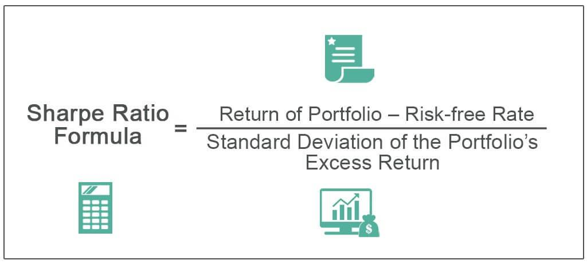

In the rapidly evolving world of algorithmic trading, understanding risk-adjusted performance metrics is crucial for developing robust and effective investment strategies. Among these metrics, the Deflated Sharpe Ratio (DSR) stands out as a sophisticated tool that refines the evaluation process by accounting for statistical biases often overlooked by traditional methods.

The Sharpe Ratio has long served as a popular metric for assessing the risk-adjusted returns of an investment portfolio. However, it is not without limitations, particularly in environments characterized by high-frequency trading and complex financial instruments. The DSR, introduced by Lópes de Prado and Bailey, addresses these shortcomings by offering a more nuanced approach to measuring investment performance.



The significance of the DSR in algorithmic trading lies in its ability to mitigate the pitfalls associated with randomness and overfitting—common challenges faced by traders and analysts. Algorithmic strategies are typically tested over vast datasets, where multiple hypotheses are evaluated. This process increases the risk of selecting strategies based on random success rather than genuine market insights.

By adjusting for the inflationary effects of multiple trials and accounting for non-normal return distributions, the DSR provides a more accurate reflection of an investment's performance. This makes it an integral component in strategy evaluation, enabling traders to better differentiate between statistical coincidences and true market edges.

In this article, we discuss the importance of the Deflated Sharpe Ratio and its application in algorithmic trading. We explore how the DSR helps address the issues of randomness and overfitting and why it is an essential metric for modern finance professionals. Join us as we unravel the intricacies of this essential tool and its impact on improving trading outcomes.

## Table of Contents

## Understanding the Limitations of the Traditional Sharpe Ratio

The Sharpe Ratio is widely regarded as a standard measure for assessing risk-adjusted returns in financial portfolios. However, it is not without its constraints, particularly when applied in [algorithmic trading](/wiki/algorithmic-trading). Its limitations arise primarily because the Sharpe Ratio assumes that returns are normally distributed, which is often not the case in real-world financial markets. This assumption of normality disregards the skewness and kurtosis that can be present in financial returns, leading to potentially inaccurate assessments of a strategy’s performance.

Moreover, the Sharpe Ratio inherently lacks mechanisms to address the biases introduced by multiple testing—a common practice in algorithmic trading where numerous strategies are backtested simultaneously to identify those with promising results. This prolific testing increases the likelihood of false positives, as some strategies might appear successful purely due to randomness and not because they possess any underlying market advantage. This statistical bias is termed as 'selection bias'.

In such an environment, it is important to be aware that a high Sharpe Ratio may not necessarily indicate a genuine market edge. When selecting strategies based solely on their Sharpe Ratio, traders risk adopting strategies that have merely performed well by chance rather than those grounded in a solid, repeatable market opportunity. This can lead to overfitting, where a model’s good performance on past data does not translate to future market success because it captured noise rather than signal.

As a result, reliance on the Sharpe Ratio without adjustment for these biases can lead to misleading conclusions regarding a strategy’s true risk-adjusted performance. The Deflated Sharpe Ratio (DSR) presents a more comprehensive metric by adjusting for these statistical anomalies, providing a more accurate reflection of a trading strategy’s effectiveness.

## The Concept and Calculation of the Deflated Sharpe Ratio

The Deflated Sharpe Ratio (DSR), developed by López de Prado and Bailey, is designed to overcome the inherent limitations in the traditional Sharpe Ratio, particularly in the context of algorithmic trading. The DSR adjusts for the potential inflationary impact introduced by conducting multiple trials and addresses statistical biases such as non-normality of returns and the overfitting risk associated with [backtesting](/wiki/backtesting).

Mathematically, the DSR is an extended version of the Probabilistic Sharpe Ratio (PSR), which itself is an adjustment of the Sharpe Ratio to account for the statistical properties of return distributions. The DSR adjusts the PSR for various biases, ultimately offering a more conservative estimate of strategy performance. This is especially relevant in algorithmic trading, where extensive backtesting may uncover spurious strategies that seem profitable purely by chance.

The formula for the Deflated Sharpe Ratio can be expressed as follows:

$$
\text{DSR} = \frac{SR - \theta}{\sigma(SR)}
$$

Where:
- $SR$ is the Sharpe Ratio of the strategy.
- $\theta$ is a correction factor for the inflation effect of multiple testing.
- $\sigma(SR)$ is the standard deviation of the Sharpe Ratio, adjusted for sample variability.

The correction [factor](/wiki/factor-investing) $\theta$ considers the trial multiplicity effect, effectively reducing the performance estimate of strategies derived from repeated testing. This correction ensures that only strategies with a genuine market edge are identified as statistically significant.

The calculation of the DSR also integrates skewness and kurtosis of the return distribution, acknowledging that financial returns often deviate from a normal distribution. Adjusting for these factors provides a more robust measure of performance by penalizing excessive tail risks and asymmetries in the distribution. Therefore, skewness and kurtosis are embedded into the estimation of $\sigma(SR)$, bringing precision to the performance assessment beyond standard assumptions.

In practice, the implementation of the DSR involves assessing the distribution characteristics of portfolio returns, adjusting the traditional Sharpe Ratio using the outlined corrections, and incorporating empirical data from backtests. Evaluating skewness, kurtosis, and trial multiplicity leads to a deflated performance metric that genuinely reflects the strategy's ability to outperform the market rather than merely benefiting from statistical flukes.

Adopting the DSR thus provides traders with an advanced tool for risk-adjusted strategy evaluation, aiding in the identification of strategies that possess true excess returns.

## Addressing the Multiple Testing Problem in Algorithmic Trading

In financial research, particularly within algorithmic trading, the process of testing numerous strategies often leads to the multiple testing problem. This phenomenon arises when multiple statistical tests are conducted, increasing the probability of obtaining seemingly successful strategies by sheer randomness. As a result, a false positive is detected, and a strategy may appear promising due to random fluctuations rather than genuine market insights.

The Deflated Sharpe Ratio (DSR) addresses this by adjusting the statistical significance thresholds based on trial multiplicity, thereby enhancing the reliability of strategy evaluations. It quantifies the extent to which a given Sharpe Ratio might have been inflated by randomness or data snooping. By deflating the Sharpe Ratio, the DSR offers a corrective measure that accounts for the number of tests conducted and the inherent biases in the selection process.

Mathematically, the Deflated Sharpe Ratio adjusts the traditional Sharpe Ratio through a probabilistic framework that incorporates the following elements:

1. **Trial Multiplicity:** The number of independent tests or strategies evaluated. This factor helps in adjusting the Sharpe Ratio to reflect the increased chance of overfitting.
2. **Statistical Biases:** Adjustments are made to account for biases such as skewness and kurtosis in the return distribution, which traditional Sharpe Ratios ignore.

To implement the DSR effectively, practitioners can utilize statistical software and programming frameworks that incorporate these adjustments. Here is a simplified example of how one might implement a form of bias-correction using Python:

```python
import numpy as np

def adjusted_sharpe_ratio(returns, benchmark_returns, trials, skewness, kurtosis):
    excess_returns = returns - benchmark_returns
    mean_excess = np.mean(excess_returns)
    std_excess = np.std(excess_returns)

    # Traditional Sharpe Ratio calculation
    sharpe_ratio = mean_excess / std_excess

    # Adjusted Sharpe Ratio for trial multiplicity and biases
    adjustment_factor = 1 + (skewness ** 2 / 6) * (trials - 1) / trials \
                           + (kurtosis - 3) / 24 * (trials - 1) / trials

    deflated_sharpe_ratio = sharpe_ratio / np.sqrt(adjustment_factor)
    return deflated_sharpe_ratio

# Example usage
returns = np.random.normal(0.05, 0.15, 1000)  # Simulated returns
benchmark_returns = 0.03
trials = 50  # Number of independent strategy tests
skewness = 0.5
kurtosis = 4.0

dsr = adjusted_sharpe_ratio(returns, benchmark_returns, trials, skewness, kurtosis)
print("Deflated Sharpe Ratio:", dsr)
```

By accounting for the number of trials, skewness, and kurtosis, this Python function provides a straightforward approach to calculating the Deflated Sharpe Ratio. Implementing methods like the DSR is pivotal for traders aiming to ensure their strategies are robust and reliable, reducing the likelihood of selecting a strategy that thrives on random success rather than genuine efficacy.

## Empirical Application of the Deflated Sharpe Ratio in Python

Applying theoretical concepts to real-world data is crucial for effective strategy evaluation in algorithmic trading. Here, we demonstrate the implementation of the Deflated Sharpe Ratio (DSR) using Python, which provides a more accurate measure of risk-adjusted performance by correcting the biases associated with multiple testing and non-normal return distributions.

### Python Implementation

To compute the DSR in Python, one can utilize libraries such as NumPy for mathematical calculations, pandas for data manipulation, and SciPy for statistical functions. Below is a basic outline of the steps involved in calculating the DSR:

#### Step 1: Calculate the Sharpe Ratio

The first step is to calculate the traditional Sharpe Ratio:

```python
import numpy as np

# Assume 'returns' is a pandas Series of strategy returns
risk_free_rate = 0.02  # Example risk-free rate
excess_returns = returns - risk_free_rate
sharpe_ratio = excess_returns.mean() / excess_returns.std(ddof=1)
```

#### Step 2: Adjust Sharpe Ratio for Biases

The DSR adjusts this Sharpe Ratio by accounting for biases such as non-normality of returns and multiple testing. The Probabilistic Sharpe Ratio (PSR) is one component used in calculating the DSR. A detailed mathematical treatment (e.g., Ló​​pez de Prado and Bailey, 2014) would be required to derive exact adjustment formulas for specific scenarios. An example might look like this:

```python
from scipy.stats import skew, kurtosis

T = len(returns)
SR_adj = sharpe_ratio*(1 + (1 / (4*T))*(1 - (skew(returns)**2 / 4) + ((kurtosis(returns)-3)**2 / 24)))
```

#### Step 3: Deflate the Sharpe Ratio

The actual deflation considers the effect of backtest overfitting, considering the number of tests, $N$, performed:

```python
from math import sqrt, log

prob_of_best = 0.975  # Probability assigned to the best strategy (e.g., top 2.5%)
# Example adjustment factor (details depend on specific methodology)
adjustment_factor = sqrt((log(N) / T))
deflated_sharpe_ratio = SR_adj - adjustment_factor
```

#### Visualization and Interpretation

Visualizing how DSR affects perceived strategy robustness is important for understanding its implications. Matplotlib can be used for such visualization:

```python
import matplotlib.pyplot as plt

plt.figure(figsize=(10, 6))
plt.plot(deflated_sharpe_ratio, label='Deflated Sharpe Ratio')
plt.axhline(y=0, color='r', linestyle='--', label='Zero Threshold')
plt.xlabel('Time')
plt.ylabel('Deflated Sharpe Ratio')
plt.title('Deflated Sharpe Ratio Over Time')
plt.legend()
plt.show()
```

### Interpretation and Strategy Deployment

Interpreting DSR results involves comparing it to the original Sharpe Ratio. A significantly lower DSR indicates potential overfitting or that the strategy may not perform as well as historical results suggest.

- **Statistical Reliability**: A lower DSR suggests caution; the strategy could have been identified by chance rather than actual market edge.
- **Informed Decisions**: Using DSR helps traders make more informed decisions by focusing on strategies less likely to be influenced by biases.

### Tools and Libraries

The commonly used tools for calculating DSR in Python include NumPy, SciPy, pandas, and Matplotlib. Libraries like Pyfolio can provide additional functionality and integrations tailored to portfolio and strategy evaluation.

Integrating DSR into the strategy development process supports more robust and reliable trading outcomes by emphasizing genuine over illusory performance metrics.

## Conclusions and Implications for Algo Traders

The Deflated Sharpe Ratio (DSR) offers significant benefits for algo traders aiming to distinguish between genuinely profitable strategies and those that are merely products of statistical noise. By considering factors such as statistical biases and trial multiplicity, the DSR provides a refined assessment of risk-adjusted performance. This enables traders to enhance their decision-making process, thereby reducing the risks associated with overfitting.

Incorporating the DSR into the evaluation of trading strategies empowers traders to accurately identify true market edges. It accounts for potential pitfalls in analysis, such as selection bias and non-normality of returns, which are often encountered in the development of algorithmic trading strategies. By adjusting the Sharpe Ratio for these biases, the DSR offers a more reliable metric for evaluating performance.

The ability to mitigate the effects of overfitting is particularly critical in algorithmic trading, where strategies are tested extensively across multiple datasets and parameters. The DSR's adjustment for trial multiplicity helps ensure that the strategies chosen are not just statistically lucky but have a genuine edge in the market. This not only helps in refining the trading strategies but also ensures their long-term profitability and reliability.

Ultimately, the integration of the Deflated Sharpe Ratio into strategy development and evaluation allows for more robust and dependable trading outcomes. By providing a clearer picture of a strategy's true performance, the DSR guides algo traders in making more informed and strategic decisions, which is essential for maintaining a competitive edge in the fast-paced world of algorithmic trading.

## References

López de Prado, M., & Bailey, D. H. (2014). The Deflated Sharpe Ratio: correcting for selection bias, backtest overfitting, and non-normality. The Journal of Portfolio Management, 40(5), 94-108. doi:10.3905/jpm.2014.40.5.094

López de Prado, M., & Bailey, D. H. (2012). The Sharpe ratio efficient frontier. The Journal of Risk, 15(2), 3-44. doi:10.21314/JOR.2012.240

## References & Further Reading

[1]: Bergstra, J., Bardenet, R., Bengio, Y., & Kégl, B. (2011). ["Algorithms for Hyper-Parameter Optimization."](https://papers.nips.cc/paper/4443-algorithms-for-hyper-parameter-optimization) Advances in Neural Information Processing Systems 24.

[2]: ["Advances in Financial Machine Learning"](https://www.amazon.com/Advances-Financial-Machine-Learning-Marcos/dp/1119482089) by Marcos López de Prado

[3]: ["Evidence-Based Technical Analysis: Applying the Scientific Method and Statistical Inference to Trading Signals"](https://www.amazon.com/Evidence-Based-Technical-Analysis-Scientific-Statistical/dp/0470008741) by David Aronson

[4]: ["Machine Learning for Algorithmic Trading"](https://github.com/stefan-jansen/machine-learning-for-trading) by Stefan Jansen

[5]: ["Quantitative Trading: How to Build Your Own Algorithmic Trading Business"](https://books.google.com/books/about/Quantitative_Trading.html?id=j70yEAAAQBAJ) by Ernest P. Chan