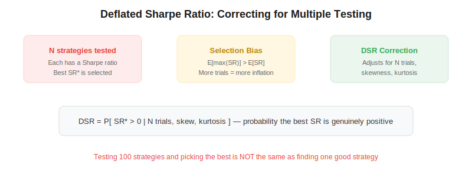
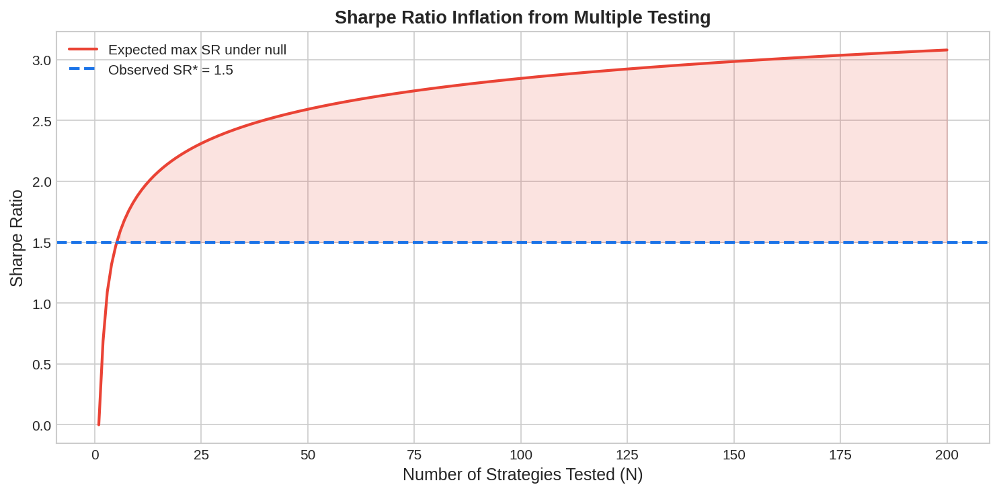

The deflated Sharpe ratio (DSR) is a statistical test introduced by Bailey and Lopez de Prado (2014) that answers a deceptively simple question: given that you tested $N$ strategy configurations and selected the one with the highest Sharpe ratio, what is the probability that this best Sharpe ratio is genuinely positive — not just a statistical artifact of multiple testing? In algorithmic trading, where researchers routinely test hundreds of parameter combinations, the DSR is essential for separating skill from luck.

## The Multiple Testing Problem

If you test one strategy and it has a Sharpe ratio of 2.0, that's strong evidence of alpha. But if you tested 1,000 strategy variants and picked the best one, a Sharpe of 2.0 may simply be the expected maximum from random noise. The more strategies you test, the higher the expected maximum Sharpe ratio under the null hypothesis of no skill:

$$E[\max(\hat{SR})] \approx \sqrt{2 \ln N} \cdot \left(1 - \frac{\gamma}{2 \ln N}\right) + \frac{\gamma}{\sqrt{2 \ln N}}$$

where $N$ is the number of independent trials and $\gamma \approx 0.5772$ is the Euler-Mascheroni constant.



## How the Deflated Sharpe Ratio Works

The DSR extends the [Probabilistic Sharpe Ratio](https://paperswithbacktest.com/wiki/probabilistic-sharpe-ratio-psr) by replacing the benchmark Sharpe ratio $SR_0 = 0$ with the expected maximum Sharpe ratio under the null hypothesis:

$$DSR = PSR[SR^*] = Z\left(\frac{(\hat{SR}^* - SR_0)\sqrt{T-1}}{\sqrt{1 - \hat{\gamma}_3 \hat{SR}^* + \frac{\hat{\gamma}_4 - 1}{4}\hat{SR}^{*2}}}\right)$$

where $\hat{SR}^*$ is the observed best Sharpe ratio, $SR_0$ is the expected max SR under the null (which depends on $N$), $T$ is the number of return observations, $\hat{\gamma}_3$ is the skewness of returns, $\hat{\gamma}_4$ is the kurtosis, and $Z(\cdot)$ is the standard normal CDF.

A DSR above 0.95 (or the chosen confidence level) means the best strategy's Sharpe ratio likely reflects genuine skill after accounting for all the trials.



## Python Implementation

```python
import numpy as np
from scipy.stats import norm

def expected_max_sr(n_trials, t_obs, sr_std=1.0):
    """Expected maximum SR under null of N independent trials."""
    emc = 0.5772  # Euler-Mascheroni constant
    z = np.sqrt(2 * np.log(max(n_trials, 2)))
    e_max = z * (1 - emc / (2 * np.log(max(n_trials, 2)))) + emc / z
    return e_max * sr_std

def deflated_sharpe_ratio(observed_sr, sr_benchmark, t_obs, skew=0, kurtosis=3):
    """
    Compute the Deflated Sharpe Ratio.

    Parameters
    ----------
    observed_sr : float
        Best observed Sharpe ratio (annualized).
    sr_benchmark : float
        Expected max SR under null (from expected_max_sr).
    t_obs : int
        Number of return observations.
    skew : float
        Skewness of strategy returns.
    kurtosis : float
        Kurtosis of strategy returns (excess kurtosis + 3).

    Returns
    -------
    float
        DSR: probability that observed SR exceeds benchmark.
    """
    sr_diff = observed_sr - sr_benchmark
    denominator = np.sqrt(
        (1 - skew * observed_sr + (kurtosis - 1) / 4 * observed_sr**2)
        / (t_obs - 1)
    )
    if denominator <= 0:
        return 0.0
    z_score = sr_diff / denominator
    return float(norm.cdf(z_score))

# Example: tested 200 strategies, best SR = 1.8, 3 years daily data
n_trials = 200
t_obs = 756  # 3 years × 252 days
best_sr = 1.8
benchmark = expected_max_sr(n_trials, t_obs)
dsr = deflated_sharpe_ratio(best_sr, benchmark, t_obs, skew=-0.3, kurtosis=4.5)

print(f"Expected max SR under null (N={n_trials}): {benchmark:.2f}")
print(f"Observed best SR: {best_sr:.2f}")
print(f"Deflated Sharpe Ratio: {dsr:.4f}")
print(f"Conclusion: {'Likely genuine' if dsr > 0.95 else 'Likely overfit'}")
```

## Key Parameters

| Parameter | Source | Effect |
|---|---|---|
| $N$ (trials) | Research log | More trials → higher benchmark → harder to pass |
| $T$ (observations) | Dataset length | More data → tighter estimate → easier to pass |
| Skewness $\hat{\gamma}_3$ | Strategy returns | Negative skew penalizes — crash risk inflates apparent SR |
| Kurtosis $\hat{\gamma}_4$ | Strategy returns | Fat tails penalize — extreme events inflate apparent SR |

## Limitations and Risks

The DSR assumes trials are independent — in practice, strategy variants are often correlated (e.g., the same signal with different lookback windows), which means the effective number of trials is lower than $N$. The formula also assumes returns are stationary, which is rarely true over long backtests. Despite these limitations, DSR is a significant improvement over naive Sharpe ratio comparisons.

## Conclusion

The deflated Sharpe ratio is the statistical reality check every algo trader needs. Before deploying any strategy, ask: "How many configurations did I try to arrive at this result?" If the answer is more than a handful, DSR tells you whether the best Sharpe ratio is skill or noise. Combined with [CPCV](https://paperswithbacktest.com/wiki/combinatorial-purged-cross-validation-cpcv) and [walk-forward optimization](https://paperswithbacktest.com/wiki/walk-forward-optimization), it forms a robust anti-overfitting toolkit.

---

**Explore further on PapersWithBacktest:**
- Browse [backtested trading strategies](https://paperswithbacktest.com/strategies) with Python code and performance metrics
- Access [clean historical market data](https://paperswithbacktest.com/datasets) for equities, crypto, and futures
- Take the [algo trading course](https://paperswithbacktest.com/course) — 60+ video lessons and notebooks
- Related wiki pages: [Probabilistic Sharpe Ratio](https://paperswithbacktest.com/wiki/probabilistic-sharpe-ratio-psr) · [CPCV](https://paperswithbacktest.com/wiki/combinatorial-purged-cross-validation-cpcv) · [Backtesting Pitfalls](https://paperswithbacktest.com/wiki/backtesting-pitfalls-overfitting)
