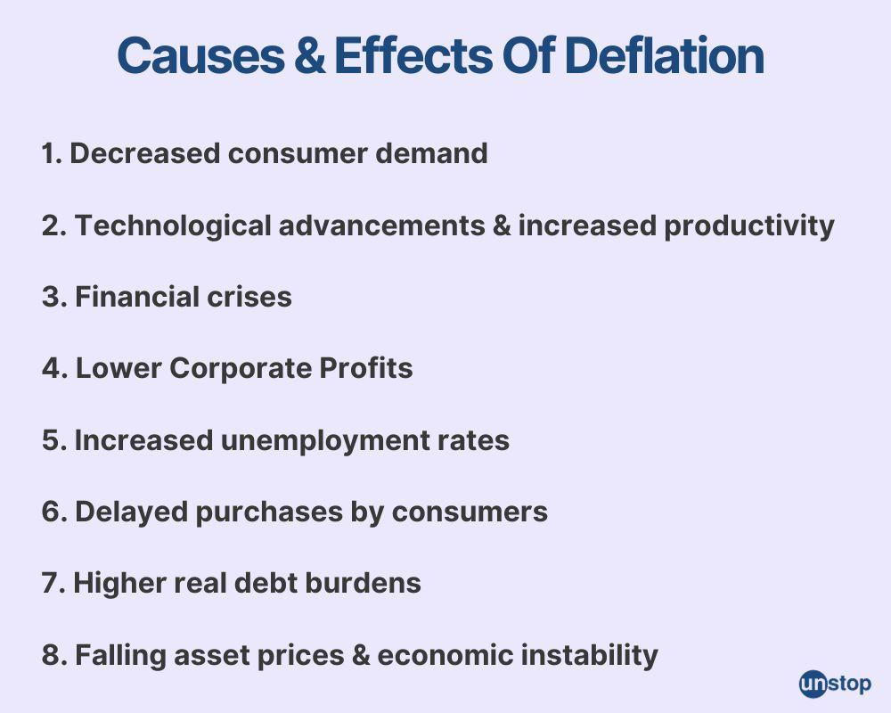

## Table of Contents

## What is deflation?

Deflation is when the prices of things we buy go down over time. This might sound good because we can buy more with our money, but it can cause problems for the economy. When prices fall, people might wait to buy things, hoping they will be even cheaper later. This can slow down businesses because they sell less, and they might have to cut jobs or close down.

Deflation can also make debts harder to pay back. If you borrowed money, the amount you owe stays the same, but your money is worth more. This sounds good, but if you earn less because of the slowing economy, it can be tough to pay back what you owe. Governments and central banks try to stop deflation because it can lead to a cycle of less spending and more economic trouble.

## How is deflation different from inflation?

Deflation and inflation are opposite things that happen to prices. Deflation is when the prices of things go down over time. This means you can buy more with the same amount of money. On the other hand, inflation is when prices go up. This means you need more money to buy the same things you used to buy.

Both deflation and inflation can cause problems. With deflation, people might wait to buy things because they think prices will keep falling. This can slow down the economy because businesses sell less and might have to cut jobs. With inflation, if prices go up too fast, people's money doesn't go as far, and it can be hard to keep up with the cost of living. Governments and central banks try to keep prices stable, not too high and not too low, to help the economy stay healthy.

## What are the common causes of deflation?

Deflation can happen for a few reasons. One big reason is when people and businesses don't want to spend money. If everyone starts saving more and buying less, stores have to lower their prices to sell their stuff. This can start a cycle where prices keep going down because people are waiting for even lower prices before they buy.

Another reason for deflation can be when there's too much of something and not enough people wanting to buy it. For example, if a lot of new houses are built but not many people want to buy them, the prices of houses might go down. This can also happen with other things like cars or electronics. When there's more supply than demand, prices tend to fall.

Sometimes, deflation can also come from big changes in technology or how we do things. If a new way of making something makes it cheaper, the price of that thing can go down. This can be good for buyers but can cause problems if it leads to people losing jobs or businesses closing because they can't keep up with the lower prices.

## Can deflation be beneficial to an economy?

Deflation can be good for an economy in some ways. When prices go down, people can buy more with the same amount of money. This means they might feel richer and be able to save more or spend on other things they want. For example, if the price of a computer goes down, someone might buy it and then have money left over to spend on something else. This can help people feel better about their money and might even help some businesses that sell cheaper products.

But deflation can also cause problems. If people think prices will keep going down, they might wait to buy things, which can hurt businesses. When businesses sell less, they might have to cut jobs or close down, which can make the economy worse. Also, if people have debts, deflation can make it harder to pay them back because even though their money is worth more, they might be [earning](/wiki/earning-announcement) less. So, while deflation can help in some ways, it can also lead to bigger problems if it goes on for too long.

## What are the negative effects of deflation on an economy?

Deflation can hurt the economy in big ways. When prices start going down, people might stop buying things because they think prices will keep falling. This means businesses sell less, and they might have to cut jobs or close down. When people lose their jobs, they have less money to spend, which makes the problem even worse. It can start a cycle where the economy keeps getting smaller because nobody is spending money.

Another bad thing about deflation is that it can make debts harder to pay back. If you borrowed money, the amount you owe stays the same, but your money is worth more because prices are lower. This might sound good, but if you're earning less because of the slowing economy, it can be tough to pay back what you owe. This can lead to more people and businesses struggling with debt, which can make the economy even weaker.

Overall, while deflation might seem good because things get cheaper, it can cause a lot of trouble if it goes on for too long. Governments and central banks try to stop deflation because it can lead to a cycle of less spending, more job losses, and a weaker economy.

## How do central banks typically respond to deflation?

Central banks usually try to stop deflation because it can hurt the economy. They do this by making it easier for people and businesses to borrow money. They lower interest rates, which means loans cost less. When loans are cheaper, people and businesses are more likely to borrow money and spend it, which can help stop prices from falling.

Sometimes, just lowering interest rates isn't enough. In those cases, central banks might use other ways to help the economy. They might buy things like government bonds to put more money into the economy. This is called quantitative easing. By doing this, they hope to get people spending more and stop deflation from getting worse.

## What historical examples illustrate the impact of deflation?

One big example of deflation happened in the United States during the Great Depression in the 1930s. Prices went down a lot, and people stopped buying things because they thought prices would keep falling. This made businesses sell less, and many had to close down. A lot of people lost their jobs, and it was hard for them to pay back what they owed. The economy got really bad, and it took a long time to get better. This shows how deflation can start a cycle that makes the economy worse and worse.

Another example is Japan in the 1990s and 2000s. Japan had a long time where prices kept going down, and they called it the "Lost Decade." People stopped spending money, and businesses didn't grow. It was hard for the economy to get better because everyone was waiting for prices to fall more before they bought anything. The government and the central bank tried many things to stop deflation, but it was tough. This shows that deflation can last a long time and be really hard to fix.

## How does deflation affect consumer behavior?

When prices start going down because of deflation, people often change how they spend their money. They might wait to buy things because they think prices will keep falling. If you know a TV will be cheaper next month, you might wait until then to buy it. This waiting can make businesses sell less, so they might lower prices even more to get people to buy. It can start a cycle where everyone is waiting for lower prices, and nobody is spending money.

This change in how people spend can hurt the economy. When businesses sell less, they might have to cut jobs or close down. If people lose their jobs, they have even less money to spend, which makes the problem worse. Also, if people have debts, like a loan for a house or a car, deflation can make it harder to pay them back. Even though their money is worth more, they might be earning less because of the slowing economy. So, deflation can make people more careful with their money, which can lead to bigger problems for everyone.

## What role does debt play in a deflationary environment?

In a deflationary environment, debt can become a big problem. When prices go down, the money you owe stays the same, but it's harder to pay back because you might be earning less. If you borrowed money to buy a house or a car, the amount you need to pay each month doesn't change, but your paycheck might be smaller because businesses are selling less and cutting jobs. This can make it tough to keep up with your payments, and more people might struggle with debt.

Deflation can also make people and businesses more careful about taking on new debt. If prices are falling, borrowing money to buy something today might not make sense because it could be cheaper tomorrow. This can slow down the economy even more because people aren't spending as much, and businesses aren't investing in new things. Overall, debt in a deflationary environment can lead to a cycle where people have less money to spend, businesses suffer, and the economy gets weaker.

## How can deflation lead to a deflationary spiral?

Deflation can start a bad cycle called a deflationary spiral. When prices start going down, people might wait to buy things because they think prices will keep falling. This means businesses sell less, so they might have to lower prices even more to get people to buy. If this keeps happening, businesses might have to cut jobs or close down because they're not making enough money. When people lose their jobs, they have even less money to spend, which makes prices fall even more. It's like a circle that keeps getting worse.

This cycle can make the whole economy weaker. As more people lose their jobs and struggle with debt, they spend even less money. Businesses see less demand for their products, so they keep lowering prices, which makes the deflation worse. Governments and central banks try to stop this from happening by making it easier for people to borrow money and spend. But if they can't stop the cycle, the economy can stay in a bad spot for a long time, like what happened in the Great Depression or Japan's Lost Decade.

## What are the policy measures used to combat deflation?

When deflation happens, governments and central banks use different ways to try to stop it. One big thing they do is lower interest rates. This makes it cheaper for people and businesses to borrow money. When loans cost less, people might borrow more and spend it on things they need or want. This can help stop prices from falling because more spending means businesses can sell more and might not have to lower prices as much.

If lowering interest rates isn't enough, central banks might use something called quantitative easing. This is when they buy things like government bonds to put more money into the economy. By doing this, they hope to get people spending more and stop deflation from getting worse. Governments might also spend more money on things like building roads or helping people who lost their jobs. This can help keep the economy going and stop the cycle of falling prices and less spending.

## How do international trade and globalization influence deflation?

International trade and globalization can make deflation happen more easily. When countries trade with each other, they can buy things from places where they are cheaper. For example, if a country can buy electronics from another country at a lower price, the price of electronics in their own country might go down. This can lead to deflation because the prices of many things can fall when cheaper goods come in from other countries.

Globalization also means that new technology and ways of making things can spread quickly around the world. If a new way of making cars makes them cheaper, car prices can go down everywhere. This can be good for people who want to buy cars, but if prices keep falling, it can start a cycle of deflation. When prices go down, people might wait to buy things, hoping they will be even cheaper later, which can hurt the economy.

## What are the economic consequences of deflation?

Deflation can precipitate an economic downturn marked by a cascade of negative effects, primarily impacting business revenues, employment, and consumer spending. When prices begin to decline, businesses often generate less income from their goods and services, directly affecting their profitability. To mitigate these losses, companies might resort to cost-cutting strategies such as reducing workforce size. This, in turn, leads to higher unemployment rates, further diminishing consumer spending power and perpetuating the cycle of reduced demand—a phenomenon known as the deflationary spiral.

A critical aspect of deflation is its influence on consumer behavior. Anticipating further declines in prices, consumers may delay purchases, waiting for goods to become even cheaper. This shift results in decreased demand, pressuring businesses to lower prices further and solidifying the deflationary cycle. This behavior undermines short-term economic recovery efforts and exacerbates the deflationary environment.

The deflationary spiral can be mathematically represented as a feedback loop where the initial decrease in prices leads to decreased production (due to less revenue), which then increases unemployment, thus reducing household income and consumption. This can be illustrated as follows:

$$
\text{Price Reduction} \rightarrow \text{Decreased Revenue} \rightarrow \text{Cost-Cutting Measures} \rightarrow \text{Higher Unemployment} \rightarrow \text{Reduced Consumption} \rightarrow \text{Further Price Reduction}
$$

Historical instances, such as the Great Depression in the United States and Japan's Lost Decade, provide poignant examples of deflation's long-term impacts. During the Great Depression, a significant and prolonged period of deflation was observed, leading to widespread poverty and unemployment. In Japan's case, the deflationary period of the 1990s, known as the Lost Decade, resulted in stagnant economic growth due to persistent declines in prices and wages.

Japan’s experience particularly highlights the challenges in overcoming deflation. Despite various monetary and fiscal policy attempts to stimulate the economy, such as lowering interest rates and implementing expansive government spending, recovery remained elusive for years. These historical contexts emphasize the complexity of deflationary periods and the extensive time and measures required to restore economic stability.

Understanding deflation’s economic consequences is crucial for policymakers and businesses. Recognizing these patterns allows for the development of strategies aimed at mitigating the adverse effects of deflation, such as implementing timely fiscal policies to boost demand and fostering environments conducive to price stability.

## What is the impact on algorithmic trading?

Deflation impacts [algorithmic trading](/wiki/algorithmic-trading) by influencing the underlying market conditions upon which trading algorithms rely to execute decisions. In a deflationary environment, several key aspects of algorithmic trading are affected.

Firstly, automated trading systems must adapt their strategies, particularly those focused on growth predictions and asset valuation. Deflation leads to a general decline in prices, which may alter the assumptions and predictions embedded within algorithms. For instance, if an algorithm is built to project growth based on historical price trends, a deflationary period may necessitate recalibrating these projections to reflect downward price movements. The formula for adjusting expected growth rates might look like:

$$
\text{Adjusted Growth Rate} = \text{Historical Growth Rate} \times (1 + \text{Deflation Factor})
$$

where the deflation factor is a percentage representing the rate of deflation.

Secondly, the [volatility](/wiki/volatility-trading-strategies) often associated with deflation requires traders to implement more robust risk management protocols to safeguard portfolio value. Increased volatility can introduce unpredictable swings in asset prices, thus requiring algorithms to incorporate risk management strategies, such as stop-loss orders or volatility hedging techniques. Algorithmic risk management can be implemented using Python as follows:

```python
def risk_management(asset_price, stop_loss_percentage):
    stop_loss_price = asset_price * (1 - stop_loss_percentage / 100)
    return stop_loss_price

# Example usage
asset_price = 100  # current asset price
stop_loss_percentage = 5  # desired stop-loss level
stop_loss_price = risk_management(asset_price, stop_loss_percentage)
print(f"Stop-loss price: {stop_loss_price}")
```

Moreover, algorithms can harness opportunities presented by deflation by being finely tuned to detect and respond to specific deflationary signals in the market. For example, if deflation causes certain sectors to underperform, algorithms can be designed to short sell those assets. Conversely, they could seek investment opportunities in assets that traditionally perform better during deflation, such as fixed-income securities.

Continuous monitoring and reevaluation of trading algorithms are crucial in dynamic market conditions influenced by deflation. Traders and developers must ensure that algorithms remain efficient and effective by [backtesting](/wiki/backtesting) them against historical data reflective of deflationary periods. This iterative process allows algorithms to adjust their trading parameters and optimize performance despite fluctuating market sentiments.

In summary, deflation presents distinct challenges and opportunities for algorithmic trading strategies. By adapting to altered market dynamics, adjusting risk management protocols, and continuously refining algorithmic models, traders can effectively navigate the complexities of a deflationary economic landscape.

## What are the strategies for navigating deflation?

Investors facing deflationary periods must employ adaptable strategies to protect their assets from devaluation. A primary approach involves diversification across different asset classes. By spreading investments among various sectors, investors can mitigate the risk associated with industries that are more negatively impacted by deflation. For instance, while consumer goods might experience a drop in demand due to postponed spending, other sectors might be less affected, offering potential safe havens.

Long-term bonds often perform well during deflationary times as they provide steady income streams. In a deflationary environment, real interest rates tend to rise, making fixed-income securities more attractive. The increase in real interest rates is mathematically expressed as:

$$
\text{Real Interest Rate} = \text{Nominal Interest Rate} - \text{Inflation Rate}
$$

During deflation, the inflation rate is negative, hence the real [interest rate](/wiki/interest-rate-trading-strategies) increases, boosting the value of existing bonds.

Investing in companies that leverage cost-reducing technologies can be advantageous as these firms are likely to maintain or increase profitability despite falling prices. For instance, companies that have successfully automated processes or employ advanced technologies to lower production costs might see their stock values stabilize or grow during deflation, providing a hedge against the broader market trends.

Proactively monitoring global economic indicators also aids investors in effectively anticipating deflationary trends. By keeping abreast of key indicators such as GDP growth rates, consumer price indices, and monetary policy changes, investors can make informed decisions about when to adjust their portfolios. Adapting to shifts in economic conditions not only protects investments but can also provide opportunities to capitalize on emerging trends.

In essence, navigating deflation requires a strategic blend of diversification, focus on fixed-income securities, and investing in technology-driven companies, all underpinned by vigilant monitoring of economic indicators. These strategies enable investors to protect their holdings and potentially identify growth opportunities in an otherwise declining economic period.

## References & Further Reading

[1]: Bernanke, B. (2000). ["Japanese Monetary Policy: A Case of Self-Induced Paralysis?"](https://www.princeton.edu/~pkrugman/bernanke_paralysis.pdf) National Bureau of Economic Research.

[2]: Bordo, M. D., & Filardo, A. (2005). ["Deflation in a Historical Perspective."](https://www.jstor.org/stable/3601059) BIS Working Papers.

[3]: Koo, R. C. (2011). ["The Holy Grail of Macroeconomics: Lessons from Japan’s Great Recession."](https://onlinelibrary.wiley.com/doi/book/10.1002/9781119199618) Wiley.

[4]: Jansen, S. (2018). ["Machine Learning for Algorithmic Trading: Predictive Models to Extract Signals from Market and Alternative Data for Systematic Trading Strategies."](https://github.com/stefan-jansen/machine-learning-for-trading) Packt Publishing.

[5]: Chan, E. (2009). ["Quantitative Trading: How to Build Your Own Algorithmic Trading Business."](https://github.com/ftvision/quant_trading_echan_book) Wiley.

[6]: Rude, T. (1985). ["Deflation and Depression: The Term Structure of Interest Rates and Economic Activity."](https://www.jstor.org/stable/3592864) National Bureau of Economic Research.

[7]: Neely, C. J. (2010). ["The Large Scale Asset Purchases Had Large International Effects."](https://files.stlouisfed.org/files/htdocs/conferences/qe/Neely_--_2010-018_1_.pdf) Federal Reserve Bank of St. Louis.