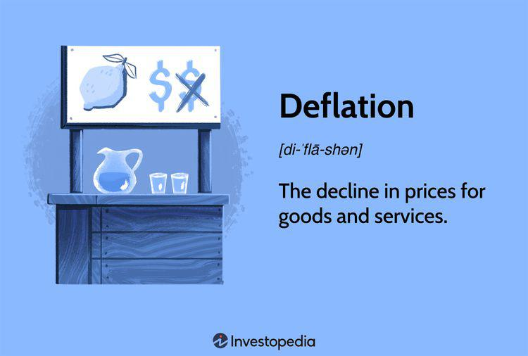

## Table of Contents

## What is deflation?

Deflation is when the prices of things we buy, like food and clothes, go down over time. It's the opposite of inflation, where prices go up. When deflation happens, money becomes more valuable because you can buy more with the same amount of money. This might sound good at first, but it can cause problems for the economy.

One big problem with deflation is that people might stop spending money. They might think that prices will keep going down, so they wait to buy things later when they're cheaper. This can slow down the economy because businesses sell less and might have to cut jobs. Also, if prices are falling, people who borrowed money have to pay back their loans with money that's worth more than when they borrowed it, which can be tough.

Deflation can be hard to stop once it starts. Governments and central banks might try to fix it by lowering interest rates or spending more money to get people to start buying things again. But if deflation keeps going, it can lead to a cycle where the economy gets weaker and weaker. That's why economists watch for signs of deflation and try to prevent it from happening.

## How is deflation different from inflation?

Deflation and inflation are opposite things that happen to the prices of things we buy. Inflation is when prices go up over time. This means that the same amount of money can buy less stuff than before. For example, if a candy bar costs $1 today, it might cost $1.10 next year if there's inflation. On the other hand, deflation is when prices go down. So, that same candy bar might only cost 90 cents next year if there's deflation. 

When inflation happens, money loses value because you need more of it to buy the same things. This can make people want to spend money now rather than later, which can help the economy grow. But if inflation gets too high, it can make things too expensive and cause problems. Deflation, on the other hand, makes money more valuable because you can buy more with the same amount of money. But this can cause people to hold onto their money and wait for prices to drop even more, which can slow down the economy. Both inflation and deflation need to be managed carefully to keep the economy healthy.

## What are the common causes of deflation?

Deflation can happen for a few reasons. One big reason is when there's not enough money going around in the economy. This can happen if people and businesses start saving more and spending less. When people spend less, businesses don't sell as much, so they might lower their prices to try to get more customers. Another reason for deflation is when new technology or better ways of making things make products cheaper. For example, if a new machine helps a factory make toys faster and cheaper, the price of toys might go down.

Another cause of deflation can be a big drop in demand for things. This can happen during a recession, when people lose their jobs and have less money to spend. When demand drops, businesses have to lower their prices to sell their products. Also, if a country imports a lot of cheap goods from other places, that can lead to deflation at home because the prices of things go down. All these things together can make prices fall and cause deflation.

## Can deflation be beneficial for an economy?

Deflation can sometimes be good for an economy, especially if it happens because things are getting cheaper to make. If new technology or better ways of doing things make products less expensive, that can be a good thing. When prices go down because of this, people can buy more with the same amount of money. This can make people happier and might even help the economy grow because people have more money left over to spend on other things.

But, deflation can also cause big problems if it goes on for too long or if it happens because people are scared and not spending money. If everyone is waiting for prices to go down even more, businesses might sell less and less, and they might have to cut jobs or even close down. This can make the economy weaker and lead to a cycle where things keep getting worse. So, while a little bit of deflation might be good, too much of it can be harmful.

## What are the negative effects of deflation on an economy?

Deflation can hurt an economy in many ways. When prices start to fall, people might decide to wait before buying things, thinking they will be even cheaper later. This means businesses sell less stuff, and they might have to lower prices even more or cut jobs to save money. When people lose their jobs, they have less money to spend, which can make the economy slow down even more. This can start a cycle where businesses keep lowering prices and people keep buying less, making the economy weaker and weaker.

Another big problem with deflation is that it can make debts harder to pay back. If you borrowed money when prices were higher, you have to pay it back with money that's now worth more. This can be really tough for people and businesses with loans. Banks might also be less willing to lend money if they think they won't get paid back, which can make it harder for businesses to grow or for people to buy homes. All these things together can make an economy struggle a lot when deflation happens.

## How do central banks typically respond to deflation?

Central banks usually try to stop deflation by making it easier for people to borrow and spend money. They do this by lowering interest rates. When interest rates are low, it costs less for people and businesses to borrow money. This can encourage them to take out loans to buy things like cars or start new projects, which can help the economy grow. Central banks might also use something called "quantitative easing," where they buy things like government bonds to put more money into the economy and get people spending.

If these things don't work, central banks might try to make people expect that prices will go up a bit in the future. They do this by promising to keep interest rates low for a long time. This can make people think it's a good time to buy things now before prices go up. By doing all these things, central banks try to stop deflation and keep the economy healthy.

## What historical examples illustrate the impact of deflation?

One big example of deflation happened in the United States during the Great Depression in the 1930s. Prices kept going down, and people stopped spending money because they thought things would get even cheaper. This made businesses sell less, so they had to lay off workers. More people out of work meant even less spending, and the economy got worse and worse. The government and the central bank tried different things to stop the deflation, but it took a long time for the economy to get better.

Another example is Japan in the 1990s and 2000s. Japan had a time called the "Lost Decade" where prices kept falling. People were scared to spend money, and businesses didn't want to invest. The government and the central bank tried to help by lowering interest rates and spending more money, but it was hard to stop the deflation. It took many years for Japan's economy to start growing again, and it showed how tough deflation can be to fix.

## How does deflation affect consumer behavior?

Deflation makes people think twice before spending money. When prices are going down, people might decide to wait before buying things. They think that if they wait a little longer, they can get the same thing for less money. This means they save more and spend less. When a lot of people do this, businesses sell less stuff, and they might have to lower their prices even more to get customers. This can start a cycle where prices keep going down, and people keep waiting to buy things.

This change in how people spend can hurt the economy. If everyone is waiting to buy things, businesses don't make as much money. They might have to cut jobs or close down, which means more people out of work. When people are out of work, they have even less money to spend, making the problem worse. So, deflation can make people more careful with their money, but it can also slow down the whole economy because everyone is waiting and not spending.

## What role does technological advancement play in causing deflation?

Technological advancement can cause deflation by making things cheaper to make. When new technology or better ways of doing things come along, businesses can produce more stuff with less money. For example, if a new machine helps a factory make toys faster, the cost of making each toy goes down. When it costs less to make things, businesses can lower their prices to sell more. This is good for people because they can buy more with the same amount of money, but it can lead to deflation if prices keep going down.

But, this kind of deflation is not always bad. When prices go down because things are cheaper to make, it can help the economy grow. People have more money left over to spend on other things, which can make businesses want to invest more and create new jobs. The key is to make sure that the deflation from technology doesn't make people too scared to spend money. If people keep buying things, the economy can stay healthy even with falling prices.

## How do debt levels influence the severity of deflation?

When there's a lot of debt in an economy, deflation can make things much worse. If prices are going down, the money people owe on their loans becomes worth more than when they borrowed it. This means they have to pay back more in real terms, which can be really hard. People might have to cut back on spending a lot just to keep up with their loan payments. Businesses might also struggle to pay back their debts, and this can lead to them cutting jobs or even going bankrupt.

High debt levels can make people and businesses more scared during deflation. They might stop spending money and start saving more, hoping to pay off their debts. This can make the deflation worse because when people spend less, businesses have to lower their prices even more to sell anything. It can start a cycle where prices keep falling, people keep spending less, and the economy gets weaker and weaker. So, the more debt there is, the harder deflation can hit an economy.

## What are the different economic theories on deflation?

Some economists believe that deflation is always bad for the economy. They think that when prices go down, people will stop spending money because they expect prices to keep falling. This can make businesses sell less, so they might have to cut jobs or close down. This can start a cycle where the economy gets worse and worse. These economists say that governments and central banks should do everything they can to stop deflation, like lowering interest rates or spending more money to get people to start buying things again.

Other economists think that deflation can be good if it happens because things are getting cheaper to make. They say that if new technology or better ways of doing things make products less expensive, that's a good thing. People can buy more with the same amount of money, which can help the economy grow. But, these economists also warn that too much deflation can still be harmful if it makes people too scared to spend money. They believe that a little bit of deflation might be okay, but it needs to be watched carefully to make sure it doesn't get out of control.

## How can policymakers mitigate the risks associated with deflation?

Policymakers can help stop deflation by making it easier for people to borrow and spend money. They do this by lowering interest rates. When interest rates are low, it costs less for people and businesses to take out loans. This can encourage them to buy things like cars or start new projects, which can help the economy grow. Policymakers might also use something called "quantitative easing," where they put more money into the economy by buying things like government bonds. This can get people spending again and stop prices from falling too much.

Another way policymakers can fight deflation is by making people think that prices will go up a bit in the future. They do this by promising to keep interest rates low for a long time. This can make people feel it's a good time to buy things now before prices go up. Governments can also spend more money on things like building roads or schools, which can create jobs and get more money moving around in the economy. By doing these things, policymakers try to stop deflation and keep the economy healthy.

## References & Further Reading

[1]: Bernanke, B. S., & Mihov, I. (1998). ["Measuring Monetary Policy."](https://pages.stern.nyu.edu/~dbackus/Identification/BernankeMihov_QJE_98.pdf) The Quarterly Journal of Economics, 113(3), 869-902.

[2]: Bordo, M. D., & Filardo, A. (2005). ["Deflation and Monetary Policy in a Historical Perspective: Remembering the Past or Being Condemned to Repeat It?"](https://www.jstor.org/stable/3601059) Economic Policy for the Transitions: To Dismantle and Create.

[3]: Eggertsson, G. B., & Krugman, P. (2012). ["Debt, Deleveraging, and the Liquidity Trap: A Fisher-Minsky-Koo Approach."](https://www.princeton.edu/~pkrugman/debt_deleveraging_ge_pk.pdf) American Economic Review, 102(3), 147-177.

[4]: Lopez de Prado, M. (2018). ["Advances in Financial Machine Learning."](https://www.amazon.com/Advances-Financial-Machine-Learning-Marcos/dp/1119482089) Wiley.

[5]: Shiller, R. J. (2000). ["Irrational Exuberance."](https://press.princeton.edu/books/paperback/9780691173122/irrational-exuberance) Princeton University Press.

[6]: Svensson, L. E. O. (2003). ["Escaping from a Liquidity Trap and Deflation: The Foolproof Way and Others."](https://pubs.aeaweb.org/doi/10.1257/089533003772034934) Journal of Economic Perspectives, 17(4), 145-166.