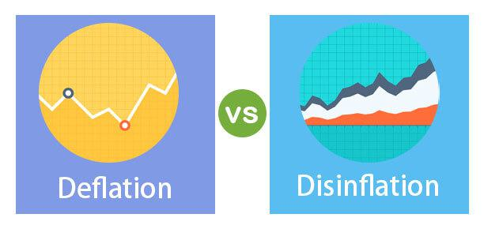

## Table of Contents

## What is deflation?

Deflation is when the prices of things we buy, like food and clothes, go down over time. It's the opposite of inflation, where prices go up. When deflation happens, people might wait to buy things because they think prices will be even lower later. This can slow down the economy because businesses sell less and might have to lower prices even more or even close down.

Deflation can also make debts harder to pay back. If you borrowed money to buy a house, and the price of the house goes down, you still have to pay back the same amount of money, but now the house is worth less. This can make people feel less wealthy and spend less money, which can make the economy even weaker. Governments and central banks try to avoid deflation because it can lead to a cycle of falling prices and economic slowdown.

## What is disinflation?

Disinflation is when the rate at which prices are going up starts to slow down. It's not the same as deflation, where prices actually go down. If inflation was at 5% last year and it drops to 3% this year, that's disinflation. Prices are still going up, but not as fast as before.

Disinflation can be a good sign if it means that the economy is getting more stable. Central banks, like the Federal Reserve in the U.S., might aim for disinflation if they think inflation is too high. They do this by raising interest rates or using other tools to cool down the economy a bit. But if disinflation happens too fast, it might worry people that deflation could be next, which can make them spend less and slow down the economy.

## How do deflation and disinflation differ?

Deflation and disinflation are different things when it comes to prices. Deflation is when the prices of things we buy, like toys or groceries, actually go down over time. It's like if a toy that cost $10 last year now costs $9. This can make people wait to buy things because they think prices will keep going down, which can hurt the economy.

Disinflation is when the speed at which prices are going up slows down. Imagine if prices were going up by 5% every year, but then they start going up by only 3% a year. Prices are still getting higher, but not as fast as before. This can be good if it means the economy is getting more stable, but if it happens too fast, people might worry that deflation could be next and start spending less.

So, the main difference is that deflation means prices are falling, while disinflation means the rate of price increases is slowing down. Both can affect how people spend money and how the economy works, but in different ways.

## What causes deflation?

Deflation can happen when there are too many goods and services for sale but not enough people wanting to buy them. Imagine a big sale where everyone is trying to sell their stuff, but not many people are buying. This can make sellers lower their prices to get rid of what they have. This often happens when the economy is not doing well, and people are worried about their jobs or money, so they spend less.

Another reason for deflation can be when new technology makes things cheaper to make. For example, if a new machine helps make toys faster and cheaper, the toy company might lower the price of toys to sell more of them. Also, if a country's money becomes worth more compared to other countries' money, things from other countries might become cheaper, which can also lead to deflation. Governments and central banks try to stop deflation because it can make the economy weaker over time.

## What causes disinflation?

Disinflation happens when the speed of price increases slows down. It can start when a country's central bank, like the Federal Reserve in the U.S., decides to raise interest rates. When interest rates go up, borrowing money becomes more expensive, so people and businesses might spend less. This can make the economy slow down a bit, and as a result, prices don't go up as fast as before.

Another reason for disinflation can be when there are more goods available than people want to buy. This can happen if businesses make too much stuff, or if people start saving more money instead of spending it. When there's a lot of stuff for sale but not many buyers, sellers might not raise their prices as much, or they might even keep them the same, leading to disinflation. 

Disinflation can also come from improvements in how things are made. If new technology or better ways of doing things make it cheaper to produce goods, companies might not need to raise prices as much to make a profit. This can help slow down the rate at which prices are going up, which is what disinflation is all about.

## What are the economic impacts of deflation?

Deflation can make the economy weaker. When prices start to go down, people might wait to buy things because they think prices will be even lower later. This means businesses sell less stuff, and they might have to lower their prices even more or even close down. When businesses do worse, they might have to let people go, which means more people might lose their jobs. This can make people feel less sure about their money, so they spend even less, which can make the economy even weaker.

Deflation can also make debts harder to pay back. If you borrowed money to buy a house and the price of the house goes down, you still have to pay back the same amount of money, but now the house is worth less. This can make people feel less wealthy and spend less money, which can hurt the economy even more. Governments and central banks try to stop deflation because it can lead to a cycle of falling prices and a slower economy. They might lower interest rates or use other tools to try to get people spending and the economy growing again.

## What are the economic impacts of disinflation?

Disinflation happens when prices are still going up, but not as fast as before. This can be good for the economy because it means things are getting more stable. When prices don't go up as quickly, people might feel more sure about their money and keep spending. This can help the economy grow in a healthy way. Central banks might aim for disinflation if they think prices are going up too fast, by raising interest rates a little bit to cool down the economy.

But disinflation can also have some downsides. If prices start going up more slowly, businesses might not make as much money as before. They might have to cut back on spending or even let some people go. This can make people worry about their jobs and spend less money, which can slow down the economy. If disinflation happens too fast, people might start to think that deflation could be next, and this worry can make them spend even less, which can hurt the economy even more.

## How do central banks respond to deflation?

When central banks see deflation happening, they get worried because it can make the economy weaker. They try to stop deflation by making it easier for people and businesses to borrow money. They do this by lowering interest rates. When interest rates are low, it costs less to borrow money, so people might spend more on things like houses or cars, and businesses might invest in new projects. This can help get the economy moving again and stop prices from falling.

Sometimes, just lowering interest rates isn't enough to fight deflation. When that happens, central banks might use other tools, like buying government bonds or other financial stuff. This is called "quantitative easing." It puts more money into the economy, which can help raise prices and stop deflation. Central banks want to make sure people keep spending and businesses keep selling, so they do everything they can to avoid a cycle of falling prices and a slowing economy.

## How do central banks respond to disinflation?

When central banks see disinflation, they pay close attention because it means prices are going up more slowly. If they think this is good for the economy and makes things more stable, they might not do much. But if they worry that disinflation is happening too fast and could lead to deflation, they will take action. They might lower interest rates a little bit to make it easier for people and businesses to borrow money. This can help keep the economy growing and stop prices from slowing down too much.

Sometimes, central banks might also use other tools to fight disinflation. They could buy government bonds or other financial stuff, which is called "quantitative easing." This puts more money into the economy and can help keep prices from going up too slowly. Central banks want to make sure the economy stays healthy, so they try to balance things just right to avoid too much disinflation or even deflation.

## Can deflation lead to a deflationary spiral?

Yes, deflation can lead to a deflationary spiral. This happens when prices start to go down, and people wait to buy things because they think prices will keep falling. When people stop buying, businesses sell less stuff, so they lower prices even more to get rid of what they have. This can make prices fall even faster, and people keep waiting to buy, which makes the problem worse.

A deflationary spiral can make the economy weaker and weaker. When businesses sell less, they might have to let people go, which means more people lose their jobs. When people are worried about their jobs, they spend even less money, which makes businesses sell even less, and prices keep falling. This cycle can be hard to stop, and it's why central banks try so hard to avoid deflation in the first place.

## What historical examples illustrate the effects of deflation and disinflation?

One big example of deflation happened in the United States during the Great Depression in the 1930s. Prices for things like food and clothes went down a lot because people didn't have much money to spend. When prices kept falling, people waited to buy things, hoping they would get even cheaper. This made businesses sell less, so they had to lower prices even more, and many businesses had to close down. This led to a lot of people losing their jobs and the economy getting even weaker. It was a really hard time, and it showed how bad deflation can be for the economy.

Another example is Japan in the 1990s and early 2000s. Japan had a problem with deflation that lasted for a long time. Prices kept going down slowly, and people didn't want to spend money because they thought things would be cheaper later. This made the economy grow very slowly, and it was hard for Japan to get out of this situation. The government and the central bank tried a lot of things to stop the deflation, but it took a long time to make things better.

Disinflation can be seen in the United States during the early 1980s. The Federal Reserve raised interest rates a lot to fight high inflation. This made prices go up more slowly, which is disinflation. It helped bring down inflation, but it also made the economy slow down for a while. People and businesses had to adjust to the new, slower price increases, but in the end, it helped make the economy more stable.

## How do deflation and disinflation affect monetary policy decisions?

Deflation makes central banks worried because it can hurt the economy. When prices go down, people might wait to buy things, thinking they will be cheaper later. This can make businesses sell less and maybe even close down. To fight deflation, central banks might lower interest rates to make borrowing money easier. This can help people spend more and businesses invest more, which can stop prices from falling. Sometimes, if lowering interest rates isn't enough, central banks might use other tools like buying government bonds to put more money into the economy and raise prices.

Disinflation, when prices go up more slowly, also affects what central banks do. If disinflation is happening slowly and the economy is getting more stable, central banks might not change much. But if disinflation is happening too fast, central banks might get worried that deflation could be next. They might lower interest rates a little bit to keep the economy growing and stop prices from slowing down too much. They could also use other tools like buying government bonds to make sure the economy stays healthy and prices don't go up too slowly.

## References & Further Reading

1. **Bernanke, Ben S., and James Harold. “Inside the Black Box: The Credit Channel of Monetary Policy Transmission.” The Journal of Economic Perspectives, vol. 9, no. 4, 1995, pp. 27–48.**  
   This paper provides insights into the mechanisms of monetary policy, focusing on the credit channel and how it interacts with economic conditions like deflation and disinflation.

2. **Shiller, Robert J. “Understanding Inflation-Indexed Bond Markets.” Brookings Papers on Economic Activity, Issue 1, 1998, pp. 253–297.**  
   Shiller discusses how inflation-indexed bonds function within varying inflationary and deflationary environments, offering a perspective on asset protection strategies.

3. **Agarwal, Anurag, et al. “Machine Learning for Trading.” Stanford University, 2018.**  
   This comprehensive guide examines the applications of [machine learning](/wiki/machine-learning) in trading strategies, providing an understanding of algorithmic tools used during economic fluctuations.

4. **Fama, Eugene F. “Efficient Capital Markets: A Review of Theory and Empirical Work.” The Journal of Finance, vol. 25, no. 2, 1970, pp. 383–417.**  
   Fama's work on efficient market hypothesis remains fundamental for understanding the market dynamics that algorithmic trading strategies seek to exploit.

5. **Goodfriend, Marvin. “Interest Rate Policy and the Inflation Scare Problem: 1979-92.” Economic Quarterly, Federal Reserve Bank of Richmond, Spring 1993.**  
   This article analyzes how interest rates and monetary policies have historically impacted inflation and deflation trends, relevant for understanding central bank interventions.

6. **Bodie, Zvi, and Robert C. Merton. “Finance.” International Encyclopedia of the Social & Behavioral Sciences, Second Edition, 2015.**  
   This entry provides a comprehensive overview of financial concepts including inflation and deflation, necessary for grasping broader economic implications.

7. **James, Gareth, et al. “An Introduction to Statistical Learning.” Springer, 2013.**  
   This textbook is a valuable resource for learning about statistical methods that form the basis for many algorithmic trading strategies.

8. **Cochrane, John H. “Asset Pricing.” Princeton University Press, 2005.**  
   Cochrane's book offers a fundamental understanding of asset pricing models critical for investment strategies in diverse economic conditions.

9. **Hull, John C. "Options, Futures, and Other Derivatives." Prentice Hall, 9th Edition, 2014.**  
   A key resource for understanding derivatives markets, with insights into trading strategies useful during deflation and disinflation scenarios.

