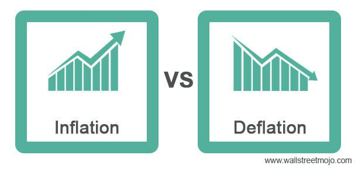

In today's complex financial landscape, understanding the intricate relationships between various economic factors is crucial. The global economy is in a constant state of flux, influenced by numerous variables that can unpredictably alter market dynamics. This article explores the financial impact of economic risks associated with deflation and algorithmic trading, shedding light on how these two phenomena influence contemporary markets.

Deflation, characterized by a general decline in prices, poses a unique set of challenges by potentially leading to reduced consumer spending and economic contraction. Historical episodes, such as the Great Depression and Japan's Lost Decade, serve as stark reminders of the severe repercussions deflation can inflict on economies. On the other hand, algorithmic trading represents a modern market force, utilizing sophisticated computer algorithms to execute trades at speeds and volumes beyond the capabilities of human traders. This innovation has significantly transformed financial markets by enhancing efficiency and liquidity, but it also introduces risks such as increased volatility and technical failures.



While deflation and algorithmic trading separately present challenges, their combined interaction offers a compelling narrative on market dynamics. During periods of deflation, the behavior of algorithmic trading systems can both stabilize markets by maintaining liquidity and destabilize them through intensified price movements. Hence, understanding these elements is vital for investors, policymakers, and market participants seeking to navigate the evolving economic environment.

As we explore these intertwined concepts, the focus will be on how deflation and algorithmic trading intersect, the risks and opportunities they present amid economic uncertainty, and the strategies necessary for market participants to leverage these forces for economic growth and stability. The goal is to provide insights that empower stakeholders to remain agile and informed, ensuring they are prepared to meet the financial challenges of tomorrow.

## Table of Contents

## Understanding Deflation and Its Economic Risks

Deflation is characterized by a sustained decrease in the general price level of goods and services. Unlike temporary price fluctuations, deflation signifies an extended period where consumers and businesses experience a drop in prices across the board. This economically adverse phenomenon reduces consumer spending, as individuals and households often postpone purchases anticipating further price reductions. Consequently, this behavior lowers aggregate demand, which can lead to an economic contraction. 

A historical example that underscores the profound impact of deflation is the Great Depression of the 1930s. During this period, the United States experienced significant deflationary pressures that exacerbated economic decline. The deflationary spiral resulted in decreased consumer prices, plummeting business revenues, and subsequent reductions in workforce, which further decreased wages and consumer spending capacity.

The potential effects of deflation in modern economies are similarly severe. Decreased demand for goods hampers production, leading to layoffs and elevated unemployment rates. Additionally, deflation increases the real value of debt; as prices fall, the relative burden of debt becomes greater, making it more challenging for borrowers to service their obligations. This can lead to increased defaults and financial instability, compounding economic difficulties.

Understanding the underlying causes of deflation is critical for designing effective fiscal and monetary policies. Structural factors such as technological advancement and productivity enhancements can lead to deflationary pressures by reducing production costs. Additionally, inadequate aggregate demand — whether due to changes in consumer preferences, external economic shocks, or restrictive fiscal policies — can induce deflation.

Governments and policymakers must employ strategic interventions to counter deflation. Monetary policy measures, such as reducing interest rates or implementing quantitative easing, can increase money supply and stimulate borrowing and investment. Fiscal policies, including increased government spending or tax cuts, can boost economic activity and counteract deflationary trends. A comprehensive understanding of these mechanisms is fundamental to mitigating the adverse effects of deflation and ensuring economic stability.

## Algorithmic Trading: A Modern Market Force

Algorithmic trading utilizes computer algorithms to automate the execution of trades in financial markets. These algorithms operate based on predefined criteria, such as timing, price, [volume](/wiki/volume-trading-strategy), or other market conditions, enabling high-speed trading with minimal human intervention. This technology has revolutionized the way financial markets operate, significantly enhancing trading speed, market [liquidity](/wiki/liquidity-risk-premium), and operational efficiency.

The integration of algorithms in trading processes allows for the rapid analysis of vast amounts of data, leading to informed and timely trading decisions. By capitalizing on computational power, traders can execute a high volume of trades within milliseconds, a capability that is unattainable through manual trading. Algorithmic trading is underpinned by sophisticated mathematical models and statistical techniques, which help in predicting market trends and identifying trading opportunities.

High-frequency trading ([HFT](/wiki/high-frequency-trading-strategies)) represents a specific subset of [algorithmic trading](/wiki/algorithmic-trading) that utilizes these algorithms to conduct a large number of orders at extremely high speeds. HFT firms leverage latency [arbitrage](/wiki/arbitrage), executing trades based on minor market fluctuations undetectable to slower market participants. This approach maximizes market interactions by taking advantage of minute price discrepancies, thus increasing liquidity and reducing spreads.

Despite the significant advantages of algorithmic trading, it is not without its risks. One prominent concern is the potential increase in market [volatility](/wiki/volatility-trading-strategies). Algorithmic trades can lead to rapid and significant price movements, sometimes resulting in flash crashes—sudden market dips followed by quick recoveries. Additionally, technical failures such as software glitches or network outages can disrupt trading operations, leading to financial losses.

Risk management in algorithmic trading requires stringent monitoring systems to detect and mitigate anomalies in real-time. Market participants must ensure that trading algorithms are robust, with fail-safes to handle unexpected market conditions. Regulatory oversight also plays a crucial role in maintaining market stability and integrity, ensuring that algorithmic trading does not compromise fair market practices.

As financial technologies evolve, algorithmic trading continues to play an integral part in shaping modern financial markets. Its continued development promises enhanced liquidity, efficiency, and competitive opportunities, though it must be carefully managed to mitigate associated risks.

## The Intersection of Deflation and Algorithmic Trading

During periods of deflation, algorithmic trading plays a complex role in impacting financial markets. On one hand, algorithmic trading can enhance market stability by ensuring liquidity. Liquidity refers to the ease with which assets can be bought or sold in a market without affecting their price. Algorithms achieve this by executing a large number of trades quickly, often surpassing the capabilities of manual trading. In low-liquidity environments, which are common during deflationary periods, this capacity to maintain activity is beneficial, as it prevents drastic price drops due to sparse trading.

However, algorithmic trading can also exacerbate price movements during deflationary times. This phenomenon occurs when algorithms, particularly those involved in high-frequency trading (HFT), respond to market signals in a way that amplifies trends. For instance, in a downward price trend typical of deflation, algorithms might detect sell signals and execute orders that further depress prices. This can lead to a feedback loop where declining prices trigger more algorithmic sell orders, intensifying the price descent.

Understanding this dual impact is crucial for managing economic and market risks effectively. Historical data analysis provides insights into how markets have previously reacted under similar conditions, allowing stakeholders to anticipate potential issues. For instance, examining deflationary periods like Japan's Lost Decade can inform how algorithmic trading might interact with falling prices and what corrective actions can mitigate adverse impacts.

Predictive modeling and simulations play a critical role in mitigating unintended market consequences during deflationary periods. By using techniques such as [machine learning](/wiki/machine-learning), market analysts can train models on historical deflationary data to predict future trading behaviors and price movements. For example:

```python
from sklearn.ensemble import RandomForestRegressor
from sklearn.model_selection import train_test_split
import numpy as np

# Sample data representing past deflationary periods
X = np.random.rand(100, 3)  # Features: market indicators
y = np.random.rand(100)     # Target: price movements

# Split the dataset into training and testing sets
X_train, X_test, y_train, y_test = train_test_split(X, y, test_size=0.2, random_state=42)

# Create a RandomForest model
model = RandomForestRegressor(n_estimators=100, random_state=42)

# Train the model
model.fit(X_train, y_train)

# Predict future price movements
predictions = model.predict(X_test)
```

By employing such models, financial institutions and regulators can better anticipate the behaviors of algorithmically driven markets in deflationary scenarios. Ultimately, balancing the stabilizing benefits of algorithmic trading with its potential to augment market volatility is pivotal for maintaining market equilibrium and ensuring the robustness of economic systems during deflation.

## Risks and Opportunities Amid Economic Uncertainty

As financial landscapes evolve, both algorithmic trading and deflation present significant challenges and opportunities. The intricate dynamics of today's markets require a keen understanding of risk management, especially in the context of deflationary cycles, where the potential rewards of algorithmic trading are weighed against its inherent risks. Algorithmic trading, or algo trading, aims to optimize trade execution through speed and efficiency. However, during deflationary periods, where the general decline in prices can lead to economic contraction, it introduces complexities that necessitate careful management.

Risk management in this context involves a multi-pronged approach. Algo trading strategies must be robust enough to withstand deflation-induced market instability. For instance, algorithmic systems might need to incorporate adaptive features that allow for real-time modifications based on prevailing market conditions. This flexibility can mitigate the risks of heightened volatility often associated with deflationary environments. Quantitative risk assessments can be enhanced by utilizing models that [factor](/wiki/factor-investing) in macroeconomic indicators indicative of deflationary pressures.

Collaboration across regulatory, financial, and technological sectors is essential to designing resilient market safeguards. Regulatory bodies must ensure that financial systems are equipped to handle rapid algorithmic trades without exacerbating market fluctuations during deflation. This involves setting guidelines that regulate trading speeds and order-to-trade ratios, thereby fostering market stability. Financial institutions should invest in advancing their technological infrastructures to keep pace with the evolving landscape. Technological partnerships can facilitate the sharing of best practices and innovations, strengthening the framework for handling economic uncertainties.

Technological advancements, especially in machine learning and [artificial intelligence](/wiki/ai-artificial-intelligence), present opportunities to enhance trading strategies. Machine learning algorithms can process vast amounts of financial data to identify patterns that signal deflationary trends, allowing market participants to adjust their strategies proactively. AI systems can simulate various market scenarios to predict the potential impact of deflation, empowering traders to make informed decisions. Python, a favored language for financial modeling due to its extensive libraries and ease of use, is widely employed for developing these adaptive trading models. 

```python
import numpy as np
from sklearn.linear_model import LinearRegression

# Sample data representing economic indicators that might predict deflationary trends
X = np.array([[1, 2], [2, 3], [3, 5], [4, 8]])  # Independent variables
y = np.array([0.5, 1.0, 1.5, 2.0])  # Dependent variable

# Linear regression model to analyze deflationary trends
model = LinearRegression().fit(X, y)

# Predicting future trends
predictions = model.predict(np.array([[5, 10]]))
print(f"Predicted economic measure: {predictions}")
```

Economic uncertainty also provides an avenue for innovative trading approaches that combine quantitative analysis with emerging technologies. As the financial sector continues to innovate, understanding and integrating these new technologies will be crucial for future resilience. Automation, data analytics, and improved algorithmic strategies not only offer a buffer against market risks but also unlock new opportunities for growth and profitability within the evolving financial ecosystem.

## Conclusion

The synergy between deflation and algorithmic trading underscores the intricate nature of contemporary financial systems. As these phenomena interact, they can simultaneously pose risks and unlock opportunities, altering the dynamics of financial markets. Strategic management and foresight are imperative for harnessing these forces toward economic growth and stability. This requires a proactive approach, where the stakeholders—policymakers, investors, and market participants—must remain agile and informed.

Market participants must ensure they are adept at interpreting real-time data and leveraging algorithmic tools to anticipate price movements, particularly during deflationary periods. This could involve developing complex models that consider both macroeconomic indicators and the nuances of market microstructure. For instance, machine learning algorithms capable of distinguishing between transient price movements and fundamental shifts in market sentiment can be invaluable. A simple representation in Python illustrating the use of machine learning for price prediction might look like this:

```python
from sklearn.ensemble import RandomForestRegressor
import numpy as np

# Example training data: historical prices and economic indicators
X_train = np.array([[...], [...]])
y_train = np.array([...])

# Fit the RandomForest model
model = RandomForestRegressor(n_estimators=100, random_state=42)
model.fit(X_train, y_train)

# Predict future prices
X_future = np.array([[...]])  # New data for prediction
predicted_prices = model.predict(X_future)
```

In addition to technological tools, collaboration across regulatory, financial, and technological sectors is vital for crafting robust market safeguards. Regulatory frameworks must evolve in tandem with technological advancements to mitigate systemic risks while fostering innovation. Policymakers should focus on creating environments promoting transparency and accountability, ensuring that algorithmic systems do not inadvertently amplify deflationary spirals or market instability.

As financial ecosystems continue to innovate, understanding and integrating emerging technologies will be crucial for building resilience against future economic shocks. Transitioning to a future where algorithmic trading and economic stability coexist requires ongoing research, adaptive policies, and a commitment to integrating advanced analytical frameworks into stakeholder decision-making processes. Only through such multi-faceted efforts can the financial sector sustain its growth and adaptability in an ever-evolving landscape.

## References & Further Reading

[1]: Bernanke, B. S., & Reinhart, V. R. (2004). ["Conducting Monetary Policy at Very Low Short-Term Interest Rates."](https://www.aeaweb.org/articles?id=10.1257/0002828041302118) American Economic Review, 94(2), 85-90.

[2]: Broussard, J. P. (2001). ["Stress Testing and Financial Crisis Simulation: Transforming Bank Performance Measurement to Assist Risk Management."](https://www.searchpeoplefree.com/find/gloria-broussard/2u5nkP9WXG1) Financial Analysts Journal, 57(3), 60-68.

[3]: Kirilenko, A. A., Kyle, A. S., Samadi, M., & Tuzun, T. (2017). ["The Flash Crash: The Impact of High-Frequency Trading on an Electronic Market."](https://www.jstor.org/stable/26652722) The Review of Financial Studies, 21(1), 1-34.

[4]: ["The Courage to Act: A Memoir of a Crisis and Its Aftermath"](https://www.amazon.com/Courage-Act-Memoir-Crisis-Aftermath/dp/0393353990) by Ben S. Bernanke

[5]: ["Advances in Financial Machine Learning"](https://www.amazon.com/Advances-Financial-Machine-Learning-Marcos/dp/1119482089) by Marcos Lopez de Prado

[6]: Shirai, S. (2000). ["Monetary Policy under Deflation in Japan."](https://www.bis.org/review/r130117b.pdf) IDE Spot Survey, 27.

[7]: ["High-Frequency Trading: A Practical Guide to Algorithmic Strategies and Trading Systems"](https://www.amazon.com/High-Frequency-Trading-Practical-Algorithmic-Strategies/dp/1118343506) by Irene Aldridge