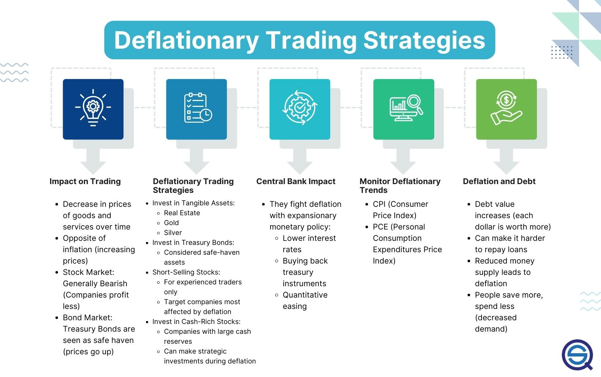

## Table of Contents

## What is deflation and how does it affect the economy?

Deflation is when the prices of things we buy, like food and clothes, go down over time. It's the opposite of inflation, where prices go up. When deflation happens, people might wait to buy things because they think prices will be even lower later. This can make businesses sell less, so they might make less money and even have to let workers go.

When businesses make less money and people lose their jobs, it can hurt the whole economy. People have less money to spend, which can make prices go down even more, starting a cycle that's hard to stop. Governments and banks often try to stop deflation because it can lead to big problems, like a lot of people being out of work and businesses closing down.

## What is a deflation trading strategy?

A deflation trading strategy is a way investors try to make money when prices are falling. They might sell things they own, like stocks or houses, before the prices drop too much. They could also buy things that usually do well when prices are going down, like certain bonds or gold. The idea is to have money in things that will lose value slowly or even gain value when everything else is getting cheaper.

For example, if someone thinks deflation is coming, they might sell their stocks and put the money into government bonds. Bonds can be safer because they pay back a set amount of money over time, no matter what happens to prices. Another part of the strategy could be to borrow money and buy things that will still be worth a lot even if prices fall. This way, they can pay back the loan with money that's worth more than when they borrowed it.

## How can deflation impact different asset classes?

Deflation can hurt stocks a lot. When prices go down, people might spend less money, so companies make less profit. If people think this will keep happening, they might sell their stocks, making the prices of stocks go down too. This can be bad for people who own stocks because their investments lose value. But some stocks, like those from companies that make things people always need, like food or medicine, might not go down as much. These companies can still do okay even when prices are falling.

Bonds can be a safer place to put money during deflation. When prices fall, the money you get back from bonds stays the same, so it's worth more. This makes bonds more valuable. People might want to buy more bonds because they are seen as a safe way to keep their money. But not all bonds are the same. Government bonds are usually safer than company bonds, so they might do better when prices are falling.

Real estate can also be affected by deflation. When prices go down, people might wait to buy houses because they think they can get a better deal later. This can make house prices fall. If people owe money on their houses and the house is worth less than what they owe, they might have to sell it for less than they want. But some types of real estate, like apartments people rent, might not go down as much because people still need a place to live.

## What are the key indicators to watch for deflation?

To see if deflation might be coming, you should look at how much prices are changing. If the prices of things like food, clothes, and gas are going down over time, that's a big sign of deflation. You can check this by looking at the Consumer Price Index (CPI), which measures the average price of a bunch of things people buy. If the CPI is going down, it means deflation might be happening. Another thing to watch is the Producer Price Index (PPI), which looks at the prices businesses pay for stuff they use to make things. If the PPI goes down, it can mean that prices for everyone might go down soon too.

Another important thing to watch is how much people are spending. If people start spending less money because they think prices will be lower later, it can lead to deflation. You can see this by looking at retail sales numbers. If fewer things are being sold, it might mean people are waiting for prices to drop. Also, keep an eye on how much money people are borrowing. If borrowing goes down, it can mean people are not spending as much, which can make prices fall. Watching these signs can help you see if deflation is coming and how it might affect the economy.

## What are the basic steps to implement a deflation trading strategy?

To start a deflation trading strategy, first, you need to look at signs that prices might be going down. Check things like the Consumer Price Index and Producer Price Index to see if prices are dropping. Also, watch how much people are spending and borrowing. If you see these numbers going down, it might mean deflation is coming. Once you think deflation is on the way, you can start planning your strategy.

Next, you should think about selling things you own that might lose value, like stocks. You could put that money into safer things like government bonds, which usually do better when prices are falling. Another idea is to borrow money and buy things that will keep their value, like gold. This way, you can pay back the loan with money that's worth more than when you borrowed it. By doing these things, you can try to make money even when prices are going down.

## How does a deflation trading strategy differ from an inflation trading strategy?

A deflation trading strategy is about what to do when prices are going down. When you think deflation is coming, you might want to sell things like stocks that could lose value. Then, you could put that money into safer things like government bonds, which usually do better when prices fall. You might also borrow money and buy things like gold, which keep their value. The idea is to have your money in things that won't lose as much value or might even gain value when everything else is getting cheaper.

An inflation trading strategy is the opposite. It's about what to do when prices are going up. When you think inflation is coming, you might want to buy things like stocks or real estate, which can go up in value with inflation. You could also look into things like commodities, like oil or food, which often get more expensive when prices rise. The goal is to have your money in things that will grow in value as prices go up, so you don't lose money to inflation.

## What are the risks associated with trading during deflationary periods?

Trading during deflationary periods can be tricky because prices are going down. If you own things like stocks or houses, they might lose value fast. This can make you lose a lot of money if you don't sell them in time. Also, if you borrow money to buy things, you might find it hard to pay back the loan if your investments lose value. This can lead to big problems, like not being able to pay your debts.

Another risk is that deflation can make the economy slow down a lot. When people think prices will keep falling, they might stop spending money. This can hurt businesses and make them lay off workers. If you have your money in things that depend on people spending, like stocks in stores or restaurants, you could lose money. It's hard to predict how bad deflation will be, so even a good trading plan might not work out if the economy gets worse than you thought.

## Can you provide historical examples of successful deflation trading strategies?

During the Great Depression in the 1930s, the U.S. went through a big deflation. Prices for everything dropped a lot. Some people who saw this coming sold their stocks before they lost too much value. They then put their money into government bonds, which stayed safe and even got more valuable as prices fell. For example, those who bought U.S. Treasury bonds did well because the money they got back was worth more than when they bought the bonds. This was a smart move because it helped them keep their money safe during a really tough time.

Another time was in Japan during the 1990s and 2000s, when they had a long period of deflation. Some investors there made money by selling stocks and real estate before prices went down too much. They then put their money into things like government bonds and gold. These things kept their value or even went up in value when other prices were falling. By doing this, these investors were able to protect their money and even make some profit during a time when many others were losing money.

## How can technical analysis be used in a deflation trading strategy?

Technical analysis can help with a deflation trading strategy by looking at charts and patterns to guess what prices might do next. When you think deflation is coming, you can use technical analysis to find good times to sell things like stocks before they lose too much value. For example, if you see a pattern that often means prices will go down, like a "head and shoulders" pattern, you might decide it's time to sell your stocks. By watching these patterns, you can try to sell at the best time and then put your money into safer things like bonds.

Technical analysis can also help you decide when to buy things that might do well during deflation. For instance, if you see that the price of government bonds is going up and breaking through a resistance level, it might be a good time to buy them. This kind of analysis can show you trends and patterns that tell you when it's a good time to move your money around. By using technical analysis, you can make smarter choices about when to sell and buy during a time when prices are falling.

## What role do government policies play in deflation and trading strategies?

Government policies can have a big impact on deflation and how people trade during these times. When a government sees deflation coming, it might try to stop it by making more money available or lowering interest rates. This can make people spend more and help prices go back up. If the government does this, it might be a good time to buy things like stocks because prices could start to rise again. But if the government doesn't do anything, deflation might get worse, and it could be smarter to sell stocks and buy safer things like bonds.

Government actions can also change how traders plan their moves. For example, if the government starts giving money to people to spend, it might make prices go up a little. Traders who see this coming might hold onto their stocks longer or even buy more, hoping that prices will recover. But if the government raises taxes or makes it harder to borrow money, it could make deflation worse. Traders might then decide to sell their stocks quickly and put their money into things that are less affected by falling prices, like gold or government bonds. Watching what the government does can help traders make better choices during deflation.

## How should one adjust a portfolio in anticipation of deflation?

When you think deflation is coming, you might want to change your portfolio to protect your money. Start by selling things that could lose value fast, like stocks. Companies might make less money when prices are falling, so their stock prices can go down a lot. Instead, put that money into things that are safer, like government bonds. These bonds pay you back the same amount of money no matter what happens to prices, so they can be worth more when everything else is getting cheaper. You could also think about buying gold, which usually keeps its value even when prices are falling.

Another thing to think about is borrowing money to buy things that will still be worth a lot during deflation. If you borrow money now and prices go down, you can pay back the loan with money that's worth more than when you borrowed it. This can be a smart move if you're careful. Keep an eye on what the government is doing too, because their actions can change how bad deflation might be. If they're trying to stop deflation, it might be okay to keep some of your money in stocks. But if they're not doing much, it's probably safer to move your money into bonds and gold.

## What advanced techniques can be used to optimize a deflation trading strategy?

To make your deflation trading strategy even better, you can use something called quantitative analysis. This means using math and computers to look at a lot of data and find patterns that can tell you when prices might go down. You can use this to make a model that predicts how bad deflation might be and what to do with your money. For example, you could use this model to figure out the best times to sell stocks and buy bonds. By doing this, you can make smarter choices and maybe make more money, even when prices are falling.

Another advanced way to improve your strategy is to use something called options trading. Options let you bet on whether prices will go up or down without having to buy the actual thing. During deflation, you can use options to protect your money. For example, you can buy "put options" on stocks, which let you sell them at a set price later, even if the stock price goes down a lot. This can help you lose less money if prices fall. You can also use "call options" on bonds or gold, which let you buy them at a set price later, helping you make money if their prices go up. By using options, you can make your trading strategy more flexible and protect your money better during deflation.

## References & Further Reading

[1]: ["Monetary Policy in Deflation: The Role of Macroprudential Tools"](https://www.stlouisfed.org/open-vault/2020/march/understanding-role-monetary-policy-economy) by Bank for International Settlements

[2]: ["Deflation: Economic Significance, Causes, and Effectiveness of Monetary Policy"](https://corporatefinanceinstitute.com/resources/economics/deflation/) by International Monetary Fund

[3]: ["Advances in Financial Machine Learning"](https://www.amazon.com/Advances-Financial-Machine-Learning-Marcos/dp/1119482089) by Marcos Lopez de Prado

[4]: ["Algorithmic Trading: Winning Strategies and Their Rationale"](https://www.wiley.com/en-us/Algorithmic+Trading%3A+Winning+Strategies+and+Their+Rationale-p-9781118746912) by Ernie Chan

[5]: Mishkin, F. S. (1997). ["The Causes and Propagation of Financial Instability: Lessons for Policymakers."](https://www.kansascityfed.org/documents/3591/pdf-s97Mishk.pdf) National Bureau of Economic Research Working Paper No. 6399

[6]: ["Deflation and Reflation: The Current Swedish Experience"](https://www.stlouisfed.org/open-vault/2023/august/explaining-inflation-disinflation-deflation) by Bank of Japan

[7]: ["The Deflationary Bias and Commutation Mechanism in an Adaptive Trading System"](https://onlinelibrary.wiley.com/doi/full/10.1111/jmcb.13140) IEEE Access

[8]: ["Quantitative Trading: How to Build Your Own Algorithmic Trading Business"](https://www.amazon.com/Quantitative-Trading-Build-Algorithmic-Business/dp/0470284889) by Ernest P. Chan