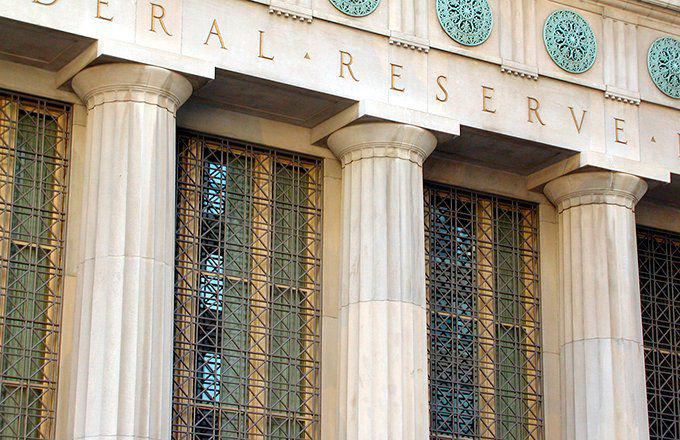

## Table of Contents

## What is deflation?

Deflation is when the prices of things we buy, like food and clothes, go down over time. It's the opposite of inflation, where prices go up. When deflation happens, people might wait to buy things because they think prices will be even lower later. This can make businesses sell less and might lead to them cutting jobs or closing.

Deflation can also make debts bigger. If you owe money, the money you pay back is worth more than when you borrowed it. This can be hard for people and businesses with loans. Governments and banks often try to stop deflation because it can slow down the whole economy and make it hard for everyone to grow and do well.

## How does deflation affect the economy?

Deflation can hurt the economy in big ways. When prices start to fall, people often wait to buy things because they think prices will drop even more. This means businesses sell less stuff, which can lead them to cut jobs or even close down. When people lose their jobs, they have less money to spend, which makes the problem worse. It can start a cycle where the economy gets smaller and smaller.

Also, deflation makes debts bigger. If you owe money, the money you pay back is worth more than when you borrowed it. This can be really tough for people and businesses with loans. They might struggle to pay back what they owe, which can lead to more businesses failing and more people losing their jobs. Governments and banks usually try hard to stop deflation because it can slow down the whole economy and make it hard for everyone to grow and do well.

## What is the role of central banks in managing deflation?

Central banks play a big role in trying to stop deflation. They do this by controlling interest rates. When there's a risk of deflation, central banks might lower interest rates. This makes it cheaper for people and businesses to borrow money. When borrowing is cheaper, people might spend more and businesses might invest more, which can help keep prices from falling.

Central banks can also use other tools, like buying bonds, to put more money into the economy. This is called quantitative easing. By putting more money out there, they hope to encourage spending and investment, which can help stop prices from going down. If they do their job well, central banks can help keep the economy stable and avoid the problems that come with deflation.

## How do central banks typically respond to deflation?

Central banks usually try to stop deflation by making borrowing cheaper. They do this by lowering interest rates. When interest rates are low, people and businesses can borrow money more easily. This encourages them to spend more on things like cars, houses, or new equipment for their businesses. More spending can help keep prices from falling and stop deflation from getting worse.

Another tool central banks use is called quantitative easing. This means they buy bonds and other financial stuff to put more money into the economy. When there's more money around, people and businesses might feel more confident and spend more. This can help push prices up a bit and fight deflation. Central banks want to keep the economy stable, so they use these methods to make sure deflation doesn't cause big problems.

## What are the challenges central banks face when dealing with deflation?

Central banks face big challenges when trying to stop deflation. One big problem is that when people expect prices to keep falling, it's hard to get them to spend more money. Even if the central bank lowers interest rates, people might still wait to buy things because they think prices will be even lower later. This makes it hard for the central bank to get the economy moving again.

Another challenge is that interest rates can only go so low. If they're already very low, central banks can't lower them much more. This is called the "zero lower bound." When rates are at or near zero, the central bank has to use other tools like quantitative easing. But these tools might not work as well, and it can be hard to know how much money to put into the economy without causing other problems.

These challenges make it tough for central banks to fight deflation. They have to be very careful and sometimes need to try different things to help the economy. If they don't get it right, deflation can keep going and make the economy weaker.

## Can deflation lead to a deflationary spiral? How?

Yes, deflation can lead to a deflationary spiral. This happens when prices keep falling, and it makes people want to spend less and less. When people spend less, businesses sell less stuff. So, they might have to cut prices even more to try to sell their products. This makes prices fall even further, and the cycle keeps going. It's like a downward spiral where prices keep dropping, and it's hard to stop.

In a deflationary spiral, businesses might also start to cut jobs because they're not selling as much. When people lose their jobs, they have even less money to spend. This makes the problem worse because now there's even less spending, which pushes prices down even more. It's a tough cycle to break because everything keeps getting worse, and it can make the whole economy shrink.

## How does deflation impact interest rates and monetary policy?

Deflation makes interest rates tricky for central banks. When prices are falling, people might save more money instead of spending it, because they think things will be cheaper later. This means there's less demand for loans, so interest rates might go down naturally. Central banks might also lower interest rates on purpose to try to get people to borrow and spend more. But if interest rates are already very low, it's hard to lower them even more. This is a big challenge because the central bank can't use lower interest rates to fight deflation as easily.

Monetary policy gets harder during deflation too. Central banks might use tools like quantitative easing, which means they put more money into the economy by buying bonds. This is supposed to make people feel more confident and spend more. But if people are still worried about falling prices, they might not spend the extra money. So, even though the central bank is trying to help, it can be hard to stop deflation. This makes it tough for the central bank to keep the economy growing and stable when prices are going down.

## What historical examples illustrate the impact of deflation on central banking?

One big example of deflation's impact on central banking happened during the Great Depression in the 1930s. In the United States, prices started to fall a lot, and this made people spend less. The Federal Reserve, which is the central bank, didn't do enough to stop this. They kept interest rates too high for too long, thinking it would help, but it made things worse. People and businesses had a hard time borrowing money, and the economy got smaller and smaller. This showed how important it is for central banks to act quickly and lower interest rates when there's deflation.

Another example is Japan in the 1990s and 2000s. Japan had a big problem with deflation that lasted for a long time. The Bank of Japan tried to fight it by lowering interest rates to almost zero and using quantitative easing to put more money into the economy. But it was hard to get people to spend more because they kept waiting for prices to fall even more. This showed that even when central banks do a lot, it can be tough to stop deflation once it starts. It also showed how central banks need to keep trying different things and not give up, even when it's hard.

## How do central banks use quantitative easing to combat deflation?

Central banks use quantitative easing to fight deflation by putting more money into the economy. They do this by buying bonds and other financial stuff from banks. When the central bank buys these bonds, it gives banks more money. The hope is that banks will then lend this money to people and businesses. When people and businesses have more money to borrow, they might spend more. More spending can help stop prices from falling and fight deflation.

But using quantitative easing isn't always easy. Sometimes, even when there's more money around, people might still not want to spend it if they think prices will keep falling. This can make it hard for the central bank to stop deflation. The central bank has to be careful and keep trying different things to make sure the extra money helps the economy. If they do it right, quantitative easing can be a powerful tool to fight deflation and keep the economy growing.

## What are the long-term effects of deflation on central bank credibility?

Deflation can hurt how much people trust the central bank over a long time. When prices keep falling and the economy gets smaller, people might start to think the central bank isn't doing a good job. If the central bank tries to stop deflation with things like lowering interest rates or using quantitative easing, but it doesn't work, people might lose faith in the central bank even more. They might think the central bank can't control the economy well, which makes it harder for the central bank to help the economy in the future.

On the other hand, if the central bank can stop deflation and keep prices stable, it can actually make people trust it more. People will see that the central bank can handle tough problems and keep the economy growing. This trust is really important because it helps the central bank do its job better. When people believe in the central bank, they're more likely to spend and invest, which helps the economy stay strong and grow over time.

## How do different central banks around the world approach deflation differently?

Different central banks around the world have their own ways of dealing with deflation. In Japan, the Bank of Japan has been fighting deflation for a long time. They've used a lot of quantitative easing, which means they put a lot of money into the economy by buying bonds. They also tried to keep interest rates very low, almost at zero, to make people borrow and spend more. But it's been hard because people in Japan got used to prices falling and didn't want to spend more even with all this extra money.

In the United States, the Federal Reserve also uses tools like lowering interest rates and quantitative easing to fight deflation. During the Great Recession, they lowered interest rates a lot and bought a lot of bonds to help the economy. The Federal Reserve tries to keep people's trust by being clear about what they're doing and why. They also watch the economy closely and change their plans if they need to. This helps them react quickly to problems like deflation.

In Europe, the European Central Bank (ECB) has its own way of dealing with deflation. They've used negative interest rates, which means banks have to pay to keep their money at the ECB. This is supposed to make banks lend more money to people and businesses. The ECB also uses quantitative easing, but they have to think about all the different countries in the Eurozone and how they're doing. This makes it harder for the ECB to fight deflation because what works for one country might not work for another.

## What are the advanced strategies central banks might employ to mitigate the effects of deflation?

Central banks might use something called forward guidance to help fight deflation. This means they tell people what they plan to do with interest rates in the future. By saying they'll keep rates low for a long time, they hope to make people feel more sure about spending money now instead of waiting. This can help stop prices from falling. Central banks might also try to make their inflation targets clearer, so people know what the bank is trying to do. If people believe the bank will do what it says, they might spend more and help stop deflation.

Another advanced strategy is called helicopter money. This is when the central bank gives money directly to people, kind of like dropping money from a helicopter. The idea is that if people get money for free, they'll spend it right away, which can help push prices up and stop deflation. Central banks might also work with the government to do things like cutting taxes or spending more on things like roads and schools. This can put more money into people's pockets and get them spending more, which can help fight deflation too.

## References & Further Reading

Articles and papers concerning deflation, monetary policy, and [algorithmic trading](/wiki/algorithmic-trading) offer a comprehensive understanding of the intricate links between these economic components. Key works include analyses by institutions like the International Monetary Fund (IMF) and the Federal Reserve, which explore deflationary impacts on global markets and the effectiveness of policy responses. For instance, "The Liquidity Trap and U.S. Monetary Policy" by the Federal Reserve provides insights into monetary strategies during low inflation or deflationary periods.

In the context of financial [machine learning](/wiki/machine-learning) and algorithmic trading strategies, several [books](/wiki/algo-trading-books) offer practical knowledge and tools. "Advances in Financial Machine Learning" by Marcos López de Prado discusses quantitative methods and machine learning techniques crucial for developing robust trading algorithms. Such resources are invaluable for understanding the technical and algorithmic responses to market changes brought on by deflation.

Statistical analyses and case studies enrich the understanding of deflation across historical and contemporary scenarios. Studies on Japan's Lost Decade and the 2008-2009 financial crisis illustrate how algorithmic trading adapted to deflationary environments. The European Central Bank's working papers provide data-driven insights into deflationary trends and policy measures in the Eurozone.

These references, through a mix of theoretical and practical perspectives, form a foundation for further exploration of deflation's impact on economic policy and financial markets.

