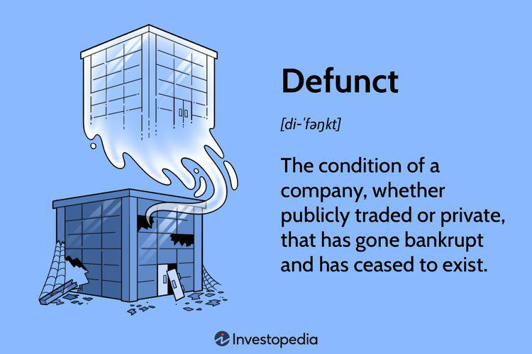

In the dynamic world of finance, emerging terminologies and concepts can often lead to confusion, especially for newcomers. One such term that often requires clarification is 'defunct.' The business landscape is rife with instances where companies, once thriving, cease to exist due to various factors like bankruptcies, mergers, or changes in market demands. Understanding this term, therefore, becomes essential for those involved in financial activities.

The advent of technology has been a game-changer in numerous sectors, and finance is no exception. One of the most transformative shifts in recent decades has been the rise of algorithmic trading, or 'algo trading.' This method of trading employs computer algorithms to automatically execute trades, based on pre-established criteria such as price, timing, or volume. Its appeal lies in its ability to process vast amounts of market data at speeds unattainable through manual trading, thus enhancing decision-making and execution efficiency.



As the popularity of algorithmic trading surges, several older trading methods become obsolete or 'defunct.' This phenomenon is not limited to trading strategies but extends to entire companies that fail to adapt to technological advancements. It stands as a testament to the critical nature of innovation and adaptation within financial markets. In this context, understanding what constitutes a defunct business or strategy is paramount for investors and traders aiming to navigate the complexities of the financial ecosystem successfully.

This article intends to clarify the meaning of 'defunct' within business contexts and specifically in algorithmic trading. We will review the historical progression and expansion of algorithmic trading, highlighting instances where technological evolution has rendered certain strategies and companies defunct. Through practical examples, we will explore the implications of these changes, providing insight into the continuous evolution of the financial markets. By doing so, we aim to equip readers with knowledge of current trends and prepare them for future developments in this ever-evolving field.

## Table of Contents

## Understanding the Term 'Defunct'

'Defunct' refers to entities that are no longer existing, functioning, or in use. In a business context, the term is often applied to companies that have gone bankrupt or ceased operations. Such companies are considered defunct once they no longer engage in any form of business activity. Despite having ceased operations, it is crucial to note that shares of a defunct company might still trade until official deregistration or revocation occurs, as noted by the Securities and Exchange Commission (SEC). This period of residual trading can sometimes lead to investor confusion, especially if the financial status and future prospects of the company are not clearly communicated.

Beyond the corporate context, the term 'defunct' can apply to various domains, encompassing outdated laws, obsolete currencies, or business practices rendered irrelevant by technological or market changes. For example, certain laws may become defunct when new regulations are enacted to replace them, while currencies can become defunct when they are succeeded by new monetary systems.

An understanding of the term 'defunct' is particularly important for investors and traders. Recognizing when a company or strategy transitions into obsolescence is vital for making informed decisions. It allows market participants to effectively manage risk and capital allocation by avoiding investments in entities or assets that are no longer viable. The concept also underscores the importance of staying informed about technological and market changes that can render existing business models ineffective or irrelevant.

Staying vigilant about the lifecycle of companies and financial strategies helps in navigating the dynamic landscape of the financial markets, where constant change is the only certainty. Familiarity with the term 'defunct' thus empowers investors and traders to better assess the ongoing viability and potential of their investments.

## Algorithmic Trading: A Brief Overview

Algorithmic trading involves the use of computer algorithms to execute trades automatically based on predefined criteria such as timing, price, or quantity. This sophisticated trading method has become increasingly popular due to its numerous advantages over traditional trading approaches.

The primary benefits of [algorithmic trading](/wiki/algorithmic-trading) include speed and precision. Algorithms can analyze vast amounts of market data much faster than any human could, allowing trades to be executed in fractions of a second. This rapid execution can take advantage of brief price discrepancies in the market, enhancing the potential for profit. Additionally, the precision offered by algorithms helps traders maintain strict adherence to their trading strategies, reducing the risk of error that is often associated with manual trading.

Another significant advantage is the elimination of human emotion from trading decisions. Emotions like fear and greed can often lead to irrational decisions, which can be costly in the fast-paced trading environment. By automating the process through algorithms, trading decisions are based purely on data and predefined instructions, removing emotional bias from the equation.

Algorithmic trading is associated with several common strategies, including trend-following, [arbitrage](/wiki/arbitrage), and mean reversion. Trend-following strategies aim to capitalize on the [momentum](/wiki/momentum) of a given market trend, buying assets when prices are rising and selling when they are falling. Arbitrage strategies exploit price differences of the same financial instrument on different markets to realize a risk-free profit. Mean reversion strategies are based on the assumption that prices will revert to their long-term average, thus traders will buy undervalued stocks and sell overvalued ones.

This advanced method of trading has transformed financial markets by significantly increasing efficiency. With algorithms, large volumes of trades can be processed simultaneously, contributing to higher market [liquidity](/wiki/liquidity-risk-premium) and narrower spreads. However, the rise of algorithmic trading has also led to the obsolescence of some older trading methods. Traditional methods that relied heavily on manual processing and slower data analysis have become less competitive, unable to match the speed and accuracy of algorithmic approaches.

Overall, algorithmic trading represents a pivotal shift in financial markets, offering substantial advantages but also posing new challenges. As markets continue to evolve, the reliance on technology in trading is likely to increase, potentially rendering more traditional practices defunct.

## Examples of Defunct Companies and Strategies

Standard Oil and Enron represent two of the most noteworthy cases of companies becoming defunct, driven by regulatory violations and fraudulent practices, respectively. Standard Oil, once a dominant force in the oil industry, was dismantled in 1911 following antitrust proceedings initiated by the U.S. government. The company's monopoly led to the violation of the Sherman Antitrust Act, resulting in its mandated breakup into 34 smaller entities, some of which remain influential today. Enron, on the other hand, collapsed in 2001 due to one of the largest accounting frauds in history. The company used complex financial structures to hide debt and inflate profits, leading to bankruptcy and significant financial loss for investors and employees.

In the context of algorithmic trading, certain trading algorithms or strategies have also become obsolete due to evolving market conditions and technological advancements. As markets have become more efficient and competitive, strategies such as trend-following and momentum, which rely on the persistence of price movements, may no longer yield the same success as before. 

Trend-following strategies involve capitalizing on the momentum of stock prices in a particular direction over a set period. Such strategies were once highly effective; however, with the saturation of these approaches and the advent of high-frequency trading, their effectiveness has waned. The underlying principle of trend-following is based on the assumption that prices will continue to move in a given direction, an assumption increasingly challenged by the faster reaction times of algorithmic systems and the increased market efficiency.

Momentum strategies are based on the observation that securities that have performed well in the past will continue to perform well in the short-term future. However, as financial markets become more sophisticated, these strategies face challenges in maintaining profitability. The increased availability of data and advanced analytical tools enable traders and institutions to detect and exploit inefficiencies more rapidly, reducing the lifespan of any market patterns these strategies seek to exploit.

As technology advances, these once-dominant strategies are often replaced with more complex algorithms incorporating [machine learning](/wiki/machine-learning) and [artificial intelligence](/wiki/ai-artificial-intelligence). These new strategies adapt to changing market conditions, analyze vast amounts of data in real-time, and execute trades in milliseconds, offering a competitive edge over traditional methods. Consequently, the rapid evolution in technology has not only rendered many older strategies obsolete but has also necessitated continuous innovation for survival and success in algorithmic trading.

## Impact of Algorithmic Trading on Market Practices

Algorithmic trading, commonly referred to as algo trading, has substantially transformed market practices by automating trading activities and reducing the need for manual intervention. This shift has significantly streamlined trading processes, enabling faster and more precise transactions. Traditional manual trading processes, which often relied on traders' instinct and reaction time, have become increasingly redundant due to the superior speed and accuracy of algorithmic systems.

The integration of artificial intelligence (AI) and machine learning technologies into algorithmic trading frameworks has accelerated this transition. AI algorithms can analyze large datasets and adapt to new information more quickly than human traders, making older, less sophisticated trading methods obsolete. For instance, machine learning models can detect subtle market patterns and predict price movements with greater accuracy than traditional statistical methods.

Here is a simple example in Python to illustrate how a basic machine learning model might predict the movement of a stock price:

```python
from sklearn.ensemble import RandomForestClassifier
import numpy as np

# Sample data: [feature1, feature2, ..., featureN]
X = np.array([[1.1, 2.3, 3.3], [1.4, 2.6, 3.6], [1.5, 2.7, 3.7]])  # Historical market data
y = np.array([1, 0, 1])  # 1: Price up, 0: Price down

# Initialize and train the model
model = RandomForestClassifier()
model.fit(X, y)

# New data for prediction
new_data = np.array([[1.2, 2.5, 3.4]])
prediction = model.predict(new_data)

print("Predicted movement (1: up, 0: down):", prediction)
```

While these technological advancements enhance efficiency, they are not without risks. Algo trading has been implicated in incidents of market instability, such as flash crashes. A flash crash is characterized by a rapid and deep plunge in security prices, often within minutes, followed by a swift recovery. These events can be traced back to the high-speed and high-frequency trading methods enabled by algorithmic strategies. In 2010, the U.S. stock market experienced a significant flash crash, where the Dow Jones Industrial Average plunged by about 1,000 points in less than 30 minutes, only to recover the majority of those losses shortly after. Such incidents pose critical questions regarding the increasing dependence on technology in trading and the adequacy of current risk management frameworks.

Additionally, the reliance on these advanced systems introduces potential vulnerabilities, such as algorithmic errors or failures that can exacerbate market [volatility](/wiki/volatility-trading-strategies). Thus, while algorithmic trading offers undeniable advantages in terms of speed and efficiency, it also necessitates a careful consideration of the associated risks to ensure market stability and integrity. Traders and investors must balance harnessing these sophisticated tools' efficiencies with implementing comprehensive risk management strategies to safeguard against unintended market disruptions.

## Conclusion

The term 'defunct' serves as a vivid reminder of the dynamic nature of financial markets, particularly under the influence of advancements like algorithmic trading. The rapid progression of technology has redefined the operational landscape, rendering some companies and strategies obsolete. For investors, identifying defunct strategies or companies is crucial to making informed decisions, especially in a market environment that is continuously evolving. 

Algorithmic trading epitomizes this shift, offering unprecedented opportunities for speed and precision. However, it also poses risks that can lead to sudden market instabilities. As algorithmic trading mechanisms become more sophisticated, traders must stay informed about technological developments to adapt effectively. Leveraging new opportunities in this environment involves not only capitalizing on these advancements but also being acutely aware of the associated risks.

For optimal investment strategies, investors are advised to seek guidance from financial advisors and to maintain a keen awareness of current market trends. This proactive approach can enhance decision-making and strategy formulation, ensuring that investments remain robust against the backdrop of a rapidly transforming financial landscape.

## References & Further Reading

[1]: Bergstra, J., Bardenet, R., Bengio, Y., & Kégl, B. (2011). ["Algorithms for Hyper-Parameter Optimization."](https://dl.acm.org/doi/10.5555/2986459.2986743) Advances in Neural Information Processing Systems 24.

[2]: ["Advances in Financial Machine Learning"](https://www.amazon.com/Advances-Financial-Machine-Learning-Marcos/dp/1119482089) by Marcos Lopez de Prado

[3]: ["Evidence-Based Technical Analysis: Applying the Scientific Method and Statistical Inference to Trading Signals"](https://www.amazon.com/Evidence-Based-Technical-Analysis-Scientific-Statistical/dp/0470008741) by David Aronson

[4]: ["Machine Learning for Algorithmic Trading"](https://github.com/stefan-jansen/machine-learning-for-trading) by Stefan Jansen

[5]: ["Quantitative Trading: How to Build Your Own Algorithmic Trading Business"](https://www.amazon.com/Quantitative-Trading-Build-Algorithmic-Business/dp/1119800064) by Ernest P. Chan