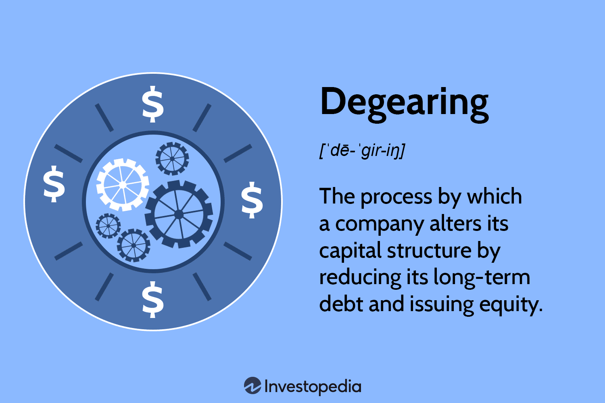

## Table of Contents

## What is degearing in finance?

Degearing in finance refers to the process of reducing a company's debt levels. When a company is highly geared, it means it has a lot of debt compared to its equity. Degearing helps to lower this debt, making the company's financial structure more stable and less risky. Companies might choose to degear by paying off loans, selling assets to reduce debt, or by increasing their equity through issuing new shares.

By degearing, a company can improve its financial health. Lower debt levels mean less interest to pay, which can free up cash flow for other uses like investing in the business or paying dividends to shareholders. Additionally, a lower debt-to-equity ratio can make the company more attractive to investors and lenders, as it suggests a lower risk of default. This can lead to better borrowing terms and a higher stock price.

## How does degearing affect a company's financial structure?

Degearing changes a company's financial structure by reducing its debt. When a company has less debt, it is less risky because it doesn't have to pay back as much money to lenders. This makes the company's balance sheet healthier. A healthier balance sheet means the company has more equity compared to debt, which is good for the company's long-term stability.

With less debt, the company also has to pay less interest. This means more money can be used for other things, like growing the business or paying dividends to shareholders. Investors and lenders like companies with less debt because it shows the company is managing its money well. This can make it easier for the company to get loans in the future or attract more investors.

## What are the primary reasons a company might choose to degear?

A company might choose to degear to make its financial situation safer. When a company has a lot of debt, it has to pay back a lot of money and interest. This can be risky because if the company can't pay, it might go bankrupt. By degearing, the company reduces its debt and makes it easier to manage its money. This can make the company more stable and less likely to have financial problems.

Another reason a company might degear is to save money on interest. When a company has less debt, it pays less interest. This means the company has more money to use for other things, like growing the business or giving money back to shareholders. This can help the company do better in the long run.

Lastly, degearing can make the company look better to investors and lenders. When a company has less debt, it seems safer and more trustworthy. This can make it easier for the company to get loans or attract investors. A company that looks financially healthy can often get better deals and grow more easily.

## Can you explain the process of degearing?

Degearing is when a company decides to lower its debt. They do this by paying off loans or selling things they own to get money to pay off the debt. Sometimes, they might also get more money from investors by selling new shares of the company. This makes the company's debt smaller compared to its equity, which is the money that belongs to the owners of the company.

When a company degears, it becomes less risky because it doesn't owe as much money. This means they don't have to pay as much interest, so they have more money to use for other things. It also makes the company look better to people who might want to lend them money or buy their shares. A company that has less debt is seen as safer and more stable, which can help it grow and do well in the future.

## What are the potential benefits of degearing for a company?

Degearing can make a company safer and more stable. When a company has less debt, it is less risky because it doesn't have to pay back as much money. This means the company is less likely to run into financial trouble. It also makes the company's balance sheet look healthier because there is more equity compared to debt. This can help the company in the long run by making it more stable and easier to manage.

Another benefit of degearing is that it can save the company money. When a company has less debt, it pays less interest. This means the company has more money to use for other things, like growing the business or giving money back to shareholders. Having more cash available can help the company invest in new projects or improve its operations, which can lead to better performance and growth.

Degearing can also make the company more attractive to investors and lenders. When a company has less debt, it looks safer and more trustworthy. This can make it easier for the company to get loans or attract new investors. A company that looks financially healthy can often get better deals and grow more easily. This can lead to a higher stock price and better borrowing terms, which are good for the company's future.

## What are the risks or downsides associated with degearing?

Degearing can have some downsides for a company. One risk is that it might use up a lot of cash to pay off debt. This can leave the company with less money to use for other things, like growing the business or fixing problems. If the company needs cash quickly for something important, it might not have enough because it used so much to pay off debt.

Another downside is that degearing might make shareholders unhappy. When a company sells new shares to get money to pay off debt, it can make each share worth less because there are more shares now. This can make the stock price go down, which can upset people who own the shares. They might feel like their investment is not doing as well as they hoped.

Also, degearing can make it harder for a company to take advantage of opportunities. Sometimes, having debt can be good because it lets a company borrow money to grow or buy other businesses. If a company degears too much, it might not be able to borrow as easily in the future. This can limit the company's ability to expand or react quickly to new chances in the market.

## How does degearing impact shareholders and investors?

Degearing can affect shareholders and investors in different ways. When a company decides to reduce its debt, it might sell new shares to get the money needed to pay off the debt. This means there are more shares now, which can make each share worth less. As a result, the stock price might go down, and shareholders might feel that their investment is not doing as well. This can make them unhappy because their shares are worth less than before.

On the other hand, degearing can also be good for shareholders and investors. When a company has less debt, it is less risky. This means the company is less likely to have financial problems, which can make investors feel more confident about the company's future. A company with less debt might also have more money to give back to shareholders through dividends or to use for growing the business. This can lead to a healthier company, which can be good for the stock price in the long run.

## What are some real-world examples of companies that have successfully degeared?

One example of a company that successfully degeared is Ford Motor Company. After the 2008 financial crisis, Ford was in a lot of debt. They decided to sell some of their assets, like their luxury car brand Jaguar, to get money to pay off their debt. By doing this, Ford was able to lower its debt and become more financially stable. This helped them survive the crisis and grow stronger in the years that followed.

Another example is Apple Inc. In the early 2000s, Apple had a lot of debt. They started to degear by using their profits to pay off the debt instead of taking on more. Over time, Apple became one of the least indebted companies in the tech industry. This made them more attractive to investors and helped them grow into the huge company they are today.

## How does degearing strategy vary between industries?

Degearing strategies can be different depending on what kind of business a company is in. For example, in industries like manufacturing or heavy machinery, companies might have a lot of debt because they need to buy expensive equipment. To degear, they might sell some of their old machines or factories to get money to pay off the debt. This can be a good way to become less risky, but it also means they might not be able to make as many products if they need to.

In the tech industry, companies might use their profits to pay off debt instead of borrowing more money. Tech companies often have a lot of cash because they make a lot of money from their products and services. They can use this cash to slowly pay down their debt over time. This makes them less risky and can help them grow without having to worry about paying back a lot of money. Each industry has its own way of degearing, based on what they need and what they have.

## What financial metrics should be monitored during and after degearing?

When a company is degearing, it's important to keep an eye on its debt-to-equity ratio. This ratio shows how much debt the company has compared to its equity, which is the money that belongs to the owners. By watching this ratio go down, the company can see if it's successfully lowering its debt. Another important metric is the interest coverage ratio, which shows if the company can pay the interest on its debt with its earnings. A higher interest coverage ratio means the company is in a better position to handle its debt.

After degearing, the company should continue to monitor its cash flow to make sure it has enough money to keep running smoothly. Good cash flow means the company can pay its bills and invest in new projects. The return on equity (ROE) is also important to watch because it shows how well the company is using its equity to make profits. If the ROE goes up after degearing, it's a sign that the company is doing well with less debt. Keeping an eye on these metrics helps the company stay healthy and grow in the long run.

## How can a company assess whether it is the right time to degear?

A company can tell if it's the right time to degear by looking at its financial health. If the company has a lot of debt and is struggling to pay it back, or if it's paying a lot of interest, it might be a good time to start degearing. The company should also check if it has enough cash or assets it can sell to pay off the debt. If the company thinks it can manage to reduce its debt without hurting its ability to run the business, then degearing could be a smart move.

Another way to decide if it's time to degear is by looking at the economy and the industry the company is in. If interest rates are going up, it might be a good idea to pay off debt now because it will be more expensive later. If the company's industry is going through tough times, having less debt can make the company safer and more likely to survive. By thinking about these things, a company can figure out if degearing is the right choice at the right time.

## What advanced strategies can be employed to optimize the degearing process?

To optimize the degearing process, a company can use a strategy called debt restructuring. This means the company talks to its lenders about changing the terms of its debt. They might ask for lower interest rates or longer time to pay back the money. This can make it easier for the company to pay off its debt without using up all its cash. Another strategy is to use excess cash flow smartly. Instead of spending all the money they make on new projects, the company can use some of it to pay down debt faster. This helps the company get out of debt quicker and save money on interest.

Another advanced strategy is to sell non-core assets. These are things the company owns but doesn't need for its main business. By selling these assets, the company can get money to pay off debt without hurting its main operations. The company can also consider a rights issue, where it gives current shareholders the chance to buy new shares at a lower price. This can bring in more money to pay off debt without diluting the value of existing shares too much. By using these strategies, a company can degear more effectively and improve its financial health.

## How can risk management be effectively implemented in algorithmic trading during periods of deleveraging?

Effective risk management is crucial in algorithmic trading, particularly during periods of deleveraging, as financial markets may experience heightened volatility and decreased liquidity. During such times, it is essential to employ robust strategies to safeguard investments and maintain operational stability. Here are several methods utilized in managing risk in algorithmic trading amid deleveraging:

1. **Diversification**: Diversification involves spreading investments across a variety of assets to minimize risk exposure. By not concentrating capital in a single asset or asset class, traders can mitigate the impact of adverse price movements on their portfolio. The principle of diversification can be mathematically represented using the variance of a portfolio, which seeks to minimize the overall risk by optimizing the allocation of weights across different assets:
$$
   \sigma_p^2 = \sum_{i=1}^{n} \sum_{j=1}^{n} w_i w_j \sigma_{ij}

$$

   where $\sigma_p^2$ is the portfolio variance, $w_i$ and $w_j$ are the weights of assets $i$ and $j$, and $\sigma_{ij}$ is the covariance between assets $i$ and $j$.

2. **Dynamic Stop-Loss Orders**: Dynamic stop-loss orders are automated trading instructions that adjust the exit price trigger based on current market conditions. This approach helps traders limit potential losses while allowing profits to run during favorable market trends. The dynamic aspect ensures that the stop-loss level moves in accordance with price fluctuations, thereby enhancing flexibility in volatile markets.

3. **Hedging Strategies**: Hedging involves taking positions that offset potential losses from unfavorable price movements in a primary position. By using derivatives such as options and futures, traders can secure their portfolios against downside risks while maintaining the potential for profit. Effective hedging requires a precise understanding of the correlation between assets and the market to strategize appropriately.

4. **Advanced Technologies and Machine Learning**: Advanced technological tools, including machine learning algorithms, offer predictive insights that assist in risk management. These technologies analyze large datasets to identify patterns and predict market movements, enabling traders to make informed decisions. For instance, machine learning models can be employed to forecast asset price movements, assisting in the optimization of trading strategies:

   ```python
   from sklearn.ensemble import RandomForestRegressor
   model = RandomForestRegressor(n_estimators=100)
   model.fit(training_data, target_data)
   predictions = model.predict(new_data)
   ```

5. **Latency-Sensitive Risk Control in High-Frequency Trading**: High-frequency trading (HFT) systems operate on extremely short timeframes, necessitating risk management modules that are sensitive to latency. As deleveraging can disrupt normal market operations, these systems must adapt swiftly to changing conditions. Integration of latency-sensitive risk controls allows for quick response to adverse events, minimizing potential losses.

Implementing these risk management practices helps algorithmic traders navigate the complexities of financial markets during deleveraging, improving resilience and ensuring sustainable trading operations.

## References & Further Reading

- Bergstra, J., et al., *Algorithms for Hyper-Parameter Optimization*. This work presents various algorithms to efficiently optimize hyper-parameters, which are crucial for enhancing the performance of machine learning models used in algo trading strategies. The paper discusses techniques like Bayesian optimization, which can fine-tune trading models for better predictive accuracy.

- Lopez de Prado, Marcos, *Advances in Financial Machine Learning*. This book combines machine learning and financial theory, providing insights into developing algorithms that manage trading risks and detect arbitrage opportunities. It introduces techniques like meta-labeling, which helps in predicting the timing of trading decisions.

- Aronson, David, *Evidence-Based Technical Analysis*. Aronson's work shifts the focus from traditional technical analysis to evidence-based techniques, advocating the use of statistical and data-driven methods. This is especially relevant for designing reliable algorithmic trading systems that minimize emotional biases.

- Jansen, Stefan, *Machine Learning for Algorithmic Trading*. Jansen provides a comprehensive guide on how to integrate machine learning techniques into trading algorithms. His book showcases practical examples and code implementations in Python, which are valuable for understanding algorithm adjustments during market changes like deleveraging.

- Chan, Ernest P., *Quantitative Trading: How to Build Your Own Algorithmic Trading Business*. Chan's guide is an essential resource for traders looking to create and manage their own algorithmic trading strategies. It covers everything from backtesting to risk management and offers insight into developing systems resilient to market disruptions.

