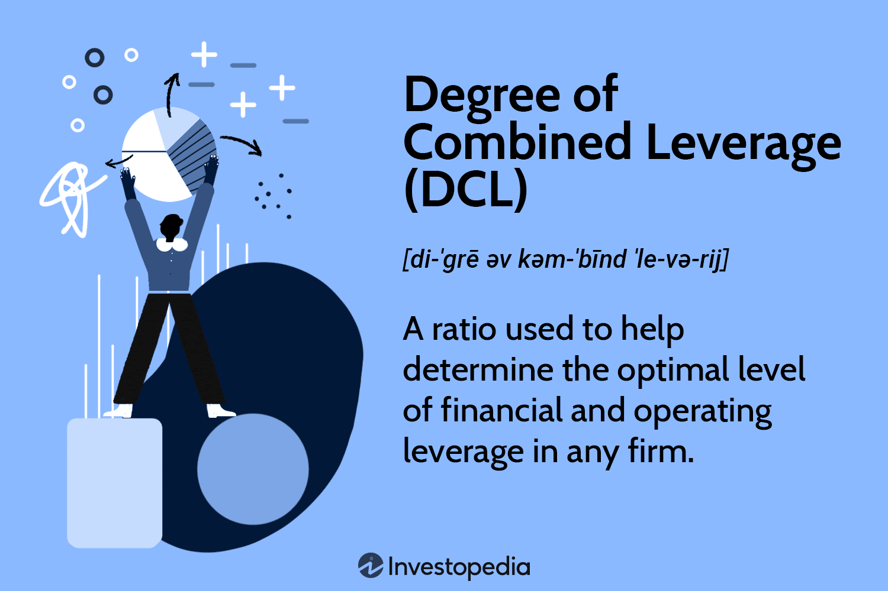

Understanding leverage is a crucial component for informed financial decision-making. In essence, leverage involves the use of various financial instruments or borrowed capital to increase the potential return of an investment. However, it is a double-edged sword; while it can amplify potential returns, it also increases potential risks, thereby affecting a company’s profitability and financial stability. This dual nature demands a thorough understanding and careful application of leverage within financial strategies.

Leverage can be broken down into several key types: financial leverage, operating leverage, and combined leverage. Financial leverage refers to the use of debt to acquire additional assets, with the expectation that the income derived from the assets will outpace the cost of borrowing. This concept is quantified by the degree of financial leverage (DFL), a ratio that highlights the sensitivity of a company's earnings per share (EPS) relative to its earnings before interest and taxes (EBIT). A higher DFL indicates that a small change in EBIT will result in a large change in EPS, underscoring the risk associated with higher financial leverage.



Operating leverage, on the other hand, is concerned with the proportion of fixed versus variable costs a company incurs. A company with high operating leverage benefits when sales increase, as more of each sales dollar contributes to profits after covering fixed costs. However, this also implies higher risk during sales downturns, as fixed costs remain constant irrespective of revenue. The degree of operating leverage (DOL) measures how a percentage change in sales will affect operating income.

Combined leverage takes into account both financial and operating leverage, providing a comprehensive view of a company's risk profile. It is represented by the degree of combined leverage (DCL), which assesses the sensitivity of EPS to changes in sales. A high DCL signifies increased risk, combining both operational and financial uncertainties, but offers significant profit potential when managed correctly.

In recent years, the rise of algorithmic trading has introduced sophisticated methods to utilize leverage. Algorithms can optimize trading strategies by integrating financial and operational leverage data to maximize returns while mitigating risks. This synergy between traditional leverage concepts and modern technological advancements enables investors and analysts to harness leverage more effectively.

The exploration of these types of leverage in financial strategies aims to equip investors and financial analysts with deeper insights into their importance in market operations. A thorough understanding of leverage not only aids in risk management but also enhances decision-making processes, contributing to sustainable financial success.

## Table of Contents

## Understanding Financial Leverage

Financial leverage is a strategic financial management tool employed to amplify the potential returns on investment by utilizing borrowed funds. This approach enables companies to enhance their capital base, facilitating greater investment opportunities without diluting ownership. The concept of financial leverage is fundamental in corporate finance, as it directly influences a company's capital structure and financial performance.

### Measuring Financial Leverage

The degree of financial leverage (DFL) is a key metric used to gauge this effect. DFL illustrates the sensitivity of a company's earnings per share (EPS) to fluctuations in earnings before interest and taxes (EBIT). Mathematically, the degree of financial leverage is expressed as:

$$
\text{DFL} = \frac{\text{EBIT}}{\text{EBIT} - \text{Interest Expense}}
$$

This formula shows the proportionate change in EPS for a given change in EBIT. A higher degree of financial leverage indicates that a small change in EBIT will result in a larger change in EPS, magnifying both potential gains and losses.

### Implications of High Financial Leverage

While high financial leverage can significantly increase profitability, it is accompanied by an elevated financial risk, particularly during economic downturns. During such periods, the obligation to meet fixed interest payments can strain a company's cash flow and adversely affect its financial health. In extreme cases, excessive leverage can lead to financial distress and potential insolvency.

### Risk Management and Strategies

Investors and financial managers must carefully balance the pursuit of higher returns with the potential for increased risk associated with financial leverage. Effective risk management strategies include:

1. **Cost-Benefit Analysis**: Before increasing leverage, companies should conduct a thorough analysis to compare the potential returns against the costs of debt servicing.

2. **Diversification**: Diversifying investments reduces the impact of adverse financial events on the overall business, mitigating the risks posed by high leverage.

3. **Hedging**: Utilizing financial instruments such as options and futures can hedge against interest rate fluctuations and currency risks, stabilizing cash flows.

4. **Monitoring Leverage Ratios**: Regularly assessing metrics such as DFL, interest coverage ratio, and debt-to-equity ratio helps in maintaining an optimal leverage level.

In summary, financial leverage remains a potent tool in enhancing investment returns, but it requires astute management to avoid the pitfalls of excessive risk. Properly balanced leverage strategies support sustainable growth and profitability, aligning with company objectives and market conditions.

## Exploring Operating Leverage

Operating leverage is a critical concept in financial management, representing the extent to which a company utilizes fixed costs in its cost structure. This leverage is quantifiable through the Degree of Operating Leverage (DOL), a measure that indicates how a company's operating income changes in response to variations in sales levels. The formula for DOL at a given level of sales is:

$$
\text{DOL} = \frac{\%\ \text{Change in EBIT}}{\%\ \text{Change in Sales}}
$$

Alternatively, it can be mathematically expressed as:

$$
\text{DOL} = \frac{\text{Sales} - \text{Variable Costs}}{\text{Sales} - \text{Variable Costs} - \text{Fixed Costs}}
$$

This quantification is crucial, as it highlights the potential impact of sales fluctuations on earnings before interest and taxes (EBIT). 

In a high operating leverage scenario, a company has a larger proportion of fixed costs relative to variable costs. This cost structure means that increases in sales lead to disproportionately higher increases in profits due to the fact that fixed costs remain constant, while only variable costs increase with sales [volume](/wiki/volume-trading-strategy). Companies with high operating leverage, such as those in technology or manufacturing sectors, benefit significantly from this scenario. However, the downside is that even a slight decrease in sales can lead to substantial declines in profitability, given that fixed costs remain unchanged regardless of sales performance.

Understanding operating leverage is essential for assessing a firm's risk profile. Firms with high operating leverage take on more business risk as they are more sensitive to sales changes. For example, in economic downturns, companies with high operating leverage might suffer more compared to those with lower operating flexibility. Therefore, assessing the degree of operating leverage assists investors and managers in making informed judgments about risk management and strategic planning.

Consequently, operating leverage serves as an invaluable tool for financial analysis, providing insights into how a firm's cost structure can affect its financial stability and profitability. By analyzing operating leverage, stakeholders can derive strategies to optimize fixed and variable costs, enhancing operational efficiency and safeguarding against potential adverse market conditions.

## Combined Leverage and Its Implications

Combined leverage represents the collective impact of financial leverage and operating leverage on a company's earnings per share (EPS). It provides a comprehensive view of a company's risk profile by combining the effects of changes in sales and earnings before interest and taxes (EBIT). 

To quantify this impact, the Degree of Combined Leverage (DCL) is utilized. DCL is calculated by measuring the percentage change in EPS relative to a percentage change in sales. The formula for DCL is derived from the degree of operating leverage (DOL) and the degree of financial leverage (DFL), expressed as:

$$
\text{DCL} = \text{DOL} \times \text{DFL}
$$

A high DCL indicates a situation where small changes in sales lead to significant variations in EPS, implicating increased risk. This is because it incorporates both the risk of fixed operational costs (in operating leverage) and the risk of fixed financial obligations (in financial leverage). 

Companies with high combined leverage face heightened exposure to market fluctuations, as both sales [volatility](/wiki/volatility-trading-strategies) and financial obligations can amplify the impact on EPS. Thus, while high combined leverage can lead to substantial profitability during periods of sales growth, it can equally lead to exacerbated losses during downturns. 

For successful utilization, firms must strategically manage both types of leverage to align with their market conditions and risk tolerance. Effective planning and management involve assessing the optimal mix of debt and operational fixed costs to maintain a favourable risk-return balance. 

By carefully calibrating these components, businesses can enhance their financial performance while mitigating the potential downsides associated with high risk. This requires robust analytical frameworks and continuous monitoring to adjust strategies in response to changing economic landscapes.

## Algorithmic Trading and Leverage

Algorithmic trading involves utilizing sophisticated computer algorithms to execute trades automatically based on predetermined criteria. These algorithms can analyze vast amounts of data at speeds unreachable by human traders, seeking profitable opportunities within milliseconds. A significant feature of [algorithmic trading](/wiki/algorithmic-trading) is its capacity to optimize for leverage risks and opportunities, which forms a crucial aspect of financial strategy development.

Leverage in algorithmic trading refers to the use of borrowed capital or financial derivatives to increase the potential return on investment. By integrating both financial and operating leverage, algorithms can assess the potential for higher returns against the risks associated with increased leverage. The balance between these factors is crucial; excessive leverage can lead to significant losses, especially during periods of market volatility.

To optimize algorithms for leverage consideration, it is essential to incorporate relevant financial metrics and constantly update these models with real-time data. For example, the degree of financial leverage (DFL) and the degree of operating leverage (DOL) can be integrated into trading algorithms to predict how changes in market conditions might affect a company's earnings before interest and taxes (EBIT) and subsequently its earnings per share (EPS).

```python
# Example of a simplified trading logic considering leverage
def trading_decision(df_ebit, df_eps, dol, dfl, market_conditions):
    # Assess sensitivity of EPS to EBIT changes
    sensitivity_ratio = df_ebit * dol * dfl

    # Decision making based on current market volatility
    if sensitivity_ratio > threshold and market_conditions == 'favorable':
        action = 'buy'
    elif sensitivity_ratio < -threshold and market_conditions == 'unfavorable':
        action = 'sell'
    else:
        action = 'hold'

    return action

# Example parameters
df_ebit = 1.1  # change in EBIT
df_eps = 1.05  # change in EPS
dol = 1.5      # Degree of Operating Leverage
dfl = 2.0      # Degree of Financial Leverage
market_conditions = 'favorable'
threshold = 1.5

trade_action = trading_decision(df_ebit, df_eps, dol, dfl, market_conditions)
print(trade_action)  # Outputs: 'buy'
```

The integration of leverage data into trading algorithms necessitates a deep understanding of various leverage mechanisms. Traders must possess the knowledge to configure these algorithms effectively, considering the complex interplay between market dynamics and leverage at any given time. This understanding enables the development of robust trading strategies that can navigate the volatile landscape of financial markets, maximizing returns while maintaining a controlled risk profile.

Algorithmic trading, when effectively leveraging data, stands as a powerful tool in modern finance. It enables traders to capitalize on fleeting market opportunities, ultimately contributing to more efficient and profitable market participation. The utilization of these technologies underscores the importance of continuous learning and adaptation, as financial markets evolve alongside technological advancements.

## Practical Examples and Case Studies

Examining real-world case studies offers insight into how various forms of leverage are applied within business strategies, highlighting both their benefits and potential risks. Successful companies often strategically manage financial and operating leverage to achieve growth while mitigating risks. One notable example involves Apple Inc., which utilizes operating leverage by maintaining high fixed costs related to its research and development (R&D) and marketing efforts. This approach allows Apple to benefit significantly from sales increases without proportionately increasing its variable costs, thus amplifying its operating income. However, in periods of reduced consumer spending, this high operating leverage can pose a risk as fixed costs must be covered regardless of sales performance.

On the financial leverage front, companies like Tesla Inc. demonstrate how borrowed funds can be used to fuel rapid expansion. By strategically utilizing financial leverage, Tesla has managed to scale its operations and production capacities swiftly. This, however, comes with increased financial risk, particularly during economic downturns when debt servicing can become challenging if cash flows are affected.

Algorithmic trading introduces another dimension of leverage usage in modern finance, wherein technology plays a pivotal role. For instance, high-frequency trading firms employ sophisticated algorithms that can make trades in milliseconds, capitalizing on minute price discrepancies in the market. These algorithms can be fine-tuned to optimize leverage levels, balancing potential returns with associated risks. A notable example is Renaissance Technologies, a [hedge fund](/wiki/hedge-fund-trading-strategies) known for its algorithmic trading strategies. By integrating financial data such as leverage ratios into their models, they can make more informed trading decisions. This illustrates the impact of technology in maximizing returns through calculated leverage usage.

Nonetheless, there are lessons to be learned from companies that have mismanaged leverage. The bankruptcy of Lehman Brothers in 2008 serves as a cautionary tale. Excessive financial leverage, incurred through high levels of borrowing, exacerbated the firm's downfall during the financial crisis. The imbalance between the risk and return due to inadequate assessment of leverage capacity and external market conditions resulted in catastrophic financial failure.

These case studies underscore the importance of sound leverage management strategies, balancing growth potential with associated risks, and leveraging technology for informed decision-making.

## Conclusion

Leverage, in its various forms, is a critical [factor](/wiki/factor-investing) in finance that influences company performance. Properly balancing financial and operating leverage is essential for making informed decisions that can drive profitability and stability. Financial leverage, which involves the use of borrowed funds, can amplify both profits and losses. As such, understanding its implications is vital for managing the inherent risk associated with increased debt levels. Operating leverage, on the other hand, deals with the proportion of fixed costs in a company's structure and its ability to magnify earnings with sales growth. High operational leverage can lead to significant gains in earnings but also poses risks if sales projections are not met.

The integration of algorithmic trading provides a contemporary approach to navigating leverage-related risks. Algorithmic trading systems can be designed to include leverage metrics, thereby optimizing trading strategies that consider both the potential rewards and risks associated with using leverage. These systems can quickly react to market changes, potentially enhancing returns while managing exposure to volatility.

Ultimately, the strategic application of leverage, coupled with advanced trading technologies, can lead to sustainable financial success. By thoroughly understanding and managing both financial and operating leverage, companies and investors alike can enhance their decision-making processes and better position themselves for future market opportunities. A sound grasp of leverage mechanics not only supports risk management but also allows for the exploitation of favorable market conditions, paving the way for robust financial performance.

## References & Further Reading

[1]: ["Principles of Corporate Finance"](https://en.wikipedia.org/wiki/Principles_of_Corporate_Finance) by Richard A. Brealey, Stewart C. Myers, and Franklin Allen

[2]: Modigliani, F., & Miller, M. H. (1958). ["The Cost of Capital, Corporation Finance, and the Theory of Investment."](https://www.aeaweb.org/aer/top20/48.3.261-297.pdf) The American Economic Review, 48(3), 261-297.

[3]: ["Financial Accounting and Reporting"](https://www.investopedia.com/terms/f/financialaccounting.asp) by Barry Elliott and Jamie Elliott

[4]: Berk, J., & DeMarzo, P. (2013). ["Corporate Finance"](https://www.pearson.com/en-us/subject-catalog/p/corporate-finance/P200000005829/9780135635926) (4th ed.). Pearson.

[5]: ["Algorithmic Trading: Winning Strategies and Their Rationale"](https://www.amazon.com/Algorithmic-Trading-Winning-Strategies-Rationale-ebook/dp/B00CY5HC0U) by Ernest P. Chan