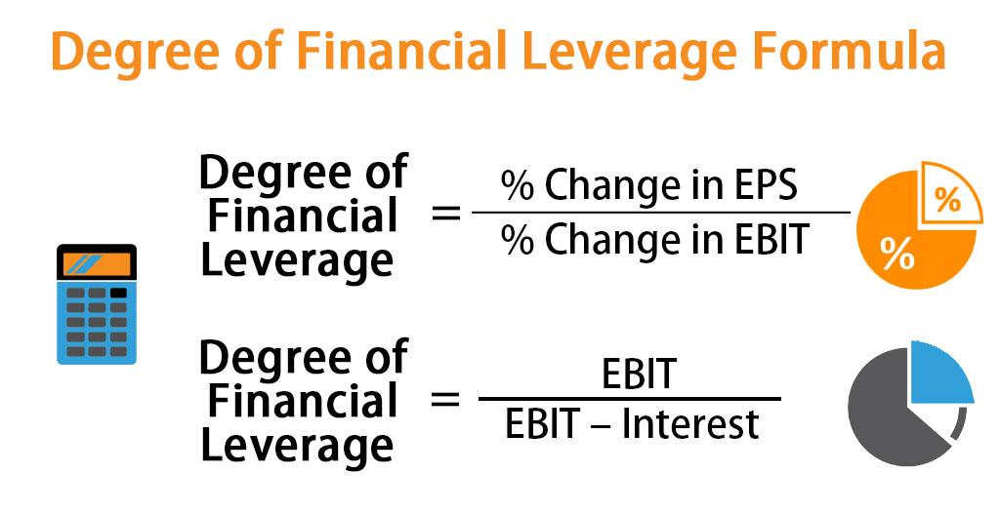

Financial leverage is a critical concept in finance, symbolizing a strategy where a business uses borrowed capital to increase its potential return on investment. The essence of financial leverage lies in its ability to amplify the effects of changes in the income and expenses of a company. By employing financial leverage, companies can optimize their capital structures, thereby enhancing the value for shareholders. It plays a pivotal role in strategic financial decision-making, guiding firms in their pursuit of optimal performance and growth.

The Degree of Financial Leverage (DFL) quantifies the sensitivity of a company's earnings per share (EPS) to changes in its operating income. This measure is crucial as it highlights the impact of financial leverage on shareholder returns. A high DFL implies that even minor variations in operating income can lead to significant changes in EPS, indicating higher financial risk. Understanding DFL aids companies in assessing their leverage levels, thereby informing strategic decisions and aligning with overall business objectives.



In recent years, algorithmic trading has gained prominence within financial markets. These automated systems utilize complex algorithms to execute trades at speeds and frequencies that are impossible for human traders. The growing prevalence of algorithmic trading is reshaping financial markets, offering increased efficiency and accuracy in executing trades. As these algorithmic platforms evolve, they increasingly incorporate various financial metrics, including DFL, to enhance their trading strategies.

This article aims to explore the intersection of DFL and algorithmic trading. The focus is on understanding how the integration of financial leverage metrics can be used to refine algorithmic trading models. Readers can expect to gain insights into the strategic importance of DFL within both traditional financial management and the innovative sphere of automated trading. They will also learn about the potential benefits and risks associated with leveraging DFL in developing sophisticated trading algorithms. By the end of this article, readers will have a comprehensive understanding of the key role financial leverage plays in modern financial markets and how it can be harnessed to maximize trading strategy performance.

## Table of Contents

## Understanding Financial Leverage

Financial leverage refers to the use of borrowed capital in order to increase the potential return on investment. This component plays a significant role in an organization’s capital structure, influencing the proportion of debt versus equity financing that a company utilizes. The core idea is that by using debt, a company can enhance its ability to generate greater returns on equity. However, this increased potential for returns comes with an elevated risk profile.

The benefits of employing financial leverage can primarily be seen in the enhanced growth capabilities it provides. By accessing additional funds through borrowing, companies can undertake larger projects or investments than they would be capable of with equity alone. This exposure not only augments the return on equity but also offers the possibility of higher earnings per share for stockholders as the company grows. Furthermore, interest payments on debt are tax-deductible, providing an additional financial advantage in jurisdictions where this tax treatment applies.

However, the use of high financial leverage entails significant risks. The most prominent risk is the potential for amplified losses. While leverage can magnify gains, it equally magnifies losses if investment outcomes do not meet expectations. Companies with high leverage levels face increased fixed financial obligations in the form of interest payments. Failure to meet these obligations may lead to financial distress or even bankruptcy. Market [volatility](/wiki/volatility-trading-strategies) and economic downturns exacerbate these risks, making the management of leveraged positions a critical component of financial strategy.

Financial leverage is intricately linked to a company’s overall operational strategy, as it influences key strategic decisions such as investment planning, risk management, and financial forecasting. Optimal leverage enables a company to balance growth and risk, thereby supporting sustainable operations and strategic goals. Crucially, a firm's choice of leverage can impact its financial flexibility, competitiveness, and ability to adapt to changing market conditions. Effective leverage management, therefore, necessitates a nuanced understanding of both the potential benefits and inherent risks associated with financial leverage, aligning them with the company’s long-term objectives.

## What is Degree of Financial Leverage (DFL)?

The Degree of Financial Leverage (DFL) is an important metric that quantifies the sensitivity of a company's earnings per share (EPS) to fluctuations in its operating income, also known as EBIT (Earnings Before Interest and Taxes). This metric helps financial analysts and executives understand how changes in operating income could impact the earnings available to shareholders, especially in scenarios where financial leverage, or the use of debt, is involved.

The DFL is calculated using the formula:

$$
DFL = \frac{\text{EBIT}}{\text{EBIT} - \text{Interest Expense}}
$$

This formula illustrates how fixed financial costs, namely interest expenses, amplify the effect of changes in EBIT on the company’s net income. The higher the DFL, the more sensitive EPS is to changes in EBIT, indicating a greater potential for volatility in earnings from the company’s financial structure.

The importance of DFL comes into focus when companies make strategic decisions related to capital structure and financing. For example, when a company is considering taking on additional debt to finance expansion, the DFL can provide insight into how this choice might impact shareholder earnings under different operating income scenarios. A high DFL could suggest increased financial risk, as even minor declines in EBIT could produce substantial reductions in EPS.

Consider a company entering a growth phase, needing significant investment. Opting for debt financing can leverage the company’s growth prospects by allowing it to take advantage of market opportunities quickly. However, if the company’s industry is highly cyclical or prone to volatile revenue streams, a high DFL might signal the possibility of income instability, urging reconsideration of debt levels to ensure sustainable growth.

It's crucial to distinguish DFL from other leverage ratios, such as the Debt-to-Equity ratio, which merely compares the company’s total debt to its equity without directly indicating the sensitivity of earnings to operating income fluctuations. While both DFL and traditional leverage ratios offer insights into a company's leverage, DFL is distinct in its focus on the relation between operating income changes and shareholder earnings, providing a clear view of potential financial risks and rewards under varying operating conditions.

## DFL Formula and Calculation

The Degree of Financial Leverage (DFL) is a critical metric used to assess how a company's earnings per share (EPS) are affected by changes in its operating income (EBIT). It provides insight into the financial risk associated with a company's use of fixed financial costs, such as interest on debt. The formula for calculating DFL is:

$$

\text{DFL} = \frac{\text{Percentage Change in EPS}}{\text{Percentage Change in EBIT}} 
$$

This can also be expressed with a focus on accounting figures as:

$$

\text{DFL} = \frac{\text{EBIT}}{\text{EBIT} - \text{Interest}} 
$$

### Step-by-Step Example of DFL Calculation

To illustrate the calculation, consider a hypothetical company, XYZ Corp, which has an EBIT of $500,000 and annual interest expenses of $100,000. The DFL can be calculated as follows:

1. **Identify EBIT and Interest**: Here, EBIT is $500,000 and interest is $100,000.

2. **Apply the DFL Formula**:

   \[ 
   \text{DFL} = \frac{500,000}{500,000 - 100,000} = \frac{500,000}{400,000} = 1.25 

$$

This result of 1.25 indicates that a 1% change in EBIT will result in a 1.25% change in EPS, highlighting the sensitivity of EPS to changes in operating income. 

### Implications of DFL in Business Scenarios

The DFL is pivotal for companies to understand their leverage impact. A higher DFL suggests greater volatility in EPS relative to changes in EBIT, meaning the company assumes more financial risk through debt. For businesses experiencing steady revenue streams, a high DFL might be advantageous as it can amplify returns to shareholders. Conversely, in volatile markets, this might lead to increased financial risk and vulnerability.

### Interpreting DFL in Context of Market Conditions

When interpreting a company's DFL, consider the prevailing market conditions. During economic upswings, a high DFL can boost returns significantly. However, in downturns, it can lead to a substantial decline in EPS, exacerbating financial distress. Analysts and investors should therefore:

- Compare the DFL of companies within the same industry to assess relative risk.
- Monitor changes in interest rates, as rising rates can increase the DFL by raising interest obligations, thus magnifying financial leverage risks.
- Consider the company’s growth stage; startups might prefer a low DFL to minimize risks, while mature entities with stable cash flows could benefit from higher leverage.

Understanding and interpreting the DFL correctly helps in making informed financial and investment decisions, thus balancing risk and reward effectively.

## Algorithmic Trading and Financial Leverage

Algorithmic trading, a method of executing trades using automated and pre-programmed trading instructions, has become increasingly prevalent in financial markets. This approach leverages complex mathematical models and algorithms to make transaction decisions at speeds beyond human capacity, allowing traders to capitalize on market inefficiencies and trends. The rise of computational power and availability of vast datasets have driven the adoption of [algorithmic trading](/wiki/algorithmic-trading), making it a dominant force in the modern trading ecosystem.

Financial leverage is a key component in algorithmic trading strategies, where borrowed capital is used to increase the potential return on investment. Leverage allows traders to enter larger positions than would be possible with their capital alone. In algorithmic strategies, leverage can be applied to enhance returns by strategically utilizing borrowed funds to multiply the exposure of particular trades. This can be especially lucrative in high-frequency trading environments, where small price differentials are exploited repeatedly over short time frames.

However, the use of financial leverage in algorithmic trading introduces substantial risks. High leverage levels can magnify losses as much as they can amplify gains. In volatile market conditions, leveraged positions might quickly result in losses that exceed the initial investment, leading to significant financial strain or even liquidation. Therefore, careful consideration and risk management are crucial when incorporating leverage in algorithmic trading models.

Examples of algorithmic trading strategies that employ financial leverage include statistical [arbitrage](/wiki/arbitrage), where algorithms identify price discrepancies in related financial instruments and execute trades to exploit these anomalies. In such strategies, leverage is used to increase the number of trades executed, thereby maximizing the potential profit from small pricing inefficiencies. Another example is trend-following strategies, where algorithms detect asset pricing trends over time. Leverage is applied to enhance the profits gained when trends correctly persist, allowing traders to benefit from continued market movements beyond their actual capital capacity. 

The application of leverage in algorithmic trading requires the balancing of potential rewards with inherent risks. Traders must employ sophisticated risk management techniques, such as stop-loss orders, to protect against adverse price movements. Additionally, continuous monitoring and adjustment of leverage levels are essential to ensure the sustainability of trading strategies over time. 

By harnessing the capabilities of algorithmic trading and judiciously applying financial leverage, traders can potentially achieve significant financial returns. However, the complexities and risks associated with this approach necessitate a thorough understanding and careful strategy design to avoid potentially devastating losses.

## Incorporating DFL in Algorithmic Trading Strategies

Incorporating the Degree of Financial Leverage (DFL) into algorithmic trading strategies involves integrating a company's financial leverage metrics into automated trading systems to enhance decision-making processes. This integration can offer several benefits, albeit with some challenges and limitations.

**Integration of DFL in Algorithmic Models**

Algorithmic trading relies on mathematical models and statistical techniques to make trading decisions. By incorporating DFL, the trading models can better assess the financial stability and performance volatility of companies. For instance, high DFL indicates that a company's earnings per share (EPS) are more sensitive to changes in operating income, alerting traders to potential risks and opportunities.

Algorithmic systems can be programmed to adjust trading positions based on the calculated DFL values. This involves using real-time financial data to compute leverage ratios. Python, a popular language in algorithmic trading, can facilitate this integration. An example Python function to calculate DFL might look like this:

```python
def calculate_dfl(ebit, interest_expense):
    """Calculate the Degree of Financial Leverage (DFL)."""
    if ebit == interest_expense:
        return float('inf')
    else:
        return ebit / (ebit - interest_expense)

# Example usage
ebit = 1000000  # Earnings Before Interest and Taxes
interest_expense = 200000  # Interest expenses
dfl = calculate_dfl(ebit, interest_expense)
print(f"The Degree of Financial Leverage is: {dfl}")
```

**Benefits of Using DFL in Algorithmic Strategies**

Incorporating DFL can improve a model's predictive power by accounting for financial leverage risks and opportunities. This enhances the potential for higher returns by identifying undervalued or overleveraged stocks. Traders can customize algorithms to automatically adjust risk levels according to a company's financial leverage, optimizing portfolios dynamically and potentially reducing risk exposure.

**Challenges and Limitations**

The primary challenge is the dynamic nature of financial markets, where changes in interest rates or economic conditions can rapidly alter DFL. Models should be designed to continuously update and validate their assumptions with real-time data. Also, relying heavily on DFL assumes that other factors affecting stock prices, like market sentiment or macroeconomic indicators, remain constant—an assumption that may not always hold true.

Furthermore, high DFL may signify not only higher potential returns but also a greater potential for losses, particularly in volatile markets. Thus, it is essential to develop robust risk management systems when integrating DFL into algorithmic trading.

**Practical Applications: Hypothetical Scenario**

Consider a trading algorithm targeting high-growth technology stocks. These companies often have varying levels of financial leverage due to reinvestment. An algorithm might use DFL to prioritize investments in companies with moderate DFL values, balancing growth potential and risk. During periods of rising interest rates, the algorithm could reduce exposure to stocks with high DFL to mitigate risk.

In this scenario, the algorithm adjusts its portfolio based on leverage sensitivity, offering traders a more informed approach to investment, driven by potential operational volatility. While this integration requires careful monitoring and calibration, incorporating DFL can provide a competitive edge by enabling more nuanced financial analyses and tailored trading decisions.

## Benefits and Risks of Using DFL in Algo Trading

Incorporating the Degree of Financial Leverage (DFL) into algorithmic trading strategies offers several advantages, but it also demands careful consideration of associated risks. Understanding these aspects is crucial for developing robust trading algorithms that leverage financial metrics effectively.

### Advantages of Incorporating DFL

One primary benefit of using DFL in algorithmic trading is its ability to enhance the precision of trading models. By quantifying the sensitivity of a company's earnings per share (EPS) to changes in its operating income, DFL provides valuable insights into potential volatility and risk, allowing algorithms to make more informed decisions. This can lead to improved accuracy in predicting stock movements and, consequently, higher profits.

Additionally, DFL can assist in optimizing capital allocation by revealing the potential impact of leverage on returns. For traders employing leveraged positions, understanding DFL helps in aligning trading strategies with risk appetite and return objectives. By calculating the DFL, traders can adjust their leverage levels based on market conditions, thus improving the overall risk-adjusted performance of their portfolios.

### Risks and Mitigation

Despite its advantages, using DFL involves inherent risks, particularly related to its sensitivity to market fluctuations. High financial leverage, as indicated by a high DFL, can exponentially increase potential losses during market downturns. Therefore, traders must implement risk management techniques, such as stop-loss orders or diversification, to mitigate these risks.

Furthermore, the reliance on historical data to calculate DFL can pose limitations in rapidly changing market environments. To address this, traders should regularly update the DFL inputs and consider incorporating real-time data feeds to enhance the predictive power of their trading algorithms.

### Balancing Risk and Reward

Balancing risk and reward when using DFL in algorithmic trading involves a prudent approach to leverage management. Traders should use DFL as one of several indicators in a holistic strategy that considers market trends, economic indicators, and company fundamentals. By integrating DFL with stochastic models or Monte Carlo simulations, traders can better estimate the probabilistic outcomes and potential variability in earnings, thereby fine-tuning their risk management strategies.

### Key Takeaways

Effective management of leverage in algorithmic environments requires a deep understanding of DFL and its implications. By leveraging DFL, traders can enhance their models' precision and capitalize on leverage while remaining vigilant to associated risks. Regular recalibration of trading algorithms and a comprehensive risk management plan are essential to successfully navigating the complexities of modern financial markets with DFL as a strategic component. Encouraging ongoing learning and adaptation will empower traders to effectively balance risk and reward in their pursuits.

## Conclusion

In summary, this article has explored the critical role of the Degree of Financial Leverage (DFL) in financial decision-making and its integration into algorithmic trading strategies. Understanding DFL is vital as it provides insights into how changes in a company's capital structure can affect earnings per share, enabling more strategic financial planning. This is particularly important in the context of algorithmic trading, where leveraging financial metrics can optimize trading models and strategies.

Further exploration and education on financial leverage are encouraged, not just to understand its theoretical underpinnings but also to apply it practically in evolving market conditions. As financial markets continually adapt to new technologies and methodologies, the relationship between financial leverage metrics like DFL and trading strategies is likely to grow in complexity and importance.

We welcome readers to share their insights or pose questions regarding DFL and algorithmic trading. Engaging with a community of like-minded individuals can provide deeper understanding and innovative applications, enhancing both personal and professional growth in this dynamic field.

## References & Further Reading

[1]: Modigliani, F., & Miller, M. H. (1958). ["The Cost of Capital, Corporation Finance and the Theory of Investment."](https://www.jstor.org/stable/1812919) The American Economic Review, 48(3), 261-297.

[2]: Damodaran, A. (2015). ["Applied Corporate Finance."](https://www.wiley.com/en-us/Applied+Corporate+Finance%2C+4th+Edition-p-x000680437) Wiley.

[3]: Hull, J. C. (2018). ["Options, Futures, and Other Derivatives."](https://www.semanticscholar.org/paper/Options%2C-Futures%2C-and-Other-Derivatives-Hull/89bdee500c8623864fc9eb7a471546aa713acc44) Pearson.

[4]: Berk, J. B., & DeMarzo, P. M. (2019). ["Corporate Finance."](https://www.pearson.com/en-us/subject-catalog/p/corporate-finance/P200000005829/9780135635926) Pearson.

[5]: Aldridge, I. (2013). ["High-Frequency Trading: A Practical Guide to Algorithmic Strategies and Trading Systems."](https://www.amazon.com/High-Frequency-Trading-Practical-Algorithmic-Strategies/dp/1118343506) Wiley.