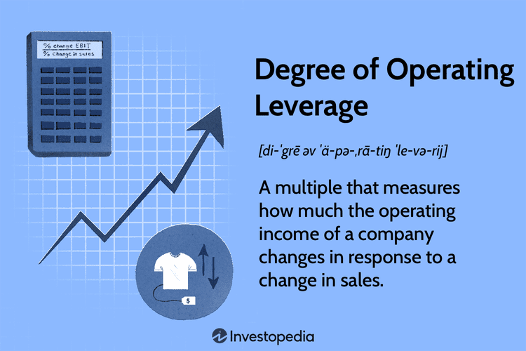

Business finance encompasses all financial activities related to running a company, such as acquiring and managing funds, budgeting, and forecasting. Integral to this domain is financial analysis, a key tool for evaluating a company’s financial health and guiding strategic decision-making. Financial analysis involves examining financial statements and metrics to assess performance, identify trends, and craft policies that optimize financial outcomes. 

An important component of financial analysis is operating leverage, which measures the sensitivity of a company's operating income to fluctuations in sales. Companies with high operating leverage experience more significant changes in operating income in response to sales volume changes, as they incur higher fixed costs relative to variable costs. Understanding operating leverage helps businesses manage risk and maximize profitability.

In recent years, algorithmic trading, or algo trading, has become a significant factor in financial markets. This approach uses computer-driven algorithms to execute trades with precision and speed, exploiting small market efficiencies and reducing the influence of human error and emotion. The intersection of business finance with technological advancements like algo trading illustrates the evolving landscape of financial markets. By embracing these interconnected elements, businesses can better navigate challenges, leveraging both traditional financial analysis tools and cutting-edge trading technologies to enhance performance and maintain competitiveness in the dynamic financial ecosystem.

## Table of Contents

## Understanding Business Finance

Business finance is integral to the efficient operation and long-term success of any company. It encompasses the planning, allocation, and management of financial resources and investment strategies to secure a company’s economic health and competitive edge. Central to business finance are several key functions: budgeting, forecasting, and financial reporting.

**Budgeting** involves outlining financial plans that detail how resources will be allocated over specific periods. This process enables organizations to control costs, prioritize expenditures, and align financial resources with strategic objectives. Budgeting is a proactive measure to ensure financial stability and operational efficiency.

**Forecasting** is the analytical process of predicting future financial conditions and performance based on historical data, economic indicators, and market trends. It aids businesses in anticipating changes in the economic environment and adjusting strategies accordingly. Accurate forecasts help to mitigate risks, optimize investment decisions, and support strategic planning.

**Financial Reporting** is the systematic presentation of financial data, encompassing income statements, balance sheets, and cash flow statements. These reports provide insights into the financial performance and position of the company, assisting stakeholders in making informed decisions. They are crucial for transparency, accountability, and regulatory compliance.

**Financial analysis** plays a pivotal role in supporting these functions by evaluating financial statements and market conditions. Through techniques such as ratio analysis, cash flow analysis, and market trend analysis, financial analysts provide critical insights into a company’s operations, liquidity, and profitability.

- *Ratio Analysis* involves the computation of financial ratios such as liquidity ratios (e.g., current ratio), profitability ratios (e.g., return on equity), and solvency ratios (e.g., debt to equity ratio). These ratios illuminate aspects of the company's financial health and operational efficiency.

- *Cash Flow Analysis* assesses the inflows and outflows of cash, providing insights into a company's liquidity and its ability to generate cash to meet obligations. Effective cash flow management is crucial for maintaining operational stability and leveraging investment opportunities.

- *Market Conditions* are evaluated by examining economic indicators, industry trends, and competitive landscapes. Understanding these conditions allows businesses to identify opportunities and threats, informing strategic decisions and resource optimization.

In summary, business finance involves a comprehensive approach to managing an organization's financial activities. By effectively budgeting, forecasting, and reporting financial information and performing rigorous financial analysis, companies can ensure profitability, optimize resources, and make informed strategic decisions that drive growth and sustainability.

## Exploring Financial Analysis

Financial analysis is a critical aspect of business management that involves scrutinizing a company's financial records to assess its viability, stability, and profitability. By dissecting financial documents, stakeholders can gain a detailed understanding of a company's operational efficiency and overall financial health, forming the basis for informed strategic decisions. Central to financial analysis is the examination of key financial ratios, which serve as indicators of various performance metrics.

**Key Financial Ratios:**

1. **Liquidity Ratios**: These measure a company's ability to meet its short-term obligations. A common liquidity ratio is the Current Ratio, calculated as:
$$
   \text{Current Ratio} = \frac{\text{Current Assets}}{\text{Current Liabilities}}

$$
   A higher ratio suggests better [liquidity](/wiki/liquidity-risk-premium), indicating that the company can cover its short-term liabilities with its short-term assets.

2. **Profitability Ratios**: These ratios assess a company's ability to generate profit relative to its revenue, equity, and assets. One widely used profitability ratio is the Return on Equity (ROE), calculated by:
$$
   \text{ROE} = \frac{\text{Net Income}}{\text{Shareholder's Equity}}

$$
   A higher ROE implies efficient use of equity investments in generating profits.

3. **Solvency Ratios**: Solvency ratios evaluate a company's capacity to meet its long-term obligations. The Debt-to-Equity Ratio is a critical solvency metric:
$$
   \text{Debt-to-Equity Ratio} = \frac{\text{Total Debt}}{\text{Shareholder's Equity}}

$$
   A lower ratio is typically preferred, as it suggests lesser reliance on borrowed funds.

Beyond these ratios, financial analysis extends to understanding operating leverage, which offers insights into how variations in sales volumes influence profits. Operating leverage is determined by the proportion of fixed to variable costs within a company's cost structure. The Degree of Operating Leverage (DOL) can be calculated with:
$$
DOL = \frac{\%\text{Change in EBIT}}{\%\text{Change in Sales}}
$$
Where EBIT stands for Earnings Before Interest and Taxes. A high degree of operating leverage indicates that a company has a larger percentage of fixed costs, which can amplify profits as sales increase. However, it also raises the risk of losses if sales decline, as fixed expenses remain unchanged.

By comprehensively analyzing these aspects, financial analysts can identify both risks and opportunities, aiding businesses in optimizing their financial strategies and achieving long-term profitability.

## The Concept of Operating Leverage

Operating leverage is a critical concept in business finance, which illustrates how a firm's fixed and variable costs structure can significantly influence its operating income. Firms with high operating leverage are characterized by a larger proportion of fixed costs relative to variable costs. This cost structure implies that such firms experience a more substantial increase in operating income from a given increase in sales due to the spreading of fixed costs over a larger sales [volume](/wiki/volume-trading-strategy).

To quantify operating leverage, we can calculate the Degree of Operating Leverage (DOL), which is given by the formula:

$$

DOL = \frac{\text{Percentage change in EBIT}}{\text{Percentage change in Sales}}
$$

Where EBIT stands for Earnings Before Interest and Taxes. A higher DOL indicates greater operating leverage, meaning the firm's EBIT is more sensitive to changes in sales.

For example, consider a firm with the following income statement components:

- Sales Revenue: $\$1,000,000$
- Variable Costs: $\$400,000$
- Fixed Costs: $\$300,000$

If the sales increase by 10%, the new sales revenue would be $\$1,100,000$. Variable costs, assuming proportional with sales, become $\$440,000$. The fixed costs remain unchanged at $\$300,000$. The new EBIT can be calculated as:

$$
\text{EBIT (New)} = \text{Sales (New)} - \text{Variable Costs (New)} - \text{Fixed Costs} = \$1,100,000 - \$440,000 - \$300,000 = \$360,000
$$

The original EBIT was:

$$
\text{EBIT (Original)} = \$1,000,000 - \$400,000 - \$300,000 = \$300,000
$$

The percentage change in EBIT is:

$$
\frac{\$360,000 - \$300,000}{\$300,000} \times 100\% = 20\%
$$

Finally, the DOL can be calculated as:

$$
DOL = \frac{20\%}{10\%} = 2
$$

This indicates that for every 1% change in sales, the firm's operating income (EBIT) changes by 2%. While this leverage amplifies profits with rising sales, it also presents a risk if sales decline because the fixed costs must still be covered regardless of sales volume. Thus, effective management of operating leverage is essential to balance profit and risk, ensuring cost structures align with business strategies to enhance profitability.

## The Rise of Algorithmic Trading

Algorithmic trading, often abbreviated as algo trading, utilizes computer algorithms to execute trades at optimal times and prices with minimal human intervention. Fundamentally, this approach harnesses advanced technology to perform high-speed transactions, capitalizing on even minor fluctuations in the market. Its primary advantage is the ability to process large volumes of data swiftly, enabling traders to make precise and informed decisions that would be challenging through manual trading practices.

One of the key strategies in [algorithmic trading](/wiki/algorithmic-trading) is trend-following. This strategy relies on algorithms to identify and exploit market trends by purchasing when prices are rising and selling when they begin to fall. Trend-following does not attempt to predict future price movements but rather reacts to observed price changes, which helps in optimizing returns while minimizing potential risks.

Arbitrage is another predominant strategy within algo trading. It involves leveraging price discrepancies between different markets or instruments. For example, an algorithm could buy a security in one market where it is undervalued and simultaneously sell it in another market where it is overvalued, thereby securing a profit from the price difference. This strategy requires high-speed execution and is heavily reliant on the rapid processing capabilities that algo trading provides.

Market-making is an additional strategy employed in algorithmic trading. It involves placing simultaneous buy and sell orders to profit from the bid-ask spread. Market-making algorithms ensure that liquidity is present in the markets, thereby facilitating smoother transactions and reducing [volatility](/wiki/volatility-trading-strategies). This strategy is essential for maintaining the efficiency and stability of financial markets.

The increasing adoption of algo trading is attributed to its numerous advantages, notably its ability to enhance trading accuracy and consistency. Algorithms operate based on pre-defined criteria and rules without the emotional biases that can influence human traders. This objectivity promotes more consistent and reliable trading outcomes. Furthermore, algos can react to market events within milliseconds, a speed unattainable by humans, thus providing substantial time and speed advantages in the competitive trading environment.

While algorithmic trading offers significant benefits, it requires a robust technological infrastructure and expertise in both finance and programming. Firms must invest in cutting-edge technology and develop sophisticated algorithms to stay competitive. Additionally, continuous monitoring and updating of these algorithms are necessary to adapt to changing market conditions and maintain their effectiveness.

In conclusion, the rise of algorithmic trading represents a significant evolution in financial markets, driven by technological advancements and the imperative for efficiency and precision in trading operations. Its ability to analyze vast amounts of data, execute complex strategies at high speed, and provide consistent results makes it an indispensable tool for modern trading enterprises.

## Impact of Algo Trading on Financial Performance

Algorithmic trading, commonly known as algo trading, enhances the precision and timing of trade executions, which can significantly improve financial performance for businesses involved in financial markets. By leveraging sophisticated computer algorithms, businesses are able to systematically execute large volumes of trades with minimal human intervention, thereby reducing operational risks linked to human errors and emotional decision-making. This intern helps to create more streamlined and efficient trading operations that lead to better financial outcomes.

Algo trading systems utilize data-driven strategies that analyze market data to forecast trends and adjust trading models in real time. This capability is crucial for staying competitive in volatile markets, as it allows traders to rapidly respond to market movements and exploit short-lived opportunities. For instance, trend-following algorithms can detect patterns in security prices and execute trades at optimal points, potentially enhancing profitability.

Despite these advantages, the implementation of algo trading is not without its challenges. Establishing an effective algo trading system demands an extensive technological infrastructure, including high-performance computing systems and advanced data analytics capabilities. This requirement can be a significant barrier for firms with limited resources. Furthermore, the development, validation, and continuous optimization of models require specialized expertise in both financial markets and software engineering, adding to the difficulty in implementing these systems effectively.

Firms investing in algor trading must also consider the associated compliance and risk management concerns. Regulatory bodies across the globe have established guidelines to govern algorithmic trading activities to prevent market abuse and ensure fair trading practices. Companies must ensure that their trading systems adhere to these regulations to avoid substantial penalties and reputational damage.

In summary, while algo trading can provide considerable benefits by enhancing trade execution precision and leveraging data-driven insights, its successful adoption demands significant technological and human capital investments. Companies must weigh these requirements against potential gains to determine whether algo trading aligns with their strategic objectives and capabilities.

## Challenges and Considerations for Modern Finance

The integration of financial analysis, operating leverage management, and algorithmic trading into business finance introduces a series of challenges and considerations that must be addressed for successful implementation. Technological complexities are at the forefront, as businesses must invest in advanced infrastructure and continuously optimize their strategies to keep pace with evolving market dynamics. Algorithmic trading, for instance, requires sophisticated software, robust data processing capabilities, and high-speed trading platforms. These complexities necessitate not only initial capital investment but also ongoing expenditure on technology upgrades and maintenance.

Regulatory compliance constitutes a significant consideration, particularly for algorithmic trading activities. These activities are governed by stringent regulations aimed at ensuring market stability and fairness. For example, firms must ensure their trading algorithms comply with guidelines set by regulatory bodies such as the Securities and Exchange Commission (SEC) in the United States or the European Securities and Markets Authority (ESMA) in Europe. Non-compliance with these regulations can result in severe penalties, thus underlining the importance of integrating compliance checks into trading strategies.

Despite these challenges, the benefits of leveraging technology and advanced analytics in modern financial markets cannot be overstated. These tools provide a competitive edge by enabling precise market predictions, enhanced decision-making, and improved operational efficiency. Businesses that successfully integrate technology into their financial strategies can capitalize on opportunities presented by algorithmic trading, such as increased trading speed and reduced transaction costs. Moreover, by optimizing financial analysis and managing operating leverage effectively, firms can improve their profitability and financial stability. 

In conclusion, while the road to integrating these advanced financial components is fraught with challenges, the potential rewards make it a worthwhile endeavor. By addressing technological and regulatory hurdles, businesses can harness the power of modern finance to drive growth and sustain competitive advantage in increasingly complex markets.

## Conclusion

In an interconnected financial landscape, understanding the roles of financial analysis, operating leverage, and algo trading is critical. These components collectively empower businesses to strategically manage financial resources, optimize cost structures, and enhance trading efficiency. For organizations adapting these elements into their financial strategies, the potential to improve performance and remain competitive is significant. 

As financial markets continually evolve, staying informed about technological advancements and market dynamics is essential for companies aiming to maintain a competitive edge. The rapid advancement of technologies, particularly in algo trading, requires firms to remain agile and adaptable to leverage these tools effectively. This dynamic environment necessitates a commitment to continuous learning and strategic foresight.

The synergy between business finance components offers a framework through which firms can navigate complexities, embrace new opportunities, and achieve long-term profitability. By integrating robust financial analysis, prudent management of operating leverage, and cutting-edge algo trading mechanisms, businesses position themselves to withstand market volatilities and capitalize on emerging trends. This comprehensive approach ensures that companies not only survive but thrive in the sophisticated and competitive financial markets of today and tomorrow.

## References & Further Reading

For those seeking to deepen their understanding of business finance and its components, several resources provide valuable insights:

- **Investopedia: Overview of Business Finance and Financial Analysis**: This online platform offers comprehensive explanations of financial concepts, including key terms and practical applications relevant to business finance and financial analysis.

- **Textbooks on Corporate Finance and Financial Management**: Foundational texts such as "Principles of Corporate Finance" by Brealey, Myers, and Allen, and "Financial Management: Theory & Practice" by Brigham and Ehrhardt provide detailed explorations of financial principles, best practices, and strategic frameworks used in corporate finance.

- **Research Articles and Journals on Operating Leverage**: Peer-reviewed journals like the "Journal of Corporate Finance" often publish studies examining operating leverage, providing empirical data and theoretical models that illustrate its impact on different industries.

- **White Papers and Case Studies on Algorithmic Trading**: Publications from financial institutions and consulting firms, such as those found in reports by McKinsey & Company or Deloitte, offer analyses and case studies on the implementation of algo trading. These resources discuss technological advancements, trading strategies, and their integration into modern financial practices.

These materials collectively offer a robust foundation for understanding the intricacies of modern financial strategies and their application across various contexts.

