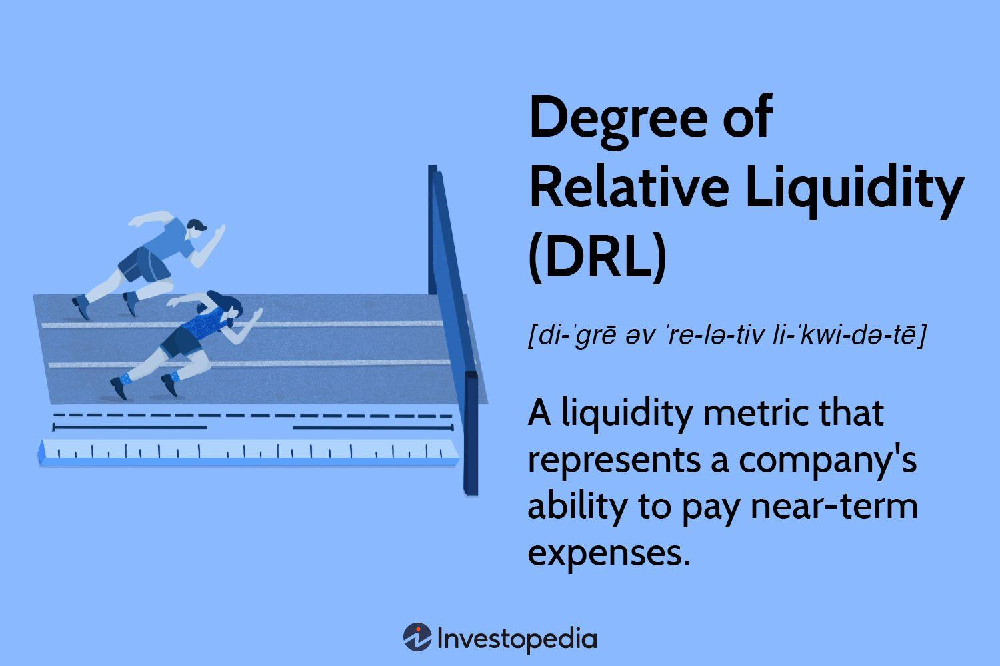

The financial industry is experiencing rapid transformation due to technological advancements, with significant focus on algorithmic trading and its associated financial metrics, such as liquidity. Understanding financial metrics is vital for assessing a company’s operational efficiency, financial health, and profitability. Among these metrics, liquidity stands out due to its vital role in finance and algorithmic trading.

Liquidity measures the ease and speed with which an asset can be converted into cash without significantly affecting its market price. This characteristic is crucial for algorithmic trading, which relies on swift and efficient transactions executed based on predefined criteria.



The interplay between financial metrics, liquidity, and algorithmic trading plays a significant role in shaping financial markets. Algorithmic trading strategies depend heavily on robust liquidity metrics to optimize trade execution and enhance market efficiency. As technological advancements continue, the importance of liquidity in financial markets is set to increase, influencing both trading strategies and market stability. This article examines the nexus of financial metrics, liquidity, and algorithmic trading and their collective impact on financial markets.

## Table of Contents

## Understanding Financial Metrics in Finance

Financial metrics serve as essential tools for evaluating a company's financial status, guiding investors and stakeholders in making well-informed decisions. These metrics offer insights into a company's profitability, efficiency, and overall financial health. Among the numerous financial metrics, Earnings Per Share (EPS), Price-to-Earnings (P/E) ratio, and Return on Equity (ROE) are widely recognized as key indicators of a company's profitability and performance.

Earnings Per Share (EPS) is a measure of a company's profitability on a per-share basis. It is calculated using the formula:

$$
\text{EPS} = \frac{\text{Net Income} - \text{Preferred Dividends}}{\text{Average Outstanding Shares}}
$$

This metric provides investors with an understanding of how much profit is attributed to each share, making it a critical [factor](/wiki/factor-investing) in stock valuation.

The Price-to-Earnings (P/E) ratio, another fundamental metric, is used to assess a company's relative valuation by comparing its current share price to its per-share earnings. The formula is:

$$
\text{P/E Ratio} = \frac{\text{Market Value per Share}}{\text{Earnings Per Share (EPS)}}
$$

A high P/E ratio may indicate that investors expect future growth in earnings, while a low P/E might suggest the stock is undervalued or that the company is experiencing challenges.

Return on Equity (ROE) is used to gauge a company's ability to generate profits from its shareholders' equity. The calculation is as follows:

$$
\text{ROE} = \frac{\text{Net Income}}{\text{Shareholder's Equity}}
$$

ROE reflects the efficiency with which a company utilizes its equity to generate returns, thus serving as a measure of financial performance and profitability.

Liquidity metrics are a subset of financial indicators that assess a company's ability to meet its short-term obligations. These metrics are crucial for evaluating a company's operational efficiency in managing cash flows. The current ratio is a prominent [liquidity](/wiki/liquidity-risk-premium) metric, calculated by:

$$
\text{Current Ratio} = \frac{\text{Current Assets}}{\text{Current Liabilities}}
$$

This metric indicates the extent to which current assets can cover current liabilities, providing a snapshot of a company's short-term financial stability.

The Degree of Relative Liquidity (DRL) is another significant liquidity metric, assessing the proportion of an asset that can be quickly converted into cash. Although less widely known, it provides insight into an organization's ability to respond swiftly to financial obligations or opportunities.

In summation, financial metrics, including EPS, P/E ratio, ROE, and various liquidity measures, are indispensable in assessing a company's financial health. They equip investors and stakeholders with the knowledge needed to evaluate performance, value investments, and make strategic financial decisions.

## The Role of Liquidity in Finance and Trading

Market liquidity plays a crucial role in the efficiency of trading and finance. It refers to the ability of market participants to buy and sell assets with minimal friction, ensuring transactions can occur with little to no impact on the asset's market price. This fluidity is vital for both individual investors looking to execute trades efficiently and institutional players managing large volumes of transactions.

In trading, high liquidity is synonymous with reduced transaction costs and minimized price slippage, making it an attractive feature for investors. The bid-ask spread, which represents the difference between the highest price a buyer is willing to pay and the lowest price a seller is willing to accept, narrows with increasing liquidity, indicating a healthy market. This dynamic is particularly crucial when swift market entry or [exit](/wiki/exit-strategy) is required, whether to capitalize on price movements or to mitigate potential losses.

Liquidity risk, on the other hand, emerges when investors face challenges in executing trades quickly without affecting the asset's price. This scenario can result in realized losses or diminished returns, especially during periods of market stress or low liquidity environments. Effective liquidity management is therefore essential in risk management, necessitating a balance between asset allocation and market condition assessment.

Algorithmic trading has notably transformed market liquidity by automating trading processes. This approach leverages advanced algorithms to conduct rapid buying and selling, creating a more dynamic trading landscape. Algorithms can execute trades based on pre-set parameters, reacting to market conditions with speed and precision, and consequently providing additional market depth. This increased activity enhances market liquidity by introducing more bids and offers, thus improving the ease with which large orders can be absorbed.

The advent of [algorithmic trading](/wiki/algorithmic-trading) introduces both opportunities and challenges in liquidity management. While it has improved market efficiency by injecting liquidity, the reliance on algorithms also raises concerns regarding market stability during periods of extreme [volatility](/wiki/volatility-trading-strategies). Instances like flash crashes have highlighted situations where algorithms may abruptly withdraw from the market, leading to sudden drops in liquidity and price disruptions. Addressing these challenges requires robust risk management strategies and cooperation among regulatory bodies to ensure fair and stable trading conditions.

## Algorithmic Trading: Enhancing Market Liquidity

Algorithmic trading integrates sophisticated mathematical models and computer systems to execute trades at exceptionally high speeds, thereby enhancing market liquidity. This form of trading involves executing algorithms that are not only swift but also capable of generating significant volumes of bids and offers, ensuring consistent liquidity in the financial markets. 

High-frequency trading ([HFT](/wiki/high-frequency-trading-strategies)), a prominent subset of algorithmic trading, substantially contributes to market depth. HFT firms utilize algorithms capable of executing thousands of trades per second, which, in turn, increases the [volume](/wiki/volume-trading-strategy) of transactions in the market. By conducting numerous small trades at unprecedented speeds, HFT enhances the availability of assets and smoothes out price fluctuations, making the market more resilient to sudden changes.

Two commonly used strategies in algorithmic trading are the Volume Weighted Average Price (VWAP) and iceberg orders. VWAP strategies seek to execute trades in line with the average price of the security over a specified period, thus reducing the market impact of large orders. The VWAP is mathematically defined as:

$$
\text{VWAP} = \frac{\sum (P_i \times Q_i)}{\sum Q_i}
$$

where $P_i$ is the price of the trade and $Q_i$ is the quantity of the trade.

Iceberg orders, meanwhile, allow traders to conceal the full size of their order, displaying only a fraction of the total order at any given time. This method helps minimize market impact, as large orders are executed discreetly, mitigating the risk of significantly affecting asset prices.

Algorithmic trading, through these high-speed and strategic variations, plays a crucial role in enhancing liquidity, providing continuous market presence, and bridging the gap between buyers and sellers in various trading environments.

## Key Liquidity Metrics in Algorithmic Trading

Liquidity metrics play a pivotal role in algorithmic trading by providing crucial insights that aid in optimizing trade executions. These metrics act as indicators that help traders understand and effectively manage both the volatility and availability of assets in the market. Among the primary indicators of liquidity in trading environments are the bid-ask spread, market depth, and trading volume.

The bid-ask spread is the difference between the prices quoted for an immediate sale (ask) and an immediate purchase (bid) of an asset. It serves as a measure of the market's liquidity; a narrower spread often indicates a more liquid market. A narrow bid-ask spread can reduce transaction costs for traders, allowing for more efficient trade execution. Algorithmic trading systems often aim to capitalize on narrow spreads by executing trades at advantageous prices within this range.

Market depth refers to the market's ability to sustain large order sizes without causing significant price changes. It provides a view of the volume of buy and sell orders at various price levels. Greater market depth typically signifies a more liquid market with fewer price fluctuations upon large trade executions. Traders can assess market depth by examining [order book](/wiki/order-book-trading-strategies) data, which displays active buy and sell orders at different prices.

Trading volume measures the total number of shares or contracts traded for a specific security within a given time frame. It is a critical liquidity metric that reflects the level of interest in a particular asset. High trading volumes indicate a liquid market, where assets can be quickly bought or sold without substantially impacting the price. Algorithmic systems leverage volume data to gauge market sentiment and adjust trading strategies accordingly.

Algorithmic trading systems continuously monitor these liquidity metrics to refine trading strategies, seek cost reductions, and enhance execution quality. By analyzing real-time data on bid-ask spreads, market depth, and trading volumes, these systems can dynamically adjust their approaches, such as modifying order sizes or timing, to maintain optimal performance in changing market conditions.

For instance, a simple Python script could be employed to calculate the average bid-ask spread over a specific period:

```python
def calculate_avg_bid_ask_spread(bid_prices, ask_prices):
    if len(bid_prices) != len(ask_prices):
        raise ValueError("Bid and ask prices must be of the same length.")
    spread_sum = sum(ask - bid for bid, ask in zip(bid_prices, ask_prices))
    return spread_sum / len(bid_prices)

# Example usage
bid_prices = [100, 101, 102]
ask_prices = [101, 102, 103]
average_spread = calculate_avg_bid_ask_spread(bid_prices, ask_prices)
print("Average Bid-Ask Spread:", average_spread)
```

This script calculates the average bid-ask spread from given lists of bid and ask prices, helping to understand market liquidity over time.

In summary, liquidity metrics are indispensable tools in algorithmic trading. They provide the data-driven insights required to navigate complex trading environments, reduce costs, and achieve superior execution. As markets continue to evolve, the ability to interpret these metrics will remain a critical component of successful algorithmic trading strategies.

## Challenges and Risks in Liquidity Management

Algorithmic trading, while offering unprecedented efficiency and speed, presents notable challenges in liquidity management, particularly during periods of market volatility. These challenges are accentuated by the fact that algorithmic traders may sometimes withdraw from the market during high-stress periods. This withdrawal can trigger sudden and severe liquidity shortages, as observed in events known as flash crashes. In these instances, the abrupt exit of key market participants leads to drastic price movements in a short timeframe, demonstrating the vulnerability of market liquidity to automated decision-making processes.

Regulatory challenges also surface as financial authorities strive to create and enforce policies aimed at maintaining fair and stable markets in an era dominated by automated trading. The rapid nature of algorithmic transactions requires constant monitoring to prevent market manipulation and to ensure that the automated trades do not inadvertently disrupt market equilibrium. Regulators focus on curbing excessive volatility and preventing systemic risks that arise from algorithmic trading practices. These efforts are often fraught with difficulties, as they must balance the benefits of technology-driven trading with the potential risks involved.

To address these challenges, robust risk management strategies are imperative. Diversification is a key strategy, helping to spread risk across different asset classes and reducing the potential impact of liquidity constraints in any single area. Additionally, setting appropriate liquidity thresholds within trading algorithms can prevent excessive market disruption. This involves establishing predefined levels at which trading activities are automatically adjusted or halted to protect against adverse market conditions.

Algorithmic traders and firms must also ensure they have advanced monitoring systems in place to detect early signs of liquidity stress and respond swiftly to mitigate impacts. Combining these strategies with technology that can dynamically adjust trading parameters based on real-time market data enhances resilience against liquidity challenges. Moreover, a proactive approach to compliance with regulatory requirements ensures that algorithmic trading does not expose markets to unwarranted risks.

Overall, navigating the challenges and risks of liquidity management in algorithmic trading involves a comprehensive approach that integrates sophisticated technology, strategic diversification, and strict adherence to regulatory standards. As financial markets continue to evolve, maintaining this delicate balance will be crucial for ensuring stability and efficiency.

## Conclusion: Navigating the Future of Liquidity and Algo Trading

The integration of liquidity metrics with algorithmic trading represents a pivotal trend that is reshaping modern financial markets. As technology continues to advance, it plays an increasingly significant role in defining the relationship between these elements. The automation and efficiency brought by algorithmic trading offer immense potential for optimizing liquidity management, providing traders and investors with the tools needed for precise and immediate market engagement.

Technological advancements are set to further refine the sophistication of trading algorithms, enhancing their ability to analyze vast amounts of data and execute trades at high speed. This progress will inevitably lead to more efficient and liquid markets, reducing transaction costs and improving price stability. However, these benefits come hand in hand with considerable risks that require careful management.

The dynamic and often volatile nature of financial markets introduces the risk of sudden swings in liquidity, particularly during periods of stress or market disruption. For instance, algorithmic and high-frequency trading can exacerbate situations like flash crashes, where liquidity seemingly evaporates in moments. Thus, the challenge lies in developing systems robust enough to maintain stability and liquidity even amidst high market volatility.

Regulatory frameworks will also have a crucial impact on the future dynamics of liquidity and algorithmic trading. Authorities are tasked with finding a balance between promoting innovation and ensuring market stability and fairness. As regulations evolve, they will aim to mitigate risks by imposing constraints or requirements on algorithmic trading practices, such as maintaining adequate liquidity buffers or adhering to circuit breakers during market disruptions.

For both investors and traders, understanding the interplay between liquidity and algorithmic trading is essential. Recognizing the potential of algorithmic systems while managing the associated risks allows for the maximization of market opportunities. By employing risk management strategies, diversifying portfolios, and maintaining thorough knowledge of liquidity metrics, market participants can navigate this complex landscape effectively. 

As financial markets continue to evolve, the synergy between liquidity and algorithmic trading will remain a critical area of focus, with ongoing technological and regulatory developments shaping their trajectory. The ability to anticipate these changes and adapt strategies accordingly will be a defining factor in achieving success in future market environments.

## References & Further Reading

[1]: Hasbrouck, J. (2007). ["Empirical Market Microstructure: The Institutions, Economics, and Econometrics of Securities Trading."](https://academic.oup.com/book/52241) Oxford University Press.

[2]: Aldridge, I. (2013). ["High-Frequency Trading: A Practical Guide to Algorithmic Strategies and Trading Systems."](https://www.amazon.com/High-Frequency-Trading-Practical-Algorithmic-Strategies/dp/1118343506) Wiley Trading.

[3]: Focardi, S. M., & Fabozzi, F. J. (2014). ["The Mathematics of Financial Modeling and Investment Management."](https://archive.org/details/mathematicsoffin0000foca) Wiley Finance.

[4]: Cartea, Á., Jaimungal, S., & Penalva, J. (2015). ["Algorithmic and High-Frequency Trading."](https://assets.cambridge.org/97811070/91146/frontmatter/9781107091146_frontmatter.pdf) Cambridge University Press.

[5]: Gomber, P., Arndt, B., Lutat, M., & Uhle, T. (2011). ["High-frequency trading."](https://papers.ssrn.com/sol3/papers.cfm?abstract_id=1858626) Working Paper, Goethe University.