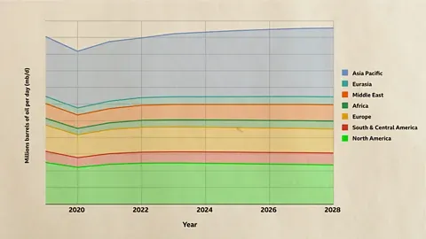

## Table of Contents

## What are the basic educational requirements for entry-level positions in oil companies?

For entry-level positions in oil companies, the basic educational requirements often include a bachelor's degree. Many positions, especially those in engineering, geology, or petroleum technology, require a degree in a related field. For example, a degree in chemical engineering, mechanical engineering, or petroleum engineering is common for technical roles. Some companies might also accept degrees in environmental science or geophysics, depending on the specific job.

In addition to a bachelor's degree, some entry-level positions might require or prefer candidates with a master's degree, especially for more specialized roles. For example, a master's in petroleum engineering or a related field can be beneficial. However, not all positions require a higher degree, and many oil companies offer training programs for new graduates to help them gain the necessary skills and knowledge.

Besides formal education, having relevant internships or co-op experience can be very helpful. Many oil companies look for candidates who have some practical experience, even if it's just a summer internship. This experience can make a candidate more attractive to employers and can sometimes be a requirement for certain positions.

## Which undergraduate degrees are most sought after by oil companies?

Oil companies often look for people with degrees in engineering. The most popular degrees are in petroleum engineering, chemical engineering, and mechanical engineering. These degrees help people understand how to find, extract, and process oil. Many jobs in oil companies need this kind of knowledge, so these degrees are very important.

Besides engineering, degrees in geology and geophysics are also very useful. These degrees help people understand the earth and where to find oil. Oil companies need geologists and geophysicists to explore new oil fields. So, these degrees are also highly sought after by oil companies.

Some oil companies also value degrees in environmental science and related fields. These degrees are important for jobs that focus on the environmental impact of oil extraction and processing. While not as common as engineering or geology degrees, they can still lead to good jobs in the oil industry.

## How important is a degree in petroleum engineering for a career in the oil industry?

A degree in petroleum engineering is very important for a career in the oil industry. This degree teaches you how to find oil, drill for it, and get it out of the ground. Many jobs in oil companies, like working on drilling rigs or designing oil wells, need people with this kind of knowledge. Because of this, oil companies often look for people with a degree in petroleum engineering for these jobs.

Even though a degree in petroleum engineering is very useful, it's not the only way to get a job in the oil industry. Other degrees, like chemical engineering, mechanical engineering, geology, or geophysics, can also lead to good jobs in oil companies. These degrees help you understand different parts of the oil business, like making oil into other products or studying the earth to find oil. So, while a petroleum engineering degree is very important, other degrees can also help you start a career in the oil industry.

## What specific skills do oil companies look for in graduates?

Oil companies look for graduates who have strong technical skills. This means they need to know how to use computers and special software for their work. For example, engineers might need to use software to design oil wells, while geologists use programs to study the earth. Oil companies also want graduates who understand math and science well. This is important for solving problems and making good decisions about oil projects.

Besides technical skills, oil companies also value soft skills. This means they want people who can work well with others in a team. Good communication is important because workers need to share ideas and information clearly. Oil companies also like graduates who can think critically and solve problems creatively. Being able to adapt to new situations and learn quickly is also very helpful in the fast-changing world of oil and gas.

In summary, oil companies look for a mix of technical and soft skills in graduates. They need people who can use technology well and have a strong background in math and science. At the same time, they value teamwork, good communication, critical thinking, and the ability to adapt and learn quickly. These skills help graduates succeed in the oil industry.

## Are there any certifications that can enhance employability in the oil sector?

Certifications can really help you get a job in the oil sector. One important certification is the Certified Petroleum Engineer (CPE) from the Society of Petroleum Engineers (SPE). This certification shows that you know a lot about petroleum engineering and can do the job well. Another useful certification is the Professional Engineer (PE) license. This license is given by state boards and shows that you meet high standards in engineering. These certifications can make you stand out to oil companies and show that you are serious about your career.

There are also certifications that focus on safety, which are very important in the oil industry. For example, the OSHA 30-Hour General Industry certification teaches you about safety rules and how to keep workplaces safe. This is important because safety is a big concern in oil and gas work. Another certification is the Well Control Certification, which is needed for people who work on drilling rigs. It shows that you know how to handle emergencies and keep operations safe. These safety certifications can make you more attractive to employers and help you get a job in the oil sector.

In addition to technical and safety certifications, some oil companies value certifications in project management. The Project Management Professional (PMP) certification from the Project Management Institute (PMI) can be very helpful. This certification shows that you can manage projects well, which is important in the oil industry where projects can be big and complex. Having a PMP certification can show oil companies that you have the skills to lead and complete projects successfully.

## How do oil companies value degrees from different countries?

Oil companies often look at degrees from different countries in a similar way, but they pay attention to the reputation of the school and the quality of education. If a school is well-known and respected, oil companies are more likely to value a degree from that school, no matter where it is. For example, a degree in petroleum engineering from a top university in the United States, Canada, or Europe might be seen as very valuable. On the other hand, degrees from less-known schools might not be as highly valued, even if they are from the same country.

Sometimes, oil companies might need to check if a degree from another country is the same as a degree from their own country. This is called "degree equivalency." They might ask for extra documents or have the degree evaluated by a special service. This helps them make sure that the graduate has the right education and skills for the job. So, while a degree from another country can be valuable, it might need a bit more work to show its worth to oil companies.

## What are the advanced degree options for professionals looking to advance in the oil industry?

For professionals looking to advance in the oil industry, getting an advanced degree can really help. A master's degree in petroleum engineering is a good choice because it teaches you more about finding and getting oil out of the ground. This degree can help you move up to higher positions like project manager or reservoir engineer. Another good option is a master's degree in chemical engineering. This degree can help you work on turning oil into other products, which is important in the oil industry. Some people also choose a master's in business administration (MBA) with a focus on energy. This can help you learn how to manage big projects and lead teams, which is useful for moving into leadership roles.

Besides master's degrees, a doctoral degree (Ph.D.) can be very helpful for those who want to do research or teach. A Ph.D. in petroleum engineering or a related field like geophysics or geology can lead to jobs in research and development. These jobs help find new ways to get oil more efficiently or safely. A Ph.D. can also lead to teaching jobs at universities, where you can train the next generation of oil industry workers. While getting a Ph.D. takes a lot of time and hard work, it can open up some of the most advanced and rewarding careers in the oil industry.

## How do interdisciplinary degrees like environmental science or chemical engineering fit into the oil industry's needs?

Interdisciplinary degrees like environmental science are very important in the oil industry. These degrees help people understand how oil extraction and processing affect the environment. Oil companies need experts in environmental science to make sure they follow laws about pollution and to find ways to reduce their impact on nature. These experts can work on projects that focus on cleaning up oil spills, managing waste, or studying how oil activities affect wildlife and ecosystems. Having a degree in environmental science can lead to jobs that help oil companies be more responsible and sustainable.

Chemical engineering is another key interdisciplinary degree for the oil industry. Chemical engineers help turn oil into useful products like gasoline, plastics, and chemicals. They work on making these processes more efficient and less harmful to the environment. Oil companies need chemical engineers to design and improve refineries, where oil is processed into other products. A degree in chemical engineering can lead to jobs that involve solving complex problems and innovating new ways to use oil. This makes it a valuable degree for anyone looking to work in the oil industry.

## What role do MBAs and other business degrees play in the management levels of oil companies?

MBAs and other business degrees are very important for people who want to work in management at oil companies. These degrees teach people how to manage projects, lead teams, and make good business decisions. In the oil industry, managers need to know how to plan big projects like drilling for oil or building new refineries. They also need to understand how to keep costs down and make the most profit. An MBA with a focus on energy or a similar business degree can help someone learn these skills and move up to higher management positions in oil companies.

Besides MBAs, other business degrees like a Bachelor's in Business Administration or a Master's in Finance can also help people get into management roles in oil companies. These degrees teach important skills like budgeting, financial planning, and understanding markets. In the oil industry, managers need to know how to handle money and make sure the company stays profitable. Having a business degree can make someone more attractive to oil companies looking for good managers. It shows that they have the knowledge and skills to help the company succeed.

## How have the degree preferences of oil companies evolved with the shift towards sustainable energy?

As the oil industry moves towards sustainable energy, the degree preferences of oil companies have started to change. They are now looking for people with degrees in renewable energy, like solar or wind power. These degrees help people understand how to use clean energy sources. Oil companies also value degrees in environmental science and engineering more than before. These degrees help them find ways to reduce their impact on the environment and meet new laws about pollution. So, while degrees in petroleum engineering are still important, oil companies are also interested in people who know about sustainable energy and environmental protection.

The shift to sustainable energy has also made oil companies pay more attention to business degrees that focus on energy management and sustainability. An MBA with a focus on energy or a degree in sustainable business can help people get jobs in management at oil companies. These degrees teach people how to manage projects that use clean energy and how to make the company more sustainable. As the oil industry changes, having a degree that combines business skills with knowledge of sustainable energy can be very helpful for someone looking to work in management at an oil company.

## What are the emerging fields of study that oil companies are beginning to demand?

As oil companies move towards using more sustainable energy, they are starting to look for people with degrees in renewable energy. This includes fields like solar power, wind power, and bioenergy. These degrees help people understand how to use clean energy sources instead of just oil. Oil companies also want more people with degrees in environmental science and engineering. These degrees are important for finding ways to reduce pollution and meet new environmental laws. So, while traditional degrees like petroleum engineering are still valued, oil companies are also interested in people who know about sustainable energy and how to protect the environment.

In addition to technical degrees, oil companies are beginning to demand more degrees that focus on business and sustainability. An MBA with a focus on energy or a degree in sustainable business can be very helpful. These degrees teach people how to manage projects that use clean energy and how to make the company more sustainable. As the oil industry changes, having a degree that combines business skills with knowledge of sustainable energy can help someone get a good job in management at an oil company.

## How can professionals with non-traditional degrees break into the oil industry?

Professionals with non-traditional degrees can break into the oil industry by focusing on gaining relevant skills and experience. Even if their degree is not directly related to oil and gas, they can take courses or get certifications in areas like environmental science, renewable energy, or project management. These can make them more attractive to oil companies. Internships or entry-level jobs in related fields can also help them get their foot in the door. By showing they are willing to learn and adapt, they can prove their value to potential employers.

Networking is also very important for people with non-traditional degrees. They should attend industry events, join professional organizations, and connect with people who already work in the oil industry. These connections can lead to job opportunities and help them learn more about what oil companies are looking for. By building a strong network and showing they are eager to contribute, professionals with non-traditional degrees can find ways to start a career in the oil industry.

## References & Further Reading

[1]: ["Introduction to Petroleum Engineering"](https://onlinelibrary.wiley.com/doi/pdf/10.1002/9781119193463.fmatter) by John R. Fanchi and Richard L. Christiansen

[2]: ["Geology of Petroleum"](https://en.wikipedia.org/wiki/Petroleum_geology) by A.I. Levorsen

[3]: ["Drilling Engineering Workbook: A Complete Guide to Drilling Engineering"](https://onepetro.org/books/book/11/Fundamentals-of-Drilling-Engineering) by William C. Lyons

[4]: ["Data Science and Analytics: What They Are and Why They Matter"](https://www.ibm.com/think/topics/data-science-vs-data-analytics) - UC Berkeley School of Information

[5]: ["Algorithmic Trading and DMA: An Introduction to Direct Access Trading Strategies"](https://www.semanticscholar.org/paper/Algorithmic-trading-%26-DMA-%3A-an-introduction-to-Johnson/aa5de1ab883d5e23b6651faa7c1807586d688e4b) by Barry Johnson

[6]: ["Oil and Gas Production Handbook: An Introduction to Oil and Gas Production, Transport, Refining, and Petrochemical Industry"](https://library.e.abb.com/public/34d5b70e18f7d6c8c1257be500438ac3/Oil%20and%20gas%20production%20handbook%20ed3x0_web.pdf) by Havard Devold

[7]: ["Environmental Management in the Oil and Gas Industry"](https://wedocs.unep.org/bitstream/handle/20.500.11822/8275/-Environmental%20Management%20in%20Oil%20&%20Gas%20Exploration%20&%20Production-19972123.pdf?sequence=2%26isAllowed=y) by Saleem H. Ali

[8]: ["Machine Learning in Finance: From Theory to Practice"](https://www.amazon.com/Machine-Learning-Finance-Theory-Practice/dp/3030410676) by Reinhold Decher

[9]: ["Principles of Environmental Science: Inquiry and Applications"](https://www.amazon.com/Principles-Environmental-Science-William-Cunningham/dp/1260219712) by William P. Cunningham and Mary Ann Cunningham