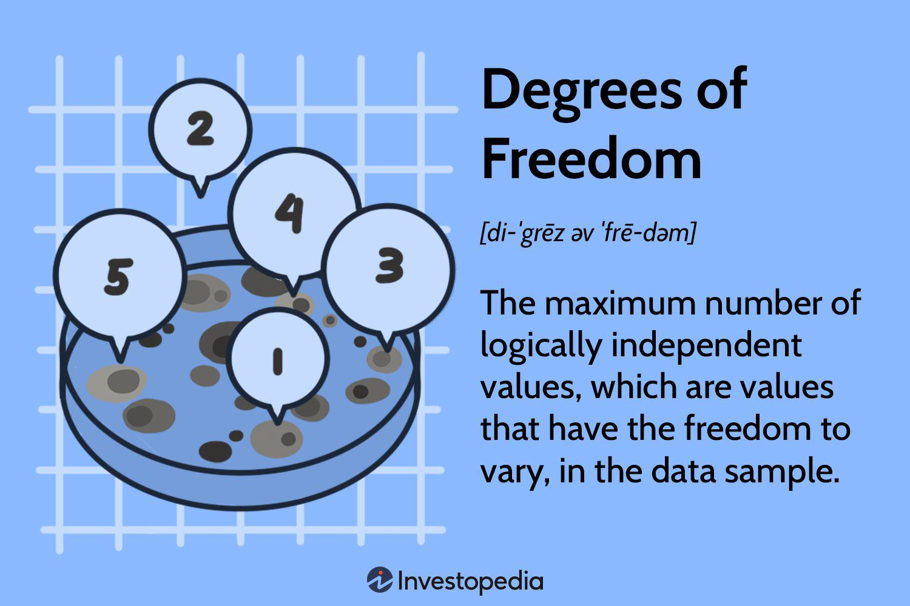

Degrees of freedom (Df) is a fundamental concept in statistics, representing the number of independent values or observations in a dataset that can vary without violating any given restrictions. In simpler terms, it is the number of pieces of free information that are available to estimate another parameter in the context of a statistical model or test. The concept plays a crucial role in various statistical analyses, influencing everything from the shape of statistical distributions to the accuracy of model predictions.

Understanding degrees of freedom is essential for accurate statistical models and hypothesis testing. In inferential statistics, degrees of freedom are used to determine the critical values for statistical tests such as the Chi-Squared test, t-test, and F-test. These critical values help in determining the likelihood that an observed pattern within the data occurred by chance. For instance, when estimating the variance from a sample, the degrees of freedom help adjust for the bias introduced by using sample data rather than the entire population. This correction ensures more reliable and valid inferences.



Traditionally, degrees of freedom is calculated using the formula Df = N - P, where N represents the sample size, and P denotes the number of estimated parameters or constraints. This formula helps quantify the balance between model complexity and the sample's ability to provide reliable estimates. Maintaining an appropriate number of degrees of freedom is crucial to avoid overfitting or underfitting, which can obscure the true relationships within the data.

The purpose of this article is to examine the applications of degrees of freedom in statistics and explore its relevance in algorithmic trading. Algorithmic trading involves using complex models and algorithms to make trading decisions. Understanding how degrees of freedom influence these models is vital to developing trading strategies that are both robust and flexible. The article will delve into how degrees of freedom are managed in trading strategies, illustrating this with real-world applications and examples, ultimately highlighting the importance of continuous learning and adaptation in the fields of statistical analysis and algorithmic trading.

## Table of Contents

## Understanding Degrees of Freedom

Degrees of freedom represent the number of independent values or observations in a dataset that can vary while estimating statistical parameters. They measure the flexibility available in statistical analyses, allowing researchers to make inferences about populations based on sample data. For instance, when calculating the mean of a dataset, all but one of the values are free to vary, and hence, the degrees of freedom are the total number of observations minus one.

Mathematically, degrees of freedom ($Df$) can be calculated using the formula:

$$
Df = N - P
$$

where $N$ is the sample size, and $P$ is the number of parameters estimated from the data. This formula reflects the reduction in freedom as more parameters are estimated because each parameter uses one degree of freedom.

The concept of degrees of freedom is crucial for ensuring the flexibility and accuracy of statistical models. In hypothesis testing and parameter estimation, correct distributional assumptions about the test [statistics](/wiki/bayesian-statistics) are necessary for making valid inferences. Degrees of freedom help shape these distributions, such as the t-distribution used in various statistical tests, adjusting the shape based on the sample size and the number of parameters involved.

In regression models, degrees of freedom indicate how much 'freedom' the data has left after explaining a portion of its variability with the model. More degrees of freedom typically suggest greater flexibility to represent the underlying pattern of the data, but there is a balance to be struck: too many degrees may lead to overfitting, where the model starts capturing noise rather than the true signal. Conversely, too few degrees of freedom can lead to underfitting, where the model is too simple to capture the complexity of the data accurately. This balancing act underscores the importance of carefully managing degrees of freedom in statistical modeling to enhance the model's predictive accuracy while maintaining its general applicability to different data sets.

## The Role of Degrees of Freedom in Statistical Tests

Degrees of freedom play a critical role in statistical tests by determining how freely data values can vary while still satisfying certain constraints. They are pivotal in shaping the statistical distributions used in hypothesis testing, such as the Chi-Squared and t-distributions.

In a Chi-Squared test, degrees of freedom are essential to determine the distribution's shape. The Chi-Squared distribution, used to assess the goodness-of-fit or test for independence in contingency tables, varies with the degrees of freedom. The formula for calculating degrees of freedom in a Chi-Squared test typically depends on the context: for a goodness-of-fit test, it is often computed as $Df = k - 1$, where $k$ is the number of categories. In a test of independence, the degrees of freedom are calculated as $Df = (r-1)(c-1)$, where $r$ is the number of rows and $c$ is the number of columns in a contingency table. The shape of the Chi-Squared distribution becomes more symmetric and normal-like as the degrees of freedom increase.

Similarly, degrees of freedom impact the shape of the t-distribution, which is commonly used in t-tests for inferential statistics. A t-test assesses whether there are significant differences between the means of two groups. Here, degrees of freedom are generally calculated as $Df = N - 1$ for a single sample t-test, where $N$ is the sample size, or combined values in cases of two-sample t-tests. The t-distribution is notably affected by degrees of freedom — with a low degree, it has heavier tails, indicating more variability, and approaches a normal distribution as the degrees of freedom rise.

Examples demonstrate how degrees of freedom are applied in these tests. In a Chi-Squared test for goodness-of-fit assessing whether a die is fair, if six outcomes are possible (one for each face of the die), and expected proportions are known, the degrees of freedom would be $6 - 1 = 5$. This value affects how the p-value is calculated and determines whether the null hypothesis is rejected.

In an independent samples t-test comparing the average performance of two groups on a task, degrees of freedom are based on both sample sizes, calculated as $Df = (n_1 + n_2 - 2)$, where $n_1$ and $n_2$ are the sample sizes of the two groups. This degree of freedom influences the critical t-value needed to determine statistical significance.

Understanding and correctly applying degrees of freedom are imperative for accurate statistical inference, as they influence the reliability of test results and the conclusions drawn from hypothesis testing.

## Degrees of Freedom in Algorithmic Trading

Degrees of freedom play a crucial role in the construction and functionality of [algorithmic trading](/wiki/algorithmic-trading) models. These models rely on statistical methods to make predictions based on historical data, which involves the estimation of parameters and the utilization of degrees of freedom to ensure accuracy and flexibility.

In algorithmic trading, degrees of freedom are directly linked to a model's ability to adapt to new data and varying market conditions. The number of degrees of freedom in a trading model can be thought of as the measure of its complexity. More degrees of freedom allow for a more flexible model that can capture a greater variety of patterns and signals within market data. However, this flexibility must be carefully managed to prevent the model from becoming overly complex, leading to overfitting—a situation where the model performs exceptionally well on historical data but poorly on unseen data.

To balance complexity and adaptability, trading models must be designed to optimize their degrees of freedom. Achieving this balance ensures robust trading algorithms that can generalize effectively to new market data. Overly simplistic models (underfitting) might miss important patterns, while overly complex models (overfitting) might capture noise rather than genuine market signals.

In practice, managing degrees of freedom involves careful selection of model parameters and regularization techniques. For instance, regularization methods, such as L1 (Lasso) and L2 (Ridge) regularization, can help control model complexity by penalizing excessive degrees of freedom. These methods effectively shrink less important model parameters toward zero, retaining only those that contribute significantly to model performance.

```python
from sklearn.linear_model import Lasso, Ridge

# Example: Implementing Lasso and Ridge regularization in trading model

# Lasso Regularization
lasso = Lasso(alpha=0.1) # Alpha controls the degree of regularization
lasso.fit(X_train, y_train) # X_train and y_train are training datasets

# Ridge Regularization
ridge = Ridge(alpha=0.1)
ridge.fit(X_train, y_train)
```

Balancing model complexity also involves using techniques like cross-validation, which assesses how the results of a statistical analysis will generalize to an independent data set. This technique aids in determining the optimal number of parameters, striking a balance between bias and variance, and ensuring the model's adaptability.

By strategically managing degrees of freedom, trading algorithms can maintain robustness and resilience against excessive risk while making accurate predictions amidst ever-changing market dynamics. This balance is essential for maximizing performance without compromising the stability and reliability of trading strategies.

## Managing Degrees of Freedom in Trading Strategies

Managing degrees of freedom effectively in trading strategies is crucial for creating robust and adaptive models that maintain predictive power while avoiding issues such as overfitting. Several strategies have been developed to address this, including feature selection, cross-validation, and regularization techniques.

Feature selection is a technique used to identify and retain only the most relevant variables in a dataset. In trading models, this involves selecting features that contribute the most to predictions or have significant predictive power. By limiting the number of features, we effectively manage the degrees of freedom and reduce the risk of overfitting, where a model performs well on training data but poorly on unseen data. One common approach for feature selection is to use algorithms like LASSO (Least Absolute Shrinkage and Selection Operator) that penalize less informative features, thereby forcing a reduction in unessential parameters.

Cross-validation is another method employed to assess the generalizability and stability of trading models. By partitioning the original dataset into multiple subsets, or "folds," and systematically training the model on one subset while validating it on another, cross-validation helps in ensuring that the model’s performance is consistent across different data samples. This process mitigates overfitting and provides a more reliable estimate of the model’s accuracy and robustness independent of the specific sample used.

Regularization techniques, such as LASSO and Ridge regression, apply penalties to the magnitude of coefficients, thereby controlling the complexity of the model. These techniques adjust the degrees of freedom by shrinking less important parameter estimates to zero (in LASSO) or close to zero (in Ridge), simplifying the model and thereby enhancing its predictive reliability. The regularization parameter, typically denoted as $\lambda$, determines the extent of the penalty applied, and choosing an appropriate value is often achieved through techniques like grid search in conjunction with cross-validation.

Managing degrees of freedom not only affects predictive performance but also impacts risk management and statistical significance in algorithmic trading. By controlling the complexity of trading models, traders can reduce model risk—the risk of model errors leading to incorrect trading decisions. Furthermore, models with appropriately managed degrees of freedom tend to yield more statistically significant insights, as their predictions are based on robust and generalizable patterns rather than noise or spurious correlations.

In summary, to manage degrees of freedom effectively in trading strategies, it is essential to employ feature selection, cross-validation, and regularization. These methods not only enhance the model’s predictive capabilities but also contribute to better risk management and more reliable statistical conclusions in algorithmic trading environments.

## Real-World Applications and Examples

While the PDF attachment is not accessible in this format, let's explore some real-world applications and examples of how companies and trading platforms utilize the concept of degrees of freedom within their algorithmic models and risk assessment strategies.

Several well-known financial institutions and hedge funds have incorporated advanced statistical models that incorporate the concept of degrees of freedom to optimize their algorithmic trading strategies. For example, quantitative hedge funds such as Renaissance Technologies and Two Sigma are known for their reliance on robust statistical models that dynamically adjust based on market conditions. These models often handle massive datasets where degrees of freedom determine the model's flexibility to capture nuances in market behavior without falling into the trap of overfitting.

Degrees of freedom are indispensable components in the platforms provided by companies like Bloomberg Terminal and MetaTrader 5. These platforms offer tools that allow traders to test various trading strategies across multiple historical datasets. With degrees of freedom, users can better estimate statistical significance and confidence intervals for trading decisions, ensuring the strategies remain robust over diverse market scenarios.

In algorithmic trading, an insufficient number of degrees of freedom can lead to overly simplistic models that fail to capture the complexity of financial markets. On the other hand, excessive freedom can cause overfitting, where models become too tailored to historical data and perform poorly on new, unseen data. Effective management of degrees of freedom allows for the perfect balance, enabling algorithms to adapt to new insights while retaining predictive accuracy.

Let's consider a practical scenario. Suppose a trading firm uses a [machine learning](/wiki/machine-learning) model to forecast stock prices. This model computes predictions based on factors such as historical price data, trading [volume](/wiki/volume-trading-strategy), and macroeconomic indicators. If this model is too complex (i.e., having too many parameters and hence high degrees of freedom), it might report excellent backtest results yet perform unpredictably in live trading. However, by applying techniques like cross-validation and regularization, the firm can effectively manage degrees of freedom. Here's a simple example in Python using regularization with Lasso:

```python
from sklearn.linear_model import Lasso
from sklearn.model_selection import train_test_split
import numpy as np

# Simulated data
np.random.seed(0)
X = np.random.rand(100, 3)  # 100 samples, 3 features
y = X @ np.array([1.5, -2.0, 1.0]) + np.random.normal(size=100)

# Split data
X_train, X_test, y_train, y_test = train_test_split(X, y, test_size=0.2)

# Apply Lasso regularization
model = Lasso(alpha=0.1)
model.fit(X_train, y_train)

# Predictions
predictions = model.predict(X_test)
```

In this example, the Lasso technique introduces a penalty term that discourages overly complex models, thus effectively managing the degrees of freedom. This balance helps maintain the model's generalization ability while avoiding overfitting.

By leveraging degrees of freedom to fine-tune their statistical models and optimize trading performance, companies and trading platforms ensure they can make more informed, accurate, and consistent trading decisions. This strategic use highlights the importance of degrees of freedom in maintaining a competitive edge in the fast-paced financial markets.

## Conclusion

The concept of degrees of freedom is a cornerstone in statistical analysis and algorithmic trading, providing essential insights into both model construction and hypothesis testing. Understanding degrees of freedom allows analysts and traders to judiciously balance model flexibility with predictive accuracy. In statistical models, degrees of freedom determine the number of values that are free to vary, facilitating more accurate and reliable interpretations of data. This understanding is crucial for ensuring the validity of statistical tests, such as t-tests and Chi-Squared tests, where degrees of freedom influence distribution shapes and critical values.

In the domain of algorithmic trading, effectively managing degrees of freedom is pivotal for creating adaptable and robust trading models. By regulating degrees of freedom, traders can mitigate the risks of overfitting—where a model performs excellently on historical data but poorly on future data—while also avoiding underfitting, where a model is too simplistic to capture underlying market dynamics. Striking this balance enhances the capability of trading algorithms to generalize across different market conditions.

Continuous learning about degrees of freedom and their application extends beyond academic curiosity; it has pragmatic implications for improving statistical analysis and optimizing trading strategies. Individuals and organizations are encouraged to apply these insights into managing degrees of freedom, thereby boosting model performance and decision-making efficacy. As both statistical analysis and financial markets evolve, the role of degrees of freedom remains a dynamic and essential [factor](/wiki/factor-investing) in enhancing analytical acumen and strategic sophistication.

## References & Further Reading

[1]: Bergstra, J., Bardenet, R., Bengio, Y., & Kégl, B. (2011). ["Algorithms for Hyper-Parameter Optimization."](https://papers.nips.cc/paper/4443-algorithms-for-hyper-parameter-optimization) Advances in Neural Information Processing Systems 24.

[2]: ["Advances in Financial Machine Learning"](https://www.amazon.com/Advances-Financial-Machine-Learning-Marcos/dp/1119482089) by Marcos Lopez de Prado

[3]: ["Evidence-Based Technical Analysis: Applying the Scientific Method and Statistical Inference to Trading Signals"](https://books.google.com/books/about/Evidence_Based_Technical_Analysis.html?id=MeoJAQAAMAAJ) by David Aronson

[4]: ["Machine Learning for Algorithmic Trading"](https://github.com/stefan-jansen/machine-learning-for-trading) by Stefan Jansen

[5]: ["Quantitative Trading: How to Build Your Own Algorithmic Trading Business"](https://www.amazon.com/Quantitative-Trading-Build-Algorithmic-Business/dp/1119800064) by Ernest P. Chan