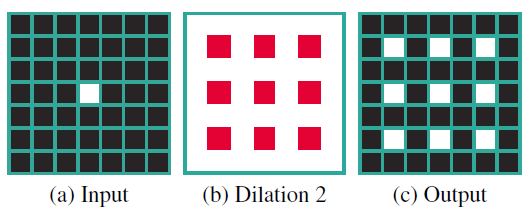

## Table of Contents

## What is degridding in the context of machine learning?

Degridding is a process used in machine learning, particularly in the field of signal processing and radio astronomy. It involves converting data from a gridded format, where data points are arranged on a regular grid, to a non-gridded format, where data points can be at any position. This is important because many algorithms and techniques work better with data that is not constrained to a grid. For example, in radio astronomy, data collected from telescopes often needs to be degridded to accurately represent the positions of celestial objects in the sky.

The process of degridding can be complex and involves interpolation techniques to estimate the values of data points at non-grid positions. A common method used is the convolution with a gridding kernel, which helps in smoothing the transition from gridded to non-gridded data. This step is crucial for improving the accuracy of data analysis and visualization in applications like image reconstruction and signal processing. By degridding, scientists and engineers can work with data in a more natural and flexible way, leading to better results in their analyses and models.

## How does degridding relate to image processing and computer vision?

In image processing and computer vision, degridding is important because it helps to make images and data more accurate and detailed. When images are captured, they might be placed on a grid, which can sometimes make the images less clear or less accurate. Degridding helps to fix this by taking the data off the grid and putting it where it should be more naturally. This can make images look better and help computers understand them more easily. For example, if you are trying to recognize objects in a picture, degridding can help the computer see the objects more clearly because the data is not forced into a grid.

Degridding is used in many steps of image processing, like when images are being made bigger or smaller, or when they are being cleaned up to remove noise. By using degridding, the computer can make sure that the changes it makes to the image are as accurate as possible. This is really helpful in fields like medical imaging, where clear and accurate images are very important for doctors to make good decisions. So, degridding helps to improve the quality of images and makes it easier for computers to work with them in many different ways.

## What are the primary challenges addressed by degridding techniques?

Degridding techniques primarily address the challenge of accurately converting data from a gridded format to a non-gridded format. When data is collected and placed on a grid, it can sometimes lose important details or become less accurate. This is a big problem in fields like radio astronomy and medical imaging, where precise data is crucial. Degridding helps by using special methods, like interpolation, to estimate where the data should be if it were not on a grid. This makes the data more accurate and detailed, which is important for making good decisions based on the data.

Another challenge that degridding tackles is improving the performance of algorithms that work with non-gridded data. Many advanced algorithms in [machine learning](/wiki/machine-learning) and signal processing are designed to work better with data that is not constrained to a grid. By degridding, these algorithms can process the data more effectively and produce better results. For example, in image processing, degridding can help algorithms to better recognize objects or enhance image quality. This is especially useful in applications where high accuracy is needed, like in computer vision systems used in self-driving cars.

## Can you explain the concept of hierarchical feature fusion in degridding?

Hierarchical feature fusion in degridding is a way to make the process of converting gridded data to non-gridded data even better. It works by combining information from different levels or layers of the data. Imagine you have a picture that is made up of many small pieces. Instead of just looking at the whole picture at once, you can look at it in smaller parts and then put those parts together in a smart way. This helps to keep important details and make the final image clearer and more accurate.

In degridding, hierarchical feature fusion means that the computer looks at the data in different ways, from very detailed to more general. It then mixes these different views together to get the best possible result. For example, if you are trying to make a medical image clearer, the computer might look at the tiny details of the image and also at the bigger picture. By combining these different levels of information, the computer can create a more accurate and detailed image. This method helps to improve the quality of the data and makes it easier for people to use it for important decisions.

## What are the typical applications of degridding in machine learning?

Degridding is used a lot in machine learning, especially when working with images and signals. One big use is in radio astronomy, where scientists need to turn the data they collect into clear pictures of space. When the data is on a grid, it can miss important details about where stars and galaxies are. By using degridding, the data can be moved off the grid, making the pictures much clearer and more accurate. This helps scientists study space better and learn more about the universe.

Another important use of degridding is in medical imaging. Doctors use machines like MRI and CT scanners to look inside the body. The pictures these machines make can sometimes be blurry or not very clear when they are on a grid. Degridding helps to make these pictures sharper and more detailed. This is really important because it helps doctors see problems in the body more clearly and make better decisions about how to help their patients. So, degridding makes a big difference in healthcare by improving the quality of medical images.

## How does degridding improve the performance of neural networks?

Degridding helps neural networks work better by making the data they use more accurate and detailed. When data is on a grid, it can lose important details that the [neural network](/wiki/neural-network) needs to understand what it's looking at. By using degridding, the data is moved off the grid, which means the neural network can see everything more clearly. This is really helpful in things like image recognition, where the neural network needs to tell the difference between different objects in a picture. When the data is clearer, the neural network can do its job better and make fewer mistakes.

In tasks like medical imaging, degridding can make a big difference in how well a neural network can help doctors. For example, if a neural network is used to find problems in MRI scans, degridding can make the images sharper and more detailed. This helps the neural network see small problems that it might miss if the data was on a grid. So, by using degridding, neural networks can be more accurate and help doctors make better decisions about how to treat their patients.

## What are the key components of a degridding algorithm?

Degridding algorithms are made up of several important parts that help change data from a grid to a more natural, non-grid format. One key part is the interpolation method, which is like guessing where the data points should be if they weren't on a grid. This is often done using a special function called a gridding kernel. The kernel helps smooth out the data and make the transition from grid to non-grid smoother. Another important part is the way the algorithm handles different levels of data detail, often through something called hierarchical feature fusion. This means the algorithm looks at the data in different ways, from very detailed to more general, and mixes these views to get the best result.

Another key component is the way the algorithm deals with noise and errors in the data. Degridding can sometimes make noise worse, so the algorithm needs ways to clean up the data and make it more accurate. This might involve using filters or other techniques to remove noise without losing important details. Finally, the algorithm needs to be efficient and fast, especially when working with large amounts of data like in radio astronomy or medical imaging. This means the code and math behind the algorithm need to be optimized to work quickly and use less computer power. By putting all these parts together, degridding algorithms can make data clearer and more useful for things like machine learning and image processing.

## How do different layers in a neural network contribute to degridding?

Different layers in a neural network help with degridding by working together to make the data clearer and more accurate. The early layers of the neural network focus on the small details in the data. They look at things like edges and basic shapes. By doing this, these layers help to start the process of moving the data off the grid. They use special math formulas, like convolution, to change the data and make it ready for the next step. This is important because it sets the stage for the rest of the network to do its job well.

As the data moves through the middle and later layers of the neural network, these layers start to put the small details together to form a bigger picture. They use what they learned from the early layers to understand more complex things in the data, like objects or patterns. This is where the degridding really starts to show its power. The network can now see the data in a more natural way, not stuck on a grid. By the time the data reaches the final layers, the neural network has a much clearer and more accurate understanding of the data, which helps it make better decisions or predictions.

## What are some common methods used to implement degridding?

One common method used to implement degridding is interpolation. This method involves guessing where the data points should be if they weren't on a grid. A popular way to do this is by using a gridding kernel. The gridding kernel is like a special math tool that helps smooth out the data and make the transition from grid to non-grid easier. For example, the kernel might be something like a Gaussian function, which looks like a bell curve and helps to blend the data points together smoothly. This helps to keep the data accurate and detailed as it is moved off the grid.

Another method is hierarchical feature fusion. This method looks at the data in different ways, from very detailed to more general, and then mixes these views together to get the best result. Imagine you are trying to make a picture clearer. You might look at the tiny details in the picture and also at the bigger picture. By combining these different levels of detail, you can create a clearer and more accurate image. In degridding, this method helps the computer understand the data better and make the final image or data set more useful for things like machine learning and image processing.

## How can degridding be evaluated and what metrics are used?

Degridding can be evaluated by looking at how well it changes data from a grid to a non-grid format. One way to do this is by using metrics like mean squared error (MSE) or peak signal-to-noise ratio (PSNR). These metrics help to see how much the degridding process has improved the data's accuracy and detail. For example, a lower MSE means the data is more accurate after degridding. Another way to evaluate degridding is by looking at how well it helps other tasks, like image recognition or medical imaging. If degridding makes these tasks easier or more accurate, it shows that the degridding method is working well.

In practice, people might also use visual checks to see if degridding has made images or data clearer. They might compare the original gridded data with the degridded data side by side to see if there are any improvements. Sometimes, they use special software or tools to help with this. For example, they might use a computer program to calculate the MSE between the original and degridded images. This helps to make sure that the degridding process is doing what it is supposed to do and that the data is more useful and accurate after degridding.

## What are the latest advancements in degridding techniques?

The latest advancements in degridding techniques have focused on improving the accuracy and efficiency of the process. One significant development is the use of [deep learning](/wiki/deep-learning) algorithms to enhance degridding. These algorithms, like convolutional neural networks (CNNs), can learn from large datasets to better predict where data points should be off the grid. This approach has been shown to reduce errors and improve the quality of the resulting data. For example, researchers have used CNNs to degrid radio astronomy data, resulting in clearer and more detailed images of the sky. This is important because it helps scientists study the universe more accurately.

Another advancement is the development of more advanced interpolation methods. These new methods use sophisticated mathematical techniques to estimate the positions of data points more accurately. One such method involves using a combination of different interpolation kernels, which can be tailored to the specific type of data being processed. This helps to minimize the loss of detail during the degridding process. Researchers have also started to use adaptive gridding kernels, which can change based on the local characteristics of the data. This makes the degridding process more flexible and effective, leading to better results in fields like medical imaging and remote sensing.

## How does degridding integrate with other machine learning techniques like transfer learning?

Degridding can work well with other machine learning techniques like transfer learning. Transfer learning is when a model learns from one task and then uses that knowledge to do well on a different task. For example, a model might learn to recognize cats and dogs, and then use that knowledge to help it recognize other animals. When you use degridding with transfer learning, the degridding process can make the data clearer and more detailed. This helps the transfer learning model understand the new task better because it has better data to work with. So, degridding can make transfer learning more accurate and helpful.

In practice, you might use degridding to clean up images before using them in a transfer learning model. For instance, if you are trying to use a model that was trained on clear images to recognize objects in blurry medical images, degridding can help make those medical images clearer. This means the transfer learning model can use its knowledge more effectively on the new, clearer images. By combining degridding with transfer learning, you can get better results in tasks like medical imaging or object recognition in photos, making these technologies more useful in real life.