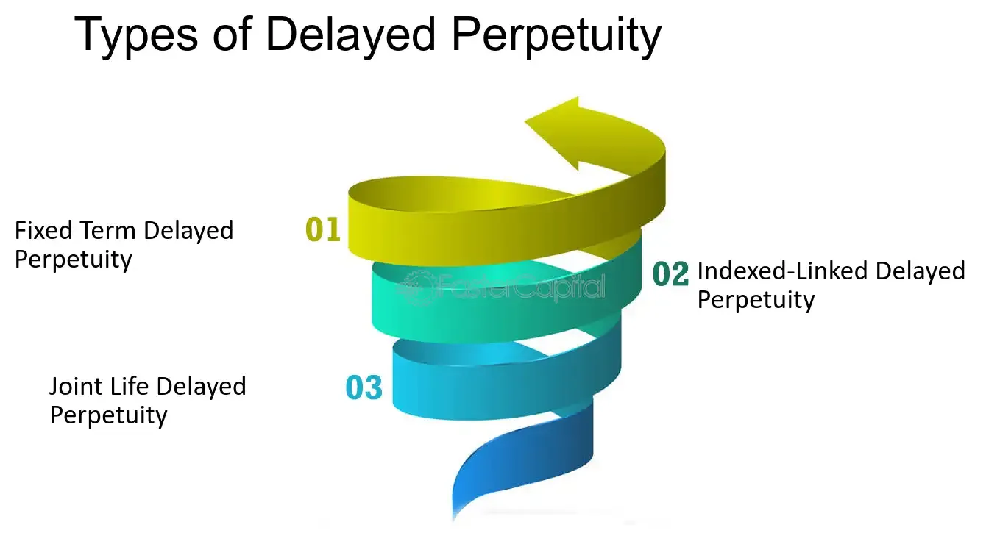

## Table of Contents

## What is the basic definition of delayed perpetuity?

A delayed perpetuity, also known as a deferred perpetuity, is a type of financial concept where you get payments that start at a later time but then keep going forever. Imagine you have a magic piggy bank that doesn't give you any coins until a certain date, but after that date, it gives you coins every day forever.

This idea is useful in finance for figuring out the value of investments or annuities that don't start paying out right away. For example, if you're planning to retire and want to know how much money you'll get from a pension that starts in 10 years, you would use the concept of delayed perpetuity to calculate its value today.

## How does delayed perpetuity differ from regular perpetuity?

A regular perpetuity is like a never-ending stream of payments that starts right away. Imagine getting a dollar every day, forever, starting today. This is useful for figuring out the value of things like stocks that pay dividends or bonds that pay interest, where the payments begin immediately.

A delayed perpetuity, on the other hand, is like that same never-ending stream of payments, but it doesn't start until some time in the future. It's like waiting for a special day before your magic piggy bank starts giving you coins every day forever. This is helpful for planning things like retirement funds or annuities that won't start paying out until you reach a certain age or date. The main difference is the waiting period before the payments begin.

## What are the key components needed to calculate a delayed perpetuity?

To calculate a delayed perpetuity, you need to know three main things: the amount of each payment, the delay before the payments start, and the interest rate. The amount of each payment is how much money you'll get every time, like getting a dollar every day. The delay is how long you have to wait before these payments begin, like waiting five years before the payments start. The interest rate is important because it helps figure out how much the future payments are worth today.

Once you know these three things, you can use a formula to find out the present value of the delayed perpetuity. This formula takes into account that you won't get the payments right away and that money today is worth more than the same amount of money in the future because of the interest you could earn. By plugging in the payment amount, the delay, and the interest rate into the formula, you can calculate how much the delayed perpetuity is worth to you right now.

## Can you explain the formula used to calculate the present value of a delayed perpetuity?

The formula to calculate the present value of a delayed perpetuity is a bit like a puzzle, but it's not too hard once you understand it. You start with the basic formula for a regular perpetuity, which is just the payment amount divided by the interest rate. This gives you the value of a never-ending stream of payments starting today. But for a delayed perpetuity, you need to adjust this value because the payments don't start right away. To do this, you multiply the value of the regular perpetuity by a special number called the discount factor. The discount factor is calculated as 1 divided by (1 + interest rate) raised to the power of the number of periods in the delay.

Let's break it down with an example to make it clearer. Suppose you're going to get $100 every year forever, but the payments won't start for 5 years. If the interest rate is 5%, first you calculate the value of the regular perpetuity, which is $100 divided by 0.05, giving you $2,000. This is what the perpetuity would be worth if it started today. But since it's delayed, you need to discount this value back to today. The discount factor for 5 years at a 5% interest rate is 1 divided by (1 + 0.05)^5, which comes out to about 0.7835. Multiply $2,000 by 0.7835, and you get the present value of the delayed perpetuity, which is around $1,567. So, even though you'll get $100 every year forever starting in 5 years, that's only worth about $1,567 to you today because of the delay and the interest rate.

## What is the significance of the delay period in a delayed perpetuity?

The delay period in a delayed perpetuity is really important because it changes how much the future payments are worth to you right now. Imagine you're going to get money every day forever, but you have to wait before it starts. The longer you wait, the less valuable those future payments are today. This is because you could be using that money now or investing it to earn more money over time. So, the delay period makes the present value of the delayed perpetuity smaller than if the payments started right away.

For example, if you're planning for retirement and you know you'll get a certain amount of money every month starting when you're 65, the delay until you're 65 means that money is worth less to you today. If you could start getting that money now, it would be worth more because you could use it or invest it sooner. The delay period helps you figure out how much you need to save or invest now to make sure you have enough money when the payments finally start.

## How do changes in the discount rate affect the value of a delayed perpetuity?

The discount rate, which is just a fancy way of saying the interest rate, is super important when figuring out how much a delayed perpetuity is worth today. If the discount rate goes up, it means the future payments are worth less right now. That's because a higher interest rate means you could earn more money by investing the same amount today. So, if the discount rate increases, the present value of the delayed perpetuity goes down. On the flip side, if the discount rate goes down, the future payments become more valuable today because you're not missing out on as much potential interest.

Let's think about it with an example. Imagine you're going to get $100 every year forever, but you have to wait 5 years before the payments start. If the discount rate is 5%, the present value of this delayed perpetuity might be around $1,567. But if the discount rate jumps to 10%, the present value drops to about $1,242. That's a big difference! So, when you're planning for things like retirement or investments, changes in the discount rate can really change how much money you need to save or invest today to make sure you're covered in the future.

## What are some common applications of delayed perpetuity in finance?

Delayed perpetuity is often used in finance to figure out the value of things like retirement plans or annuities that don't start paying out right away. Imagine you're planning to retire and you'll get a certain amount of money every month starting when you're 65. You need to know how much that's worth to you today so you can plan how much to save or invest now. By using the concept of delayed perpetuity, you can calculate the present value of those future payments, taking into account the delay until you're 65 and the interest rate you could earn on your money.

Another common use of delayed perpetuity is in valuing certain types of bonds or investments that have a delay before they start paying interest or dividends. For example, some bonds might not start paying interest until a few years after you buy them. To figure out if these bonds are a good investment, you need to know their value today, considering the delay and the interest rate. By using the delayed perpetuity formula, you can work out how much those future payments are worth to you now, helping you decide if the investment is worth it.

## How can one adjust the delayed perpetuity formula for growing payments?

If the payments in a delayed perpetuity are going to grow over time, you need to tweak the formula a bit. Instead of using the regular perpetuity formula where you just divide the payment by the interest rate, you use a special formula for growing perpetuities. This formula is the first payment divided by the difference between the interest rate and the growth rate. So, if your payments are going to grow by a certain percentage each year, you need to know that growth rate to use in the formula.

Once you have the value of the growing perpetuity, you still need to account for the delay before the payments start. Just like with regular delayed perpetuities, you multiply the value of the growing perpetuity by a discount factor. The discount factor is 1 divided by (1 + interest rate) raised to the power of the number of periods in the delay. This way, you can figure out the present value of a delayed perpetuity where the payments grow over time, which is really helpful for planning things like retirement funds or investments that increase in value.

## What are the limitations and assumptions when using delayed perpetuity models?

When you use delayed perpetuity models, there are some important things to keep in mind. One big assumption is that the payments will keep going forever, which is not always realistic. In real life, things can change, like laws or economic conditions, which might stop the payments. Another assumption is that the interest rate stays the same forever, which is also not likely. Interest rates can go up and down, affecting how much the future payments are worth today. These assumptions can make the model less accurate if the real world doesn't follow them.

Another limitation is that delayed perpetuity models don't account for inflation. If the value of money goes down over time because of inflation, the payments you get in the future won't be worth as much as the model says. Also, these models assume you can invest money at the same interest rate for as long as you want, which isn't always possible. So, while delayed perpetuity models are useful for planning and figuring out the value of future payments, they have some limits and assumptions that you need to be aware of to use them wisely.

## Can you provide an example of calculating a delayed perpetuity with specific numbers?

Let's say you're going to get $100 every year forever, but you have to wait 5 years before the payments start. The interest rate is 5%. First, you figure out the value of the regular perpetuity, which is just the payment divided by the interest rate. So, $100 divided by 0.05 gives you $2,000. This is what the perpetuity would be worth if it started today.

But since it's delayed, you need to discount this value back to today. The discount factor for 5 years at a 5% interest rate is 1 divided by (1 + 0.05) to the power of 5, which comes out to about 0.7835. When you multiply $2,000 by 0.7835, you get the present value of the delayed perpetuity, which is around $1,567. So, even though you'll get $100 every year forever starting in 5 years, that's only worth about $1,567 to you today because of the delay and the interest rate.

## How does inflation impact the calculations of a delayed perpetuity?

Inflation can make the calculations of a delayed perpetuity less accurate. When there's inflation, the value of money goes down over time. This means that the $100 you get every year in the future won't be worth as much as it is today. The delayed perpetuity formula doesn't take inflation into account, so it might make the future payments seem more valuable than they really will be. If you want to get a more realistic picture, you need to adjust the interest rate in the formula to include an inflation rate, which can be tricky.

For example, if you're planning to retire and you'll get $100 every year starting in 5 years, and the interest rate is 5%, the delayed perpetuity formula might tell you it's worth about $1,567 today. But if inflation is 2% per year, the real value of that $100 will be less in the future. To account for this, you could use a real interest rate, which is the interest rate minus the inflation rate, so 5% minus 2% equals 3%. Using this real interest rate in the formula would give you a lower present value, showing you that the future payments are worth even less today because of inflation.

## What advanced techniques can be used to refine the accuracy of delayed perpetuity calculations?

To make delayed perpetuity calculations more accurate, one advanced technique is to use real interest rates instead of nominal interest rates. A real interest rate takes into account inflation, so it gives you a better idea of what the future payments will be worth in today's money. For example, if the nominal interest rate is 5% and inflation is 2%, you can use a real interest rate of 3% in your calculations. This adjustment helps you see that the future payments won't be as valuable because of inflation, making your planning more realistic.

Another technique is to use scenario analysis. This means you calculate the present value of the delayed perpetuity under different possible future conditions, like different interest rates or payment amounts. By looking at these different scenarios, you can get a range of possible values instead of just one number. This helps you understand how sensitive your calculations are to changes in the future and can make your planning more robust. For instance, you might calculate the value with a low interest rate, a high interest rate, and an average interest rate to see how much the present value could vary.

## What is the understanding of Perpetuity and Delayed Perpetuity?

Perpetuity is a financial concept that refers to a stream of equal payments that continue indefinitely. The significance of perpetuity lies in its application to various financial models, such as valuation of perpetual bonds and preferred stock, where consistent and perpetual cash flows are expected. Perpetuity serves as a fundamental building block in finance, providing a framework to evaluate securities that promise indefinite returns.

Delayed perpetuity, meanwhile, is a variation of ordinary perpetuity. Unlike a standard perpetuity where payments start immediately, delayed perpetuity involves a situation where the first cash flow does not occur until a specified period in the future. This delay can accommodate specific financial strategies or investment structures where immediate returns are not necessary or desirable. 

The differentiation between ordinary and delayed perpetuity primarily lies in the timing of the cash flows. While a perpetuity is calculated as $PV = \frac{C}{r}$, where $C$ is the cash flow per period and $r$ is the discount rate, delayed perpetuity requires adjusting for the delay period, resulting in the formula:

$$

PV = \frac{C}{r} \times \frac{1}{(1 + r)^t} 
$$

Here, $t$ represents the number of periods before the payments begin. This formula acknowledges the time value of money, reflecting the premise that funds available today are worth more than the same funds in the future due to potential [earning](/wiki/earning-announcement) capacity.

For investors, delayed perpetuity presents opportunities and challenges. It allows strategic planning where payments aligned with future financial needs can be more beneficial. For instance, retirement planning could leverage delayed perpetuities to ensure income begins coinciding with retirement age, optimizing cash flow to match future liabilities. Understanding how delayed perpetuities work enables investors to time their investments appropriately, minimizing risk and optimizing returns, particularly in fixed-income markets where long-term financial commitments are essential.

## What are Financial Calculations Involving Perpetuity?

### Financial Calculations Involving Perpetuity

Perpetuity, a type of financial instrument that provides an infinite series of identical cash flows, plays a significant role in financial calculations due to its simplicity and utility in valuing perpetual streams of cash flows. The present value of a perpetuity can be calculated with the formula:

$$
PV = \frac{C}{r}
$$

where $PV$ is the present value, $C$ represents the annual cash flow, and $r$ symbolizes the discount rate or interest rate.

#### Time Value of Money in the Context of Perpetuity

The concept of the time value of money underpins the valuation of perpetuities. It asserts that a specific amount of money today is more valuable than the same amount in the future due to its potential earning capacity. This principle allows investors to evaluate perpetual income streams by discounting them back to their present value, thereby enabling comparisons with alternative investments.

#### Example Calculations

##### Calculating a Perpetuity

Consider an investor looking to value an investment providing a constant annual cash flow of $10,000, assuming a discount rate of 5%. The present value (PV) of this perpetuity is:

$$
PV = \frac{10,000}{0.05} = 200,000
$$

This calculation indicates that the investor should be willing to pay $200,000 for an investment offering $10,000 annually indefinitely at a 5% discount rate.

##### Calculating a Delayed Perpetuity

A delayed perpetuity is a perpetuity that commences payments after a certain period rather than immediately. This variation ensures that the cash flows start at a future date, necessitating an adjustment in the calculation.

Suppose the same investor is considering a delayed perpetuity that begins in 5 years, with the same annual cash flow of $10,000 and a discount rate of 5%.

1. First, calculate the present value at the start of the perpetuity (time $t$ = 5):

   \[ PV_{\text{starts at } 5} = \frac{10,000}{0.05} = 200,000
$$

2. Then, discount this value back to present day:

   \[ PV = \frac{200,000}{(1 + 0.05)^5} \approx 156,672
$$

Thus, the present value of the delayed perpetuity is approximately $156,672.

Understanding these principles and calculations equips investors and financial professionals with the tools to assess and compare various investment opportunities effectively. Whether encountering standard perpetuities or more complex delayed variants, the ability to compute their present value is invaluable for sound financial decision-making.

## What are examples of delayed perpetuity in financial products?

Delayed perpetuity is a financial concept often implemented in various investment and retirement products, particularly where steady income streams are desired over time. These are instances where an income stream starts after a specified delay, and then continues indefinitely. In such cases, delayed perpetuity proves to be a vital instrument for valuation and investment analysis.

### Preferred Stock Dividends

Preferred stocks can be seen as a prime example where delayed perpetuity might be utilized. Preferred stock dividends are typically fixed and paid at regular intervals, much like a perpetuity. However, certain preferred stocks may have stipulations that delay the commencement of these dividends. In such scenarios, the dividends start at a predetermined future date, representing a delayed perpetuity scenario. 

The fair value of these stocks can be calculated using the formula for the present value of a delayed perpetuity:

$$
PV = \frac{D}{r} \times \frac{1}{(1 + r)^n}
$$

where:
- $D$ is the fixed dividend amount,
- $r$ is the discount rate,
- $n$ is the number of periods until the dividend payments begin.

Calculating the value of these dividends involves discounting the infinite series of payments starting at time $n$ back to the present value.

### Deferred Annuities

Deferred annuities are retirement products designed to provide income after a certain delay. The initial investment accumulates returns until the annuity payments start, which continue for the rest of the annuitant's life, or for a specified period, thus forming a perpetuity post the delay period. 

These financial products are widely used by individuals planning retirement to ensure a stable income stream in the future. Considering the delay [factor](/wiki/factor-investing) in annuity payouts, financial professionals assess the present value to advise on the feasibility and attractiveness of these products against other investment opportunities.

### Retirement Products and Delayed Perpetuity

Retirement planning heavily relies on the concept of delayed perpetuity, providing continuous cash flow starting at a future retirement date. Individual retirement accounts (IRAs) and pension plans often incorporate such strategies, allowing contributors to receive payouts at a later stage when their regular income ceases.

These delayed payouts are critical in ensuring retirees maintain financial stability throughout their retirement years. Through careful calculation of the present value of these future income streams, financial advisors tailor retirement solutions to meet the lifetime income needs of individuals.

### Terminal Value in Investments

Delayed perpetuity also plays a significant role in determining the terminal value of investments. In capital budgeting and valuation, the terminal value reflects the value of an investment at the end of a specified forecast period when is expected to produce perpetually recurring inflows. By acknowledging delayed perpetuity, analysts can accurately discount these future values back to present terms, ensuring that investment appraisals capture the long-term benefits appropriately.

In conclusion, delayed perpetuity is integral to various financial products, aiding in providing predictable and sustained income streams for investors. Its application across preferred stock dividends, deferred annuities, retirement planning, and investment valuation underscores its importance in precise financial modeling and decision-making.

## What is the relationship between Algorithmic Trading and Delayed Perpetuity?

Algorithmic trading is a method of executing orders using automated pre-programmed trading instructions. These instructions take into account variables such as time, price, and [volume](/wiki/volume-trading-strategy), and are designed to reduce transaction costs, maximize productivity, and improve trading consistency. The success of [algorithmic trading](/wiki/algorithmic-trading) heavily relies on complex financial calculations and mathematical models, which guide decision-making processes. One of these models involves perpetuity and delayed perpetuity calculations, offering insights into pricing strategies and risk management.

Perpetuity, in trading terms, refers to a financial instrument that pays a steady stream of equal payments indefinitely. Delayed perpetuity, on the other hand, involves payments that commence after a specified period. Both concepts are crucial for traders and investors seeking to develop long-term investment strategies. In algorithmic trading, the valuation of assets or financial products using perpetuity models allows traders to recognize the intrinsic value of stable cash flows. Delayed perpetuity models extend this analysis by factoring in time delays, which are critical when projecting returns from financial products with deferred income streams.

Incorporating delayed perpetuity calculations into algorithmic trading strategies begins with understanding their foundational formulae. The present value of a delayed perpetuity can be calculated using:

$$
PV = \frac{C}{r} \times \frac{1}{(1 + r)^t}
$$

where $C$ is the cash flow per period, $r$ is the discount rate, and $t$ is the time before the first payment. This calculation informs algorithmic models by enabling traders to determine the fair price of investments with delayed cash flows.

Case studies illustrate the integration of delayed perpetuity models into algorithmic trading platforms. One example involves the pricing of deferred annuities, where algorithms factor in the time delay before annuity payments begin to optimize buy and sell decisions. Such strategies focus on identifying opportunities that maximize long-term return potential while accounting for the delayed payout structure of these investments.

Another instance is the use of delayed perpetuity models to assess the terminal value of investment portfolios. Here, algorithms calculate the contributions of expected perpetual cash flows commencing at a future date, guiding decisions on portfolio adjustments and risk assessment.

The interplay between algorithmic trading and delayed perpetuity models underscores the importance of financial mathematics in developing sophisticated trading algorithms. These models provide a structured approach to evaluating long-term investment possibilities, ensuring that algorithms can make informed predictions about asset performance over time. By leveraging the principles of delayed perpetuity, algorithmic trading can achieve a higher degree of accuracy and efficiency in financial markets.

## References & Further Reading

[1]: ["Principles of Corporate Finance"](https://en.wikipedia.org/wiki/Principles_of_Corporate_Finance) by Richard A. Brealey, Stewart C. Myers, and Franklin Allen

[2]: ["Financial Theory and Corporate Policy"](https://www.afajof.org/wp-content/uploads/files/historical-texts/Financial_Theory_and_Corpora.pdf) by Thomas E. Copeland and J. Fred Weston

[3]: ["Options, Futures, and Other Derivatives"](https://www.amazon.com/Options-Futures-Other-Derivatives-10th/dp/013447208X) by John C. Hull

[4]: ["The Intelligent Investor: The Definitive Book on Value Investing"](https://www.amazon.com/Intelligent-Investor-Third-Definitive-Investing/dp/0063423537) by Benjamin Graham, with commentary by Jason Zweig

[5]: ["Algorithmic Trading and DMA: An introduction to direct access trading strategies"](https://www.amazon.com/Algorithmic-Trading-DMA-introduction-strategies/dp/0956399207) by Barry Johnson