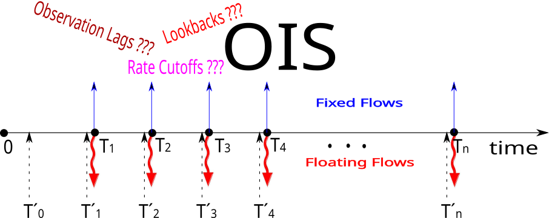

## Table of Contents

## What is a Delayed Rate Setting Swap?

A Delayed Rate Setting Swap is a type of financial agreement where the interest rate for a period is set after that period has already started. Normally, in a standard swap, the interest rate is set at the beginning of the period it applies to. But in a delayed rate setting swap, the rate might be set a few days or even weeks into the period.

This type of swap can be useful for businesses and investors who need more time to gather information or make decisions about their financial strategies. It helps them manage their cash flows better because they can see how rates are moving before they are locked in. However, it also means they might face more uncertainty because they don't know the exact rate until later.

## How does a Delayed Rate Setting Swap differ from a standard interest rate swap?

In a standard interest rate swap, the interest rate for a period is set at the start of that period. This means that both parties know the rate they will pay or receive right away. For example, if the period is from January to June, the rate is fixed on January 1st. This helps businesses plan their finances because they know their costs or earnings from the swap right from the start.

A Delayed Rate Setting Swap works differently. Here, the interest rate is set after the period has already begun. So, using the same example, the rate for January to June might not be set until sometime in January or even February. This can be helpful for companies that need more time to see how rates are moving before deciding on their financial strategies. However, it also means they have to wait to know their exact costs or earnings, which can add some uncertainty to their planning.

## What are the key components of a Delayed Rate Setting Swap?

A Delayed Rate Setting Swap has a few main parts that make it work. First, there is the swap agreement itself, where two parties agree to exchange cash flows based on different interest rates. One party might pay a fixed rate, while the other pays a floating rate. The key difference here is that the floating rate isn't set at the start of the period like in a normal swap. Instead, it's set after the period has already started, which is why it's called "delayed rate setting."

The second important part is the timing of when the rate is set. In a Delayed Rate Setting Swap, the rate might be set a few days or even weeks into the period it applies to. This means that both parties have to wait to find out the exact rate they will use. This can help them make better decisions because they can see how rates are moving before they are locked in. But it also means there's more uncertainty because they don't know the rate right away.

## Who typically uses Delayed Rate Setting Swaps and why?

Delayed Rate Setting Swaps are often used by businesses and investors who want more time to see how interest rates are moving before they lock in a rate. These swaps can help them make better decisions about their money because they can wait and see what's happening in the market. For example, a company might use a Delayed Rate Setting Swap if they think interest rates might go down in the next few weeks. By waiting, they could end up paying a lower rate than if they had locked in the rate at the start of the period.

These swaps are also useful for businesses that have cash flows that don't match up well with standard swap periods. If a company gets paid at different times throughout the month, a Delayed Rate Setting Swap can help them line up their payments and receipts better. However, using these swaps means taking on more uncertainty because the exact rate won't be known until partway through the period. So, companies that use them need to be okay with not knowing their exact costs or earnings right away.

## What are the advantages of using a Delayed Rate Setting Swap?

One big advantage of using a Delayed Rate Setting Swap is that it gives businesses more time to see how interest rates are moving before they lock in a rate. This can help them make smarter decisions about their money. For example, if a company thinks interest rates might go down soon, they can wait a bit longer before setting the rate. This way, they might end up paying less than if they had to lock in the rate right at the start of the period.

Another advantage is that Delayed Rate Setting Swaps can help businesses better match their cash flows. If a company gets paid at different times throughout the month, this type of swap can help them line up their payments and receipts better. This can make it easier for them to manage their money and plan their finances. However, it's important to remember that using these swaps means accepting more uncertainty because the exact rate won't be known until partway through the period.

## What are the potential risks associated with Delayed Rate Setting Swaps?

One risk of using Delayed Rate Setting Swaps is the uncertainty about the interest rate. Since the rate is set after the period has already started, businesses don't know exactly what they will pay or receive until later. This can make it harder to plan their finances because they have to wait to find out their costs or earnings. If rates move in a way they didn't expect, they might end up paying more or receiving less than they planned for.

Another risk is that businesses might miss out on better rates. If interest rates go down right after the period starts but before the rate is set, the company could lock in a higher rate than they would have if they had used a standard swap. This means they might pay more than they needed to. On the other hand, if rates go up, they could end up with a better deal, but this adds more uncertainty to their financial planning.

## How is the rate determined in a Delayed Rate Setting Swap?

In a Delayed Rate Setting Swap, the rate is set after the period it applies to has already started. This is different from a standard swap where the rate is fixed at the beginning of the period. For example, if the swap period is from January to June, the rate might not be set until sometime in January or even February. This delay allows businesses to see how interest rates are moving before they lock in a rate.

The rate is usually based on a reference rate like LIBOR or SOFR, which are common benchmarks for interest rates. When the time comes to set the rate, the parties look at the reference rate at that moment and use it to calculate the rate for the swap. This means that the exact rate won't be known until partway through the period, adding some uncertainty but also giving businesses more time to make informed decisions about their financial strategies.

## Can you explain the process of entering into a Delayed Rate Setting Swap?

To enter into a Delayed Rate Setting Swap, a business first needs to find a counterparty, which is usually a bank or another business, willing to enter the swap agreement. They then negotiate the terms of the swap, including the length of the period, the reference rate they will use (like LIBOR or SOFR), and when exactly during the period the rate will be set. This could be a few days or weeks into the period. Once both parties agree on these terms, they sign a contract that outlines all the details of the swap.

After the contract is signed, the swap goes into effect at the start of the period. However, unlike a standard swap, the interest rate isn't set right away. Instead, both parties wait until the agreed-upon date to set the rate. On that date, they look at the reference rate and use it to calculate the rate for the swap. This means that the business won't know exactly what they will pay or receive until partway through the period, but it gives them more time to see how rates are moving before they lock in a rate.

## What are the common terms and conditions in a Delayed Rate Setting Swap agreement?

When businesses enter into a Delayed Rate Setting Swap, they agree on several key terms and conditions. One important term is the length of the swap period, which could be a few months or even years. They also decide on the reference rate they will use, like LIBOR or SOFR, to calculate the swap rate. Another key condition is when during the period the rate will be set. This might be a few days or weeks after the period starts. All these details are written in a contract that both parties sign, making the agreement official.

In the contract, there are also conditions about what happens if one party can't meet their obligations. For example, if a business can't make a payment, there might be penalties or other actions that can be taken. The contract will also cover how payments are made and when they are due. This helps both parties know what to expect and how to handle any issues that might come up. By agreeing to these terms and conditions, businesses can use Delayed Rate Setting Swaps to better manage their money and plan for the future.

## How does the timing of rate setting impact the valuation of a Delayed Rate Setting Swap?

The timing of when the rate is set in a Delayed Rate Setting Swap can change how much the swap is worth. If the rate is set later in the period, it means there's more time for interest rates to move around. This can make the swap more valuable if rates go down because the business might end up paying a lower rate. But it can also make the swap less valuable if rates go up because they might have to pay more.

Because the rate isn't set right away, there's more uncertainty about what the swap will be worth. This uncertainty can affect how businesses value the swap. They have to guess what rates might do in the future, which can be tricky. This means they might value the swap differently than if they knew the rate at the start of the period.

## What are some real-world examples of Delayed Rate Setting Swaps?

A big company that makes cars might use a Delayed Rate Setting Swap to help manage their money better. They might have a lot of loans that they need to pay interest on, and they want to make sure they're paying the lowest rate they can. By using a Delayed Rate Setting Swap, they can wait a bit to see if interest rates go down before they lock in a rate. This can save them money if rates do go down, but it also means they have to wait to know exactly what they'll pay.

Another example could be a business that gets paid at different times during the month. They might find it hard to match up their payments and receipts with a regular swap. A Delayed Rate Setting Swap can help them because they can set the rate when it makes the most sense for their cash flow. This can make it easier for them to plan their finances, but they have to be okay with not knowing the exact rate until later.

## How do regulatory changes affect the use and structure of Delayed Rate Setting Swaps?

Regulatory changes can have a big impact on how businesses use Delayed Rate Setting Swaps and how these swaps are set up. For example, if new rules come out about how interest rates can be set or reported, businesses might have to change how they do their swaps. They might need to use different reference rates, like switching from LIBOR to SOFR, or they might need to report their swaps in a new way. This can make it harder for them to use Delayed Rate Setting Swaps the way they used to.

Also, new regulations might change how much risk businesses can take on with these swaps. If the rules say they can't have as much uncertainty about their rates, they might use Delayed Rate Setting Swaps less often. Or, they might have to change the timing of when the rate is set to fit within the new rules. This means they always have to keep an eye on what the regulators are doing and be ready to adjust their financial strategies.

## What is the understanding of Financial Derivatives?

Financial derivatives are financial instruments whose value is contingent upon the price or value of underlying assets, which can include stocks, bonds, commodities, or interest rates. These derivatives are widely used in contemporary finance owing to their versatility in various applications. They are crucial for hedging against risks, speculating on potential future price movements, and identifying and capitalizing on arbitrage opportunities present in financial markets.

Derivatives are broadly categorized into four main types: futures, options, swaps, and forwards. Each category serves specific financial purposes and is utilized based on the nature of the transaction or financial goal. For instance, futures contracts obligate the buyer to purchase, or the seller to sell, an asset at a predetermined future date and price, providing an effective tool for hedging against price fluctuations. Options provide the right, but not the obligation, to buy or sell an asset under specified conditions, offering flexibility in tailoring investment strategies.

Interest rate swaps, a significant category of derivatives, permit the exchange of different types of interest payment streams between parties. This financial tool is typically employed by entities looking to convert fixed-rate debt into floating-rate debt or vice versa. By doing so, businesses and financial institutions aim to stabilize their cash flows and manage their exposure to the uncertainties of [interest rate](/wiki/interest-rate-trading-strategies) movements.

The fundamental structure of an interest rate swap involves a notional principal amount, which is not exchanged between parties, but serves as the basis for calculating interest payments. These payments are typically exchanged at regular intervals. For instance, one party may agree to pay a fixed interest rate on the notional principal, while the other pays a floating rate linked to a benchmark, such as the London Interbank Offered Rate (LIBOR).

Mathematically, the fixed payment (P_fixed) in an interest rate swap can be calculated using the formula:

$$
P_{\text{fixed}} = \frac{r_{\text{fixed}} \times N \times T}{m}
$$

where $r_{\text{fixed}}$ is the fixed interest rate, $N$ is the notional principal, $T$ is the term of the swap, and $m$ is the frequency of payments per year. Similarly, the floating payment (P_floating) depends on the index rate at each payment period.

Understanding the nuances of these instruments provides a foundation for comprehending the mechanics of interest rate swaps and their pivotal role in modern financial systems. By utilizing these swaps, financial market participants can manage interest rate exposure with greater precision, aligning their financial strategies with desired risk profiles.

## What is an Interest Rate Swap?

An interest rate swap is a derivative financial contract in which two parties agree to exchange interest payment obligations on specified notional principal amounts. These swaps are primarily utilized to hedge against fluctuations in interest rates or to achieve a desired interest rate profile. Generally, one party agrees to pay a fixed interest rate, while the other agrees to pay a floating rate, typically indexed to a benchmark such as the London Interbank Offered Rate (LIBOR) or the Secured Overnight Financing Rate (SOFR).

The notional principal is a hypothetical amount used to calculate the payment streams but is never exchanged between the parties. Its role is crucial for computing the cash flows exchanged over the life of the swap. For instance, if Party A agrees to pay a fixed interest rate of 3% annually on a $100 million notional principal, and Party B pays a floating rate adjusted semi-annually, their respective payments could be calculated at different points using the applicable interest rates.

The key to understanding the financial dynamics of interest rate swaps lies in their mathematical representation. For the fixed-rate payer, the cash flow can be calculated as:

$$
\text{Fixed Payment} = \text{Notional Principal} \times \frac{\text{Fixed Rate} \times \text{Day Count Fraction}}{1+\text{Fixed Rate}}
$$

Conversely, the floating-rate payer's obligation is calculated by:

$$
\text{Floating Payment} = \text{Notional Principal} \times \text{Floating Rate} \times \text{Day Count Fraction}
$$

Here, the day count fraction accounts for the actual time period between payments relative to a standard year, reflecting differences in calculation conventions such as actual/360 or actual/365.

By exchanging these cash flows, interest rate swaps enable companies and financial institutions to achieve greater predictability in their interest expenses or incomes, thus stabilizing cash flows against interest rate [volatility](/wiki/volatility-trading-strategies). This stabilization is particularly important for budgeting, financial planning, and achieving a desired cash flow profile aligned with specific risk management strategies.

Interest rate swaps also afford financial flexibility, allowing parties to benefit from their comparative advantages in distinct interest rate environments. For instance, an organization with a better credit rating might secure lower fixed rates from a lender, choosing to swap these for floating rates to capitalize on anticipated decreases in benchmark interest rates.

Through these mechanisms, interest rate swaps have become integral instruments in contemporary financial markets, offering a strategic tool for managing interest rate exposure.

## What are Delayed Rate Setting Swaps and how are they explained?

A delayed rate setting swap is a specialized form of interest rate swap designed to commence immediately while allowing the interest rate, or coupon, to be established at a predetermined future date. This mechanism revolves around the initial agreement on the spread between the fixed and floating rates by the involved counterparties, with the actual floating rate determined subsequently at the point of interest rate fixing.

This financial instrument introduces increased risk dynamics due to the inherent contractual obligation relating to a future interest rate. The primary risk stems from the potential divergence between the predicted interest rate environment and the actual rates at the time of setting. Such uncertainty necessitates robust risk management strategies to hedge against unfavorable movements in interest rates.

Despite the additional risks, delayed rate setting swaps offer distinct advantages. One of the primary benefits is [liquidity](/wiki/liquidity-risk-premium) management. By setting the coupon in the future, entities can optimize their cash flow positions, particularly when there is a strong belief that future market conditions will align more favorably with the predetermined spread. This alignment can lead to enhanced liquidity management and potentially lower transaction costs compared to conventional swaps.

From a structural perspective, a delayed rate setting swap functions through the engagement of two parties agreeing on an initial notional principal and a spread. The swap might look something like this:

1. Assume Company A needs a swap starting today but intends to set the coupon rate three months hence.
2. Company A and a counterparty, Company B, agree on a fixed spread over a reference rate, such as LIBOR.
3. The swap commences, but the floating rate payments are deferred, leaving only the spread agreed today.
4. At the end of three months, the actual coupon rate is determined based on the prevailing market rates.

Mathematically, the payoff for a delayed rate setting swap can be expressed as follows:

$$
\text{Payoff} = N \times (r_{\text{fixed}} - r_{\text{floating}}) \times \tau
$$

Where:
- $N$ is the notional principal
- $r_{\text{fixed}}$ is the agreed-upon fixed interest rate
- $r_{\text{floating}}$ is the later determined floating interest rate
- $\tau$ is the accrual period

This setup allows market participants to harness financial flexibility and adapt to future changes in interest rates without immediate exposure, providing a tactical advantage when used judiciously. The combination of strategic foresight and contemporaneous market analysis thus enables effective risk mitigation, reinforcing the utility of delayed rate setting swaps in complex financial environments.

## What are some real-world applications and examples?

Interest rate swaps are integral to corporate finance, offering strategic avenues for managing borrowing costs and stabilizing financial outcomes. Corporations, such as PepsiCo, engage in these swaps to transform their floating rate obligations into fixed rates, effectively mitigating exposure to fluctuations in interest rates.

The process of utilizing interest rate swaps involves complex mathematical modeling, which is crucial for understanding their impact on financial forecasting and budgeting. For instance, the cash flows associated with a swap can be calculated using the formula:

$$

\text{Net Cash Flow} = (\text{Fixed Rate} - \text{Floating Rate}) \times \text{Notional Principal} 
$$

This formula allows companies to quantify the impact of swaps on their finances, aiding in budgeting and financial strategizing. By stabilizing cash flows, firms can project their financial needs more accurately and allocate resources efficiently.

Delays in rate setting add another layer of strategic depth to these instruments. Delayed rate setting swaps offer the option to set the swap's interest rate at a future date. This can be advantageous in scenarios where a firm anticipates changes in interest rates, allowing them flexibility aligned with market expectations. These swaps provide immediate liquidity while also securing future rates that align with corporate projections.

Real-world examples underscore the practicality and economic benefits of such financial instruments. Firms utilize delayed rate setting swaps to align their financial frameworks with expected market conditions, potentially leading to significant reductions in borrowing costs. This aligns well with algorithmic trading strategies, where the timing and selection of swaps are optimized using predictive analytics and real-time data.

Through these applications, interest rate swaps, particularly those with delayed rate settings, demonstrate their value in enhancing business strategies, stabilizing financial positions, and supporting corporate growth objectives. The ongoing evolution of financial markets further underscores the importance of these swaps in modern finance, providing companies with robust tools to navigate complex economic landscapes.

## References & Further Reading

- Neftci, S. N. (2008). *Principles of Financial Engineering*. This book offers a comprehensive overview of the theoretical underpinnings and practical aspects of financial engineering, providing insights into the construction and application of various financial instruments, including derivatives.

- Corb, H. (2011). *Interest Rate Swaps and Other Derivatives*. This resource details the mechanics and strategies behind interest rate swaps and other derivative instruments. It is valuable for understanding how these financial tools are employed for managing risk and optimizing financial transactions.

- Lopez de Prado, M. (2018). *Advances in Financial Machine Learning*. This text covers advanced machine learning techniques and their application in financial markets, which is beneficial for grasping how algorithmic strategies incorporate derivatives for enhanced trading performance.

- Fabozzi, F. J. (2021). *The Handbook of Fixed Income Securities*. Widely regarded as an authoritative guide, this handbook investigates into the nuances of fixed income instruments, including interest rate swaps. It is an essential reference for understanding the complexities of bonds and derivatives markets.

- Hull, J. C. (2018). *Options, Futures, and Other Derivatives*. This book is a definitive resource in the study of derivatives, blending fundamental concepts with advanced strategies. Hull's work is indispensable for those looking to deepen their understanding of the derivatives landscape and their practical applications in finance.

