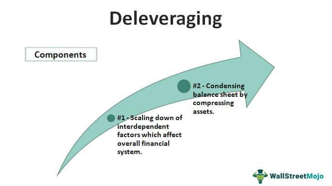

Algorithmic trading, commonly referred to as algo trading, involves the use of automated and pre-programmed systems to execute trades in the financial markets. These systems utilize complex mathematical models and algorithms to make decisions concerning the timing, price, and quantity of orders. The significance of algorithmic trading lies in its ability to execute trades at speeds and volumes unimaginable by human traders, thus enhancing market liquidity and reducing transaction costs. Algo trading minimizes human emotions in decision-making, leading to more disciplined trading behavior.

Deleveraging in financial markets refers to the process by which traders and institutions reduce their use of borrowed funds or leverage. This typically occurs during volatile market conditions when there is a need to mitigate risks or prevent unfavorable outcomes. In the context of algo trading, deleveraging becomes particularly relevant as it can influence algorithmically driven strategies by altering market dynamics, such as liquidity and volatility. Understanding how deleveraging interacts with these systems is crucial for traders seeking to maintain stable and profitable operations.



The comprehension of deleveraging is essential for effective risk management in trading strategies. During periods of market stress, deleveraging can lead to a significant alteration in asset prices and trading volumes, prompting algorithmic systems to adjust their strategies accordingly. Without a firm understanding of the implications of deleveraging, traders may experience amplified losses or missed opportunities. Establishing robust risk management frameworks that account for the potential impacts of deleveraging is thus paramount for algo traders.

The current exploration is aimed at examining how deleveraging affects algorithmic trading. By analyzing this relationship, the article seeks to provide insights that will enhance risk management practices, improve trading outcomes, and contribute to overall market stability. The discussion will address the direct and indirect ways in which deleveraging can influence algorithmic strategies, thereby equipping traders with the knowledge necessary to adapt to and thrive in changing market conditions.

## Table of Contents

## Understanding Algorithmic Trading

Algorithmic trading, often referred to as "algo trading," is the use of computer algorithms to execute trading orders automatically in financial markets. These algorithms are designed to make decisions about aspects such as timing, price, and quantity of orders, based on pre-defined sets of instructions or rules. This process is enabled by sophisticated software that is capable of analyzing market data at high speeds and executing trades at fractions of a second, which is significantly faster than any human trader could achieve.

One of the primary advantages of [algorithmic trading](/wiki/algorithmic-trading) is its speed and efficiency. Due to its automated nature, algorithmic trading allows for rapid execution of large order volumes without significant manual intervention, minimizing the impact of human errors. This speed and capacity enable market participants to capture price discrepancies and opportunities that might only exist for very short periods. Furthermore, algorithmic trading eliminates emotions such as fear and greed from trading decisions, relying solely on logic and data-driven analysis.

There are several popular strategies implemented in algorithmic trading systems. Trend-following is a common strategy that involves algorithms identifying and taking positions in the direction of market trends. These trends can be discerned using various indicators or moving averages. The aim is to profit from sustained market movements by riding the trend until there are signs of reversal. 

Arbitrage is another widely used strategy in algorithmic trading. It involves taking advantage of price differentials between different markets or financial instruments. For instance, if a stock is priced differently on two exchanges, an algorithm could execute a buy order on the undervalued exchange and a sell order on the overvalued exchange, capturing a risk-free profit from the price discrepancy. This requires rapid execution, high precision, and often occurs in very high volumes to generate substantial returns from relatively small price differences.

Algorithmic trading can incorporate a wide range of other strategies, including mean reversion, market-making, and statistical [arbitrage](/wiki/arbitrage). The common element across these strategies is the reliance on quantitative methods and models to identify trading opportunities, integrate market data, and execute trades based on calculated probabilities and risks. By leveraging advanced computing technologies, algorithmic trading continues to shape the dynamics of financial markets by enhancing [liquidity](/wiki/liquidity-risk-premium), improving pricing efficiency, and increasing overall market activity.

## What is Deleveraging?

Deleveraging in financial markets refers to the process by which traders and financial institutions reduce their levels of leverage, typically by selling off assets to decrease their debt-to-equity ratios. Leverage, in this context, is the use of borrowed funds to amplify potential returns on investment. While leverage can enhance returns during market upswings, it also amplifies losses during downturns, making deleveraging a crucial strategy during periods of market stress or uncertainty.

Several factors can drive traders and institutions to deleverage. One primary reason is to mitigate the risk associated with high levels of leverage, particularly when market conditions become volatile or when asset values decline rapidly. Regulatory requirements may force institutions to maintain certain leverage ratios, prompting deleveraging if those thresholds are breached. Additionally, external economic factors such as [interest rate](/wiki/interest-rate-trading-strategies) hikes can increase the cost of borrowing, thereby incentivizing deleveraging to maintain profitability.

Deleveraging can have significant implications for market stability. On one hand, it can lead to asset price declines as institutions sell off holdings to reduce leverage. This can create a negative feedback loop where falling prices induce further selling, exacerbating market [volatility](/wiki/volatility-trading-strategies). On the other hand, deleveraging can restore balance to over-leveraged positions, potentially stabilizing the market over the longer term.

For individual trading positions, deleveraging requires careful consideration of asset liquidity and market conditions to minimize potential losses. Traders must assess their portfolios to determine which assets can be liquidated with the least impact on market prices. Failure to manage deleveraging effectively can result in substantial financial losses and can impair an institution’s ability to raise capital or access credit in the future. Understanding the dynamics of deleveraging is thus crucial for both risk management and strategic decision-making in financial markets.

## The Intersection of Deleveraging and Algorithmic Trading

Algorithmic trading, which relies heavily on automated systems to execute trades, is inherently tied to risk parameters such as leverage ratios. Deleveraging, the process of reducing borrowed capital, can significantly impact these systems, especially when predefined risk thresholds are breached. This section explores the dynamic relationship between deleveraging and algorithmic trading strategies.

When market conditions become volatile, algorithmic trading systems often operate under strict risk parameters designed to minimize potential losses. These parameters include leveraging limits, stop-loss orders, and overall risk exposure. Should market conditions trigger these risk thresholds, algorithmic systems may initiate deleveraging to bring exposure back within acceptable limits. For instance, if a trading algorithm is programmed with a maximum leverage ratio of 5:1, a sudden market downturn reducing the value of held assets could surpass this ratio, leading the system to automatically reduce positions to comply with predefined guidelines.

Such automated deleveraging actions can exacerbate market movements. For example, if numerous algorithms execute sell orders simultaneously to reduce leverage, it can lead to a supply-demand imbalance, causing further price declines. This, in turn, can trigger additional deleveraging from other market participants, resulting in a feedback loop of market activity. The mathematical relationship here can be expressed through the formula:

$$
\text{New Position Size} = \text{Current Position Size} \times \left(1 - \frac{\text{Excess Leverage}}{\text{Current Leverage}}\right)
$$

In practical terms, when an algorithm detects excessive leverage, it calculates the excess and proportionately adjusts the position size to restore balance. This automatic recalibration protects against over-exposure but also introduces liquidity risks, as massive concurrent sell-offs can dry up market liquidity, making it difficult to execute trades at desired prices.

Another significant aspect of this interaction is the potential for cascading events. A notable example occurred during the 2008 financial crisis, where widespread deleveraging by financial institutions led to severe market disruptions. Algorithmic systems, designed to manage portfolios through real-time adjustments, were not immune to these systemic shocks, as the programmed actions based on historical data proved inadequate for the unprecedented conditions.

Understanding the interplay between deleveraging and algorithmic trading requires recognizing the sensitivity of algorithms to market conditions and the potential for amplifying volatility. Algorithm designers and traders must carefully calibrate risk parameters to avoid unintended consequences of automated deleveraging, ensuring algorithms are not just reactive but anticipative of potential market shocks.

## Risk Management in Algorithmic Trading During Deleveraging

Implementing robust risk management strategies in algorithmic trading is crucial, particularly during periods of deleveraging, where market volatility and risk exposure can dramatically increase. Deleveraging refers to the reduction of borrowed funds, which can lead to rapid sell-offs and increased market fluctuations. In such environments, traders must adopt strategies to mitigate risk and protect their capital.

One essential technique is diversification. By spreading investments across various asset classes, traders can reduce the impact of a severe loss in any single position. Diversification minimizes individual exposure and can stabilize returns during market downturns. For instance, employing a portfolio optimization algorithm, like the Mean-Variance Optimization, helps to allocate assets in a way that achieves the desired balance between risk and return.

Another effective risk management strategy is the implementation of dynamic stop-loss orders. These orders automatically sell an asset when it reaches a certain price threshold, limiting potential losses. During deleveraging, when price volatility is high, dynamic stop-loss algorithms can adjust these thresholds in real-time, based on market conditions. A simple Python script to set a dynamic stop-loss could look like this:

```python
current_price = get_current_market_price()
volatility = calculate_market_volatility()

stop_loss_price = current_price * (1 - volatility_multiplier * volatility)
set_stop_loss_order(asset, stop_loss_price)
```

Where `volatility_multiplier` is a predefined constant that determines sensitivity to market volatility.

Traders can also use hedging strategies to offset potential losses. Hedging involves taking positions in derivatives such as options or futures to protect against unfavorable price movements. During deleveraging, hedging allows traders to maintain exposure to desirable assets while minimizing downside risk.

Innovative tools and technologies play a pivotal role in managing risks effectively. Machine learning algorithms can analyze historical and real-time data to predict risk factors, allowing preemptive adjustments to trading strategies. Additionally, stress testing tools enable traders to simulate market scenarios and assess the resilience of their strategies under extreme conditions. These technologies offer valuable insights that can guide decision-making and strategy adjustments.

High-frequency trading ([HFT](/wiki/high-frequency-trading-strategies)) systems, which execute numerous trades at very high speeds, must integrate latency-sensitive risk management modules. These modules can adapt to market changes instantaneously, ensuring that risk management protocols are consistently applied.

In conclusion, effective risk management in algorithmic trading during deleveraging periods hinges on diversification, dynamic stop-loss orders, hedging, and the adoption of advanced technologies. These strategies are indispensable for navigating high volatility and safeguarding financial assets. Traders who proactively implement these measures are better equipped to achieve stability and maintain competitive advantage amidst market turbulence.

## Case Studies and Real-World Examples

The intersection of deleveraging and algorithmic trading has been a focal point in several significant market events. One noteworthy instance is the Flash Crash of May 6, 2010, an event where the U.S. stock market rapidly plummeted and quickly rebounded, highlighting the vulnerabilities within algorithmic systems during episodes of deleveraging. High-frequency trading (HFT) firms were heavily involved, using algorithms that executed large volumes of trades at incredibly high speeds. When certain market conditions triggered mass deleveraging, these algorithms exacerbated market volatility by executing a rapid sequence of sell orders, significantly impacting liquidity.

A critical lesson from this event was the importance of implementing circuit breakers and risk limits within trading algorithms to mitigate extreme market conditions. Regulators responded by introducing measures such as the limit down-limit up (LULD) mechanism, intended to prevent trades outside certain price bands.

Another example involves the Chinese stock market crash of 2015, where excessive leverage within the system prompted a need for deleveraging, leading to severe market fluctuations. Algorithmic trading strategies that failed to account for sudden shifts in liquidity or regulatory changes ended up amplifying the downturns. This incident underscored the necessity for adaptive algorithms that can reevaluate and recalibrate in the face of changing leverage levels and market conditions.

Regulatory adaptations have played an essential role in shaping how algo trading systems interface with markets during deleveraging. The European Union's Markets in Financial Instruments Directive II (MiFID II), for example, introduced regulations that emphasized transparency and accountability, requiring detailed reporting on algorithmic trading activities. These regulations push for better-equipped systems that can manage risks associated with rapid market movements more effectively.

Overall, these examples highlight the necessity for integrating robust risk management strategies that account for deleveraging scenarios. Algo trading systems must incorporate adaptive mechanisms and maintain a keen awareness of regulatory landscapes to enhance resilience against market instabilities.

## Conclusion

The relationship between deleveraging and algorithmic trading is a critical aspect that influences both individual trading outcomes and broader market stability. Deleveraging refers to the reduction of leverage by traders or institutions, often required during periods of market stress or risk reassessment. In the context of algorithmic trading, which relies heavily on automated, pre-programmed strategies, the dynamics of deleveraging can have profound and immediate effects.

One of the key takeaways is that deleveraging can act as a triggering mechanism within algorithmic trading systems. Algorithms designed with specific risk parameters might initiate deleveraging when these parameters are breached, such as during sudden market downturns. This automated response can amplify market volatility, potentially leading to a feedback loop where the sell-off begets further price drops, triggering additional deleveraging.

Understanding the intricacies of this relationship can significantly enhance trading outcomes. By recognizing how deleveraging can influence market conditions, traders and institutions can refine their algorithms to account for potential volatility spikes and systemic risks. This includes setting more adaptive risk parameters, [backtesting](/wiki/backtesting) strategies under diverse market conditions, and incorporating real-time data analytics to adjust trading approaches dynamically.

Moreover, market stability benefits from strategies that anticipate and mitigate the impact of deleveraging. By implementing robust risk management frameworks, traders can ensure that their strategies are resilient against abrupt market shifts. Techniques such as stress testing, scenario analysis, and employing advanced risk assessment tools are fundamental in preparing for deleveraging events.

In conclusion, continual updates to trading strategies and risk management frameworks, informed by an understanding of deleveraging dynamics, are essential. As financial markets evolve, so too must the approaches to managing the inherent risks associated with algorithmic trading. This proactive adaptation not only enhances individual trading outcomes but also contributes to the overall stability of financial markets.

## References & Further Reading

[1]: Bergstra, J., Bardenet, R., Bengio, Y., & Kégl, B. (2011). ["Algorithms for Hyper-Parameter Optimization."](https://papers.nips.cc/paper/4443-algorithms-for-hyper-parameter-optimization) Advances in Neural Information Processing Systems 24.

[2]: ["Advances in Financial Machine Learning"](https://www.amazon.com/Advances-Financial-Machine-Learning-Marcos/dp/1119482089) by Marcos Lopez de Prado

[3]: ["Evidence-Based Technical Analysis: Applying the Scientific Method and Statistical Inference to Trading Signals"](https://www.amazon.com/Evidence-Based-Technical-Analysis-Scientific-Statistical/dp/0470008741) by David Aronson

[4]: ["Machine Learning for Algorithmic Trading"](https://github.com/PacktPublishing/Machine-Learning-for-Algorithmic-Trading-Second-Edition) by Stefan Jansen

[5]: ["Quantitative Trading: How to Build Your Own Algorithmic Trading Business"](https://books.google.com/books/about/Quantitative_Trading.html?id=j70yEAAAQBAJ) by Ernest P. Chan