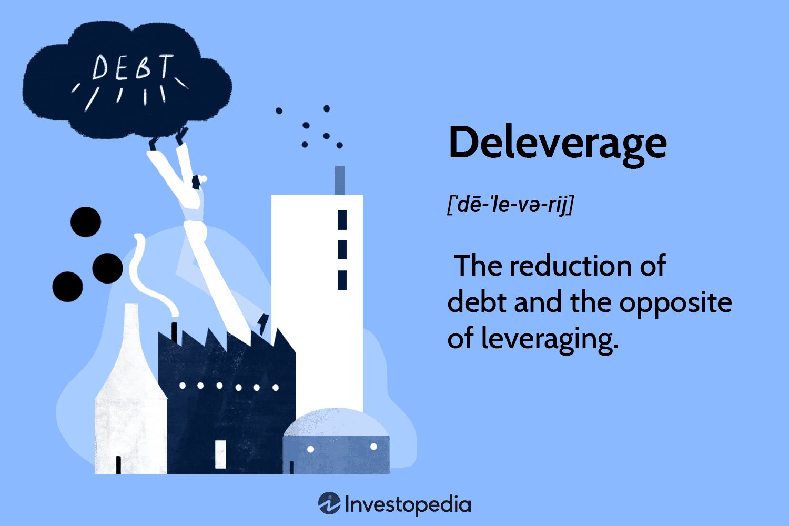

## Table of Contents

## What is deleveraging?

Deleveraging is when a person, business, or country tries to lower the amount of debt they have. They do this by paying off loans or selling assets to get money to pay back what they owe. It's like trying to lighten a heavy load by taking some weight off. When someone deleverages, they are trying to become less dependent on borrowed money and more financially stable.

This process can be tough because it often means cutting back on spending or selling things they own. For example, a company might have to sell some of its buildings or equipment to pay off its loans. On a bigger scale, if many people and businesses start deleveraging at the same time, it can slow down the whole economy. This happened during the financial crisis in 2008 when lots of people and businesses had too much debt and started deleveraging all at once.

## Why is deleveraging important for financial stability?

Deleveraging is important for financial stability because it helps reduce the risk of financial trouble. When people or businesses have a lot of debt, they are more likely to face problems if they can't pay it back. By deleveraging, they lower their debt levels, which makes them less likely to go bankrupt or default on their loans. This makes the whole financial system more stable because fewer people and businesses are at risk of failing.

When everyone starts deleveraging at the same time, it can be tough on the economy. But in the long run, it can lead to a healthier financial environment. If too many people and businesses are heavily in debt, it can create a bubble that might burst and cause a big crisis, like what happened in 2008. By deleveraging, the economy slowly becomes more balanced and less prone to big shocks. This helps build a stronger foundation for future growth and stability.

## How does deleveraging affect the economy?

Deleveraging can slow down the economy in the short term. When people and businesses start paying off their debts, they often have to cut back on spending. This means they buy fewer things, which can hurt companies that sell goods and services. If many people are deleveraging at the same time, it can lead to less overall spending in the economy, which can cause businesses to struggle and even lead to job losses. This slowdown can make the economy feel like it's shrinking, which is tough for everyone.

In the long run, however, deleveraging can help the economy become stronger and more stable. By reducing their debt, people and businesses become less risky. They are less likely to go bankrupt or default on their loans, which makes the financial system more secure. A more stable financial system means fewer big shocks and crises, like the one in 2008. Over time, this stability can lead to steady growth and a healthier economy where people feel more confident about spending and investing.

## What are the common causes of deleveraging?

Deleveraging often happens because people or businesses find themselves with too much debt. They might have borrowed a lot of money during good times, thinking they could easily pay it back. But if things change, like if they lose their job or their business starts doing badly, they might struggle to keep up with their loan payments. This can make them decide to start paying off their debts to avoid even bigger problems later.

Another common cause of deleveraging is when interest rates go up. When it costs more to borrow money, people and businesses might choose to pay off their existing loans rather than take on new ones. Also, if the economy is slowing down, banks might start asking for their loans to be paid back sooner. This can force people and businesses to start deleveraging, even if they didn't plan to.

Sometimes, big economic events, like a financial crisis, can make everyone start deleveraging at the same time. When people see others struggling with debt, they might get worried and decide to pay off their own debts quickly. Governments and central banks might also encourage deleveraging to make the economy more stable. This can lead to a lot of people and businesses trying to reduce their debt all at once, which can have a big impact on the economy.

## Can you explain the difference between voluntary and forced deleveraging?

Voluntary deleveraging happens when people or businesses choose to pay off their debts on their own. They might decide to do this because they want to be less risky or because they see that having a lot of debt is not good for them. For example, a person might decide to use their savings to pay off their credit card because they want to stop paying high interest rates. A business might sell some of its buildings to pay off loans because they want to be more financially stable. When people and businesses choose to deleverage, they are taking control of their finances to make their future more secure.

Forced deleveraging, on the other hand, happens when people or businesses have to pay off their debts because they don't have a choice. This can happen if they can't keep up with their loan payments and the bank demands the money back. For example, if a person loses their job and can't pay their mortgage, the bank might force them to sell their house to pay off the loan. A business might be forced to sell its assets quickly if it's about to go bankrupt. Forced deleveraging can be very stressful and can lead to big changes, like losing a home or a business.

## What are the signs that an economy is undergoing deleveraging?

When an economy is going through deleveraging, you can see some clear signs. One big sign is that people and businesses are spending less money. They might be using their money to pay off debts instead of buying new things. This can make stores and companies sell less, and sometimes they have to lower prices or even close down. Another sign is that banks are lending less money. They might be worried about people not being able to pay back loans, so they make it harder for people to borrow. This can slow down the whole economy because fewer people are buying houses, cars, or starting new businesses.

You might also notice more people and businesses selling things to get money. They could be selling houses, stocks, or other things they own to pay off what they owe. This can make the prices of these things go down because there are more people trying to sell than buy. Also, if a lot of people and businesses are struggling to pay their debts, you might see more bankruptcies and foreclosures. All these signs together show that an economy is deleveraging, which can be tough in the short term but can help make things more stable in the long run.

## How can businesses prepare for and manage deleveraging?

Businesses can prepare for deleveraging by keeping a close eye on their debts and making sure they don't borrow more than they can handle. They should always have a plan for paying off their loans, even if things get tough. This might mean setting aside some money each month to pay down debt or looking for ways to make more money to cover their loans. It's also smart for businesses to talk to their banks early if they think they might have trouble paying back what they owe. Banks might be willing to work out a new plan that makes it easier for the business to pay off the debt over time.

When it comes to managing deleveraging, businesses need to be ready to make some tough choices. They might have to cut back on spending, which could mean letting go of some workers or selling off parts of the business to get money to pay off debts. It's important for businesses to be honest with themselves about what they can and can't do. They should focus on keeping the most important parts of the business running smoothly while they work on getting rid of their debt. By being smart and careful, businesses can get through deleveraging and come out stronger on the other side.

## What role do governments and central banks play in deleveraging processes?

Governments and central banks play a big role in helping with deleveraging. When a lot of people and businesses are trying to pay off their debts at the same time, it can hurt the economy. Governments can help by making rules that make it easier for people to pay off their debts without losing everything. They might change laws to let people pay back their loans more slowly or help them find new jobs if they lost their old ones. Central banks can also help by keeping interest rates low. When interest rates are low, it's cheaper for people and businesses to borrow money, which can make it easier for them to pay off their old debts.

Sometimes, governments and central banks have to be careful because they don't want to make things worse. If they help too much, people might keep borrowing money instead of paying off their debts. This can lead to even bigger problems later. So, they need to find a balance between helping people and businesses deleverage and making sure they don't create new problems. By working together, governments and central banks can help make the deleveraging process smoother and help the economy get back on track.

## What are the long-term effects of deleveraging on economic growth?

In the long run, deleveraging can help make the economy stronger and more stable. When people and businesses pay off their debts, they become less risky. This means they are less likely to go bankrupt or have big money problems. A more stable economy is good for everyone because it means fewer big shocks and crises, like what happened in 2008. Over time, this stability can lead to steady growth. People feel more confident about spending and investing, which can help the economy grow in a healthy way.

However, deleveraging can also make things hard for a while. When everyone is trying to pay off their debts at the same time, they spend less money on other things. This can slow down the economy because businesses sell less and might have to let people go. It can take a long time for the economy to start growing again after a lot of deleveraging. But if people and businesses can get through this tough time, the economy can become more balanced and ready for long-term growth.

## How does deleveraging impact asset prices and investment?

When a lot of people and businesses start deleveraging, they often sell things they own to get money to pay off their debts. This can make the prices of houses, stocks, and other things go down because there are more people trying to sell than buy. When asset prices fall, it can make people feel less confident about investing. They might think it's too risky to buy things when prices are going down, so they hold onto their money instead. This can slow down the economy because fewer people are buying and investing.

But in the long run, deleveraging can help make the economy more stable. When people and businesses have less debt, they are less likely to go bankrupt or have big money problems. This can make people feel more confident about investing again. When the economy is stable, people might start buying houses, stocks, and other things again, which can help asset prices go back up. Over time, this can lead to a healthier economy where people feel safe to invest and spend money.

## What strategies can individuals use to protect their finances during periods of deleveraging?

During times when a lot of people are paying off their debts, individuals can protect their finances by being careful with their money. One good strategy is to save more money and spend less. This means cutting back on things you don't really need and putting that money into a savings account. It's also smart to pay off any debts you have as quickly as you can. If you have credit card debt, try to pay more than the minimum each month. This will help you get out of debt faster and save money on interest.

Another important thing to do is to keep an eye on your investments. When a lot of people are selling their assets, prices can go down. You might want to hold onto your investments instead of selling them when prices are low. If you can, keep investing a little bit each month, even if the market is going down. This can help you buy more when prices are low, which can be good for the long run. Also, talk to a financial advisor if you're not sure what to do. They can help you make a plan that fits your situation and helps you stay safe during tough economic times.

## What are some historical examples of deleveraging and their outcomes?

One big example of deleveraging happened after the Great Depression in the 1930s. A lot of people and businesses had borrowed too much money and couldn't pay it back when the economy got bad. They had to sell their houses, farms, and other things to try to pay off their debts. This made prices go down a lot and made the economy even worse for a while. But over time, as people and businesses paid off their debts, the economy started to get better. It took a long time, but eventually, things got more stable and the economy started to grow again.

Another example is the deleveraging that happened after the 2008 financial crisis. A lot of people had borrowed money to buy houses they couldn't afford, and when house prices started to fall, they couldn't pay back their loans. Banks started to fail, and the government had to step in to help. People and businesses had to cut back on spending and sell things to pay off their debts. This slowed down the economy for a few years. But with help from the government and central banks, things started to get better. Slowly, people started to feel more confident about spending and investing again, and the economy started to grow in a more stable way.

## What is the Intersection of Deleveraging and Algorithmic Trading?

Algorithmic trading, which relies heavily on automated systems to execute trades, is inherently tied to risk parameters such as leverage ratios. Deleveraging, the process of reducing borrowed capital, can significantly impact these systems, especially when predefined risk thresholds are breached. This section explores the dynamic relationship between deleveraging and [algorithmic trading](/wiki/algorithmic-trading) strategies.

When market conditions become volatile, algorithmic trading systems often operate under strict risk parameters designed to minimize potential losses. These parameters include leveraging limits, stop-loss orders, and overall risk exposure. Should market conditions trigger these risk thresholds, algorithmic systems may initiate deleveraging to bring exposure back within acceptable limits. For instance, if a trading algorithm is programmed with a maximum leverage ratio of 5:1, a sudden market downturn reducing the value of held assets could surpass this ratio, leading the system to automatically reduce positions to comply with predefined guidelines.

Such automated deleveraging actions can exacerbate market movements. For example, if numerous algorithms execute sell orders simultaneously to reduce leverage, it can lead to a supply-demand imbalance, causing further price declines. This, in turn, can trigger additional deleveraging from other market participants, resulting in a feedback loop of market activity. The mathematical relationship here can be expressed through the formula:

$$
\text{New Position Size} = \text{Current Position Size} \times \left(1 - \frac{\text{Excess Leverage}}{\text{Current Leverage}}\right)
$$

In practical terms, when an algorithm detects excessive leverage, it calculates the excess and proportionately adjusts the position size to restore balance. This automatic recalibration protects against over-exposure but also introduces [liquidity](/wiki/liquidity-risk-premium) risks, as massive concurrent sell-offs can dry up market liquidity, making it difficult to execute trades at desired prices.

Another significant aspect of this interaction is the potential for cascading events. A notable example occurred during the 2008 financial crisis, where widespread deleveraging by financial institutions led to severe market disruptions. Algorithmic systems, designed to manage portfolios through real-time adjustments, were not immune to these systemic shocks, as the programmed actions based on historical data proved inadequate for the unprecedented conditions.

Understanding the interplay between deleveraging and algorithmic trading requires recognizing the sensitivity of algorithms to market conditions and the potential for amplifying [volatility](/wiki/volatility-trading-strategies). Algorithm designers and traders must carefully calibrate risk parameters to avoid unintended consequences of automated deleveraging, ensuring algorithms are not just reactive but anticipative of potential market shocks.

## References & Further Reading

[1]: Bergstra, J., Bardenet, R., Bengio, Y., & Kégl, B. (2011). ["Algorithms for Hyper-Parameter Optimization."](https://papers.nips.cc/paper/4443-algorithms-for-hyper-parameter-optimization) Advances in Neural Information Processing Systems 24.

[2]: ["Advances in Financial Machine Learning"](https://www.amazon.com/Advances-Financial-Machine-Learning-Marcos/dp/1119482089) by Marcos Lopez de Prado

[3]: ["Evidence-Based Technical Analysis: Applying the Scientific Method and Statistical Inference to Trading Signals"](https://www.amazon.com/Evidence-Based-Technical-Analysis-Scientific-Statistical/dp/0470008741) by David Aronson

[4]: ["Machine Learning for Algorithmic Trading"](https://github.com/PacktPublishing/Machine-Learning-for-Algorithmic-Trading-Second-Edition) by Stefan Jansen

[5]: ["Quantitative Trading: How to Build Your Own Algorithmic Trading Business"](https://books.google.com/books/about/Quantitative_Trading.html?id=j70yEAAAQBAJ) by Ernest P. Chan