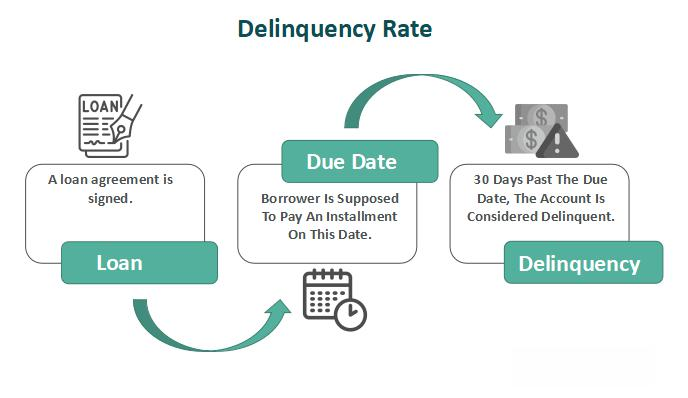

## Table of Contents

## What is delinquency?

Delinquency usually refers to the behavior of young people who break the law or act in ways that are not acceptable to society. This can include things like stealing, skipping school, or being disrespectful to others. When kids or teenagers do these things, they might be called delinquent. It's a problem because it can lead to more serious issues later in life, like trouble with the law or difficulties in school and work.

People often try to understand why some young people become delinquent. There can be many reasons, like problems at home, being around others who break the law, or feeling left out of society. Sometimes, it's because they are trying to fit in with a certain group or they are looking for excitement. Helping these young people can involve giving them support, like counseling, better education, or activities to keep them busy and out of trouble. It's important to address delinquency early to help them have a better future.

## What are the common causes of delinquency?

One common cause of delinquency is the environment a young person grows up in. If a kid lives in a place where crime is normal, they might think it's okay to break the law too. Family can play a big part too. If parents are not around much or don't set good examples, a kid might not learn right from wrong. Also, if a young person feels like they don't fit in or are left out, they might act out to get attention or to feel like they belong somewhere.

Another cause can be the friends a young person hangs out with. If their friends are doing bad things, they might be pressured to do the same to fit in. This is called peer pressure. Sometimes, a young person might not have enough to do, like after school activities or sports, and they might get bored and look for trouble. Also, if a kid has trouble in school or doesn't feel smart, they might start acting out because they feel frustrated or hopeless.

Lastly, some young people might have mental health issues or problems at home that make them feel angry or sad. If they don't get help for these feelings, they might start acting out in ways that get them into trouble. It's important for adults to notice these signs and help young people find better ways to deal with their feelings and situations.

## How is delinquency measured and tracked?

Delinquency is measured and tracked by looking at the number of crimes committed by young people. Police and other groups keep records of when a young person breaks the law. They use these records to see how many kids are getting into trouble and what kinds of trouble they are getting into. Sometimes, schools and community groups also keep track of behavior problems, like skipping school or fighting, to understand delinquency better.

This information is often put into reports and studies. These reports help people see if delinquency is going up or down in a certain area or across the country. By looking at these numbers, adults can try to figure out why some kids are acting out and what can be done to help them. It's important to track delinquency carefully so that the right help can be given to young people who need it.

## What are the different types of delinquent behaviors?

Delinquent behaviors can be split into two main types: status offenses and criminal offenses. Status offenses are things that are only against the law for young people, like skipping school or running away from home. These actions are not crimes for adults, but they can still get a kid in trouble with the law. On the other hand, criminal offenses are actions that are illegal for everyone, no matter their age. These can include things like stealing, vandalism, or even more serious crimes like assault.

There are also different ways to think about delinquent behaviors, like whether they are done alone or with others. Some kids might act out by themselves, maybe because they are feeling angry or sad. Other times, a young person might join a group and do bad things together, like being part of a gang. This can make the behavior more serious because they might feel pressure to keep doing bad things to stay in the group.

Lastly, delinquent behaviors can be about breaking rules at school or home, like not listening to teachers or parents, or they can be about breaking the law in the community, like shoplifting or graffiti. Each type of behavior can lead to different kinds of trouble, and understanding these differences helps adults know how to help the young person better.

## How does delinquency impact society?

Delinquency can have a big impact on society. When young people break the law or act out, it can make communities feel unsafe. People might be scared to go out or let their kids play outside. This can hurt the way people feel about their neighborhood. Also, when kids get into trouble, it can cost a lot of money. The police, courts, and other services have to spend time and money dealing with these problems. This means less money for other important things like schools or parks.

Delinquency can also affect the future of a community. If a lot of young people are getting into trouble, it can be hard for the area to grow and do well. Businesses might not want to open there, and it can be hard to attract new families. Over time, this can make the whole area struggle. But, if society works to help these young people, it can make a big difference. By giving them support and chances to do better, they can grow up to be good members of the community. This helps everyone in the long run.

## What are the age groups most commonly associated with delinquency?

The age group most commonly associated with delinquency is teenagers, usually between the ages of 12 and 17. This is the time when young people are going through a lot of changes and might be trying to figure out who they are. They might feel pressure from friends or be dealing with problems at home or school. Because of these things, they might start acting out in ways that get them into trouble.

Sometimes, younger kids can also show delinquent behavior, but it's less common. These kids might be between the ages of 7 and 11. At this age, they might not fully understand the difference between right and wrong, or they might be copying what they see older kids doing. But most of the time, when people talk about delinquency, they are talking about teenagers.

## What are the legal consequences of delinquent behavior?

When a young person acts out and breaks the law, they can face legal consequences. These consequences can be different depending on what they did and how old they are. For example, if a teenager steals something, they might have to go to juvenile court. In juvenile court, a judge decides what should happen next. The judge might decide the teen needs to do community service, pay a fine, or go to a special program to learn better behavior. If the crime is more serious, the teen might have to spend time in a juvenile detention center, which is like a jail for young people.

The goal of these legal consequences is not just to punish the young person, but also to help them learn from their mistakes and change their behavior. The law understands that young people are still growing and learning, so the focus is often on rehabilitation rather than just punishment. This means they might get counseling, education, or other support to help them stay out of trouble in the future. By giving young people these chances, the hope is that they can grow up to be good members of society.

## How do family and environment influence delinquency?

Family and environment play a big role in whether a young person gets into trouble. If a kid grows up in a place where crime is common, they might think it's normal to break the law. Also, if parents are not around much or don't show good behavior, a kid might not learn what's right and wrong. Sometimes, if there are a lot of fights or problems at home, a young person might feel angry or sad and start acting out. This can lead to delinquent behavior because they might be looking for attention or a way to feel better.

The people around a young person can also make a difference. If their friends are doing bad things, a kid might feel pressure to do the same to fit in. This is called peer pressure. Also, if a young person feels left out or doesn't have much to do, like after school activities or sports, they might get bored and look for trouble. It's important for adults to notice these things and help young people find better ways to deal with their feelings and situations, so they don't turn to delinquent behavior.

## What prevention and intervention programs are effective against delinquency?

There are many programs that help stop young people from getting into trouble. One kind of program is called mentoring. In mentoring, an older person spends time with a young person, helping them make good choices and giving them someone to talk to. Another program is after-school activities. These can be sports, clubs, or art classes that keep kids busy and out of trouble. Also, there are programs that teach young people about the dangers of drugs and crime, like D.A.R.E. (Drug Abuse Resistance Education). These programs help kids understand why it's important to stay away from bad things.

Intervention programs are there to help kids who are already showing signs of delinquent behavior. One example is family therapy, where families work together to fix problems at home that might be causing a kid to act out. Another type of program is counseling, where a young person talks to a professional about their feelings and learns better ways to deal with them. Sometimes, schools have special programs to help kids who are struggling with behavior, like anger management classes or conflict resolution training. These programs aim to help young people change their behavior before it gets worse.

## How do delinquency rates vary by geographic location?

Delinquency rates can be different in different places. In big cities, there might be more kids getting into trouble because there are more people and more things happening. Sometimes, in cities, there are areas where crime is more common, and kids growing up there might see bad behavior more often. This can make them think it's okay to break the law. On the other hand, in smaller towns or rural areas, there might be fewer kids getting into trouble because everyone knows each other, and there might be more support for young people.

But it's not just about city versus country. Even within the same city, some neighborhoods might have more delinquency than others. This can depend on things like how much money people have, how safe the area feels, and what kind of support is available for young people. If a neighborhood has good schools, after-school programs, and community centers, kids might be less likely to get into trouble. Understanding these differences helps adults know where to focus their efforts to help young people stay out of trouble.

## What are the long-term effects of delinquency on individuals?

When young people get into trouble and act out, it can affect their future in big ways. If they keep breaking the law, they might have a hard time finding a good job when they grow up. Employers might not want to hire someone with a criminal record. Also, going to jail or a detention center can make it hard to finish school. Without a good education, it's tough to get a good job. This can lead to a cycle where they keep getting into trouble because they feel stuck and don't see a way out.

Delinquency can also hurt a person's relationships. If someone is always in trouble, their family and friends might feel sad or angry. This can make it hard to keep close relationships. Over time, feeling left out or not loved can make someone feel even worse, which might make them act out more. But if young people get help early, they can learn to make better choices and have a better future. It's important to give them support and chances to change, so they can grow up to be good members of society.

## What role does the juvenile justice system play in addressing delinquency?

The juvenile justice system is important in helping young people who get into trouble. When a kid breaks the law, they might have to go to juvenile court. The people in the court, like judges and lawyers, work to figure out what happened and what should be done next. The goal is not just to punish the young person, but to help them learn from their mistakes and change their behavior. They might have to do things like community service, go to special programs, or even spend time in a juvenile detention center. The system tries to focus on helping young people get back on the right path.

The juvenile justice system also works to keep young people from getting into more trouble. They might set up programs like counseling or family therapy to help fix problems at home or school. Sometimes, they work with other groups, like schools or community centers, to give kids more support and chances to do better. By doing these things, the system hopes to stop kids from becoming adults who keep breaking the law. It's all about giving young people the help they need to have a better future.

## What is the conclusion?

As financial markets evolve, understanding the dynamics of delinquency rates is more important than ever. Delinquencies, which reflect the inability of borrowers to meet their debt obligations on time, serve as significant indicators of both individual and economic financial health. With the increasing complexity of financial systems and the [volume](/wiki/volume-trading-strategy) of transactions, accurately predicting and mitigating delinquencies has become a challenging yet essential task for financial institutions.

Algorithmic trading provides innovative ways to manage risks associated with financial delinquencies. By leveraging advanced computational algorithms, these trading strategies can process vast amounts of financial data in real-time, identifying patterns and trends that might go unnoticed with traditional analysis methods. For instance, machine learning models can be used to predict the likelihood of a borrower becoming delinquent based on historical data, current economic conditions, and individual financial behaviors. These predictions enable financial institutions to proactively adjust their lending practices, modify interest rates, or alter credit limits to minimize potential risks.

The formula for a simple prediction model might include predictors such as income level ($X_1$), debt-to-income ratio ($X_2$), and payment history ($X_3$), represented as: 

$$
P(\text{Delinquency}) = \beta_0 + \beta_1 X_1 + \beta_2 X_2 + \beta_3 X_3
$$

where $\beta_0$, $\beta_1$, $\beta_2$, and $\beta_3$ are coefficients derived from regression analysis based on historical data.

Future developments in technology and statistical methods will continue to enhance our understanding and handling of delinquencies. Advances in [artificial intelligence](/wiki/ai-artificial-intelligence) and big data analytics promise more sophisticated models that can integrate a broader range of variables and adapt to changes in economic conditions with greater precision. Moreover, improvements in blockchain technology and digital ledgers may offer more transparent and secure avenues for tracking and verifying transactions, potentially reducing the risk of default through clearer and more reliable data.

In conclusion, while the challenges posed by financial delinquencies are significant, the tools available to tackle them are becoming increasingly sophisticated. As these technologies evolve, they offer promising avenues not only for mitigating risks but also for fostering a healthier, more resilient financial ecosystem.

## References & Further Reading

[1]: ["Advances in Financial Machine Learning"](https://www.amazon.com/Advances-Financial-Machine-Learning-Marcos/dp/1119482089) by Marcos Lopez de Prado

[2]: ["Machine Learning for Algorithmic Trading"](https://github.com/PacktPublishing/Machine-Learning-for-Algorithmic-Trading-Second-Edition) by Stefan Jansen

[3]: ["Algorithmic Trading: Winning Strategies and Their Rationale"](https://www.wiley.com/en-us/Algorithmic+Trading%3A+Winning+Strategies+and+Their+Rationale-p-9781118460146) by Ernest P. Chan

[4]: ["Credit Risk Management: Basic Concepts"](https://academic.oup.com/book/5416) by Tony Van Gestel and Bart Baesens

[5]: Arner, D. W., Barberis, J., & Buckley, R. P. (2015). ["The Evolution of Fintech: A New Post-Crisis Paradigm?"](https://papers.ssrn.com/sol3/papers.cfm?abstract_id=2676553) Georgetown Journal of International Law, 47(4), 1271-1319.