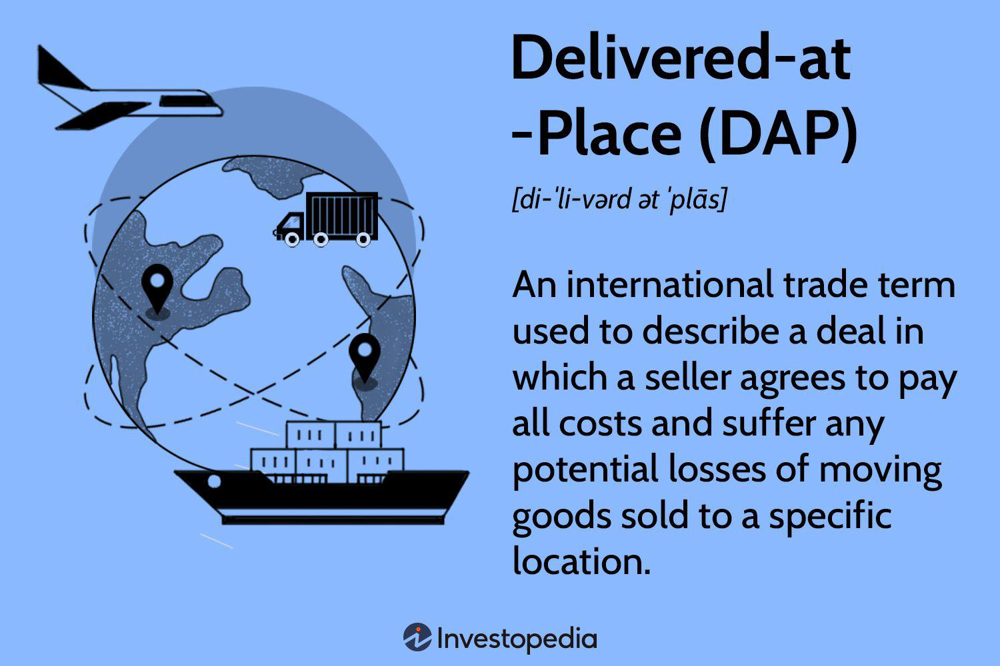

In the dynamic landscape of international trade, the comprehension and application of various trade terms and advanced trading strategies are crucial for achieving success. Among these, Delivered-at-Place (DAP) terms, standardized by the International Chamber of Commerce, play a significant role by clearly delineating responsibilities between sellers and buyers when goods are transported across borders. This clarity is essential for mitigating risks and minimizing disputes, thereby facilitating smoother trade transactions.

Additionally, integrating DAP terms with algorithmic trading offers businesses an opportunity to further streamline their operations and optimize efficiency. Algorithmic trading, which leverages sophisticated computer algorithms to automate and execute trade orders, can significantly enhance operational speed and decision-making accuracy. This integration not only reduces the likelihood of human error but also allows businesses to navigate the complexities of global trade with greater agility and precision.



The use of DAP terms provides a structured framework that clearly defines the point at which the responsibility and risk transfer from the seller to the buyer. When coupled with algorithmic trading strategies, companies can automate the monitoring of these transfer points, ensuring compliance and optimizing logistics. This combination can lead to substantial improvements in operational performance, cost management, and competitive positioning in the global marketplace. As such, understanding and effectively implementing DAP terms alongside algorithmic trading constitutes a strategic necessity for modern enterprises aiming to excel in international trade.

## Table of Contents

## What is Delivered-at-Place (DAP)?

Delivered-at-Place (DAP) is an international commercial term, or Incoterms, established by the International Chamber of Commerce (ICC) in 2010. It dictates the responsibilities of buyers and sellers in the transportation of goods within international trade. Under DAP agreements, the seller is accountable for all risks and costs involved in transporting goods to a prearranged destination specified by the buyer. This includes overseeing and executing all aspects of transportation logistics up to the point of delivery. Once the goods have arrived at the specified location, the buyer assumes responsibility, which entails handling import duties, taxes, and any additional charges associated with the final leg of transportation. This handover of responsibility delineates a clear division of obligations between the two parties involved.

The introduction of DAP as an Incoterm was aimed at simplifying the complexities affiliated with international trade processes. It superseded the previously used term 'Delivery Duty Unpaid' (DDU), creating a more streamlined approach to defining terms of delivery between trading partners. The transition from DDU to DAP reflects an evolution towards clarifying trade terms in an increasingly interconnected global market, helping to mitigate potential misunderstandings or disputes related to the allocation of delivery responsibilities and costs. The structured approach provided by DAP has become integral for businesses navigating the global supply chain, enhancing efficiency by clearly outlining the expectations and duties of both parties in the trade transaction.

## How DAP Works in International Trade

In Delivered-at-Place (DAP) agreements, the seller assumes a comprehensive role in managing the logistics chain from the point of origin to the specified destination. This responsibility encompasses several critical tasks. First, the seller is tasked with the packaging of goods, ensuring that they are securely and appropriately prepared for transport. The seller must also handle all necessary documentation, which includes obtaining export approvals and any other paperwork required for the goods to [exit](/wiki/exit-strategy) the country of origin legally.

Transportation arrangements are another essential component under the seller's purview. The seller is obliged to select a mode of transport—be it air, sea, rail, or road—that aligns with the delivery timeline and conditions stipulated in the trade contract. This choice provides adaptability across various global trade routes, offering flexibility to accommodate different logistical needs and constraints.

Once the goods arrive at the agreed destination, the buyer's responsibilities commence. The buyer is responsible for unloading the cargo, undertaking import formalities, and facilitating further transportation to the final destination. At this point, the financial burden transitions to the buyer, who assumes costs such as import duties, taxes, and any additional handling charges necessary to clear the goods through customs.

The articulation of responsibilities between the seller and the buyer under DAP terms is designed to mitigate disputes and streamline the execution of international trades. By delineating logistics and financial obligations, both parties can engage in a more efficient and predictable trade process, ultimately enhancing the fluidity of international commerce.

## Obligations Under DAP

In an international trade transaction governed by Delivered-at-Place (DAP) terms, the obligations of both the seller and the buyer are clearly defined to ensure a smooth and legally compliant transfer of goods across borders.

### Seller's Responsibilities

Under DAP terms, the seller is tasked with a series of responsibilities that encompass the initial stages and logistics of the delivery process:

1. **Securing Necessary Documents**: The seller must obtain all relevant export licenses, permits, and documentation required for the shipment. This includes any paperwork needed to satisfy the regulations of the exporting country.

2. **Freight Costs and Transportation Arrangements**: It is the seller's duty to cover all costs associated with the transportation of goods to the designated place of delivery. This includes hiring transport services, ensuring proper packaging, and mitigating risks associated with the physical transfer.

3. **Proof of Delivery**: The seller must also provide the buyer with evidence that the goods have been delivered to the specified location. This proof often takes the form of a signed receipt or other documentation that verifies delivery completion.

### Buyer's Responsibilities

Once the goods have arrived at the specified place, the buyer assumes responsibility for the subsequent stages of the import process:

1. **Payment for Goods**: The buyer needs to ensure timely payment for the purchased goods as agreed in the sales contract.

2. **Import Paperwork and Customs Clearance**: The buyer is responsible for handling all import formalities, including securing necessary import licenses, and ensuring compliance with the importing country's laws and regulations. This involves preparing and submitting customs declarations and paying any duties or taxes applicable.

3. **Unloading Costs and Transportation to Final Location**: Upon arrival of goods, the buyer covers the costs of unloading and arranges further transportation to the final destination. This step ensures the goods reach their intended end point without incurring additional costs to the seller.

### Importance of Clear Responsibilities

Clearly delineating these responsibilities under DAP terms minimizes the risk of disputes and facilitates efficient trade execution. By understanding these obligations, both parties can better manage logistics, financial planning, and regulatory compliance throughout the transaction process. This structured division of duties not only enhances trade efficiency but also builds trust and reliability between trading partners, thereby contributing to a more seamless global trade environment.

## Importance of Incoterms in Trade

Incoterms, short for International Commercial Terms, are an essential component of both international and domestic trade. Established by the International Chamber of Commerce (ICC), these terms provide a standardized set of rules that clarify the responsibilities of sellers and buyers in the transportation of goods. This clarity is crucial to prevent disputes and ensure seamless transactions, as it delineates the allocation of costs, risks, and obligations between parties.

One of the primary benefits of Incoterms is that they establish a common language for trade, reducing misunderstandings between international trading partners. By setting clear expectations and specifying who is responsible for various aspects of the shipping process, including loading, transportation, and insurance, Incoterms mitigate potential conflicts that can arise from discrepancies in contractual interpretations. This aspect is particularly valuable in the global marketplace, where cultural differences and language barriers often complicate business transactions.

The periodic updates of Incoterms reflect the evolving nature of global trade and logistics. Adjustments are made to keep pace with changes in transportation technology, shifts in regulatory frameworks, and the emergence of new trade practices. These updates ensure that Incoterms remain relevant and applicable to contemporary trade environments, offering businesses current guidance in their shipping agreements. For instance, the 2020 revision of Incoterms introduced changes like the replacement of "Delivered at Terminal" (DAT) with "Delivered at Place Unloaded" (DPU), acknowledging the preferences of many traders who demand flexibility in delivery locations.

In summary, Incoterms are indispensable tools in trade, providing a well-defined structure for commercial agreements. By reducing ambiguities and ensuring all parties have a mutual understanding of their roles, Incoterms enhance the efficiency and reliability of international and domestic trade operations.

## Algorithmic Trading in International Trade

Algorithmic trading, also known as algo-trading, employs computer algorithms to systematically execute large trade orders by adhering to predetermined conditions. These algorithms enhance the speed and efficiency with which trades are conducted, a significant advantage in the fast-paced environment of international trade.

For businesses engaged in international trade, [algorithmic trading](/wiki/algorithmic-trading) offers various benefits. One of the primary advantages is the optimization of logistical processes. Algorithms can analyze complex data sets to identify the most efficient shipping routes, determine optimal inventory levels, and streamline the scheduling of shipments. For instance, by analyzing historical shipping data and current market conditions, an algorithm can predict the best time to transport goods to minimize costs and transit times.

Moreover, algorithmic trading facilitates precise demand forecasting. By integrating [machine learning](/wiki/machine-learning) models, businesses can predict consumer demand trends with high accuracy. This predictive capability enables companies to maintain optimal inventory levels, thereby reducing both overstock and stockouts. For example, a supervised learning model can be trained on historical sales data to predict future demand, ensuring that a company is adequately prepared to meet market needs.

Currency exchange fluctuation is another area where algorithms prove invaluable. International trade frequently involves transactions in multiple currencies, subjecting businesses to exchange rate [volatility](/wiki/volatility-trading-strategies). Algorithmic trading systems can monitor real-time currency fluctuations and automatically execute currency trades to hedge against adverse movements. This process helps businesses manage foreign exchange risk and stabilize financial outcomes.

Integrating algorithmic trading with Delivered-at-Place (DAP) terms, as defined by Incoterms, presents further opportunities for businesses. By streamlining cost management and improving logistical efficiency, firms can reduce operational expenses. The use of algorithms in this context allows for swift adaptation to market changes, thereby enhancing decision-making processes and competitive positioning in the global market.

In practical implementation, Python is often used for building algorithmic trading models due to its rich ecosystem of libraries and ease of use. For example, the use of libraries like NumPy and pandas for data manipulation, along with scikit-learn for predictive modeling, allows for efficient development and deployment of trading algorithms.

```python
import numpy as np
import pandas as pd
from sklearn.ensemble import RandomForestRegressor

# Example: Using Random Forest for demand prediction
def predict_demand(historical_data):
    # historical_data should be a DataFrame with historical sales information
    features = historical_data.drop('sales', axis=1)
    target = historical_data['sales']

    model = RandomForestRegressor(n_estimators=100, random_state=42)
    model.fit(features, target)

    return model

# Sample invocation
# historical_data = pd.read_csv('historical_sales.csv')
# demand_model = predict_demand(historical_data)
```

By leveraging such tools and methodologies, businesses can achieve operational excellence and maintain a competitive edge in international trade. Algorithmic trading is an indispensable component of modern trading strategies, providing significant efficiency and risk management benefits.

## Challenges and Future of DAP and Algorithmic Trading

Navigating complex international regulations and ensuring compliance with varying local laws present significant challenges in Delivered-at-Place (DAP) agreements. The multifaceted nature of international logistics requires continuous monitoring and adaptation to different legal requirements, which can vary significantly between jurisdictions. These legal frameworks govern aspects such as customs regulations, import-export controls, and additional documentation necessary for the lawful movement of goods. Non-compliance can result in penalties, delays, and financial losses, urging businesses to invest resources in legal expertise and compliance technologies.

Algorithmic trading, which utilizes computer algorithms to automate trade order execution, also faces substantial challenges. A robust infrastructure is paramount for the success of algorithmic strategies. This involves reliable data feeds, high-speed internet connectivity, and advanced computational resources to process vast amounts of data in real-time. Furthermore, data security measures are critical to prevent market manipulations and technical failures that could lead to significant financial repercussions. Algorithms need constant validation and testing to ensure they function correctly under various market conditions, and they should be safeguarded against cybersecurity threats.

Looking towards the future, the integration of Artificial Intelligence (AI) and Machine Learning (ML) offers promising advancements in refining international trade processes and predictive analytics. AI and ML can enhance the capability of algorithms to adapt and learn from historical data, optimizing trade strategies and improving accuracy in forecasting demand and currency fluctuations. These technologies can further personalize and streamline logistical operations, adapting to unforeseen variables with greater precision. As AI and ML technologies evolve, they are expected to play an even more central role in automating and optimizing trade processes, potentially transforming the industry with smarter, data-driven decisions.

Incorporating these advancements necessitates an investment in continuous learning and adaptation, ensuring that systems remain resilient against a backdrop of rapid technological change. The innovation in AI and ML also raises ethical and regulatory considerations, prompting industry stakeholders to collaboratively establish guidelines that balance competitive advantage with ethical concerns and equitable trade practices.

## Conclusion

Incorporating Delivered-at-Place (DAP) terms in international trade agreements is pivotal for delineating costs and responsibilities between buyers and sellers, reducing the potential for misunderstandings and disputes. This clarity facilitates smoother transactions by establishing precise delivery points and explicitly defining which parties shoulder specific logistics and financial responsibilities. In an era marked by rapid technological advancements, the integration of algorithmic trading with DAP terms offers businesses a significant competitive edge. Algorithmic trading, leveraging sophisticated algorithms to execute trades, enhances operational efficiency by automating decision-making processes, predicting market trends, and optimizing logistics.

By adopting algorithmic trading alongside DAP terms, organizations can minimize risks associated with market volatilities and complex supply chains. This synergy enables enterprises to efficiently manage currency fluctuations and optimize cross-border logistical operations, ultimately maximizing profitability. Moreover, the strategic use of these tools allows businesses to react swiftly to market changes, ensuring their agile adaptation to the ever-evolving global trade landscape.

For modern enterprises seeking success, the combination of DAP terms and algorithmic trading is no longer optional but essential. This integrated approach helps businesses establish robust operational frameworks, simplify complex trade processes, and achieve excellence in a competitive international market. Embracing these strategies positions companies to thrive amidst the dynamic challenges of global commerce.

## References & Further Reading

[1]: [International Chamber of Commerce. Incoterms® 2020](https://iccwbo.org/business-solutions/incoterms-rules/incoterms-2020/) - International Chamber of Commerce, 2019.

[2]: Lopez de Prado, M. (2018). ["Advances in Financial Machine Learning."](https://www.amazon.com/Advances-Financial-Machine-Learning-Marcos/dp/1119482089) Wiley.

[3]: Jansen, S. (2020). ["Machine Learning for Algorithmic Trading."](https://github.com/stefan-jansen/machine-learning-for-trading) Packt Publishing.

[4]: Aronson, D. (2006). ["Evidence-Based Technical Analysis: Applying the Scientific Method and Statistical Inference to Trading Signals."](https://onlinelibrary.wiley.com/doi/book/10.1002/9781118268315) Wiley.

[5]: Chan, E. P. (2008). ["Quantitative Trading: How to Build Your Own Algorithmic Trading Business."](https://github.com/ftvision/quant_trading_echan_book) Wiley.