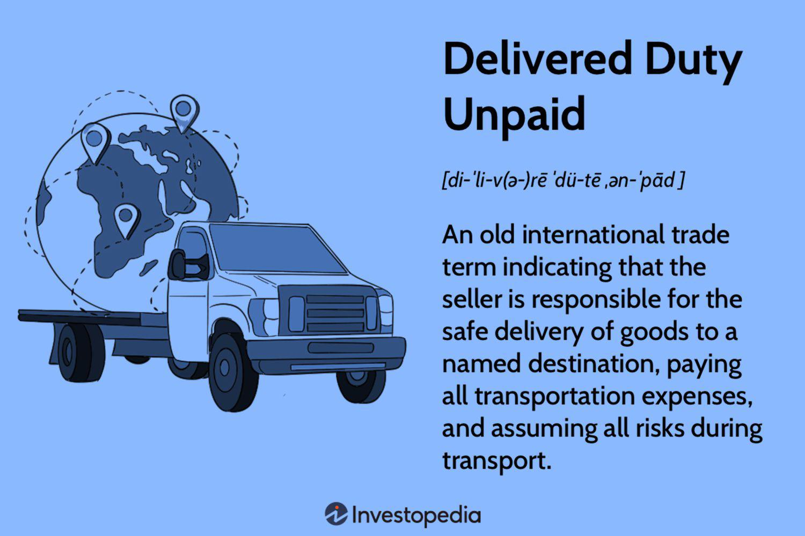

International shipping plays a crucial role in global trade. It links producers and consumers across continents, moving commodities, manufactured goods, and services swiftly and efficiently. With the world's economy increasingly interconnected, international shipping facilitates not only the exchange of goods but also cultural and knowledge exchanges, cementing its place as a backbone of globalization.

Delivered Duty Unpaid (DDU) is a vital term in the lexicon of international trade. It refers to a contractual agreement where the seller assumes all responsibilities and costs associated with transporting goods to a destination country, excluding customs duties, taxes, and other clearance fees, which the buyer must handle. This trade term is distinguished from Delivered Duty Paid (DDP), where the seller covers all costs, including customs clearance and pays all tariffs.



In recent years, the concept of algorithmic trading has significantly transformed financial markets. Algorithmic (algo) trading involves utilizing computer algorithms to execute trading orders at a speed and frequency that is impossible for human traders. These algorithms assess numerous market variables, making strategic decisions based on pre-defined criteria to optimize transaction efficiency. Algo trading is renowned for benefits such as speed, accuracy, and the ability to execute complex trading strategies, making it indispensable for modern-day financial transactions.

Where DDU and algo trading intersect in the global marketplace is in their shared goal of optimizing efficiency, reducing costs and managing risks. While DDU handles the physical movement and financial responsibilities associated with shipping goods internationally, algo trading enhances the financial transactions involved, ensuring that trade orders related to shipping are executed swiftly and at the most favorable terms. This confluence creates a streamlined process where both goods and their associated financial flows are managed efficiently.

The purpose of this article is to provide a comprehensive understanding of DDU and how it works alongside algorithmic trading in today's global marketplace. By exploring these topics, businesses and stakeholders can make informed decisions that enhance their international trade operations, ultimately leading to improved efficiency and profitability.

## Table of Contents

## What is Delivered Duty Unpaid (DDU)?

Delivered Duty Unpaid (DDU) is an international trade term used to define the responsibilities of sellers and buyers in cross-border transactions. According to the Incoterms 2000, DDU is a term that specifies that the seller is responsible for delivering the goods to a predetermined destination, covering all the costs and risks involved in bringing the goods to that point except for duties, taxes, and other official charges payable upon import. The buyer assumes responsibility for these import costs and any further transport beyond the agreed destination.

### Seller and Buyer Responsibilities Under DDU Terms

Under DDU terms, the seller is tasked with a series of essential responsibilities, which include:

1. **Packaging and Transporting Goods**: The seller must ensure that the goods are adequately packaged and transported to the buyer’s country. This encompasses all costs related to the export processes.

2. **Risk of Loss or Damage**: The seller bears the risk of loss or damage to the goods until they have reached the agreed destination. It includes obtaining export licenses and handling all export customs formalities.

3. **Insurance and Freight Costs**: While not responsible for insurance under the delivery terms, the seller must cover all freight charges required to transport the goods to the destination.

On the buyer’s side, the responsibilities are focused on import duties and potential logistical arrangements upon the goods' arrival:

1. **Clearing Goods for Import**: The buyer assumes responsibility for clearing the goods through customs at the import destination, which involves paying any customs duties, taxes, and other related charges.

2. **Risk and Costs Post-Delivery**: Upon delivery to the agreed location, the buyer takes over the risks and costs, including those for subsequent transportation to the final destination if needed.

### Comparison with Delivered Duty Paid (DDP)

Delivered Duty Paid (DDP) offers a contrasting framework to DDU. In a DDP transaction, the seller's obligations are expanded to include the payment of import duties and related taxes, thereby minimizing the buyer's involvement in the import process. The key distinction between DDU and DDP lies in who bears the costs and risks associated with importing the goods:

- **Cost Responsibility**: In DDU, the buyer is responsible for import duties, while under DDP, the seller absorbs these costs.
- **Risk Transfer**: For DDU, the transfer of risk to the buyer occurs once the goods have reached the delivery location, but before customs clearance. In DDP, the risk shifts to the buyer only after the goods have been cleared for import and delivered.

Choosing between DDU and DDP depends on various factors, including the relative knowledge and capability of buyers and sellers to handle customs issues and their strategic approach to managing financial and strategic risks in international trade.

## Understanding the Logistics of DDU

Delivered Duty Unpaid (DDU) represents a set of shipping terms where the seller is responsible for transporting goods to a specified destination without covering the costs of import duties and taxes. The execution of DDU shipping terms requires meticulous planning and coordination between the seller and buyer to ensure a smooth transaction. 

The process begins with the seller preparing the goods for shipment. This includes packaging, labeling, and preparing necessary documentation, such as invoices and transport documents, which are crucial for customs clearance at the destination country. Once the goods are ready, the seller arranges transportation, ensuring that the chosen method aligns with delivery timelines and cost considerations. 

Upon arrival at the destination port or location, the buyer assumes responsibility for customs clearance. This entails payment of import duties, taxes, and any applicable local handling fees. It is crucial for buyers to be aware of the specific customs regulations in their country to avoid delays or additional costs.

Key logistical considerations for sellers under DDU terms include selecting reliable carriers and ensuring that all documentation is accurate and comprehensive. Sellers must communicate effectively with logistic providers to monitor shipments and address any unforeseen issues promptly. Buyers, on the other hand, should focus on understanding customs regulations and preparing the necessary funds for duties and taxes to facilitate timely clearance.

One of the primary risks involved in DDU transactions is the potential for delays during customs clearance, which can occur due to incorrect documentation or unexpected customs charges. Such delays result in increased costs for storage and demurrage, impacting the overall efficiency of the supply chain. To mitigate these risks, sellers can work with experienced freight forwarders who can navigate the complexities of international shipping and customs regulations. Buyers should consider engaging customs brokers to ensure compliance with local import requirements.

Another risk [factor](/wiki/factor-investing) is currency fluctuations, which can affect the overall cost of import duties and taxes payable by the buyer. Implementing hedging strategies or negotiating terms that allow for currency adjustments can minimize financial exposure due to volatile exchange rates.

In summary, successful execution of DDU shipping terms requires a collaborative approach between sellers and buyers, supported by detailed planning and knowledge of international logistics and customs procedures. By proactively managing these elements, businesses can ensure efficient and reliable international transactions under DDU terms.

## Algo Trading: A Brief Overview

Algorithmic trading, often known as algo trading, refers to the use of computer algorithms to manage trading activities in financial markets. These algorithms are designed to follow a set of instructions for placing a trade in order to generate profits at a speed and frequency that is impossible for a human trader. It integrates complex mathematical models, cutting-edge software, and powerful computing resources to make automated decisions that optimize the execution of trades.

### Key Benefits and Uses of Algo Trading

The primary advantages of [algorithmic trading](/wiki/algorithmic-trading) include increased speed, efficiency, and accuracy. Algorithms can process vast quantities of data almost instantaneously, allowing them to react to market conditions more swiftly than any human trader. This speed can be particularly beneficial in markets where prices can change in fractions of a second. Additionally, algorithmic trading mitigates human error by executing trades according to predetermined criteria without emotional interference, leading to more disciplined and consistent trading strategies.

Algorithmic trading is extensively used for activities such as [market making](/wiki/market-making), [arbitrage](/wiki/arbitrage), and [trend following](/wiki/trend-following). Market makers employ algo trading to quote both buy and sell prices in a financial instrument, profiting from the bid-ask spread. Arbitrage algorithms exploit price discrepancies across different markets or instruments, while trend-following algorithms execute trades based on technical indicators to capture gains from sustained market movements. 

### How Technology Reshapes the Trading Landscape

The evolution of technology has significantly transformed financial markets, primarily through the proliferation of high-frequency trading ([HFT](/wiki/high-frequency-trading-strategies)), a subset of algo trading that leverages high-speed data analysis and order execution. HFT firms deploy ultra-low latency networks and advanced computational techniques to achieve microsecond-level execution times, accessing [liquidity](/wiki/liquidity-risk-premium) and profiting from small price movements across exchanges.

Moreover, developments in [machine learning](/wiki/machine-learning) and [artificial intelligence](/wiki/ai-artificial-intelligence) (AI) are further revolutionizing algorithmic trading. Machine learning models are now capable of processing complex historical data patterns to predict future market behaviors, refining trading algorithms in real-time to evolve with changing market dynamics.

In Python, popular libraries such as NumPy, pandas, and scikit-learn facilitate statistical analysis and machine learning implementations. The integration of these tools enables traders to build and backtest sophisticated algorithms more efficiently. Below is an example of a simple moving average crossover strategy implemented in Python:

```python
import pandas as pd
import numpy as np

# Load historical data
data = pd.read_csv('market_data.csv')
data['SMA_50'] = data['close'].rolling(window=50).mean()
data['SMA_200'] = data['close'].rolling(window=200).mean()

# Define signals
data['Signal'] = 0
data.loc[data['SMA_50'] > data['SMA_200'], 'Signal'] = 1  # Buy signal
data.loc[data['SMA_50'] < data['SMA_200'], 'Signal'] = -1  # Sell signal

# Calculate returns
data['Return'] = data['Signal'].shift(1) * (data['close'].pct_change())

print(data[['close', 'SMA_50', 'SMA_200', 'Signal', 'Return']])
```

In conclusion, algorithmic trading is a powerful tool that continues to shape the dynamics of financial markets, enhancing their efficiency and liquidity while presenting both challenges and opportunities for traders. With ongoing technological advancement, the capabilities and applications of algo trading are likely to expand, offering further sophisticated mechanisms to navigate the complex landscape of financial markets.

## The Intersection of DDU and Algo Trading

International trade significantly impacts global markets by facilitating the movement of goods across borders. Terms like Delivered Duty Unpaid (DDU) dictate the responsibilities of sellers and buyers in these transactions. Under DDU, the seller is responsible for transporting goods to the destination, while the buyer covers import duties and additional charges. This clear demarcation of responsibilities influences market dynamics by affecting pricing, demand, and supply chains.

Algorithmic solutions play a crucial role in optimizing international shipping and trade. Algorithms can streamline logistical operations by minimizing costs and enhancing delivery efficiencies. Through data analysis and predictive modeling, these algorithms assess various factors like shipping times, route optimization, and cost-benefit analyses to recommend the most efficient trade routes and methods. For instance, machine learning models can analyze historical shipping data to predict potential delays and suggest alternate shipping paths to avoid congestion, thereby reducing transit times and costs.

Algorithmic trading, initially developed for financial markets, can also be applied to international trade logistics, solving challenges associated with DDU terms. Consider a case where a company uses an algorithm to predict fluctuations in import duty rates across different countries. By integrating this predictive capability with real-time exchange rates, businesses can decide the most opportune time to purchase goods in local currencies, optimizing cost efficiency.

A specific example is a company implementing an algorithm that incorporates international shipping schedules, real-time weather data, and port congestion information to forecast delays. Suppose the algorithm predicts a delay at a specific port; the company can re-route shipments in advance, avoiding costly hold-ups. This preventative approach, enabled by algorithmic insight, aligns with the nature of DDU agreements where the buyer must bear additional costs resulting from unexpected delays.

In the context of DDU, algorithmic solutions offer a dual benefit: they not only optimize shipping and logistical processes but also provide strategic insights for cost management. As businesses increasingly embrace digital transformation, integrating algorithmic trading techniques into their international trade practices can lead to more informed decision-making, reduced risks, and improved operational efficiency.

## Key Considerations for Businesses

When businesses decide between Delivered Duty Unpaid (DDU) and Delivered Duty Paid (DDP) shipping terms, several crucial factors come into play. DDU places the onus of import duties and taxes on the buyer, while DDP involves the seller covering these costs. The choice between these terms impacts financial strategies, cash flow, and risk management.

Firstly, choosing between DDU and DDP depends on the company's negotiation power and market positioning. Companies with a solid presence may lean towards DDP to offer customers a hassle-free experience, potentially enhancing customer satisfaction and loyalty. Conversely, firms looking to avoid potential customs complications may choose DDU, transferring import-related risks and costs to the buyer.

Secondly, considering algorithmic trading can significantly enhance the efficiency of international trade processes. Algorithmic trading involves the use of computer programs to execute predetermined trading strategies at speeds and frequencies that are impossible for human traders. In the context of international trade, businesses can leverage these algorithms to optimize currency exchange transactions, hedge against foreign exchange risk, and manage supply chain logistics more effectively.

For instance, businesses can employ algorithmic systems to monitor currency fluctuations in real-time, executing currency trades when favorable exchange rates arise. This not only helps in managing costs but also in protecting against adverse currency movements. Moreover, algorithms can assist in making data-driven decisions regarding supply chain logistics, such as determining the most efficient shipping routes and timing based on real-time data.

The financial implications of choosing DDU versus DDP and using algorithms in trading should not be underestimated. DDU may initially appear to provide cost-saving benefits by shifting the duty burden to buyers; however, businesses must account for potential delays at customs, which can lead to increased carrying costs and opportunity losses. By contrast, DDP offers more predictable cash flow, albeit potentially decreasing the profit margin with additional responsibility for duty costs.

Risk management strategies are paramount when engaging in international trade. With DDU, the key risk involves relying on the buyer's ability to navigate their country's import processes. In contrast, DDP entails the risk of miscalculating duty fees, potentially impacting profitability. Here, algorithmic trading can play a substantial role. By employing algorithms to predict duty costs and optimize currency trades, businesses can mitigate some of these financial risks.

In summary, the decision to utilize DDU or DDP should be informed by a comprehensive assessment of a company's market strategy, financial health, and risk appetite. Leveraging algorithmic trading offers a potent toolset to enhance efficiency, manage financial exposure, and drive informed decision-making in the complexities of international trade.

## Conclusion

In conclusion, understanding Delivered Duty Unpaid (DDU) and the role of algorithmic trading is integral to navigating the complexities of modern global trade. DDU simplifies transactions across international borders by delineating the responsibilities between sellers and buyers, which can vary significantly from those under Delivered Duty Paid (DDP) terms. This distinction is crucial for businesses aiming to optimize their supply chain operations while managing costs and risks effectively.

In parallel, algorithmic trading stands as a transformative force, offering tools to enhance the precision and efficiency of financial transactions. By leveraging complex algorithms, businesses can execute trades at speeds and volumes previously unimaginable, optimizing their financial strategies and responding swiftly to market conditions.

The intersection of these two domains presents unprecedented opportunities for businesses. The strategic application of algorithmic solutions can streamline international shipping processes, thereby mitigating DDU-related challenges such as forecasting demand, managing currency risks, and optimizing routes.

Ultimately, businesses are encouraged to harness these practices to elevate their trade efficiency. By understanding and applying DDU principles and embracing technology like algo trading, companies can better navigate the intricate landscape of global commerce, ensuring a competitive edge in an ever-evolving marketplace. This integration not only fosters resilience but also positions businesses to capitalize on the dynamic opportunities presented by globalization.

## References & Further Reading

[1]: ["Incoterms 2020 by the International Chamber of Commerce (ICC)"](https://iccwbo.org/business-solutions/incoterms-rules/incoterms-2020/) - Provides the latest guidelines on international commercial terms including DDU.

[2]: ["Advances in Financial Machine Learning"](https://www.amazon.com/Advances-Financial-Machine-Learning-Marcos/dp/1119482089) by Marcos Lopez de Prado - Discusses applications of machine learning in financial markets and algorithmic trading.

[3]: ["Quantitative Trading: How to Build Your Own Algorithmic Trading Business"](https://www.amazon.com/Quantitative-Trading-Build-Algorithmic-Business/dp/1119800064) by Ernest P. Chan - Offers insights into developing an algorithmic trading business and strategies used in the field.

[4]: ["Algorithmic Trading: Winning Strategies and Their Rationale"](https://www.wiley.com/en-us/Algorithmic+Trading%3A+Winning+Strategies+and+Their+Rationale-p-9781118460146) by Ernie Chan - Explores various algorithmic trading strategies and their practical implementations.

[5]: ["Logistics and Supply Chain Management"](https://www.netsuite.com/portal/resource/articles/erp/supply-chain-management-vs-logistics.shtml) by Martin Christopher - Provides a comprehensive understanding of logistics and its role in international trade.

[6]: ["Financial Markets and Trading: An Introduction to Market Microstructure and Trading Strategies"](https://archive.org/details/financialmarkets0000schm) by Anatoly B. Schmidt - An introduction to trading strategies and market microstructure, relevant to algorithmic trading applications.