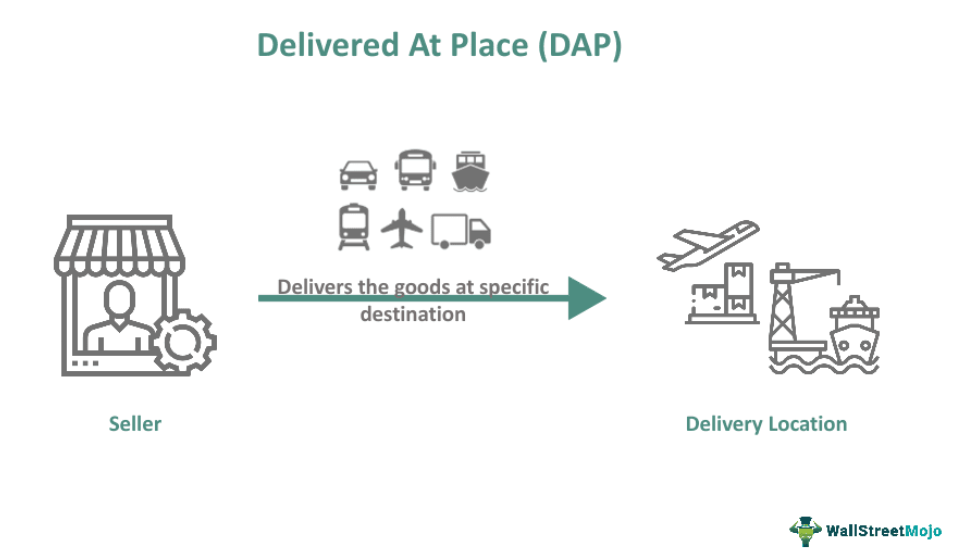

In today's competitive global marketplace, businesses face the constant pressure of optimizing their delivery and trading strategies to remain viable. Efficient and cost-effective approaches are crucial for ensuring sustainability and growth. Within this context, understanding and utilizing specific International Commercial Terms, known as Incoterms, become vital. Incoterms such as Delivered Ex Ship (DES), Delivered At Place (DAP), and Delivered At Terminal (DAT) hold significant importance in international trade by defining the responsibilities between buyers and sellers in the shipping process.

Delivered Ex Ship (DES) involves the seller delivering goods to a particular port, with the buyer responsible for unloading and further transportation. Delivered At Place (DAP), on the other hand, places the onus on the seller to deliver goods to a designated location, excluding import duties and unloading costs. Delivered At Terminal (DAT) requires the seller to deliver goods to a specified terminal, covering unloading expenses. These terms streamline international transactions by delineating the responsibilities and costs associated with shipping, thereby enhancing logistical efficiency and cost management.



Parallel to these developments, algorithmic trading, commonly referred to as algo trading, is revolutionizing transaction execution. It replaces traditional human decision-making processes with technology-driven methods, providing unparalleled speed, precision, and the ability to analyze vast amounts of data in real time. By employing pre-set mathematical models and algorithms, businesses can execute trades at high frequencies, adapt swiftly to market changes, and reduce operational errors. This technological advancement is becoming a cornerstone for companies aiming to optimize both their financial transactions and logistics operations, particularly in volatile market conditions.

This article explores the interaction between these Incoterms and algorithmic trading. By leveraging both, businesses can achieve optimal results, harnessing the power of precise trade execution and well-defined shipping protocols to enhance their competitive edge. Through this exploration, readers will gain a clearer understanding of the essential Incoterms and discover the transformative impact technology has on logistics and trade execution. This knowledge can be pivotal for businesses looking to refine their strategies and thrive in the dynamic global market landscape.

## Table of Contents

## Understanding Incoterms: DES, DAP, and DAT

Incoterms, or International Commercial Terms, are a set of standardized guidelines published by the International Chamber of Commerce (ICC). They are critical in defining the responsibilities and obligations of buyers and sellers during the transportation and delivery of goods in international trade. Incoterms help mitigate misunderstandings by clearly outlining who is responsible for various costs and risks associated with shipping, delivery, and transfer of goods.

### Delivered Ex Ship (DES)

Delivered Ex Ship (DES) is an Incoterm where the seller's responsibility extends until the goods are delivered to a specified port of destination on a ship. The risk and cost transfer from the seller to the buyer once the goods are ready for unloading at the named port. In DES, it is the buyer's responsibility to handle the unloading, customs clearance, and onward transportation of the goods. Understanding DES is important, as it impacts the logistics plan and cost structure. This term emphasizes the responsibility lying with the buyer post the arrival of goods at the destination port.

### Delivered At Place (DAP)

Delivered At Place (DAP) is an Incoterm where the seller is accountable for all costs and risks associated with delivering goods to a specific location agreed upon by both parties. The seller takes responsibility for export clearance, transportation, and discharge of goods at the delivery destination, excluding import duties and the process of unloading the goods. This term simplifies cost management for the buyer, as they are only required to handle local duties, taxes, and unloading once the goods arrive at the designated location.

### Delivered At Terminal (DAT)

Delivered At Terminal (DAT) is an Incoterm that obligates the seller to deliver the goods to a terminal—such as a port, airport, or logistics center—at the agreed destination. The seller covers all transportation and unloading costs, ensuring the goods are available to the buyer at the terminal. Responsibility for the goods, including risk and cost, transfers to the buyer once the seller completes the delivery at the given terminal. This term appeals to buyers who prefer streamlined logistics, as it reduces their burden of arranging transport and unloading logistics.

### Impact on International Logistics

A thorough understanding of these Incoterms—DES, DAP, and DAT—can significantly enhance the efficiency and cost management of international logistics operations. By delineating specific points of cost and risk transfer, Incoterms enable businesses to more accurately forecast expenses, manage liabilities, and ensure compliance with international standards. Proper use of these terms helps in avoiding confusion and disputes in international trade, thereby fostering smoother transaction and delivery processes.

## Exploring Algorithmic Trading

Algorithmic trading represents a technological advancement in the execution of financial transactions, utilizing computer systems to implement trades at high frequencies based on pre-defined criteria. This approach has significantly reshaped trading dynamics by offering enhanced execution speeds, cost efficiency, and significantly reduced human error—an advantage critical for volatile market environments where timely decision-making is paramount.

The technological evolution propelling [algorithmic trading](/wiki/algorithmic-trading) forward is characterized by sophisticated programming languages and advanced computational capabilities. Python, commonly favored for its simplicity and robust libraries, enables the execution of complex algorithms. For example, a simple trading algorithm might look like this:

```python
def simple_moving_average(data, window_size):
    return data.rolling(window=window_size).mean()

# Example of usage
# Assume 'data' is a pandas DataFrame containing price information
sma = simple_moving_average(data['price'], 20)
```

This code snippet demonstrates how a simple moving average can be used as part of a trading strategy, a foundational example in the trend-following category of algorithms.

Algorithm types are vast and varied, tailored for distinct purposes. Statistical [arbitrage](/wiki/arbitrage) aligns with algorithmic calculations to exploit price imbalances, often utilizing mean reversion strategies. Trend-following algorithms identify and capitalize on persistent market movements, while [machine learning](/wiki/machine-learning) algorithms evolve with historical data, learning and predicting future trends.

The critical role of algorithmic trading in industries engaged in international trade cannot be understated. It facilitates the optimization of financial transactions that underpin logistics and inventory management. By analyzing real-time data, algorithms can dynamically adjust trading strategies, allowing businesses to mitigate risks and capitalize on potential market opportunities efficiently.

In summary, algorithmic trading has revolutionized trade execution, enhancing speed, accuracy, and cost-effectiveness. Its integration into international trade operations provides a formidable tool for navigating the complexities of global market dynamics, making it indispensable for modern businesses.

## Integration of Incoterms with Algorithmic Trading

The strategic integration of Incoterms such as Delivered Ex Ship (DES), Delivered At Place (DAP), and Delivered At Terminal (DAT) with algorithmic trading can substantially enhance efficiency and reduce costs in international trade. Algorithmic trading systems can optimize logistics decisions by utilizing real-time data related to shipping routes, costs, and geopolitical factors, thereby allowing businesses to adapt quickly to changing conditions.

The ability to adjust shipping terms dynamically according to market forecasts represents a significant advantage. For example, algorithmic trading platforms can rapidly evaluate fluctuations in currency exchange rates, fuel prices, and shipping lane congestion, enabling companies to optimize their trade terms continuously. This capability to adjust on-the-fly minimizes both operational delays and unexpected expenses, enhancing overall supply chain efficiency.

Data analytics underpins this integration by offering deeper insights into risk assessment and logistics optimization. Through machine learning algorithms and data modeling, companies can better predict and manage potential disruptions in the supply chain. This analytical capacity is crucial for negotiating favorable trade terms, as it provides a data-driven understanding of risk factors associated with different shipping strategies.

Furthermore, combining Incoterms and advanced trading algorithms provides businesses with a competitive edge by enhancing strategic decision-making processes. Companies can leverage this integration to negotiate more effectively, streamline operations, and ultimately reduce transactional costs. The result is a more agile trading framework capable of responding swiftly to external influences such as political instability or natural disasters, thereby safeguarding business interests.

In summary, utilizing algorithmic trading in conjunction with Incoterms delivers a transformative effect on international trade operations. By capitalizing on innovations in real-time data processing and analytics, businesses can achieve improved logistical outcomes and a significant competitive advantage in the global market.

## Benefits and Challenges

Combining Incoterms with algorithmic trading offers several benefits that can significantly enhance international trade operations. One of the primary advantages is cost efficiency. By automating the selection and management of Incoterms through algorithmic trading systems, businesses can minimize manual errors and optimize logistics expenses. For instance, real-time data analysis can identify the most cost-effective shipping routes and adjust terms like DES, DAP, and DAT accordingly, leading to substantial savings.

Improved decision accuracy is another critical benefit. Algorithmic systems, when integrated with Incoterms, provide precise and data-driven insights, reducing the reliance on human judgment which may be biased or prone to errors. This precision is particularly valuable in volatile markets, where quick and accurate decision-making can significantly impact the bottom line.

Streamlined logistics operations are achieved as algorithmic trading systems automate various supply chain processes. From predicting demand to adjusting inventory levels, these systems enable a more responsive and agile logistics framework, ensuring timely delivery and improved customer satisfaction.

However, there are challenges involved in this integration. One significant hurdle is the complexity of combining technical systems. This complexity requires robust infrastructure and seamless connectivity between trading algorithms and logistics management platforms. Data privacy is also a pressing concern, as integrating Incoterms with algorithmic trading involves the exchange of sensitive information which must be safeguarded against breaches.

The need for specialized expertise is another challenge. Developing and maintaining such integrated systems require skilled professionals who understand both the technical aspects of algorithmic trading and the intricacies of international logistics. This expertise is not only essential for initial development but also for ongoing system optimization and adaptation to new market conditions.

Regulatory compliance regarding international trade and data usage is crucial and requires constant monitoring. As global trade regulations evolve, businesses must ensure that their automated systems remain compliant to avoid legal issues and potential fines.

Moreover, adapting to this technology-intensive approach necessitates a significant initial investment. Businesses may need to invest in new technology, staff training, and system integration, which can be substantial. However, these costs may be offset in the long term by the efficiencies and savings derived from the system.

Despite these challenges, the potential for increased profitability and market reach makes this integration a worthwhile endeavor. By leveraging the combined strengths of Incoterms and algorithmic trading, companies can position themselves to capitalize on new opportunities in the global marketplace, ensuring long-term growth and competitiveness.

## Practical Applications and Case Studies

In the dynamic landscape of international trade, companies are increasingly turning to the integration of Incoterms with algorithmic trading to enhance performance, efficiency, and customer satisfaction. This approach has shown tangible results in diverse industries, including maritime shipping and automotive parts distribution, by optimizing logistical processes and financial transactions.

### Maritime Shipping

One notable application is in maritime shipping, where companies have utilized Delivered Ex Ship (DES) Incoterms combined with algorithmic trading to optimize vessel routing and docking schedules. For instance, a shipping company could employ real-time data analytics and trading algorithms to predict port congestion and adjust ship arrival times accordingly. This adaptability not only reduces wait times but also results in significant cost savings. Additionally, automating freight rate negotiations through algorithmic trading has allowed companies to secure better deals, thereby enhancing profitability.

### Automotive Parts Distribution

In the automotive parts distribution sector, businesses are leveraging Delivered At Terminal (DAT) Incoterms in connection with algorithmic trading to streamline inventory management and delivery operations. By integrating predictive analytics, companies can anticipate demand fluctuations and adjust inventory levels efficiently. For instance, a distributor might use machine learning algorithms to forecast regional demand for specific parts and reroute shipments to minimize stockouts and excess inventory. This strategic approach translates to faster delivery times and elevated customer satisfaction, [earning](/wiki/earning-announcement) the company a competitive edge.

### Success Stories

Several case studies highlight the success of integrating Incoterms with algorithmic trading. One prominent example involves a logistics company that reduced its average delivery time by 20% through the use of Delivered At Place (DAP) terms augmented with algorithmic decision-making tools. By automating route selection and customs documentation processes, the company not only expedited delivery but also improved compliance with international trade regulations.

### Scalability and Adaptability

These technologies have demonstrated remarkable scalability and adaptability across various market sectors. Companies have been able to adjust their trading algorithms swiftly in response to emergent market trends and geopolitical developments, maintaining operational efficiency under fluctuating conditions. This adaptability ensures that businesses remain competitive and capable of rapidly seizing new market opportunities.

### Blueprint for Integration

The practical examples and case studies from these diverse industries provide a viable blueprint for other businesses exploring similar integrations. Enterprises seeking to harness the benefits of combining Incoterms with algorithmic trading can learn from these proven strategies, adapting them to fit their unique logistical and operational needs. By doing so, they can achieve enhanced performance, cost savings, and improved customer satisfaction, laying the groundwork for sustained success in the international marketplace.

## Future Trends and Innovations

The integration of Incoterms logistics practices with advanced trading algorithms is set to undergo significant transformations as businesses adapt to emerging technologies. Innovative developments such as blockchain technology, [artificial intelligence](/wiki/ai-artificial-intelligence) (AI), and the Internet of Things (IoT) promise to reshape how logistics and trade execution are managed, bolstering efficiency and security in international trade operations.

Blockchain technology offers the potential to enhance transparency and security within the supply chain by providing a decentralized and immutable ledger for recording transactions. This can significantly reduce fraud and errors, ensuring that all parties have access to reliable and verifiable data. Additionally, smart contracts, a feature of blockchain, can automate and enforce contract terms, including Incoterms conditions, leading to reduced disputes and improved operational efficiency.

Artificial intelligence is increasingly being employed to analyze vast datasets for predictive analytics and decision-making. AI algorithms can forecast demand, optimize shipping routes, and assess risks related to geopolitical events or market fluctuations. This enhances the adaptive capacity of businesses, allowing for proactive adjustments in logistics and trading strategies, ultimately leading to cost savings and improved service delivery.

The Internet of Things (IoT) is instrumental in real-time tracking and monitoring of goods throughout the supply chain. IoT devices can provide data on the location, condition, and environment of shipments, enabling companies to manage logistics operations with greater precision. This data-driven approach not only facilitates immediate responses to issues but also contributes to long-term strategic planning and optimization.

Furthermore, fintech startups and innovative platforms are at the forefront of creating automated tools designed to simplify international trade processes. These advancements enable seamless integration of finance and logistics, facilitating faster transaction settlements and reducing administrative burdens.

A shift towards sustainable and green logistics is also anticipated to drive future innovations. Businesses are increasingly considering environmental impacts, motivated by regulations and consumer demand for sustainable practices. Emerging technologies are likely to support greener logistics solutions, such as optimizing transportation routes for reduced emissions and utilizing alternative energy sources for transportation.

Staying ahead of these trends is crucial for businesses aiming to maintain their market position and operational efficiency. Embracing these technological advancements will not only provide competitive advantages but also align with the evolving demands of the global trade landscape. Companies that are proactive in adopting these innovations are likely to set new standards in efficiency and sustainability within international trade operations.

## Conclusion

The integration of Delivered Ex Ship (DES), Delivered At Place (DAP), and Delivered At Terminal (DAT) with algorithmic trading marks a key development in international trade strategies. These combined methodologies enable businesses to enhance operational efficiency by optimizing logistical and financial transactions. Automated decision-making processes based on real-time data facilitate quicker adaptations to market changes, reduce overhead costs, and improve resource allocation. For instance, an algorithm that analyzes shipping routes and geopolitical conditions can dynamically adjust Incoterms, offering tailored solutions for minimizing expenses and managing risks more effectively.

Furthermore, despite the challenges posed by integrating complex technical systems and ensuring regulatory compliance, the strategic advantages are substantial. The use of sophisticated models and data analytics allows for precise trade execution and strategic planning, potentially leading to significant growth and profitability. To illustrate, a predictive model can forecast demand fluctuations, allowing a company to adjust delivery schedules accordingly, thus reducing storage costs and improving service speed.

As technology continues to progress, embracing innovations in algorithmic trading and Incoterms will be crucial for maintaining competitive leverage. Modern enterprises that employ these advanced methodologies will likely emerge as leaders in the field of international trade. By investing in these technologies, such companies not only push the boundaries of efficiency and effectiveness but also position themselves at the forefront of future trade developments. This proactive stance offers a strategic pathway to capturing greater market share and achieving sustained success in the global marketplace.

## References & Further Reading

[1]: International Chamber of Commerce. ["Incoterms® 2020: ICC rules for the use of domestic and international trade terms."](https://iccwbo.org/business-solutions/incoterms-rules/incoterms-2020/)

[2]: Lopez de Prado, M. (2018). ["Advances in Financial Machine Learning"](https://www.amazon.com/Advances-Financial-Machine-Learning-Marcos/dp/1119482089). Wiley.

[3]: Aronson, D. R. (2006). ["Evidence-Based Technical Analysis: Applying the Scientific Method and Statistical Inference to Trading Signals"](https://www.amazon.com/Evidence-Based-Technical-Analysis-Scientific-Statistical/dp/0470008741). Wiley.

[4]: Jansen, S. (2020). ["Machine Learning for Algorithmic Trading: Predictive models to extract signals from market and alternative data for systematic trading strategies with Python, 2nd Edition"](https://www.amazon.com/Machine-Learning-Algorithmic-Trading-alternative/dp/1839217715). Packt Publishing.

[5]: Chan, E. P. (2008). ["Quantitative Trading: How to Build Your Own Algorithmic Trading Business"](https://github.com/ftvision/quant_trading_echan_book). Wiley.