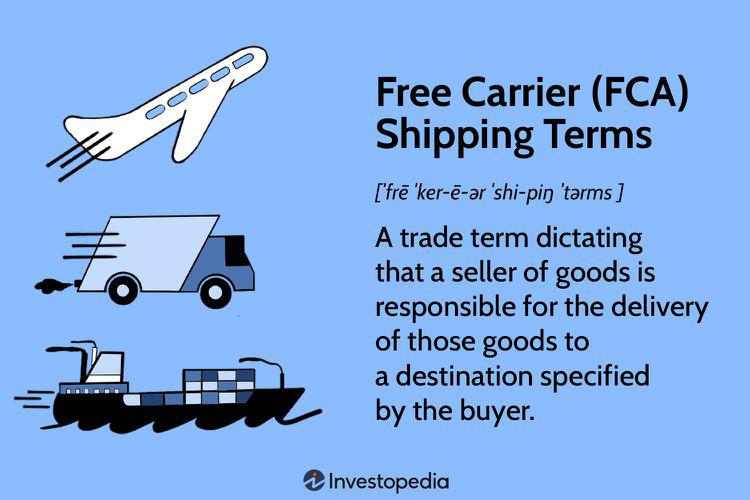

Understanding the intricacies of delivery logistics and the pivotal role of delivery dates is crucial in today's fast-paced trading environment. As global commerce becomes increasingly interconnected, the efficient coordination of shipping processes is essential to maintaining competitive advantage. Delivery logistics involves orchestrating the movement of goods from origin to destination, ensuring that delivery dates are precisely met. These dates form the cornerstone of contract fulfillment, particularly in trading sectors where timing is critical.

Shipping processes are undergoing tremendous transformations with the integration of technology. Innovations such as real-time tracking, automated scheduling, and advanced analytics are reshaping traditional logistics frameworks. These technologies enable companies to optimize routes, reduce costs, and improve the predictability of delivery times, thereby enhancing service quality. At the same time, algorithmic trading—a method that uses computer algorithms to execute trades at high speed based on set rules—presents a unique intersection with these logistical elements. The synergy between logistics and trading algorithms allows for real-time data analysis and decision-making, ultimately influencing trading strategies by aligning them more closely with logistical capabilities.



This article explores the confluence of delivery logistics with delivery dates and how they intersect with modern trading practices like algorithmic trading. By investigating these connections, the article aims to provide insights into how technological advancements are driving efficiency and strategic advantages in both fields. Key concepts will be examined, including the essence of delivery dates, their application in logistics, and their impact on trading strategies. Understanding these intersections is essential for leveraging technology to foster growth and innovation in today's dynamic market environment.

## Table of Contents

## Understanding Delivery Logistics and Delivery Dates

Delivery logistics involve the comprehensive process of planning, executing, and managing the movement of goods from one location to another. This intricate system is essential for ensuring that products reach their destinations efficiently and on time, regardless of the complexity of the supply chain. Central to this system is the concept of the delivery date, which designates the specific time by which goods must be delivered as per contractual agreements. 

Accurate delivery dates are integral to the fulfillment of contracts, especially in trading environments that handle futures and forward contracts. These financial instruments often require physical delivery of the underlying asset, making the delivery date a key aspect of trading operations. Such dates are not arbitrarily chosen but are instead meticulously planned to synchronize with both market demands and the logistical capabilities available at a given time.

The alignment of delivery dates with logistical capabilities ensures that the supply chain operates smoothly. This requires consideration of various factors, such as transportation modes, warehousing capacities, and routes. The planning process might involve predictive models to determine the most efficient methods and timings for delivery, taking into account any potential disruptions or delays in the logistics network.

The integration of technology has significantly enhanced the ability to manage delivery logistics. Through advanced software and data analytics, companies can optimize their logistics operations to ensure that delivery dates are met consistently. This technological evolution supports the strategic planning necessary to meet contract deadlines, thus playing a crucial role in maintaining the reliability and efficiency of the logistics process.

## The Shipping Process: A Seamless Integration with Trading

The shipping process, integral to trading, involves the precise transference of commodities or securities and hinges on efficient logistics to ensure timely delivery. Effective management of logistics encompasses several components: transportation, warehousing, and regulation compliance, all crucial for maintaining the integrity of the trading ecosystem.

Transportation management involves selecting the best modes and routes to deliver goods efficiently, minimizing transit times and costs. This often includes a combination of air, sea, and land freight tailored to the specific commodity's needs. Warehousing plays a critical role in ensuring the storage of goods under optimal conditions, maintaining quality until delivery. Compliance with regulations, including customs procedures and safety standards, is mandatory to prevent delays and financial penalties.

In trading, timely deliveries are paramount as delays can result in significant financial repercussions. Missed delivery dates might lead to penalties stipulated in contracts or the loss of market opportunities, especially in volatile markets where timing can affect prices and trading margins.

Modern logistics systems are increasingly driven by data, optimizing delivery schedules and resource allocation. Advanced algorithms analyze vast datasets to identify patterns and forecast demands, enhancing logistical efficiency. For example, predictive analytics can anticipate delays due to weather or traffic, allowing pre-emptive route adjustments. Similarly, [machine learning](/wiki/machine-learning) models are employed to refine warehousing processes, predicting inventory needs and reducing storage costs.

The formula for estimating optimal delivery schedules can utilize linear programming, solving for minimal cost given constraints like delivery deadlines and transport availability. A basic representation in Python could be as follows:

```python
import pulp

# Define the problem
problem = pulp.LpProblem('OptimalDeliverySchedule', pulp.LpMinimize)

# Define variables for decision making, e.g., number of trucks, air freights
x1 = pulp.LpVariable('trucks', lowBound=0, cat='Integer')
x2 = pulp.LpVariable('air_freights', lowBound=0, cat='Integer')

# Objective function: Minimize costs
problem += 30 * x1 + 100 * x2, 'TotalCost'

# Constraints: e.g., delivery time windows, availability
problem += x1 + x2 <= max_capacity
problem += delivery_time_constraint(x1, x2)

# Solve the problem
problem.solve()

print(f'Trucks used: {x1.varValue}')
print(f'Air freights used: {x2.varValue}')
```

This example demonstrates how computational approaches enhance logistics management, ensuring that the shipping process effectively integrates with trading systems, maximizing efficiency and mitigating risks associated with delays.

## Algorithmic Trading: Revolutionizing Trade Executions

Algorithmic trading, commonly referred to as algo trading, represents a significant evolution in financial markets, enabling unprecedented precision and speed in executing trade orders. These systems are characterized by their use of automated, high-speed trading platforms that execute transactions based on pre-set criteria. The algorithms used are complex mathematical models that analyze vast datasets to optimize trade decisions, aiming to increase profitability while minimizing risk.

Central to algo trading is the reliance on data analysis. Algorithms process large volumes of data in real-time, identifying patterns and executing trades at optimal times. This data-driven approach allows for fine-tuning trade timings, which is crucial for capturing market opportunities. The speed at which these trades are executed is another critical [factor](/wiki/factor-investing). With the ability to process trades within milliseconds, algo traders can capitalize on small price movements that manual traders might miss.

By minimizing human errors, these systems significantly enhance trading efficiency. Human decisions are prone to biases and can be impaired by fatigue, whereas algorithms consistently operate under predefined rules, ensuring disciplined trading actions. Additionally, the rapid processing capabilities help navigate market fluctuations more effectively, mitigating potential losses during volatile market conditions.

Moreover, the integration of [algorithmic trading](/wiki/algorithmic-trading) with delivery logistics provides further advantages. By leveraging predictive analytics and optimization algorithms, traders can make more informed decisions regarding contract executions and deliveries. For example, an algorithm can predict the optimal timing for executing a commodity futures contract based on historical delivery data, current market trends, and logistical constraints. This intersection allows traders to align their market strategies with logistical planning, ensuring physical delivery or settlement is both timely and cost-effective. 

Overall, algorithmic trading represents a transformative force in the trading landscape, combining speed, precision, and data-driven decision-making to revolutionize trade executions. Its synergy with logistics underscores the evolving complexity and interconnectivity of modern trading practices.

## The Intersection of Delivery Logistics and Algo Trading

Algorithmic trading holds the potential to significantly reshape delivery logistics through the application of predictive analytics and optimization algorithms. At its core, algorithmic trading utilizes computational techniques to execute orders based on pre-defined conditions. This computational power can be harnessed to refine logistics operations, particularly through the determination of optimal delivery times and routes, thereby reducing costs and enhancing service levels.

Predictive analytics relies on historical data and machine learning to forecast future events. In the context of delivery logistics, algorithms can analyze trends from past delivery data to predict future demands, optimize fleet routes, and schedule deliveries at times that minimize congestion and ensure punctuality. For instance, if a trader needs to ensure the timely arrival of goods to meet contractual obligations, algorithms can calculate the most efficient routing, taking into account variables such as traffic patterns, weather conditions, and vehicle performance metrics.

Optimization algorithms, such as linear programming or genetic algorithms, allow for the systematic evaluation of myriad scenarios to find the most efficient logistics strategies. For example, the traveling salesman problem (TSP), a classic optimization problem, can be addressed using these algorithms to determine the shortest possible route that visits a set of locations. In a logistics context, solving a TSP variant can significantly cut down transit times and fuel costs.

```python
from scipy.optimize import linprog

# Example of linear programming setup for cost minimization
# Define coefficients of the linear objective function vector
c = [-1, -2]  # Coefficients for the objective function

# Define the inequality constraint matrix
A = [[1, 1], [2, 1]]
b = [4, 5]  # Right-hand side of the inequality

# Define the bounds for each variable
x_bounds = (0, None)
y_bounds = (0, None)

# Solve linear programming problem
result = linprog(c, A_ub=A, b_ub=b, bounds=[x_bounds, y_bounds], method='highs')

print('Optimal value:', result.fun, '\nX:', result.x)
```

Machine learning algorithms, particularly those leveraging real-time data, can dynamically adjust logistics strategies. For instance, adaptive algorithms can modulate delivery routes instantaneously if they detect emerging traffic congestion or unexpected shipping delays, thus ensuring continued optimization of resources. Through continuous learning, these systems not only adjust to real-time conditions but also improve their future predictive accuracy.

By integrating algorithmic trading and machine learning into delivery logistics, traders can better manage the risks associated with physical delivery. Anomalies and disruptions become more manageable, as data-driven insights enable quicker adjustments to logistics plans and minimize the impact of unforeseen events. This confluence of algorithmic trading techniques and delivery logistics fosters a more agile and responsive supply chain, ultimately improving the reliability and efficiency of delivery operations.

## Challenges and Risks in Delivery and Algo Trading

Algorithmic trading and delivery logistics both face distinct challenges and risks that must be addressed to ensure seamless operations. In algorithmic trading, the dependency on technology is a primary concern. Automated trades rely on complex algorithms and vast computational power, making them vulnerable to technical failures or cyber attacks. Additionally, market [volatility](/wiki/volatility-trading-strategies) poses significant risks—rapid price movements can lead to unexpected losses if algorithms are not programmed to handle such fluctuations effectively. To mitigate these risks, robust risk management strategies are essential.

In logistics, the physical delivery of goods can be complicated by factors such as storage conditions, which need to be meticulously maintained to preserve the quality of perishable goods. Regulatory compliance also plays a significant role, with various national and international laws governing the transport of goods, making it crucial for logistics providers to stay informed and adaptable. Furthermore, transportation infrastructure, including roads, ports, and air freight facilities, forms the backbone of delivery logistics. Delays or failures within this infrastructure can lead to significant delivery bottlenecks.

Both algorithmic trading and logistics must be equipped with strong systems to manage unexpected changes. For trading, this might involve creating adaptive algorithms capable of responding dynamically to market changes using predictive analytics. In logistics, implementing contingency plans for potential disruptions, such as rerouting shipments during infrastructure delays, is vital.

For instance, a basic Python implementation to monitor algorithmic trading risks could involve setting up alerts for significant price changes:

```python
import yfinance as yf  # For more datasets, visit: https://paperswithbacktest.com/datasets
import numpy as np

def monitor_stock(symbol, threshold):
    stock = yf.Ticker(symbol)
    hist = stock.history(period="1d")['Close'].values
    changes = np.diff(hist) / hist[:-1]

    if np.any(np.abs(changes) > threshold):
        print(f"Alert: {symbol} has exceeded the threshold.")

monitor_stock("AAPL", 0.05)
```

This code checks daily stock price changes for a given symbol and raises an alert if the change exceeds a specified threshold, providing a simple mechanism to monitor volatility risk. Such proactive measures can help safeguard both trading and logistical operations from unforeseen disruptions.

## Future Trends in Trading and Logistics

Advanced technologies like Artificial Intelligence (AI) and blockchain are on the cusp of redefining the landscape of trading and logistics, bringing transformative changes that are expected to enhance efficiency, accuracy, and trust within these domains.

AI technology is capable of significantly improving predictive models, a crucial aspect for both algorithmic trading and logistics. In trading, AI facilitates analyzing vast datasets to identify existing patterns and emerging trends, optimizing trade execution timing and enhancing decision-making. For instance, algorithms utilizing machine learning can predict price movements by recognizing historical data patterns and performing real-time data analysis. This empowers traders to execute more precise trades, potentially leading to increased profitability and reduced risk.

In logistics, AI-driven systems can optimize supply chain operations by forecasting demand, managing inventory, and optimizing delivery routes. Predictive models powered by AI analyze traffic patterns, weather conditions, and other logistical variables to improve delivery accuracy and reduce delays. As an example, AI algorithms can identify optimal delivery windows, thus minimizing transportation costs and improving resource allocation.

Blockchain technology, on the other hand, is positioned to enhance transparency and efficiency in transactions. By creating immutable, decentralized records for each transaction, blockchain assures all participants of the integrity of the data, thereby fostering trust among parties. In the context of trading, blockchain can streamline processes by reducing the number of intermediaries, thereby decreasing transaction costs and settlement times. In logistics, the implementation of blockchain allows for enhanced tracking of goods, verifying the authenticity and condition of products throughout the supply chain. This is especially beneficial for industries like pharmaceuticals and food, where provenance and condition are critical.

Smart contracts, a component of blockchain technology, automate transaction execution when predefined conditions are met, further improving efficiency and reducing the likelihood of disputes. These contracts could standardize and simplify processes in both trading and logistics by executing transactions automatically, thus maximizing efficiency and minimizing human error.

Overall, the integration of AI and blockchain into trading and logistics is anticipated to yield substantial improvements, fostering environments where transactions are executed more swiftly, accurately, and with greater reliability. Businesses that leverage these technologies may find themselves better equipped to adapt to changing market demands and capitalize on new opportunities, positioning themselves strategically for future advancements.

## Conclusion

The convergence of delivery logistics and algorithmic trading is swiftly altering the landscape of modern trading, creating significant strategic advantages for market participants. By integrating these systems, traders benefit from enhanced efficiency in processing transactions and managing logistics, leading to cost-effectiveness and expanded access to diverse trading opportunities. Algorithmic trading's ability to leverage large data sets in real-time for optimal decision-making transforms the execution of trades, thus aligning with logistics' need for precise and timely deliveries.

Despite the evident advantages, the landscape is fraught with challenges requiring adept navigation. The technology-dependence inherent in algorithmic trading and the logistical hurdles in delivery logistics—such as regulatory compliance and transportation disruptions—demand robust and adaptive systems. Nonetheless, these challenges are overshadowed by the remarkable potential for innovation and growth within both sectors. The application of advanced technologies, including [artificial intelligence](/wiki/ai-artificial-intelligence) and blockchain, promises further enhancements in predictive capabilities, transactional transparency, and efficiency. 

By becoming conversant with these innovative technologies and understanding their seamless integration into logistics strategies, businesses can cultivate a competitive edge. This evolving interplay between logistics and algorithmic trading not only optimizes operational workflows but also positions businesses to harness future opportunities as these sectors continue to develop and integrate novel advancements. Emphasizing a proactive and informed approach to this integration will be essential for ensuring continued success and scalability in a dynamic trading environment.

## References & Further Reading

[1]: Bergstra, J., Bardenet, R., Bengio, Y., & Kégl, B. (2011). ["Algorithms for Hyper-Parameter Optimization."](https://dl.acm.org/doi/10.5555/2986459.2986743) Advances in Neural Information Processing Systems 24.

[2]: ["Advances in Financial Machine Learning"](https://www.amazon.com/Advances-Financial-Machine-Learning-Marcos/dp/1119482089) by Marcos Lopez de Prado

[3]: ["Evidence-Based Technical Analysis: Applying the Scientific Method and Statistical Inference to Trading Signals"](https://www.amazon.com/Evidence-Based-Technical-Analysis-Scientific-Statistical/dp/0470008741) by David Aronson

[4]: ["Machine Learning for Algorithmic Trading"](https://github.com/stefan-jansen/machine-learning-for-trading) by Stefan Jansen

[5]: ["Quantitative Trading: How to Build Your Own Algorithmic Trading Business"](https://www.amazon.com/Quantitative-Trading-Build-Algorithmic-Business/dp/1119800064) by Ernest P. Chan