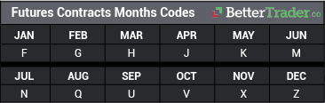

## Table of Contents

## What is a futures contract?

A futures contract is a legal agreement to buy or sell something at a specific price on a specific date in the future. This "something" can be a physical item, like wheat or oil, or it can be a financial product, like a stock index. People use futures contracts to manage risk or to try to make money by guessing how prices will change.

Farmers, for example, might use futures contracts to lock in a price for their crops before they harvest them. This way, they know how much money they will get, even if prices go down later. On the other hand, a company that needs oil might use a futures contract to lock in a price now, protecting themselves if oil prices go up in the future. Traders also buy and sell futures contracts, hoping to profit from price changes without ever actually taking delivery of the physical item.

## What does 'delivery month' mean in the context of futures contracts?

In futures contracts, the 'delivery month' is the month when the thing you're buying or selling, like wheat or oil, is supposed to be handed over. It's an important part of the contract because it tells everyone when the deal needs to be finished.

For example, if you have a futures contract for corn with a delivery month of July, you expect to get the corn in July. This helps people plan their buying and selling better. They know exactly when they will get their goods or need to give them away.

## How does the delivery month affect the pricing of futures contracts?

The delivery month can change how much a futures contract costs. This is because the price of what you're buying or selling, like oil or corn, can be different at different times of the year. If people think the price will be higher in the future, the futures contract for a later delivery month might cost more. On the other hand, if they think the price will go down, the contract might be cheaper.

Also, the delivery month can affect the price because of things like storage costs or seasonal demand. For example, if you're buying heating oil, the price might be higher for a contract with a delivery month in winter because more people need it then. Or, if it costs a lot to store something until the delivery month, that can make the futures contract more expensive too.

## What are the most common delivery months for different types of futures contracts?

Different types of futures contracts have different common delivery months, depending on what they are for. For example, agricultural futures like corn, wheat, and soybeans often have delivery months that match the times when farmers harvest their crops. So, you might see common delivery months like March, May, July, September, and December for these kinds of futures.

For energy futures like [crude oil](/wiki/crude-oil) and natural gas, the delivery months are usually every month of the year. This is because people need energy all the time, not just at certain times like with crops. So, you can find futures contracts for crude oil or natural gas with delivery months like January, February, March, and so on, all the way through December.

Financial futures, like those for stock indexes or interest rates, also tend to have delivery months every month of the year. This is because financial markets are always active, and people want to be able to trade these contracts whenever they need to. So, common delivery months for financial futures include all twelve months of the year.

## How do traders use the delivery month to manage their trading strategies?

Traders use the delivery month to plan their buying and selling. They look at when the thing they are trading, like corn or oil, will be delivered. This helps them decide when to buy or sell the futures contract. If they think the price will go up before the delivery month, they might buy the contract now and sell it later for a profit. If they think the price will go down, they might sell the contract now and buy it back later at a lower price.

Traders also use the delivery month to spread out their risk. They might buy contracts with different delivery months to balance out the ups and downs in prices. For example, if they are worried about prices going up in the summer, they might buy a contract with a summer delivery month and another with a winter delivery month. This way, if prices go up in the summer, they can make money on the summer contract, but if prices go down, they can still make money on the winter contract.

## What is a coding system in relation to futures contracts?

A coding system in futures contracts is a way to quickly and easily tell different contracts apart. Each futures contract gets a special code that shows what it is for, like corn or oil, and when it will be delivered. This code is usually a mix of letters and numbers that helps traders, brokers, and computer systems understand and handle the contracts without getting confused.

For example, a code might start with letters that show what the contract is for, like "CL" for crude oil. Then, it might have numbers to show the delivery month and year, like "2406" for June 2024. So, a full code like "CL2406" would mean a futures contract for crude oil that will be delivered in June 2024. This system makes it easier for everyone to keep track of lots of different futures contracts and trade them quickly and correctly.

## How are futures contracts coded to indicate the delivery month?

Futures contracts use a special code to show the delivery month. This code is usually just one letter that stands for the month. For example, "F" means January, "G" means February, and "H" means March. This way, traders can quickly see when the contract will be delivered just by looking at the code.

The letter code for the delivery month is part of a bigger code for the whole futures contract. For example, if you see "CLH24", the "H" in the middle tells you the delivery month is March, and "24" means the year is 2024. So, "CLH24" is a futures contract for crude oil that will be delivered in March 2024. This system helps everyone keep track of different contracts easily.

## Can you explain the standardized coding system used by major futures exchanges?

Major futures exchanges use a standardized coding system to make it easy for everyone to understand and trade futures contracts. Each contract has a unique code made up of letters and numbers. The code starts with letters that show what the contract is for, like "CL" for crude oil or "GC" for gold. Then, there's a letter that stands for the delivery month, like "F" for January or "G" for February. Finally, there are numbers that show the year of delivery, like "24" for 2024. So, a code like "CLF24" means a futures contract for crude oil that will be delivered in January 2024.

This coding system helps traders, brokers, and computer systems quickly identify and manage different futures contracts. By using the same codes across different exchanges, it reduces confusion and makes trading smoother. For example, if a trader sees "CLG24", they know right away it's a crude oil futures contract with a delivery month of February 2024. This clear and simple system is important for the fast-paced world of futures trading, where quick and accurate communication is key.

## What are the implications of choosing the wrong delivery month in a futures contract?

Choosing the wrong delivery month in a futures contract can cause problems. If you pick a delivery month that is too soon, you might have to take the goods before you are ready. This can mean you need to find a place to store them or sell them quickly, which might cost more money or make you lose money if the price goes down. On the other hand, if you pick a delivery month that is too far away, you might miss out on making money now if the price goes up before the delivery month.

Also, the wrong delivery month can mess up your trading plan. If you are trying to manage risk or make a profit by guessing how prices will change, getting the delivery month wrong can throw off your whole strategy. For example, if you think the price will go up in the summer but you pick a winter delivery month, you might not make the money you were hoping for. So, it's really important to think carefully about the delivery month when you are trading futures contracts.

## How do automated trading systems handle different delivery months?

Automated trading systems use computer programs to buy and sell futures contracts. These systems can handle different delivery months by following rules set by the people who made the program. For example, the system might be told to buy contracts for the next three delivery months to spread out the risk. This way, the computer knows which months to focus on and can trade those contracts without needing someone to tell it what to do every time.

These systems also look at data and patterns to decide which delivery months might be the best to trade. They can use past price information to guess how prices might change in the future for different delivery months. If the system sees that prices usually go up in the summer for a certain kind of contract, it might choose to buy contracts with a summer delivery month. This helps the system make smart trades without human help, making sure it picks the right delivery months to match the trading plan.

## What advanced strategies can traders employ involving multiple delivery months?

Traders can use a strategy called "calendar spreading" to take advantage of price differences between futures contracts with different delivery months. For example, if a trader thinks the price of wheat will go up more in the summer than in the winter, they might buy a wheat futures contract with a summer delivery month and sell one with a winter delivery month. If the price difference between these two months gets bigger, the trader can make money. This strategy helps traders make money from how prices change over time, not just from the price going up or down.

Another strategy traders use is "rolling over" contracts. This means they might start with a futures contract that has a delivery month that is coming up soon. As that month gets closer, they sell that contract and buy a new one with a later delivery month. This way, they can keep their position in the market without having to take delivery of the goods. Rolling over helps traders stay in the market longer and manage their risk better by always having a contract that is far enough away from the delivery date.

## How do regulatory changes impact the coding and delivery months of futures contracts?

Regulatory changes can affect how futures contracts are coded and what delivery months are available. If the rules change, exchanges might have to use different codes to show the new rules. For example, if a new rule says that contracts for a certain product can only be traded in certain months, the exchange might have to change the coding system to show these new months. This helps traders and computer systems understand the new rules quickly and trade the right contracts.

Also, changes in regulations can make exchanges add or remove delivery months. If a new law says that some products can only be delivered at certain times of the year, the exchange might have to stop offering contracts for other months. This can make traders change their plans and use different strategies. They might need to look at new delivery months and figure out how to trade them to still make money or manage their risk.

## References & Further Reading

[1]: Hull, J. (2018). ["Options, Futures, and Other Derivatives"](https://www.amazon.com/Options-Futures-Other-Derivatives-10th/dp/013447208X). Pearson.

[2]: Narang, R. K. (2009). ["Inside the Black Box: A Simple Guide to Quantitative and High-Frequency Trading"](https://onlinelibrary.wiley.com/doi/book/10.1002/9781118267738). Wiley.

[3]: Chincarini, L. B., & Kim, D. (2006). ["Quantitative Equity Portfolio Management: An Active Approach to Portfolio Construction and Management"](https://archive.org/details/quantitativeequi0000chin_c9d6). McGraw-Hill.

[4]: Aldridge, I. (2013). ["High-Frequency Trading: A Practical Guide to Algorithmic Strategies and Trading Systems"](https://www.amazon.com/High-Frequency-Trading-Practical-Algorithmic-Strategies/dp/1118343506). Wiley.

[5]: Chan, E. (2009). ["Quantitative Trading: How to Build Your Own Algorithmic Trading Business"](https://github.com/ftvision/quant_trading_echan_book). Wiley.

[6]: Lopez de Prado, M. (2018). ["Advances in Financial Machine Learning"](https://www.amazon.com/Advances-Financial-Machine-Learning-Marcos/dp/1119482089). Wiley.