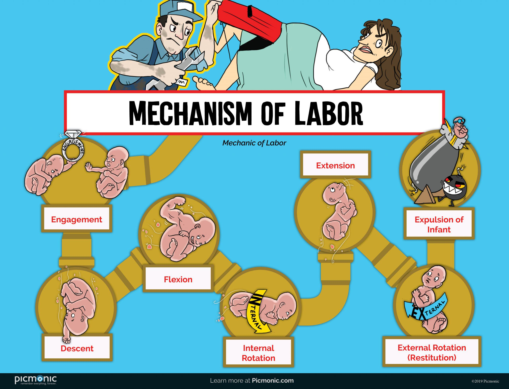

Algorithmic trading, commonly referred to as algo trading, represents a technological advancement in the execution of financial trades. It uses computer programs and algorithms to enter trading orders at high speed and with an accuracy that human traders cannot achieve alone. The foundation of algorithmic trading lies in its ability to make split-second decisions based on pre-set criteria, evaluating statistical and mathematical models to maximize trading efficiencies and profitability.

Financial deliveries, on the other hand, concern the fulfillment of a trading contract, which involves the transfer of an underlying asset or cash settlement upon the contract's expiration. In this context, a thorough understanding of how deliveries are managed and executed in conjunction with algorithmic trading strategies becomes a critical aspect for participants in financial markets.



This interplay between algorithmic trading and delivery is pivotal for two main reasons. Firstly, it determines how swiftly and accurately trades can be executed, directly impacting the financial markets' liquidity and overall efficiency. Secondly, the mechanisms that manage the delivery process can safeguard traders from potential financial risks or losses linked to delivery delays or errors. By examining these aspects, traders can improve their strategies, align with regulatory standards, and optimize their market operations.

This article aims to provide clarity on how delivery processes work within the framework of algorithmic trading. It will provide insights into the technologies and methodologies that facilitate these activities, creating a comprehensive understanding of the roles and interactions essential for modern trading environments. Through examples and analysis of different methodologies, readers will gain a deeper appreciation of the complex yet vital nature of deliveries in the context of algorithmic trading.

## Table of Contents

## Understanding Delivery in Trading

Delivery in trading involves the transfer of an underlying asset, such as commodities or securities, at the conclusion of a contract. This process is particularly important in the context of derivative markets, such as futures and options, where the structure of delivery can significantly influence strategic trading decisions.

In derivative markets, delivery can take two forms: physical delivery and cash-settlement. Physical delivery involves the actual transfer of the commodity or asset from the seller to the buyer. For instance, if a trader has entered into a futures contract for crude oil intending physical delivery, at the contract's expiration, the seller must deliver a specified amount of crude oil to the buyer. This method ensures tangible exchange but requires logistical arrangements like transportation, storage, and insurance, which might increase transaction costs and complexity.

On the other hand, cash settlement simplifies the delivery process by resolving the contract in terms of cash rather than a physical transfer. In this case, the difference between the contract price and the market price at expiration determines the cash settled. For example, if a trader purchases a futures contract at $70 per barrel and the price at expiration is $75, the seller pays the difference in cash, which is $5 per barrel, without exchanging the physical commodity. This method is preferred by most traders due to its ease of execution and avoidance of the logistical challenges associated with physical delivery.

Despite the preference for cash settlements, understanding the delivery process remains essential for robust trading strategies. Traders must evaluate market conditions, asset types, and trading goals to select the most effective delivery method. For commodities with volatile prices, holding physical delivery may hedge against significant price shifts, providing a strategic advantage. Therefore, comprehending both delivery forms allows traders to tailor their approaches, manage risks, and potentially enhance profitability.

## How Delivery Works in Algo Trading

In [algorithmic trading](/wiki/algorithmic-trading), the process of delivery is seamlessly integrated into the execution of trades through advanced computational algorithms. At its core, algorithmic trading involves computers making trading decisions and executing them based on pre-defined rules and strategies without human intervention. These algorithms are designed to identify optimal trade conditions and automatically execute trades with precision and speed.

One critical aspect of algo trading related to delivery is the algorithm's ability to choose between physical delivery and cash settlement. This decision depends on several market indicators and predefined conditions set within the algorithm. For instance, market signals such as price trends, [liquidity](/wiki/liquidity-risk-premium), and [volatility](/wiki/volatility-trading-strategies) can influence whether an asset is physically delivered or whether a financial equivalent (cash) is exchanged. The decision-making process might involve evaluating factors like storage costs, transportation logistics for commodities, or the financial implications of settling in cash versus taking possession of the asset.

To achieve such decision-making capabilities, algorithms are often equipped with complex mathematical models and statistical tools. They continuously analyze market data, including prices, [volume](/wiki/volume-trading-strategy), and news, to forecast future movements. For example, an algorithm might use time-series analysis or [machine learning](/wiki/machine-learning) techniques to predict price changes, thereby optimizing the delivery decision to maximize profitability or minimize risk.

The hallmark of algorithmic trading is its speed and precision. These characteristics are particularly beneficial in managing complex delivery operations, where timing is crucial. The rapid processing of information allows algorithms to execute trades and manage deliveries in milliseconds, outpacing human capabilities. This speed is crucial in volatile markets where conditions change rapidly, and execution timing can significantly impact the outcome of trades.

Furthermore, algorithmic systems are designed to handle vast amounts of data and execute high-frequency trades, which can be extremely advantageous in markets where delivery terms are subject to sudden changes due to economic or geopolitical events. The automation of the delivery decision process minimizes human errors, ensuring that trades are executed exactly as specified in the algorithm's strategy.

In conclusion, the integration of delivery mechanics within algorithmic trading systems empowers traders to handle the end-to-end trading process more efficiently. By leveraging sophisticated algorithms capable of rapid decision-making and precise execution, market participants can achieve optimal delivery outcomes aligned with their strategic objectives.

## Example of Delivery Process in Algo Trading

Consider an algorithm designed to trade in [crude oil](/wiki/crude-oil) futures, a common strategy in algorithmic trading. This algorithm automates the purchase of futures contracts and is programmed to decide whether to settle these contracts through cash or physical delivery. The decision is based on two main factors: market price movements and inventory costs. 

For instance, let's say the algorithm is set to monitor the spot price of crude oil and compare it with the future price to identify [arbitrage](/wiki/arbitrage) opportunities. If the spot price (P_spot) is significantly lower than the future price (P_future), defined by the condition $P\_spot + C \lt P\_future$, where $C$ is the cost of [carry](/wiki/carry-trading), the algorithm might consider physical delivery. This approach could be profitable if the logistics and storage facilities can manage additional inventory efficiently.

On the other hand, if inventory costs are high, the algorithm might choose cash settlement. For example, when the total cost of storage (S_cost) is high, leading to an increase in the effective spot price, i.e., $P\_spot + S\_cost \geq P\_future$, the algorithm would opt for cash settlement. This would prevent incurring losses due to the additional storage costs, maintaining profitability despite fluctuating market conditions.

This strategic decision-making process showcases how algorithmic trading can optimize operations by adapting to market signals and logistical constraints. The underlying algorithms are typically coded in Python due to its extensive libraries and ease of use for financial computations. Here's a simplified Python snippet illustrating this decision-making algorithm:

```python
def decide_delivery(P_spot, P_future, C, S_cost):
    if P_spot + C < P_future and S_cost < some_threshold:
        return "Physical Delivery"
    elif P_spot + S_cost >= P_future:
        return "Cash Settlement"
    else:
        return "Reevaluate Conditions"

P_spot = 50
P_future = 55
C = 3
S_cost = 6

decision = decide_delivery(P_spot, P_future, C, S_cost)
print(f"The algorithm chose: {decision}")
```

This example demonstrates how algorithms in trading efficiently handle the complexities of delivery decisions by evaluating various market and cost factors. This efficiency minimizes human error and optimizes transaction outcomes in a rapidly changing market environment.

## Benefits and Challenges of Delivery in Algo Trading

Algorithmic trading offers distinct advantages in delivering financial instruments, primarily through the reduction of human error and the acceleration of trade execution. By leveraging algorithms, trading can occur at a speed and accuracy that is unattainable by manual processes. Algorithms execute trades by systematically adhering to pre-defined criteria, thereby eliminating emotional and psychological biases that often lead to trading errors. The precision in trade execution, enabled by algorithms, is crucial for managing large volumes in volatile markets, ensuring that delivery mechanisms are executed seamlessly. 

One of the primary benefits of algorithmic trading in the delivery of financial instruments is the speed at which trades can be executed. Algorithms can place orders within milliseconds, taking advantage of even the smallest market fluctuations. This rapid execution is particularly advantageous in high-frequency trading, where the ability to quickly respond to market changes can significantly impact profitability.

However, algorithmic trading also presents notable challenges, particularly in the sophisticated programming required to develop these algorithms. Creating robust algorithms necessitates a deep understanding of quantitative finance, market dynamics, and programming languages like Python or C++. A basic example of an algorithm might involve calculating moving averages:

```python
def moving_average(prices, window_size):
    return [sum(prices[i:i+window_size]) / window_size for i in range(len(prices) - window_size + 1)]
```

Despite the efficiency, technical failure risks are inherent, ranging from software errors to hardware malfunctions, which can lead to significant financial losses if not promptly addressed. Algorithms require thorough testing and constant monitoring to ensure they function as intended under various market conditions. 

Furthermore, algorithmic trading must strictly adhere to regulatory requirements. Market regulations mandate transparency and fairness, and algorithms must be designed to comply with these legal standards to avoid penalties and sanctions. Understanding the regulatory landscape ensures that the use of algorithms does not inadvertently breach market rules, thereby protecting traders from legal repercussions.

In conclusion, while algorithmic trading significantly enhances the efficiency of delivery in financial transactions, it is imperative for traders to balance the benefits of speed and accuracy with the challenges of sophisticated programming and regulatory compliance. Proper implementation and monitoring mean that algorithms can effectively and reliably handle complex delivery processes in modern trading environments.

## Conclusion

Efficient delivery mechanisms are crucial in algorithmic trading, as they significantly affect both the efficiency and profitability of trades. Algorithmic trading systems, which rely on complex algorithms to make split-second trading decisions, must be adept at managing delivery processes to ensure that trades achieve their desired outcomes. Understanding these delivery processes is essential for traders aiming to fully capitalize on the potential of algorithmic strategies.

Algorithmic traders must possess a deep understanding of the nuances involved in the delivery of trades. Delivery in this context refers to the settlement of trades and can include options for cash settlement or physical delivery of an underlying asset. The choice between these options can have significant impacts on trading outcomes and must be made strategically. By understanding the intricacies of both physical and cash settlement deliveries, traders can optimize their strategies to align with market conditions and trading goals.

As technology continues to advance, algorithmic trading's role in managing deliveries is likely to expand and evolve. Innovations in computing power, data analysis, and machine learning could further enhance the capabilities of these trading systems. For instance, improvements in machine learning algorithms can lead to more accurate predictions of market movements, which in turn can inform better delivery decisions. Furthermore, the increasing popularity and development of blockchain technology may introduce new methods for secure and transparent trade settlements.

The ongoing evolution of algorithmic trading technology will require traders to stay informed and adapt their strategies. By doing so, they can better exploit new opportunities that arise in the market and maintain a competitive edge in an ever-changing financial landscape. In conclusion, efficient delivery mechanisms in algorithmic trading not only bolster trade execution but also play a pivotal role in maximizing the profitability and success of trading strategies.

## References & Further Reading

[1]: Bergstra, J., Bardenet, R., Bengio, Y., & Kégl, B. (2011). ["Algorithms for Hyper-Parameter Optimization."](https://dl.acm.org/doi/10.5555/2986459.2986743) Advances in Neural Information Processing Systems 24.

[2]: ["Advances in Financial Machine Learning"](https://www.amazon.com/Advances-Financial-Machine-Learning-Marcos/dp/1119482089) by Marcos Lopez de Prado

[3]: ["Evidence-Based Technical Analysis: Applying the Scientific Method and Statistical Inference to Trading Signals"](https://www.amazon.com/Evidence-Based-Technical-Analysis-Scientific-Statistical/dp/0470008741) by David Aronson

[4]: ["Machine Learning for Algorithmic Trading"](https://github.com/stefan-jansen/machine-learning-for-trading) by Stefan Jansen

[5]: ["Quantitative Trading: How to Build Your Own Algorithmic Trading Business"](https://www.amazon.com/Quantitative-Trading-Build-Algorithmic-Business/dp/1119800064) by Ernest P. Chan