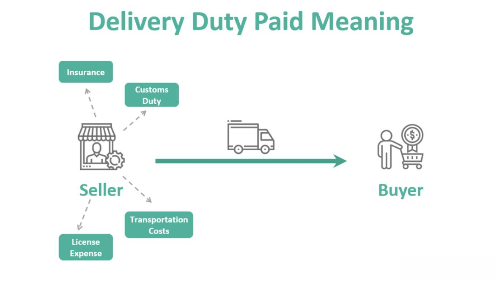

In the fast-paced world of trading, delivery costs, delivery prices, pricing mechanisms, and algorithmic trading play pivotal roles in shaping the financial markets. These elements are intricately linked and significantly impact both traders and financial institutions. Understanding these concepts is essential to navigating the complexities of modern trading environments.

Delivery prices, particularly in the context of futures contracts, are predetermined prices at which commodities or assets are delivered. They are crucial for ensuring that both buyer and seller have a clear understanding of the transaction terms. The formulation of delivery prices requires a careful consideration of various factors, including supply and demand dynamics, market volatility, and the specific terms outlined in the contract. Accurate delivery pricing is fundamental for traders seeking to maximize their potential profits while minimizing risks.



Algorithmic trading, on the other hand, leverages sophisticated algorithms to execute trades at speeds and efficiencies unattainable by human traders alone. These automated systems utilize predefined criteria to facilitate rapid execution and effective price discovery, contributing to market liquidity and reducing transaction costs. Algorithmic trading's capacity to analyze vast datasets in real-time enhances its ability to navigate fluctuating markets adeptly.

Together, these elements contribute to a trading environment that is increasingly reliant on technology and data-driven strategies. Traders and financial institutions must continuously evolve their practices to remain competitive, making an understanding of delivery costs, delivery prices, pricing mechanisms, and algorithmic trading indispensable in the financial markets today.

## Table of Contents

## Understanding Delivery Costs and Delivery Price

Delivery costs are the expenses incurred in the process of delivering a commodity according to the terms outlined in a futures contract. These costs include transportation, storage, and handling fees associated with transferring the commodity from seller to buyer. They are crucial for determining the total cost of fulfilling a futures contract and directly affect a trader’s bottom line. Delivery costs can vary significantly based on factors such as the nature of the commodity, distance between delivery points, and prevailing logistics prices.

In futures and forward contracts, the delivery price is a predetermined amount at which the underlying commodity or asset is delivered. This price is a critical element of these contracts because it defines the financial obligations of the buyer and the seller. It is agreed upon when the contract is executed and remains fixed until the delivery date, providing both parties with certainty regarding the transaction’s financial terms.

The interactions between delivery costs and delivery prices have significant implications for traders. High delivery costs can diminish the potential profit margin from trading futures contracts. For instance, if a futures contract involves a commodity with expensive storage or transportation requirements, these costs must be carefully evaluated against the delivery price to assess profitability. As a result, understanding delivery costs is essential for effective contract negotiation and strategic planning in futures trading.

Furthermore, savvy traders often incorporate delivery costs into their decision-making processes, seeking to optimize their transaction outcomes. For example, utilizing efficient logistics solutions or negotiating favorable terms with logistics providers can mitigate delivery expenses, thereby enhancing profitability. A thorough comprehension of both delivery costs and delivery prices enables traders to make informed decisions and optimize their trading strategies in the competitive financial markets.

## Pricing Mechanism in Trading

Pricing mechanisms in trading are critical in determining and adjusting the prices of financial assets. These mechanisms are governed by various factors, including supply and demand, market sentiment, and external economic indicators. A thorough understanding of these concepts enables traders to predict market movements and make informed decisions.

One primary pricing mechanism used in trading is auction-based pricing. This method relies on participants placing bids and offers within a designated time frame, leading to the discovery of a market-clearing price. Auction-based pricing is commonly employed in stock exchanges and commodities markets. It ensures transparency and fairness, as the final price reflects the collective interaction of buyers and sellers.

Continuous pricing is another prominent mechanism, where prices are updated regularly based on real-time transactions. This method is prevalent in liquid markets like [forex](/wiki/forex-system) and equities, where trades occur continuously. Continuous pricing allows for immediate reflection of market changes, providing traders with up-to-date information for decision-making.

Both auction-based and continuous pricing are deeply influenced by supply and demand dynamics. When supply outpaces demand, prices typically fall, and conversely, prices rise when demand exceeds supply. Market sentiment, which reflects the collective mood or outlook of traders and investors, also impacts pricing. Positive sentiment can drive prices up, while negative sentiment can exert downward pressure.

External economic indicators such as interest rates, inflation, and geopolitical events further influence pricing mechanisms. For instance, a rise in interest rates might strengthen a currency due to higher returns on investments in that currency, affecting its price in the forex market.

Mathematically, pricing can be modeled using various algorithms and formulas. For example, the Black-Scholes model, widely used for option pricing, calculates the theoretical price of options based on factors like the underlying asset price, time to expiration, [volatility](/wiki/volatility-trading-strategies), and risk-free [interest rate](/wiki/interest-rate-trading-strategies).

In Python, traders and analysts often use libraries like NumPy and pandas to process and analyze pricing data. Here’s a simple code snippet that demonstrates how to calculate a moving average, a tool used to smooth out price data and identify trends:

```python
import pandas as pd

# Sample data: daily closing prices of an asset
prices = pd.Series([150, 152, 154, 155, 153, 151, 149, 152, 154, 156, 158, 160])

# Calculate the moving average with a window of 3 days
moving_average = prices.rolling(window=3).mean()

print(moving_average)
```

In conclusion, a thorough grasp of pricing mechanisms enables traders to navigate market complexities effectively. By considering the interplay of supply and demand, market sentiment, and external factors, and by leveraging tools such as algorithms and statistical models, traders can anticipate price movements and optimize their strategies accordingly.

## Algorithmic Trading and Its Benefits

Algorithmic trading, often referred to as algo-trading, involves the use of pre-programmed trading instructions to execute trades at optimal speeds and prices. The integration of advanced algorithms allows for rapid processing of market data and the automatic placement of orders, eliminating emotional and human errors. This technological advancement invites several benefits, especially pertinent to financial markets characterized by high volumes and rapid price changes.

One of the primary advantages of [algorithmic trading](/wiki/algorithmic-trading) is the significant reduction in transaction costs. This is largely attributed to the ability to capitalize on market inefficiencies and execute trades at optimal prices, which manual trading might overlook due to timing or [volume](/wiki/volume-trading-strategy) constraints. Additionally, algorithmic trading enhances trade execution accuracy. Precise adherence to the trading criteria reduces the risks associated with human error and slippage, ensuring that trades are executed as intended based on predefined logic.

Another major benefit of algorithmic trading is its capacity to handle substantial trade volumes with minimal market impact. Large institutional investors, such as hedge funds and mutual funds, often require the execution of vast numbers of shares. Manual execution of such trades could notably influence market prices. However, algorithms can break down these large orders into smaller, strategically timed trades, thereby minimizing market disturbance.

An exemplary application of algorithmic trading is observed in foreign exchange markets through systems like the Interbank Price Delivery Algorithm. This sophisticated system is instrumental in optimizing price discovery, allowing traders access to the best prices from various [liquidity](/wiki/liquidity-risk-premium) providers. By aggregating quotes from multiple financial institutions, the algorithm ensures that the currency prices are competitive and reflect real-time market conditions, enhancing the overall efficiency of forex trading. Such algorithms enable traders to set precise entry and [exit](/wiki/exit-strategy) points, optimizing their trading strategies and improving profitability.

In conclusion, algorithmic trading serves as a cornerstone for modern financial markets, providing speed, accuracy, and efficiency that manual trading struggles to achieve. Its benefits extend beyond cost reduction and enhanced execution, offering robust solutions for large-scale trading operations, as highlighted by tools like the Interbank Price Delivery Algorithm. As trading technology continues to advance, the role of algorithms in the financial industry is set to expand further.

## The Role of Interbank Price Delivery Algorithm

The Interbank Price Delivery Algorithm plays a crucial role in orchestrating the delivery and determination of currency prices within the interbank market. By aggregating price quotes from a variety of financial institutions, the algorithm provides a comprehensive reflection of real-time market conditions. This aggregation of data ensures that the pricing is competitive and precise, thereby enhancing market efficiency.

The core functionality of the Interbank Price Delivery Algorithm involves collecting bid and ask quotes, which are continuously updated by participating banks and financial institutions. These quotes provide a dynamic picture of currency price levels, helping to ensure that traders receive an accurate and up-to-date reflection of the market. The algorithm applies sophisticated statistical models to filter out anomalies and ensure data integrity, which is pivotal for reliable trading operations.

Using this real-time pricing information, traders can set optimal entry and exit points in their trading strategies. By leveraging the continuous stream of price data, traders can adjust their positions with great precision. This capability is particularly important in the forex market, where currency values can fluctuate significantly within short timeframes. The mathematical foundation often employed involves techniques from time series analysis and may include models such as the autoregressive moving average (ARMA) for volatility predictions. 

The Interbank Price Delivery Algorithm offers significant advantages for traders seeking to design algorithmic strategies. For instance, by providing immediate access to aggregated pricing, the algorithm helps traders analyze market movements effectively and enhances their ability to execute trades with minimal latency. This is especially beneficial during high-frequency trading activities where milliseconds can influence trade outcomes.

In conclusion, the Interbank Price Delivery Algorithm is an indispensable tool in the foreign exchange market, facilitating competitive pricing and accurate transaction execution. By exploiting the algorithm's capabilities, traders can enhance their market strategies and achieve better performance in a highly dynamic trading environment.

## Challenges and Limitations

Implementing algorithmic trading strategies entails several challenges and limitations, predominantly stemming from technological, market, and regulatory factors. The foremost obstacle is the technological barrier, which necessitates sophisticated infrastructure capable of high-speed data processing and transaction execution. Algorithmic trading relies heavily on low latency environments, where microsecond-level delays can significantly impact performance and profitability. Building and maintaining such infrastructure demands considerable investment in both hardware and software, including powerful servers, cutting-edge network solutions, and reliable data feeds.

Market conditions, notably volatility, present another significant challenge. High volatility can disrupt normal trading patterns, leading to erratic price fluctuations that may affect the precision of delivery prices. Algorithmic trading systems, which depend on historical data and statistical models to forecast market movements, can struggle in these unpredictable conditions. Algorithms must be robust enough to handle sudden price swings while minimizing slippage and potential losses. For example, consider an algorithm attempting to execute a trade during a market spike. The algorithm might be coded in Python as follows:

```python
# Example of a simple trading algorithm reacting to market volatility
def execute_trade(price, moving_avg, threshold):
    if abs(price - moving_avg) > threshold:
        print("Market volatility detected - evaluating trade execution.")
        # Implement execution logic here
```

Regulatory considerations also introduce compliance challenges that can markedly impact algorithmic trading operations. Financial markets across the globe are governed by an intricate web of regulations designed to ensure market stability and protect investors. These regulations often require algorithmic trading firms to implement comprehensive risk management systems and to maintain thorough records of their trading activities for audit purposes. Compliance involves ongoing adjustments to algorithms to adhere to evolving regulations, which may vary significantly across jurisdictions. Failure to comply can result in severe penalties, including fines and suspension of trading privileges.

In summary, while algorithmic trading offers numerous advantages, such as enhanced speed and efficiency, it is crucial to address and mitigate these challenges and limitations through advanced technology, robust algorithmic design, and diligent regulatory compliance. This enables traders to harness the full potential of algorithmic trading while minimizing associated risks.

## Conclusion

Delivery costs, delivery prices, pricing mechanisms, and algorithmic trading are integral components in navigating today's trading environment. For traders, understanding these elements is crucial to optimize strategies and enhance market performance. Delivery costs and prices influence profit margins and require careful management within futures contracts. Accurate delivery pricing is essential for fulfilling contract obligations and realizing profits.

Pricing mechanisms in trading, such as auction-based and continuous pricing, help in interpreting market dynamics by considering supply-demand forces, sentiment, and external economic indicators. Predicting market trends relies on comprehending these mechanisms, enabling traders to make informed decisions.

Algorithmic trading stands as a cornerstone of modern trading strategies. It allows for the automation of trades based on pre-established criteria, drastically improving execution speed and reducing costs. The benefits extend to precise trade execution and handling large volumes efficiently, which minimizes market impact.

The Interbank Price Delivery Algorithm exemplifies the cutting-edge technology reshaping financial markets. By aggregating price quotes from various financial institutions, it ensures competitive and real-time currency pricing, empowering traders to identify optimal market entry and exit points.

As technological advancements continue and markets evolve, the importance of technologies like the Interbank Price Delivery Algorithm will only increase. Traders who leverage these tools gain a competitive edge, essential for thriving in today's rapidly changing financial markets.

## References & Further Reading

[1]: Gomber, P., Arndt, B., Lutat, M., & Uhle, T. (2011). ["High-Frequency Trading."](https://papers.ssrn.com/sol3/papers.cfm?abstract_id=1858626) CIGI.

[2]: Hasbrouck, J., & Saar, G. (2013). ["Low-latency trading."](https://www.sciencedirect.com/science/article/abs/pii/S1386418113000165) The Review of Financial Studies, 26(9), 2532-2572.

[3]: Aldridge, I. (2013). ["High-Frequency Trading: A Practical Guide to Algorithmic Strategies and Trading Systems."](https://onlinelibrary.wiley.com/doi/pdf/10.1002/9781119203803.fmatter) Wiley.

[4]: Hull, J. C. (2012). ["Options, Futures, and Other Derivatives."](https://www.semanticscholar.org/paper/Options%2C-Futures%2C-and-Other-Derivatives-Hull/89bdee500c8623864fc9eb7a471546aa713acc44) Pearson Education.

[5]: Cartea, Á., Jaimungal, S., & Penalva, J. (2015). ["Algorithmic and High-Frequency Trading."](https://assets.cambridge.org/97811070/91146/frontmatter/9781107091146_frontmatter.pdf) Cambridge University Press. 

[6]: Johnson, B., Cervellin, G., & Adil, S. (2015). ["Handbook of High-Frequency Trading and Modeling."](https://onlinelibrary.wiley.com/doi/pdf/10.1002/9781118593486.fmatter) Academic Press.

[7]: Hendershott, T., Jones, C. M., & Menkveld, A. J. (2011). ["Does Algorithmic Trading Improve Liquidity?"](https://onlinelibrary.wiley.com/doi/full/10.1111/j.1540-6261.2010.01624.x) The Journal of Finance, 66(1), 1-33.

[8]: Easley, D., Lopez de Prado, M. M., & O'Hara, M. (2012). ["Flow Toxicity and Liquidity in a High-frequency World."](https://www.semanticscholar.org/paper/Flow-Toxicity-and-Liquidity-in-a-High-Frequency-Easley-Prado/9369430bd005d194f9332ae7cbd5a57ace5e9ab3) The Review of Financial Studies, 25(5), 1457-1493.