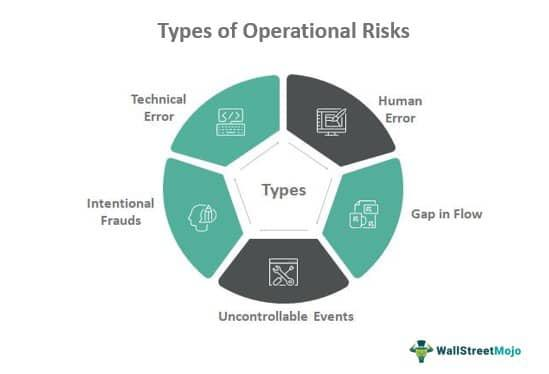

Supply chain risk management and algorithmic trading are integral to the efficiency and stability of global commerce today. As businesses navigate increasingly complex markets, the need to effectively manage risks related to the delivery of goods and capital has become more pronounced. Delivery risks in supply chains encompass uncertainties that can hinder timely and successful fulfillment of obligations, often affecting everything from individual transactions to overarching supply chain strategies.

In contrast, algorithmic trading leverages sophisticated algorithms and automated systems to exploit market efficiencies. However, this innovation comes with its own set of risks, like technical malfunctions and erratic market behaviors that can translate into financial losses if not properly managed. Ensuring these systems operate within controlled risk parameters is crucial for maintaining optimal performance.

The intersection of supply chain risk management and algorithmic trading underscores the necessity of balancing operational efficiency with risk mitigation. Analyzing how delivery risk is assessed and mitigated in supply chains provides valuable insights into maintaining supply chain fluidity and reliability. Simultaneously, understanding the pivotal role of risk management in algorithmic trading is essential for designing robust trading strategies that are resilient to market fluctuations.

In conclusion, comprehending the interplay between these two domains allows businesses to strategically position themselves to better handle both financial and operational uncertainties, ultimately leading to improved productivity and reduced vulnerability to disruptions. Through targeted risk management strategies, companies can safeguard their operations and capitalize on opportunities in volatile environments.

## Table of Contents

## Understanding Delivery Risk in Supply Chains

Delivery risk refers to the uncertainty associated with fulfilling the delivery of goods or cash value within the agreed timeframe. This type of risk is a crucial [factor](/wiki/factor-investing) in supply chain management as it affects both physical goods distribution and financial transactions. It encompasses various forms of risk that could potentially interrupt or delay the completion of a delivery process, impacting efficiency and financial outcomes.

Settlement risk, default risk, and counterparty risk are often used synonymously with delivery risk. Settlement risk involves the potential that one party in a transaction will fail to deliver on its obligations. In financial markets, this is significant as it can lead to [liquidity](/wiki/liquidity-risk-premium) problems and potential losses. Default risk refers to the probability that a party involved in a financial agreement will not meet its contractual obligations, which can lead to disputes and financial losses. Counterparty risk is the risk that the other party in an agreement will not meet their contractual obligations, which is particularly relevant in derivatives and securities trading.

During times of financial uncertainty, delivery risk can escalate. Economic instability, political events, or natural disasters can cause disruptions in supply chains, leading to delays or defaults in deliveries. Such disruptions can amplify delivery risk and have substantial impacts on supply chain efficiency. Companies may experience increased costs, delays in production, or even complete standstills if they are unable to secure the necessary inputs for their operations.

To mitigate delivery risk in financial agreements, various measures are typically employed. Collateral is one such measure, where an asset is pledged as security to safeguard against potential default. This provides a buffer to absorb potential losses, making counterparties more secure in fulfilling their obligations. Credit assessments are also vital, as they evaluate the creditworthiness of parties involved in a transaction. A thorough credit assessment helps in understanding the likelihood of a counterparty defaulting, allowing businesses to make informed decisions regarding whom to engage with in their transactions.

By employing these and other risk management practices, businesses can strategically reduce exposure to delivery risk, thereby enhancing their supply chain resilience and overall financial stability.

## Risk Management in Algorithmic Trading

Algorithmic trading utilizes sophisticated algorithms to execute trading strategies at high speeds and volumes, aiming to exploit market trends and inefficiencies. However, while these automated systems can offer significant advantages in terms of speed and precision, they inherently amplify a variety of risks that must be carefully managed to protect investments and maintain profitability.

**Market Risks** are the primary concerns in algorithmic trading, as they involve the possibility of losses due to adverse price movements. To mitigate these risks, traders often employ strategies such as setting stop-loss limits, which automatically sell securities when their prices drop to a predetermined level. This approach helps in capping losses and preventing further financial damage during market downturns.

**Diversification** is another crucial element in managing risks, involving the allocation of capital across a range of assets to reduce exposure to any single asset or market. By diversifying portfolios, traders can moderate the impact of isolated adverse price movements and improve the resilience of their trading strategies.

**Hedging strategies** are also commonly utilized to offset potential losses. Hedging involves taking an opposing position in a related security or market to protect against unfavorable price changes. For example, a trader might use futures contracts or options to hedge against fluctuations in stock prices.

**Technical risks** arise from the infrastructure and technology used in algorithmic trading. System failures, data feed interruptions, or software bugs can lead to significant losses if not properly managed. To mitigate these risks, firms must ensure robust system architecture, maintain redundant systems, and regularly update and test their trading algorithms.

**Operational risks** involve failures in internal processes, systems, or from external events that can disrupt trading activities. These can be managed by implementing stringent operational controls and conducting regular audits to ensure compliance with best practices and regulatory requirements.

**Behavioral risks** relate to the human errors and biases that can affect trading strategies, even within automated systems. These can be addressed by continuously monitoring and refining algorithms to align with changing market conditions and reduce errors.

**Preserving capital** is fundamental to long-term success in algorithmic trading. Traders must remain adaptable to dynamic market conditions, adjusting their strategies to mitigate risks and capitalize on new opportunities. By focusing on robust risk management and continuous adaptation, traders can enhance their algorithmic trading systems' resilience, ensuring sustained profitability amidst the uncertainties and volatilities of financial markets.

## Mitigating Market and Delivery Risks

In both supply chain management and [algorithmic trading](/wiki/algorithmic-trading), minimizing risk is crucial to maintaining financial stability and ensuring operational continuity. Efficient mitigation of risks in these sectors involves strategic approaches and tools tailored to each domain's unique challenges.

Supply chain management often deals with delivery risks, which encompass the uncertainties related to the timely and successful delivery of goods or cash value. To counter these risks, the application of clearinghouses, collateral, and comprehensive credit evaluations proves to be effective. Clearinghouses act as intermediaries that ensure transactions are completed, reducing the potential for counterparty defaults. Collateral requirements serve as a safety net by demanding security against potential credit exposure, while rigorous credit evaluations assess the financial stability and reliability of counterparties before engaging in transactions.

In algorithmic trading, risk management must address the inherent [volatility](/wiki/volatility-trading-strategies) of financial markets. Tools such as stop-loss orders, dynamic position sizing, and trailing stops are implemented to mitigate risk exposure. A stop-loss order automatically exits a position when a specified price threshold is reached, preventing further loss. Dynamic position sizing adjusts the [volume](/wiki/volume-trading-strategy) of investment based on market conditions, optimizing potential gains while limiting losses. Trailing stops provide a flexible [exit](/wiki/exit-strategy) strategy by tracking favorable price movements and securing profit while protecting against downside risk.

Moreover, adopting a proactive risk management strategy allows supply chain operations and trading platforms to better navigate market uncertainties. This approach involves continuously monitoring market developments, adjusting strategies in response to changing conditions, and employing advanced analytics to predict future risks. By incorporating predictive modeling and real-time data analytics, businesses can identify potential threats early and adjust their strategies accordingly.

The integration of these risk management techniques not only enhances operational resilience but also ensures long-term profitability. By systematically evaluating and addressing risks, businesses can fortify their operations against disruptions, thereby securing a competitive advantage in the dynamic environments of supply chain management and algorithmic trading.

## Conclusion

The integration of risk management strategies within supply chains and trading platforms is crucial for effectively managing both delivery and market risks. Understanding diverse risk types and implementing robust mitigation techniques are key to ensuring business resilience and profitability. In the context of supply chains, delivery risks, such as settlement and counterparty risks, can lead to significant disruptions if not properly managed. Similarly, algorithmic trading platforms face technical, market, and operational risks that could result in substantial financial losses without adequate controls.

Adopting a comprehensive approach that combines the strengths of supply chain risk management and algorithmic trading can significantly enhance the ability to safeguard operations against potential disruptions. For instance, utilizing clearinghouses and credit evaluations can reduce delivery risks in supply chains, stabilizing operations even in volatile conditions. In algorithmic trading, tools such as stop-loss orders and dynamic position sizing play a critical role in limiting potential financial exposure, thereby maintaining market stability.

This holistic approach not only improves operational efficiency but also fortifies the capacity to withstand both market and delivery uncertainties. By bridging these disciplines, companies can create a resilient framework that supports continuous operation and growth, even amidst economic fluctuations.

## References & Further Reading

[1]: Tang, C. S., & Tomlin, B. (2008). ["The power of flexibility for mitigating supply chain risks."](https://www.sciencedirect.com/science/article/pii/S0925527308002181) Management Science, 54(1), 53-70.

[2]: PWC. (2013). ["Supply chain and risk management: Making the right risk decisions to strengthen operations performance."](https://www.pwc.com/gx/en/operations-consulting-services/pdf/pwc-supply-chain-and-risk-management.pdf)

[3]: Gomber, P., Arndt, B., Lutat, M., & Uhle, T. (2011). ["High-frequency trading."](https://papers.ssrn.com/sol3/papers.cfm?abstract_id=1858626) Journal of information technology, 11(2), 34-38.

[4]: Hull, J. C. (2015). ["Risk Management and Financial Institutions"](https://books.google.com/books/about/Risk_Management_and_Financial_Institutio.html?id=1J1QDwAAQBAJ). Wiley.

[5]: BlackRock Investment Institute. (2015). ["Principles of Portfolio Construction - Risk Management."](https://www.blackrock.com/corporate/insights/blackrock-investment-institute)

[6]: Christopher, M., & Peck, H. (2004). ["Building the resilient supply chain."](https://www.researchgate.net/publication/228559011_Building_the_Resilient_Supply_Chain) International Journal of Logistics Management, 15(2), 1-14.