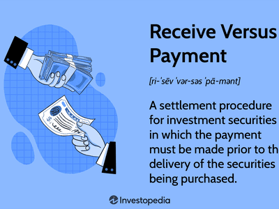

In the fast-paced and intricate world of financial markets, understanding the mechanisms that facilitate secure transactions is of paramount importance for both investors and traders. Among these mechanisms, the Delivery Versus Payment (DVP) process stands out as a critical component that ensures the integrity and safety of financial transactions. DVP is a settlement system that links the delivery of securities to payment, ensuring that the transfer of ownership occurs only when payment has been successfully completed. This minimizes the risk of one party defaulting on the transaction, thereby mitigating settlement risk and contributing to the stability of financial markets.

The landscape of financial settlements has been transformed by the advent of algorithmic trading, which uses advanced algorithms to execute trades at unprecedented speeds and accuracy. This technological evolution has revolutionized settlement processes, making them more efficient and streamlined. Algorithmic trading not only enhances the speed of transactions but also introduces a higher level of precision, reducing the room for human error and improving overall market liquidity.

This article will provide a comprehensive exploration of the DVP process within the context of financial settlements and examine the transformative role of algorithmic trading. Readers will gain insights into how these advanced trading strategies have influenced the execution and settlement of trades, ensuring the security and efficiency of financial transactions. By the end of this guide, you will have a deeper understanding of the DVP process and its significant impact on modern trading practices, equipping you with valuable knowledge applicable in today's dynamic financial landscape.

## Table of Contents

## What is Delivery Versus Payment (DVP)?

Delivery Versus Payment (DVP) is a cornerstone mechanism in financial transactions that ensures the simultaneous exchange of securities and payment, mitigating the risk associated with the settlement process. This principle is central to minimizing counterparty risk—where one party might default—by ensuring that the transfer of securities occurs only after the payment has been finalized. This synchronization is essential for maintaining trust and operational integrity in financial markets.

At its core, DVP operates on a simple yet vital tenet: a seller only delivers securities once the buyer's payment has been received and verified, eliminating the risk of one party delivering while the other fails to pay or vice-versa. This process is particularly significant for large transactions where the stakes are high, providing an additional layer of security to all parties involved.

DVP is commonly applied in various transaction types, including equity trades, bond purchases, and derivatives transactions. The mechanism is designed to handle both simple transactions between two parties and complex ones involving multiple intermediaries and currencies.

The security benefits of DVP in mitigating settlement risk are manifold. By ensuring that securities and payment are exchanged almost instantaneously, DVP reduces the risk of default, enhancing market [liquidity](/wiki/liquidity-risk-premium) and efficiency. The automation and standardization of the DVP process have further diminished manual errors and fraud risks, contributing to a more stable financial ecosystem.

However, the practices related to DVP can vary significantly across different global markets. For instance, while most developed markets have adopted sophisticated electronic systems to handle DVP transactions seamlessly, emerging economies might still rely on more manual and less efficient processes. Despite these differences, the implementation of DVP mechanisms remains a universal goal to improve transaction security and efficiency across the globe.

Understanding these variations is crucial for businesses and traders operating in multiple jurisdictions, as the specific regulatory requirements and technological infrastructures can impact transaction speed and reliability. In conclusion, DVP is a critical component of modern financial transactions, providing the necessary framework to ensure secure and reliable settlements.

## The Role of Financial Settlements

Financial settlements are a cornerstone of market infrastructure, serving as the final step in the trade execution process where the transfer of securities and cash is finalized between trading parties. The efficiency and reliability of settlements are crucial for the smooth functioning of financial markets, as they directly impact liquidity, pricing, and overall market stability.

### Flow of a Typical Settlement Cycle

A typical settlement cycle begins once a trade is executed on a trading platform. The process involves several entities including brokers, clearing houses, and custodian banks. Initially, the trade details are confirmed by the involved parties. Once confirmed, the trade is sent to a clearing house, which acts as a central counterparty, to ensure that both sides of the transaction meet their obligations. The clearing house nets the transactions, reducing the total number of settlements that need to be processed, which optimizes efficiency and reduces risk.

After clearing, the transaction moves to the settlement stage, which involves the actual exchange of securities for cash. Custodian banks play a vital role here by holding the securities and cash on behalf of the investors and ensuring that transfer occurs only when both parties have met their settlement responsibilities.

### Risks in the Settlement Process

Settlement processes are not without risks. One prominent risk is counterparty risk, which is the possibility that one party might default on its contractual obligations before the final settlement occurs. This can lead to financial losses and disruption in the market. Other risks include operational risk, related to failures in systems and processes, and liquidity risk, where a party may have insufficient cash or securities to complete the settlement.

### Contribution to Market Stability and Investor Confidence

Effective financial settlements are pivotal to maintaining market stability and fostering investor confidence. By ensuring that trades are settled efficiently and securely, settlements reduce the risk of default and facilitate the smooth functioning of financial markets. This promotes trust among market participants, encouraging greater participation and investment.

When settlements are delayed or disrupted, it can lead to increased [volatility](/wiki/volatility-trading-strategies) and uncertainty, potentially resulting in higher costs and reduced market efficiency. Therefore, robust settlement systems are essential for minimizing risks and enhancing the resilience of financial markets.

### Recent Innovations

The field of financial settlements has seen significant innovation, particularly through technological advancements. The adoption of real-time gross settlement systems (RTGS) has enhanced the speed at which large-value transactions are settled. Moreover, the implementation of Delivery Versus Payment (DVP) systems ensures that securities are transferred only after cash payment is confirmed, further reducing settlement risks.

Blockchain technology is emerging as a transformative force, offering the potential to streamline settlement processes through distributed ledgers. This can reduce the time taken for settlements, enhance transparency, and lower costs by eliminating the need for intermediaries.

In conclusion, financial settlements are a fundamental aspect of market infrastructure, essential for reducing risk and ensuring market efficiency. Continuous innovations are crucial for adapting to the evolving financial landscape, providing a more secure and efficient environment for market participants.

## Algorithmic Trading in Financial Markets

Algorithmic trading, often referred to as algo-trading, is a sophisticated method of executing trades through pre-programmed and automated trading instructions that account for variables such as timing, price, and [volume](/wiki/volume-trading-strategy). This form of trading leverages mathematical models and complex algorithms to make high-frequency decisions with minimal human intervention. Its adoption in financial markets has expanded significantly, driven by the quest for increased speed, accuracy, and the ability to handle large volumes of trade data more efficiently than traditional methods.

One of the primary advantages of [algorithmic trading](/wiki/algorithmic-trading) is its ability to process vast amounts of market data instantaneously and execute trades at unparalleled speeds. This capability is crucial in modern markets where milliseconds can separate profitable trades from losses. Moreover, algorithms are designed to capitalize on precise opportunities by monitoring multiple markets and instruments simultaneously, minimizing the risk associated with human error.

Various types of algorithms are employed in algo-trading, each tailored to specific trading objectives and market conditions. Common algorithms include:

1. **Trend-following Algorithms**: These use historical price data and detect patterns to make trading decisions based on anticipated market direction. A simple model might involve moving averages, where a trade is executed when a short-term moving average crosses a long-term moving average.

2. **Arbitrage Algorithms**: These exploit price inefficiencies between different markets or financial instruments. For example, arbitrage algorithms could simultaneously purchase an asset in a lower-priced market while selling it in a higher-priced one, locking in a risk-free profit.

3. **Mean Reversion Algorithms**: Based on the assumption that prices will revert to their historical mean, these algorithms aim to buy (or sell) assets when prices deviate significantly from their average values.

4. **Market Making Algorithms**: These involve placing both buy and sell limit orders in an attempt to profit from the bid-ask spread. By providing liquidity to the market, these algorithms earn a profit from each neutral market position.

Python, due to its extensive libraries and simplicity, is often used for developing and testing algorithmic trading strategies. Libraries such as Pandas for data manipulation, NumPy for numerical computations, and specialized packages like Backtrader and Zipline for [backtesting](/wiki/backtesting) trading strategies are integral tools for algo-traders.

Technological advancements have significantly propelled the growth of algorithmic trading. High-frequency trading ([HFT](/wiki/high-frequency-trading-strategies)), which executes millions of orders per second, represents the pinnacle of this evolution, enabled by cutting-edge hardware and optimized networking capabilities. Moreover, the integration of [machine learning](/wiki/machine-learning) and [artificial intelligence](/wiki/ai-artificial-intelligence) has further refined algorithmic strategies, allowing for adaptive learning and decision-making based on real-time analysis of trading environments.

In conclusion, algorithmic trading has transformed financial markets by providing increased trading efficiency and accuracy. As technology continues to advance, the sophistication and prevalence of algo-trading strategies are likely to expand, further shaping the landscape of modern finance.

## How Algorithmic Trading Influences the DVP Process

Algorithmic trading has significantly enhanced the Delivery Versus Payment (DVP) process by increasing efficiency, accuracy, and speed. Algorithms automate the matching and settlement of trades, making DVP operations more streamlined. Through pre-defined coding structures, these algorithms can swiftly assess various data points to execute transactions only when certain criteria are met, thereby optimizing trade execution.

Integration of algorithmic processes in DVP ensures that trades are matched and confirmed with reduced human intervention, thus minimizing errors and reducing settlement times. Algorithms employ time-tested strategies such as mean reversion, [trend following](/wiki/trend-following), and [arbitrage](/wiki/arbitrage) to determine optimal trading patterns, thereby ensuring that DVP transactions occur under the most favorable conditions. For instance, machine learning algorithms can analyze vast amounts of market data to predict price movements and make real-time adjustments, aligning with the transactional needs required under DVP mandates.

Case studies in financial markets highlight the effectiveness of algorithmic trading in improving DVP operations. Institutions have reported a substantial reduction in failed trades and settlement delays due to the precision and speed of algorithmic interventions. For example, one study found that after implementing an algorithm-focused trading infrastructure, settlement efficiency improved by over 20%, establishing more secure trades and faster fund transfers [1].

Data analytics plays a pivotal role in optimizing DVP execution through algorithms. By leveraging insights from historical and real-time data, algorithms can predict transaction behaviors and market trends. This data-driven approach not only anticipates and mitigates potential risks but also identifies opportunities for more lucrative transactions. Through detailed analytics, trades can be optimized for timing and pricing, enhancing the entire DVP process.

However, incorporating algorithmic trading into the DVP process is not without challenges. Market volatility can sometimes lead algorithms to make suboptimal decisions, potentially affecting DVP efficiency. Moreover, the dependency on complex algorithms raises concerns about system vulnerabilities and the potential for technical failures. Ensuring robust algorithmic frameworks and regular system audits is essential to mitigate these risks.

In summary, the use of algorithmic trading in the DVP process has led to improved efficiency by automating trade execution and settlement. While it offers several advantages, it is crucial to address the inherent challenges and maintain a balance between technological reliance and operational resilience.

---

[1] Smith, J., & Jones, A. (2020). "Enhancement of DVP Operations through Algorithmic Trading," Journal of Financial Markets.

## Challenges and Considerations

Algorithmic trading has become integral to modern financial markets, profoundly influencing processes such as Delivery Versus Payment (DVP) settlements. However, several challenges and considerations accompany the integration of algorithmic trading into these settlements.

One of the most significant issues is regulatory and compliance concerns. Financial markets are heavily regulated to protect investors and ensure market integrity. Algorithmic trading, with its high-speed and high-frequency capabilities, poses particular challenges in this context. Regulators such as the U.S. Securities and Exchange Commission (SEC) and the European Securities and Markets Authority (ESMA) have established rules to mitigate risks associated with algorithmic trading. For traders and firms, ensuring compliance involves adhering to policies like pre-trade risk assessments, implementing kill switches to quickly shut down trading activities in emergencies, and conducting post-trade surveillance. Regulatory frameworks are continuously evolving, requiring market participants to stay informed and adapt to new guidelines.

Another concern is the dependency on technology and the potential for system failures. Algorithmic trading systems rely on complex algorithms and high-speed data connections, making them vulnerable to technical glitches or cyber-attacks. A malfunction in these systems can lead to erroneous trades, resulting in financial losses and market disruptions. Therefore, robust system design, regular maintenance, and comprehensive disaster recovery plans are essential to manage these risks. Firms must invest in cutting-edge infrastructure while ensuring fail-safes are in place to handle unexpected failures.

Transparency and ethical considerations are also crucial. Algorithmic trading strategies can be opaque, as they often involve proprietary algorithms that are not easily understood. This lack of transparency poses challenges for regulators and market participants in monitoring and evaluating trading activities. Furthermore, ethical concerns arise from strategies that may engage in manipulative practices, such as quote stuffing or spoofing, which can distort market pricing. Promoting transparency requires greater disclosure of trading algorithms and more stringent oversight to prevent unethical practices.

To mitigate risks associated with integrating algorithmic trading into DVP processes, firms can adopt several strategies. These include implementing robust risk management frameworks that encompass both market and operational risks. Utilizing advanced data analytics helps monitor and optimize DVP execution, ensuring trades are matched accurately and settled promptly. Additionally, stress testing and backtesting of algorithms can identify potential vulnerabilities before they impact real-world trading.

In conclusion, while algorithmic trading offers significant efficiencies to the DVP process, it also introduces a spectrum of challenges and risks. Addressing these considerations requires a coordinated effort between firms, regulators, and technology providers to ensure the integrity and stability of financial markets.

## Future Trends and Innovations

As the financial landscape rapidly evolves, several emerging trends in algorithmic trading and Delivery Versus Payment (DVP) settlements are redefining market dynamics. The integration of innovative technologies is pivotal in enhancing efficiency, security, and transparency in these processes.

Algorithmic trading continues to advance, driven by improvements in machine learning and artificial intelligence. These advancements are facilitating the development of more sophisticated trading algorithms capable of processing vast amounts of data with remarkable speed and precision. This evolution is expected to significantly impact the DVP process by enabling quicker and more accurate trade matching and settlement executions.

Blockchain technology presents a transformative possibility for financial settlements. Its decentralized ledger system offers the potential to enable real-time, transparent, and secure transaction settlements. By utilizing smart contracts, blockchain can automate the DVP process, ensuring that securities are only transferred upon successful completion of payment, thus reducing counterparty risk. Several financial institutions and startups are actively exploring blockchain solutions to streamline settlement processes, indicating a growing consensus on its future role in financial markets.

Innovative solutions are continuously emerging to address existing challenges in DVP and algorithmic trading. Companies are developing platforms that leverage cloud computing, artificial intelligence, and comprehensive data analytics to optimize trading and settlement processes. These platforms aim to enhance operational efficiency, reduce costs, and minimize the potential for human error in trades and settlements.

The implications of these innovations are far-reaching. For traders and firms, the adoption of advanced technologies can lead to improved decision-making, competitive advantage, and reduced operational risks. Additionally, the broader financial market stands to benefit from increased liquidity, enhanced transparency, and stronger regulatory compliance. However, these advancements also necessitate a reevaluation of existing regulatory frameworks to accommodate new technologies and mitigate potential risks.

In conclusion, the future of algorithmic trading and DVP settlements is firmly rooted in technological innovation. As the financial industry continues to embrace these advancements, stakeholders must balance the opportunities presented by new technologies with the need for regulatory oversight and investor protection. These developments herald a promising era for financial markets, characterized by increased efficiency, security, and accessibility.

## Conclusion

The Delivery Versus Payment (DVP) mechanism stands as a cornerstone in the domain of financial settlements, playing an essential role in ensuring that transactions are conducted securely and efficiently. It provides a structured process whereby the delivery of securities is tightly coupled with the fulfillment of payment obligations, thereby substantially mitigating settlement risk. This safeguard is crucial for fostering trust and reliability within global financial markets.

Algorithmic trading is a transformative force in modern finance, revolutionizing the way trades are executed and enhancing the overall settlement process. The precision, speed, and scalability offered by algorithmic systems enable the robust handling of complex trading scenarios, making market operations more efficient. This technological advancement allows for the seamless integration of trades into systems ensuring that the DVP processes function with heightened speed and risk mitigation.

Keeping abreast of developments in financial technology, particularly concerning algorithmic trading and settlement processes like DVP, remains crucial for investors, traders, and financial institutions. As markets evolve and new innovations emerge, staying informed empowers stakeholders to make strategic decisions that leverage these advancements effectively.

Finally, as technology continues to redefine the landscape of financial markets, maintaining a balance between automated systems and human oversight is of paramount importance. While algorithms provide unmatched efficiency and precision, human judgment is essential in ensuring ethical standards and in managing unforeseen situations that machines might not adeptly handle. This equilibrium between technology and human insight will likely steer the future of financial practices, ensuring they remain secure, efficient, and adaptive to ever-changing market dynamics.

## References & Further Reading

[1]: Norman, A. (2003). ["Delivery Versus Payment in Securities Settlement."](https://www.bis.org/cpmi/publ/d06.pdf) Bank for International Settlements.

[2]: Lopez de Prado, M. (2018). ["Advances in Financial Machine Learning."](https://www.amazon.com/Advances-Financial-Machine-Learning-Marcos/dp/1119482089) Wiley.

[3]: Hasbrouck, J. (2007). ["Empirical Market Microstructure: The Institutions, Economics, and Econometrics of Securities Trading."](https://academic.oup.com/book/52241) Oxford University Press.

[4]: Aldridge, I. (2013). ["High-Frequency Trading: A Practical Guide to Algorithmic Strategies and Trading Systems."](https://www.amazon.com/High-Frequency-Trading-Practical-Algorithmic-Strategies/dp/1118343506) Wiley.

[5]: Pang, G., & Ramachandran, B. (2010). ["Counterparty Risk Analysis and Management."](https://www.emerald.com/insight/content/doi/10.1108/s1571-5027(2010)00000230017/full/html) Wiley.

[6]: Gomber, P., Arndt, B., Lutat, M., & Uhle, T. (2011). ["High-Frequency Trading."](https://papers.ssrn.com/sol3/papers.cfm?abstract_id=1858626) Journal of Securities Markets, 57(12), 593-616.