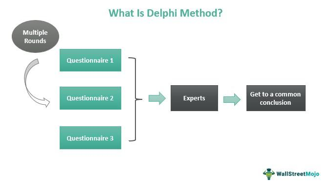

The constant evolution in decision-making, forecasting, and trading has driven the adoption of numerous innovative techniques and strategies. Among these, the Delphi Method stands out as a profoundly influential structured communication technique that has found extensive application across these areas. Originally conceptualized to tackle military strategy challenges, the Delphi Method's adaptability has allowed it to transition into diverse fields, significantly aiding in the realms of decision-making, forecasting, and algorithmic trading.

This article examines how the Delphi Method facilitates decision-making and forecasting processes, alongside exploring its implications in algorithmic trading. By allowing experts to engage in a methodical process of consensus-building, this approach has the potential to enhance the accuracy and reliability of predictions in various markets. The Delphi Method's distinctive model, combining expert opinion with quantitative analysis, offers a unique vantage point in predicting market trends and formulating effective strategies. Through this synthesis of expert consensus and data-driven insights, organizations can gain a competitive edge in today’s dynamic market landscape.

## Table of Contents

## Understanding the Delphi Method

The Delphi Method is a well-established forecasting approach that involves eliciting and aggregating expert opinions to derive a consensus. Initially developed in the 1950s by the RAND Corporation, it aimed to tackle complex military strategy questions during the Cold War era. The method has since extended its utility to a multitude of domains such as business, healthcare, and academic research.

At its core, the Delphi Method operates through a series of rounds involving structured questionnaires. Experts within a particular field are invited to provide their insights on specific issues or forecasts. After each round, a facilitator summarizes the feedback, which is then shared with the panel for a subsequent round of input. This iterative process allows experts to adjust their views based on peer feedback, ultimately working towards a collective consensus.

The structured approach of the Delphi Method is pivotal in minimizing bias and enhancing the quality of decisions. Unlike conventional group discussions where dominant voices may sway decisions, the anonymity afforded by the Delphi Method ensures that all expert opinions are considered equally, thus reducing the influence of power dynamics. By systematically refining expert judgments over multiple rounds, the method cultivates more accurate and reliable consensus outcomes.

Additionally, the iterative nature of the Delphi process lets experts reassess their initial assumptions and adjust their forecasts accordingly. This cyclical process continues until a stable consensus is reached or marginal returns from additional rounds become negligible. Consequently, the Delphi Method is revered for its ability to transcend individual expert limitations, fostering a comprehensive synthesis of varied expert insights.

## Delphi Method in Decision Making

The Delphi Method is a powerful tool for decision-making, particularly when tackling complex issues that require a synthesis of diverse expert insights. This method facilitates decision-makers' access to a broad range of expert opinions without necessitating physical meetings, thus overcoming geographical and logistical barriers. Its structure is based on iterative rounds of anonymous questionnaires, which allow experts to express their views independently before receiving feedback on their collective responses. This iterative process continues until a consensus is reached or significant convergence in opinions occurs.

One of the primary strengths of the Delphi Method is its ability to offer a structured pathway to consensus. By maintaining the anonymity of responses, the influence of dominant personalities or seniority within the expert panel is significantly reduced. This permits a more egalitarian platform where less experienced but highly knowledgeable participants can contribute equally to the decision-making process. As such, the method mitigates potential bias that can arise from hierarchical power dynamics, leading to more balanced and objective outcomes.

The iterative nature of the Delphi Method also enhances the quality of decisions. Experts are provided with summaries of the group's responses and invited to revise their earlier answers in subsequent rounds. This process not only enables reflection and adjustment but also encourages the convergence of opinions based on shared understanding and evidence presented by other experts. The method's design inherently reduces the impact of initial bias and allows for progressive refinement of expert judgment.

Furthermore, the Delphi Method leverages the collective intelligence of a diverse group of experts, allowing decision-makers to draw on a wide array of knowledge and perspectives. This diversity enhances the robustness of the decisions, as it integrates insights from various fields and experiences, resulting in comprehensive solutions to multifaceted issues. The structured elicitation of expert opinions thus provides decision-makers with a rich, informed foundation upon which strategic decisions can be built.

In summary, the Delphi Method's ability to harness collective expertise in an unbiased and structured manner makes it an invaluable asset in decision-making processes, particularly for complex and nuanced issues where consensus is crucial.

## Application of the Delphi Method in Forecasting

Forecasting with the Delphi Method leverages the expertise of a panel to integrate diverse insights into cohesive predictive models, capable of anticipating market and economic trends. This technique is characterized by its iterative approach, where multiple rounds of questionnaires are administered to experts. After each round, summarized feedback is shared, allowing participants to reassess their positions. This iterative feedback loop fosters refinement of forecasts, contributing to increased precision and reliability.

The strength of the Delphi Method lies in its ability to synthesize varied expert opinions, often leading to more accurate forecasts than those generated by singular analysis. By utilizing iterative refinement, the method confronts initial assumptions and erroneous forecasts, reducing their influence over time. This capability is crucial in domains like healthcare, where accurate forecast models can direct resource allocation and policy decisions, such as predicting disease outbreaks or the future need for healthcare services.

In education, the Delphi Method facilitates strategic planning by anticipating future trends and challenges the sector might face. It can be employed to forecast the impact of technological advancements on learning environments or to predict student enrollment trends, guiding institutions in policy formulation and curriculum development.

Strategic business planning also benefits significantly from the Delphi Method, where market [volatility](/wiki/volatility-trading-strategies) and consumer behavior are constants. By gathering and refining expert input, businesses can better anticipate shifts in market demands, helping to inform strategic pivots or novel product development. The ability to adapt business strategies in anticipation of market trends provides a strategic advantage, allowing firms to seize opportunities and minimize risks associated with unforeseen challenges.

In essence, the Delphi Method advances forecasting by fostering expert-driven insight convergence, reducing biases, and refining predictions through structured, iterative engagement. Its effectiveness in improving the reliability of forecasts underscores its value across various strategic sectors.

## Role of Delphi Method in Algorithmic Trading

Algorithmic trading relies heavily on the ability to forecast market movements with high precision. The integration of the Delphi Method into [algorithmic trading](/wiki/algorithmic-trading) brings a unique advantage by enhancing the accuracy of these predictive models. This is achieved through the synthesis of expert consensus, which provides valuable data-driven insights that can refine and optimize trading algorithms.

The Delphi Method, characterized by its structured approach to eliciting expert opinions and fostering consensus, plays an important role in improving algorithmic trading strategies. It does so by systematically capturing the diverse knowledge of experts who possess a deep understanding of various market factors. By involving a diverse panel of experts, the Delphi Method reduces the likelihood of individual biases affecting the outcome, resulting in more reliable and well-rounded insights.

In the context of algorithmic trading, the Delphi Method functions to iteratively refine forecasts by allowing experts to review and adjust their predictions based on feedback from their peers. This iterative process helps to align disparate views and reach a more unified and informed perspective on market trends. As a result, the Delphi Method enhances the robustness of predictive models used in algorithmic trading systems.

Incorporating expert consensus through the Delphi Method into algorithmic models allows traders to adjust parameters and rulesets based on empirical insights. For instance, the method can help determine the optimal conditions under which to enter or [exit](/wiki/exit-strategy) trades, select the most relevant indicators to use, and assess how potential market changes could influence various trading strategies. This process, when automated, supports the continuous improvement of trading algorithms and aids in mitigating risks associated with uncertainty in market conditions.

By applying the Delphi Method, algorithm developers can incorporate real-world insights, leading to more adaptive and responsive algorithms that better anticipate market movements. This integration not only offers an additional layer of analytical depth but also enhances the strategic decision-making capabilities of algorithmic traders in ever-evolving financial markets.

## Advantages and Disadvantages

The Delphi Method offers several advantages that make it an effective tool in various decision-making contexts. One key benefit is its ability to garner a wide range of expert opinions, which fosters a comprehensive understanding of complex issues. The method's iterative nature allows participants to review and refine their responses based on feedback from others, leading to more informed and precise outcomes. This reflective process enhances the quality of the consensus, as experts can reconsider their initial judgments in light of new information presented during each round.

However, the Delphi Method is not without its drawbacks. One significant disadvantage is the time-consuming nature of conducting multiple rounds of surveys, which can delay the decision-making process. This aspect might be a limitation in scenarios requiring timely conclusions. Additionally, the pressure to reach a consensus may lead to a convergence toward mediocrity, where participants might suppress innovative or extreme viewpoints in favor of more moderate positions. This tendency can potentially dilute the richness of expert insights and stifle creative problem-solving.

Despite these challenges, the Delphi Method remains valuable due to its structured approach to harnessing expert knowledge. It achieves well-rounded expert opinions by allowing diverse perspectives to be systematically evaluated and synthesized. As a result, the Delphi Method continues to be a prominent tool for organizations seeking to make informed decisions based on expert consensus.

## Real-World Application of Delphi Method

In healthcare, the Delphi Method has been instrumental in developing clinical guidelines, particularly those requiring consensus on complex medical protocols. One notable application is its use in establishing protocols for monitoring high-risk medications. A study involving a panel of medical experts employed the Delphi Method to achieve consensus on which specific drugs required stringent monitoring, taking into account factors such as patient safety and therapeutic efficacy. This structured approach not only facilitated the harmonization of clinical practices but also enhanced the reliability of the guidelines by integrating diverse expert opinions in an unbiased manner.

Additionally, the Delphi Method has found significant applications in business and policy planning. Organizations utilize this method to anticipate market trends and devise strategic plans. By collating insights from experts across different sectors, businesses can forecast potential market shifts and align their strategies accordingly. For example, in strategic business planning, companies may use the Delphi Method to obtain consensus on future technological advancements or consumer behavior trends, enabling them to position themselves advantageously in evolving markets.

In policy planning, governments and institutions apply the Delphi Method to predict socio-economic developments and inform policy decisions. This method assists policymakers in balancing varied expert perspectives, ensuring that policies are robust and comprehensive. Overall, the practical applications of the Delphi Method in these sectors underscore its effectiveness in achieving well-rounded and reliable forecasts and strategies.

## Conclusion

The Delphi Method is an effective tool in decision-making and forecasting, largely due to its structured approach in achieving expert consensus. By systematically and iteratively gathering opinions from a diverse panel of experts, the method minimizes individual biases and fosters balanced decision outcomes. This iterative feedback loop ensures that the forecasts or decisions are refined progressively, leading to more reliable results compared to singular expert opinions. 

In the context of algorithmic trading, the Delphi Method holds significant promise. Algorithmic trading relies on precise market predictions and data-driven strategies. By incorporating the Delphi Method, trading algorithms can benefit from consensus-driven insights, which can enhance the accuracy of predictive models. This integration helps in refining algorithms that are sensitive to market movements, potentially leading to improved trading strategies and performance.

As markets become increasingly complex and interdependent, the significance of expert-led insights provided by the Delphi Method cannot be overstated. Organizations striving to maintain a competitive edge must continuously adapt and evolve their strategies. Through the integration of expert consensus with quantitative data analysis, entities can navigate uncertainty more effectively and align their strategic planning with market dynamics. The Delphi Method, therefore, remains a vital tool for anyone seeking to understand and predict future trends in a competitive landscape.

## References & Further Reading

[1]: Linstone, H. A., & Turoff, M. (1975). ["The Delphi Method: Techniques and Applications."](https://www.researchgate.net/publication/237035943_The_Delphi_Method_Techniques_and_Applications) Addison-Wesley.

[2]: Rowe, G., & Wright, G. (1999). ["The Delphi technique as a forecasting tool: Issues and analysis."](https://www.sciencedirect.com/science/article/pii/S0169207099000187) International Journal of Forecasting, 15(4), 353-375.

[3]: Gürkaynak, R. S., & Wolfers, J. (2006). ["Macroeconomic Derivatives: An Initial Analysis of Market-Based Macro Forecasts, Uncertainty, and Risk."](https://users.nber.org/~confer/2005/isom05/wolfers.pdf) American Economic Review, 96(2), 405-409.

[4]: Armstrong, J. S. (Ed.). (2001). ["Principles of Forecasting: A Handbook for Researchers and Practitioners."](https://link.springer.com/book/10.1007/978-0-306-47630-3) Springer.

[5]: Gordon, T. J., & Pease, A. (2006). ["RT Delphi: An efficient, 'round-less' almost real time Delphi method."](https://www.sciencedirect.com/science/article/pii/S0040162505001435) Technological Forecasting and Social Change, 73(4), 321-333.