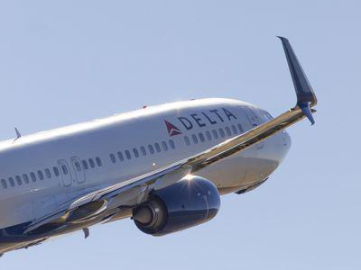

Understanding the employee structure within a corporate organization can be complex, especially in a large and globally impactful company like Delta Air Lines. Delta's approach to corporate organization is distinctive, particularly in its partial unionization and integration of modern technological processes. This article will explore the unique corporate structure of Delta Air Lines, focusing on its partly unionized employee model, and examine the influence of algorithmic trading in shaping contemporary corporate strategies.

Delta Air Lines has long set itself apart with its specific way of managing employee relations and operations, positioning itself as a leader in the airline industry. This leadership is rooted in a nuanced approach to handling both unionized and non-unionized employees, maintaining a balance that impacts pay structures, employee benefits, and overall workplace harmony. Such strategies have not only optimized employee satisfaction but have also contributed to Delta's operational efficiency and market competitiveness.



This article will further outline how Delta’s corporate structure aids its operational efficiency and contributes to its market dominance. By analyzing the strategic alignment of employee roles within its hierarchical structure, we will highlight how these dynamics support Delta's success.

Furthermore, the article will discuss how automated processes like algorithmic trading can influence strategic decision-making in large corporations like Delta. Algorithmic trading, typically associated with financial markets, has broader implications for corporate strategy, particularly in optimizing resource allocation and managing financial risks. In evaluating these processes, we can better understand how Delta leverages modern innovations to enhance its operational strategy and maintain a competitive edge in the dynamic airline industry.

## Table of Contents

## Delta Air Lines' Corporate Structure

Delta Air Lines utilizes a hierarchical organizational structure to maintain clarity in roles and responsibilities, ensuring effective management across its various functions and divisions. This structure is anchored by the CEO, who is supported by a cadre of vice-presidents overseeing the core divisions essential to Delta's operations. These divisions include operations, marketing, finance, and human resources, each playing a significant role in maintaining the airline’s day-to-day activities and strategic initiatives.

The operations division is particularly critical to Delta's success, encompassing flight operations, maintenance, and customer service. This division is responsible for guaranteeing safe and efficient flight transitions, which are pivotal to the airline's reputation and performance. Efficient flight operations rely on meticulous coordination between pilots, ground crew, and air traffic control, while maintenance ensures that aircraft are in optimal condition. Customer service, on the other hand, focuses on providing passengers with a positive travel experience, addressing inquiries, and resolving issues promptly.

Delta's employee structure uniquely features a partly unionized model. This model includes unionized pilots and dispatchers, providing these groups with collective bargaining power concerning wages, benefits, and working conditions. Notably, other employee groups, such as flight attendants, remain non-unionized. This differentiation in union representation affects team dynamics and management strategies, as it requires Delta to navigate varying employee expectations and negotiation frameworks. The balance between unionized and non-unionized employees is a strategic decision by Delta, aimed at maintaining operational flexibility while addressing the needs and concerns of its workforce. This dynamic has implications on how the company manages employee relations and devises strategies to ensure that all employees feel valued and motivated, which is integral to its overall corporate strategy.

## Employee Management and Unionization at Delta

Delta Air Lines has navigated the complex terrain of employee management with a strategic approach to unionization, balancing its workforce between unionized and non-unionized staff. This balance significantly affects pay structures and benefits across different employee groups.

One of the critical strategies Delta employs to prevent further unionization is offering competitive pay and a profit-sharing plan that directly links employees' financial rewards with the company's performance. By aligning employee interests with corporate outcomes, Delta enhances employee motivation and reduces the incentive to unionize. The profit-sharing scheme is designed to distribute a portion of the airline’s profits among employees, promoting a sense of ownership and accomplishment. This approach effectively serves as a counterbalance to unionization by addressing some of the primary reasons employees seek union representation, such as dissatisfied pay or lack of engagement with management.

However, maintaining this balance is not without challenges. During the 2008 merger with Northwest Airlines, Delta experienced heightened tensions in union dynamics, as it had to integrate the workforce from a company with a different union landscape. Northwest Airlines’ employees were more heavily unionized than Delta’s, leading to potential conflicts in aligning benefits and pay expectations. Such mergers require careful negotiation to ensure equitable treatment of all employees while maintaining operational harmony.

The dynamics of unionization versus non-unionization [carry](/wiki/carry-trading) implications for Delta's operational policies and employee satisfaction. Unionized employees typically have more formalized negotiation procedures for their employment terms, which can lead to more stable and predictable working conditions. In contrast, non-unionized employees might enjoy more flexibility but face less certainty regarding changes in employment terms.

Understanding these dynamics and how they affect employee relations at Delta is crucial for analyzing its operational efficiency and workforce morale. The airline's ability to maintain employee satisfaction in a hybrid union environment speaks to its broader strategy of effectively managing human resources. This approach not only ensures continuity in service delivery but also positions Delta as a competitive player in attracting and retaining talent within the industry.

## The Role of Algorithmic Trading and Automated Processes

Algorithmic trading, a prominent feature in financial markets, has found valuable applications beyond its traditional domain, influencing corporate strategies in various industries, including the airline sector. Companies such as Delta Air Lines are increasingly employing algorithmic techniques to enhance operational efficiency and inform strategic decisions.

In the airline industry, data-driven decision-making empowered by algorithms plays a crucial role in optimizing numerous processes. Flight paths, for instance, can be adjusted dynamically in response to real-time data, leading to fuel savings and reduced travel time. This optimization is achieved by analyzing variables such as weather patterns, air traffic, and fuel costs to determine the most efficient routes. Python libraries like NumPy and Pandas can process this large [volume](/wiki/volume-trading-strategy) of data, while optimization packages such as SciPy can be employed to solve routing problems. An example of a simplified Python script leveraging these libraries could look like this:

```python
import numpy as np
from scipy.optimize import linprog

# Objective: minimize fuel costs
# Coefficients for hypothetical flight paths
c = np.array([200, 180, 220])

# Constraints (e.g., flight path capacities, time windows)
A = np.array([[1, 2, 1],
              [3, 1, 2]])
b = np.array([20, 30])

# Linear Optimization to find the best flight path
res = linprog(c, A_eq=A, b_eq=b, method='highs')
print(res)
```

Beyond optimizing flight routes, algorithms facilitate profitable pricing strategies. By using historical data and demand forecasts, airlines can develop models that predict optimal ticket prices. This not only maximizes revenue per passenger but also ensures competitive pricing aligned with market demand. Machine learning models such as regression analysis help quantify the relationship between ticket prices and demand variables.

Algorithmic approaches also address broader economic challenges faced by airlines. Fluctuating fuel prices represent a significant risk, and algorithms can assist in crafting hedging strategies to mitigate this [volatility](/wiki/volatility-trading-strategies). By simulating different fuel price scenarios and their potential impacts on costs, airlines can make informed hedging decisions.

Moreover, leveraging algorithms for resource distribution goes beyond flight and financial optimizations, affecting staffing, maintenance scheduling, and asset management. The integration of automated processes for resource allocation ensures that personnel and equipment are utilized efficiently, promising significant cost savings and enhanced service delivery.

In conclusion, the role of [algorithmic trading](/wiki/algorithmic-trading) and automated processes in Delta Air Lines and similar organizations underscores a strategic shift towards data-centric operations. The ability to adapt swiftly to economic variables using algorithmic insights is a testament to the forward-thinking corporate strategies employed in the modern airline industry.

## Profit-Sharing Models Versus Traditional Pay Structures

Delta Air Lines’ compensation strategy, which includes profit-sharing, serves as a pivotal tool in mitigating unionization efforts and enhancing employee loyalty. This model offers employees a share in the financial success of the airline, thus incentivizing high performance and fostering a sense of ownership and motivation. The profit-sharing mechanism is designed to align employee interests with the company’s financial health, translating into improved productivity and morale. Employees are encouraged to contribute to the company’s success, knowing that profitability directly impacts their rewards.

Profit-sharing works by allocating a portion of the company’s profits to employees, typically calculated as a percentage of eligible earnings. This approach is contrasted with traditional pay structures, which rely solely on fixed wages and standard benefits. The profit-sharing model at Delta allows employees to receive bonuses when the airline performs well financially, offering a dynamic addition to their fixed base pay.

However, this model is not without its challenges. During economic downturns, when company profits decrease, the bonus pool for profit-sharing also diminishes, leading to reduced employee bonuses. This variability can affect employee satisfaction and morale, as they experience a drop in expected income. The reliance on profit-sharing necessitates careful financial management to buffer against economic fluctuations and maintain employee confidence.

The balance that Delta maintains between base pay and profit-sharing is crucial for understanding its corporate structure. While the base pay provides stability, the profit-sharing component offers the potential for additional financial gains, creating a hybrid compensation model that appeals to both stability and performance-based rewards.

For stakeholders, analysts, and employees, understanding this blend of traditional and performance-based pay structures is essential. It underscores Delta’s commitment to engaging its workforce financially while highlighting the risks and opportunities inherent in such a model. This approach is emblematic of Delta’s broader strategy in managing employee relations and driving corporate performance through innovative compensation structures.

## Challenges and Opportunities in Corporate Organization

Delta Air Lines, as a major player in the aviation industry, encounters several challenges and opportunities inherent to its large-scale corporate organization. One of the primary challenges lies in managing the wide-ranging expectations of a diverse workforce. Employees across various departments have distinct needs and aspirations, influenced by their roles, union affiliations, and regional labor markets. Delta must continuously establish effective communication channels and responsive management strategies to address these differences.

Adapting to external market pressures is another significant challenge. The airline industry is notably sensitive to economic fluctuations, geopolitical events, and technological advancements. These external factors compel Delta to remain agile, ensuring its operational strategies are robust enough to withstand such pressures. Efficient resource allocation and strategic forecasting are essential to navigate these challenges successfully.

On the opportunities front, the integration of automated processes within corporate workflows provides Delta with potential efficiency gains. Automation can streamline various operational aspects, from maintenance scheduling to customer service interactions, enhancing overall productivity. For instance, employing data analytics in flight path optimization can lead to fuel savings and improved flight schedules.

However, automation also presents its own set of challenges, particularly concerning workforce adaptability. Employees must be trained to interact with new technologies, necessitating investment in continuous learning and skills development programs. Ensuring that employees are equipped to handle technological changes is vital for seamless integration.

Delta’s long-term success depends on its ability to foster innovation while upholding safety standards and maintaining excellent customer service. As the company implements new technologies, it must rigorously test and verify these systems to meet stringent industry safety regulations. Concurrently, maintaining high customer service levels is crucial as passengers' expectations evolve with technological advancements.

The evolving landscape of aviation technology and financial management underscores the importance of continuous strategic adjustment. Delta must anticipate industry trends, such as advancements in sustainable aviation fuel or shifts in global travel patterns, and integrate these insights into its business model. Building resilient financial strategies to handle variables like fuel price volatility and fluctuating passenger demand is essential for sustaining profitability.

In conclusion, Delta Air Lines must effectively balance technological adoption with employee engagement, safety compliance, and customer satisfaction to capitalize on growth opportunities while mitigating inherent organizational challenges. Maintaining this balance is crucial for navigating the dynamic and competitive aviation sector.

## Conclusion

Delta Air Lines exemplifies a modern approach to corporate management by harmoniously blending traditional hierarchical structures with cutting-edge automated techniques. This synergy allows Delta to maintain its leadership position in the airline industry, showcasing its adaptability to evolving industry standards. A significant aspect of Delta's corporate strategy is the management of its workforce, striking a balance between unionized and non-unionized employees. This approach not only reflects a broader strategy for human resource management but also aids in fostering a work environment tailored to meet diverse employee expectations and organizational goals.

For stakeholders and analysts, understanding Delta's complex corporate structure is crucial as it directly impacts the airline's operational efficiency and market performance. The integration of algorithmic trading and automated decision-making processes within Delta's operations signifies a forward-thinking approach. These technologies enhance resource allocation, optimize pricing strategies, and manage economic fluctuations, all of which are essential in a rapidly changing business landscape. As Delta continues to expand, the ongoing adaptation of these strategies will play a pivotal role in maintaining its competitive edge and ensuring long-term success.

## References & Further Reading

[1]: Gomez-Mejia, L. R., Balkin, D. B., & Cardy, R. L. (2016). ["Managing Human Resources."](https://www.pearson.com/en-us/subject-catalog/p/managing-human-resources/P200000005902/9780135638316) Pearson Education.

[2]: Raudabaugh, J., & Effron, M. (2013). ["The Global Airline Industry: Alliances through Uncertain Times."](https://ageconsearch.umn.edu/bitstream/26718/1/01010056.pdf) In: Air Transport in the 21st Century: Key Strategic Developments. 

[3]: ["Advances in Financial Machine Learning"](https://www.amazon.com/Advances-Financial-Machine-Learning-Marcos/dp/1119482089) by Marcos Lopez de Prado.

[4]: ("The Outsiders: Eight Unconventional CEOs and Their Radically Rational Blueprint for Success"](https://www.amazon.com/Outsiders-Unconventional-Radically-Rational-Blueprint/dp/1422162672) by William N. Thorndike.

[5]: ["Machine Learning for Algorithmic Trading: Second Edition"](https://www.amazon.com/Machine-Learning-Algorithmic-Trading-alternative/dp/1839217715) by Stefan Jansen.