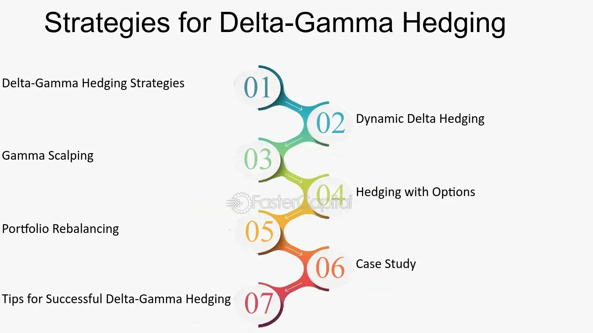

## Table of Contents

## What is Delta-Gamma Hedging and why is it important in financial markets?

Delta-Gamma Hedging is a way for investors to manage the risk of their investments, especially when dealing with options. Options are financial tools that give the buyer the right, but not the obligation, to buy or sell an asset at a certain price. Delta measures how much the price of an option changes when the price of the underlying asset changes. Gamma measures how much the Delta changes when the price of the underlying asset changes. By using Delta-Gamma Hedging, investors try to protect their investments from big price swings by adjusting their positions based on these two measures.

This method is important in financial markets because it helps investors reduce their risk. Markets can be unpredictable, and prices can move a lot. By using Delta-Gamma Hedging, investors can make their portfolios more stable. They can do this by buying or selling assets to balance out the changes in Delta and Gamma. This way, they are less likely to lose a lot of money if the market moves against them. It's like having a safety net that helps them sleep better at night, knowing their investments are better protected.

## How does Delta-Gamma Hedging differ from simple Delta Hedging?

Delta-Gamma Hedging is a more advanced version of Delta Hedging. Delta Hedging focuses only on the Delta, which is how much an option's price changes when the price of the underlying asset changes. With Delta Hedging, investors try to make their portfolio's overall Delta equal to zero. This means if the price of the asset goes up or down, the value of their options should stay about the same. It's like trying to balance on a seesaw by moving weights around.

Delta-Gamma Hedging, on the other hand, takes into account not just the Delta but also the Gamma. Gamma shows how much the Delta itself changes when the price of the underlying asset moves. This makes Delta-Gamma Hedging more effective because it helps protect against bigger price swings. It's like using not just weights but also springs on the seesaw to keep it more stable, even if someone jumps on or off suddenly. By considering both Delta and Gamma, investors can better manage the risks in their portfolios, making their investments safer in a changing market.

## What are the key components of Delta and Gamma in option pricing?

Delta in option pricing is a measure that tells you how much the price of an option will change if the price of the underlying asset changes. Think of it like a speedometer for your option. If the Delta is 0.5, it means that for every $1 increase in the price of the stock, the option's price will go up by about $0.50. Delta can be positive or negative. For a call option, Delta is usually positive because the option's value goes up as the stock price goes up. For a put option, Delta is usually negative because the option's value goes down as the stock price goes up.

Gamma is like the accelerator for Delta. It tells you how much the Delta will change if the price of the underlying asset changes. Imagine you're driving a car and Delta is your speed. Gamma is how quickly your speed (Delta) changes when you press the gas pedal. If Gamma is high, even small changes in the stock price can make big changes in Delta, making your option's price move a lot. If Gamma is low, Delta will change more slowly, and your option's price will be more stable. Both Delta and Gamma are important for understanding how sensitive your option is to changes in the stock price.

## Can you explain the mathematical formulas used in Delta-Gamma Hedging?

In Delta-Gamma Hedging, the main idea is to use math to keep your investments safe. The formula for Delta is pretty simple. It's the change in the option's price divided by the change in the stock's price. If you have a call option, Delta is usually between 0 and 1. If you have a put option, Delta is usually between -1 and 0. To hedge using Delta, you want to make the total Delta of your portfolio equal to zero. This means if the stock price goes up or down, the value of your options should stay about the same.

Gamma adds another layer to this. The formula for Gamma is the change in Delta divided by the change in the stock's price. Gamma tells you how fast Delta changes. If Gamma is high, even small changes in the stock price can make big changes in Delta. To use Delta-Gamma Hedging, you need to keep both Delta and Gamma in mind. You want to make sure that not only is your Delta close to zero, but also that your Gamma is managed so that your Delta stays close to zero even if the stock price moves a lot. This way, you're better protected against big swings in the market.

## What are the practical steps to implement Delta-Gamma Hedging in a portfolio?

To start using Delta-Gamma Hedging in your portfolio, first you need to figure out the Delta and Gamma of your options. Delta tells you how much the price of your option changes when the stock price changes. Gamma tells you how fast Delta changes. You can find these numbers using an options pricing model like the Black-Scholes model. Once you know your Delta and Gamma, you need to adjust your portfolio to make the total Delta close to zero. This means if the stock price goes up or down, your options' value should stay about the same. You can do this by buying or selling more options or the underlying stock.

Next, you need to keep an eye on your Gamma. A high Gamma means your Delta can change quickly, so you need to keep adjusting your portfolio to keep the Delta close to zero. You might need to buy or sell more options or stock to do this. It's like playing a game where you're always trying to balance things out. The key is to check your Delta and Gamma often and make small adjustments as the market moves. This way, you're better protected against big swings in the market, and your portfolio stays more stable.

## How often should Delta-Gamma Hedging be adjusted, and what factors influence this decision?

Delta-Gamma Hedging should be adjusted often to keep your portfolio safe. How often you need to adjust depends on how fast the stock price is moving and how high your Gamma is. If the stock price is changing a lot or your Gamma is high, you might need to adjust your portfolio every day or even several times a day. This is because a high Gamma means your Delta can change quickly, so you need to keep an eye on it to make sure your portfolio stays balanced.

The decision to adjust your Delta-Gamma Hedging also depends on how much risk you're willing to take and how much it costs to make these adjustments. If you want to be very safe, you'll adjust more often, but this can be expensive because you're always buying and selling. On the other hand, if you're okay with taking more risk, you might not need to adjust as often. It's all about finding the right balance between keeping your portfolio safe and not spending too much on adjustments.

## What are the costs associated with Delta-Gamma Hedging and how can they be minimized?

The costs of Delta-Gamma Hedging come from buying and selling options and stocks to keep your portfolio balanced. Every time you make a trade, you have to pay fees like commissions and the difference between the buying and selling price, called the bid-ask spread. These costs can add up, especially if you have to adjust your portfolio a lot because the stock price is moving quickly or your Gamma is high. Also, if you're always buying and selling, you might miss out on some gains if the market moves in your favor right after you make a trade.

To keep these costs down, you can try to adjust your portfolio less often. If you're okay with taking a bit more risk, you might not need to make as many trades. Another way to save money is to use options with lower transaction costs, like those that trade more often and have smaller bid-ask spreads. You can also look for brokers that charge lower fees. The key is to find a balance between keeping your portfolio safe and not spending too much on adjustments.

## Can Delta-Gamma Hedging be applied effectively to different types of options, such as American and European options?

Delta-Gamma Hedging can be used for both American and European options, but there are some differences to keep in mind. American options can be exercised at any time before they expire, which makes them a bit trickier to hedge. This is because the value of an American option can change not just because of the stock price, but also because of the option to exercise early. Still, you can use Delta-Gamma Hedging to manage the risk of American options by keeping an eye on Delta and Gamma and adjusting your portfolio often.

European options, on the other hand, can only be exercised at the end of their life, which makes them a bit easier to hedge. Since you know exactly when the option can be exercised, it's easier to predict how the option's price will change. You can use Delta-Gamma Hedging for European options just like you would for American options, by making sure your Delta stays close to zero and managing your Gamma to keep your portfolio balanced. The key is to adjust your portfolio often enough to keep it safe, no matter which type of option you're dealing with.

## What are the risks and limitations of using Delta-Gamma Hedging strategies?

Delta-Gamma Hedging can help you manage the risk of your investments, but it's not perfect. One big risk is that it can be expensive. Every time you adjust your portfolio to keep your Delta and Gamma balanced, you have to pay fees and other costs. If the stock price is moving a lot, you might have to adjust often, which can add up quickly. Also, if you're always buying and selling, you might miss out on some gains if the market moves in your favor right after you make a trade.

Another limitation is that Delta-Gamma Hedging can't protect you from all kinds of risks. It's good at managing the risk from changes in the stock price, but it doesn't help with other things that can affect your options, like changes in interest rates or how much the stock price might move around (called volatility). Plus, it can be hard to keep your portfolio perfectly balanced all the time. Even with the best tools, there's always a chance that something unexpected happens and your Delta and Gamma get out of whack.

## How does Delta-Gamma Hedging perform during periods of high market volatility?

During times when the market is moving a lot, Delta-Gamma Hedging can be really helpful, but it also gets trickier to use. When the market is bouncing around, the stock price can change quickly, which means your Delta can change a lot too. That's where Gamma comes in. If your Gamma is high, even small changes in the stock price can make big changes in your Delta. So, you need to keep a close eye on your portfolio and adjust it often to keep your Delta close to zero. This way, you can protect your investments from big swings in the market.

But, adjusting your portfolio a lot can be expensive. Every time you buy or sell options or stocks to keep your Delta and Gamma balanced, you have to pay fees and other costs. If the market is really volatile, you might need to make a lot of adjustments, which can add up quickly. Also, if you're always buying and selling, you might miss out on some gains if the market moves in your favor right after you make a trade. So, while Delta-Gamma Hedging can help you manage risk during high market volatility, it's important to think about the costs and be ready to make a lot of adjustments.

## What advanced techniques can be used to enhance the effectiveness of Delta-Gamma Hedging?

To make Delta-Gamma Hedging work even better, you can use something called Vega Hedging. Vega is a measure that shows how much the price of an option changes when the expected movement of the stock price (called volatility) changes. By keeping an eye on Vega and adjusting your portfolio to manage it, you can protect your investments from changes in how much the stock price might move around. This can be really helpful, especially when the market is acting wild and unpredictable.

Another way to boost Delta-Gamma Hedging is by using more advanced math tools, like Monte Carlo simulations. These simulations help you see how your portfolio might do under different situations by running lots of different scenarios. By using these simulations, you can figure out the best way to adjust your Delta and Gamma to keep your portfolio safe. It's like having a crystal ball that lets you see into the future and plan your moves better.

## How can Delta-Gamma Hedging be integrated with other risk management strategies in a comprehensive financial framework?

Delta-Gamma Hedging can be part of a bigger plan to keep your money safe. You can use it with other ways to manage risk, like stop-loss orders. A stop-loss order is like a safety net that automatically sells your investment if it drops to a certain price. By using Delta-Gamma Hedging to balance your portfolio and stop-loss orders to protect against big losses, you can make sure your investments are safer from different kinds of risks.

Another way to use Delta-Gamma Hedging in a bigger plan is to think about other things that can affect your investments, like interest rates and how much the stock price might move around. You can use Vega Hedging to manage the risk from changes in how much the stock price might move. You can also use something called Theta Hedging to manage the risk from time passing, which can make options lose value as they get closer to expiring. By putting all these pieces together, you can create a strong plan to keep your money safe no matter what the market does.

## What are Delta and Gamma in Options Trading?

Delta, in options trading, is a fundamental metric that quantifies the sensitivity of an option's price in response to changes in the price of the underlying asset. It is expressed as a ratio that ranges between -1 and 1 for puts, and 0 and 1 for calls. A Delta of 0.5 for a call option suggests that for a $1 increase in the price of the underlying asset, the option's price will increase by $0.50, assuming all other factors remain constant. Calculating Delta involves the partial derivative of the option price with respect to the underlying asset price, formulated as:

$$
\Delta = \frac{\partial C}{\partial S}
$$

where $C$ represents the option price and $S$ represents the stock price.

Gamma, on the other hand, measures the rate of change in Delta itself as the price of the underlying asset alters. It provides insight into the curvature of the option's value with respect to the underlying asset's price and is crucial for understanding an option’s price stability. High Gamma values indicate significant potential changes in Delta, suggesting that while the position may currently be Delta-hedged, it could swiftly alter due to price fluctuations of the underlying asset. Mathematically, Gamma is the second-order derivative of the option price relative to the underlying asset price:

$$
\Gamma = \frac{\partial^2 C}{\partial S^2}
$$

Both Delta and Gamma are essential tools for effective options trading. Delta provides a first-level approximation of an option's price change, while Gamma offers a more nuanced view by looking at how Delta itself changes. This comprehension enables traders to develop strategies that mitigate risk by structuring portfolios that are neutral in terms of Delta (Delta-neutral) and account for changes in Gamma. By analyzing these metrics, traders can make informed decisions on managing their portfolios, aiming for a balanced approach that compensates for market shifts.

A deeper understanding of Delta and Gamma assists traders in decoding market movements more accurately, enabling efficient risk management through dynamic hedging techniques. These concepts are integral to models such as the Black-Scholes model, which underpin much of modern options pricing. Proficiency in employing these metrics enables traders to anticipate market behavior better, translate calculations into practical trading strategies, and optimize financial outcomes through precise adjustments.

Python, a favored language in quantitative finance, can be used to automate the computation and analysis of Delta and Gamma metrics, allowing for real-time updates and adjustments. Here's a simple example of how you might compute these metrics using a library like `numpy` and potentially link it with more extensive quantitative analysis frameworks:

```python
import numpy as np
from scipy.stats import norm

def black_scholes_option_price(S, K, T, r, sigma, option_type='call'):
    d1 = (np.log(S / K) + (r + 0.5 * sigma**2) * T) / (sigma * np.sqrt(T))
    d2 = d1 - sigma * np.sqrt(T)
    if option_type == 'call':
        price = S * norm.cdf(d1) - K * np.exp(-r * T) * norm.cdf(d2)
    else:
        price = K * np.exp(-r * T) * norm.cdf(-d2) - S * norm.cdf(-d1)
    return price

def compute_delta(S, K, T, r, sigma, option_type='call'):
    d1 = (np.log(S / K) + (r + 0.5 * sigma**2) * T) / (sigma * np.sqrt(T))
    if option_type == 'call':
        return norm.cdf(d1)
    else:
        return norm.cdf(d1) - 1

def compute_gamma(S, K, T, r, sigma):
    d1 = (np.log(S / K) + (r + 0.5 * sigma**2) * T) / (sigma * np.sqrt(T))
    return norm.pdf(d1) / (S * sigma * np.sqrt(T))

# Example Usage
S = 100  # Current stock price
K = 100  # Strike price
T = 1    # Time to expiration in years
r = 0.05 # Risk-free interest rate
sigma = 0.2 # Volatility

delta_call = compute_delta(S, K, T, r, sigma, option_type='call')
gamma = compute_gamma(S, K, T, r, sigma)

print("Call Option Delta:", delta_call)
print("Gamma:", gamma)
```

By leveraging such models and calculations, traders can enhance their capacity to manage complex portfolios, protect against unfavorable movements, and capitalize on favorable market conditions.

## What is Delta-Gamma Hedging?

Delta-Gamma hedging is a sophisticated risk management strategy employed in options trading, designed to address two dimensions of risk: changes in the price of the underlying asset, and changes in the option’s Delta itself. The core objective is to maintain a portfolio that is neutral with respect to both Delta and Gamma, thereby minimizing the impact of market fluctuations on the portfolio's value.

### Delta and Gamma Explained

To appreciate the mechanics of Delta-Gamma hedging, it is crucial to understand the Greeks involved. Delta is the first derivative of the option's price with respect to the price of the underlying asset. It measures how much the price of an option is expected to move per a one-unit move in the underlying asset. Mathematically, Delta ($\Delta$) can be expressed as:

$$

\Delta = \frac{\partial V}{\partial S} 
$$

where $V$ is the option's price, and $S$ is the price of the underlying asset.

Gamma ($\Gamma$), on the other hand, reflects the rate of change of Delta concerning changes in the underlying asset’s price, essentially measuring the curvature of the option's price relative to the underlying asset. It is the second derivative of the option's price with respect to the underlying asset's price, given by:

$$

\Gamma = \frac{\partial^2 V}{\partial S^2} 
$$

### Implementing Delta-Gamma Hedging

In a practical scenario, achieving Delta-Gamma neutrality involves adjusting both the options and the underlying asset positions constantly. The goal is to ensure that:

1. The Delta of the entire portfolio is zero, which neutralizes the immediate sensitivity to price changes in the underlying asset.
2. The Gamma of the portfolio is also zero, effectively neutralizing the second-order price movements.

The combined hedging allows traders to create a balanced position, reducing the risk of significant financial loss due to unpredictable market dynamics. This is particularly useful in volatile markets where both Delta and Gamma may vary significantly.

### Practical Application

In implementing a Delta-Gamma hedge, traders regularly recalibrate their portfolios by buying or selling options and adjusting the underlying assets to maintain the neutral positions. This often requires sophisticated algorithmic models and trading platforms that can handle the complex calculations and execute trades efficiently.

For instance, consider a simplified Python function to adjust such a portfolio:

```python
def adjust_delta_gamma(positions, target_delta=0.0, target_gamma=0.0):
    current_delta = sum(position.delta for position in positions)
    current_gamma = sum(position.gamma for position in positions)

    while abs(current_delta - target_delta) > tolerance or abs(current_gamma - target_gamma) > tolerance:
        for position in positions:
            # Logic to adjust delta and gamma by buying/selling options
            # Update current_delta and current_gamma after each trade
            pass

    return positions
```

This sketch illustrates the iterative process of balancing the positions to reach desired neutrality. The complexities of this process reveal the challenges inherent in implementing an effective Delta-Gamma hedging strategy.

Delta-Gamma hedging is instrumental for traders looking to manage risk in portfolios containing options. By mastering this technique, traders can safeguard themselves against the dual threats of asset price movements and [volatility](/wiki/volatility-trading-strategies), enhancing their ability to maintain stable returns in uncertain financial environments.

## References & Further Reading

[1]: Hull, J. C. (2018). ["Options, Futures, and Other Derivatives"](https://www.semanticscholar.org/paper/Options%2C-Futures%2C-and-Other-Derivatives-Hull/89bdee500c8623864fc9eb7a471546aa713acc44). Pearson.

[2]: Taleb, N. N. (1997). ["Dynamic Hedging: Managing Vanilla and Exotic Options"](https://archive.org/details/dynamichedgingma0000tale). Wiley.

[3]: Wilmott, P. (2006). ["Paul Wilmott Introduces Quantitative Finance"](https://www.amazon.com/Paul-Wilmott-Quantitative-Finance-Set/dp/0470018704). Wiley.

[4]: Gatheral, J. (2006). ["The Volatility Surface: A Practitioner's Guide"](https://onlinelibrary.wiley.com/doi/book/10.1002/9781119202073). Wiley.

[5]: Luenberger, D. G. (1997). ["Investment Science"](https://www.amazon.com/Investment-Science-David-G-Luenberger/dp/0199740089). Oxford University Press.