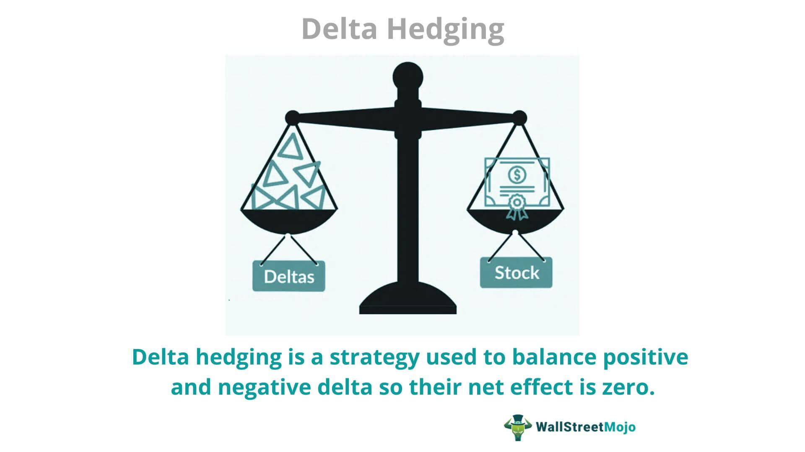

Options trading, a prominent activity within financial markets, is both celebrated for its potential to yield substantial returns and feared for the risks it presents. Options are complex financial instruments that derive their value from underlying assets like stocks, indices, or commodities. Traders utilize options to speculate on market movements or hedge existing positions, but the intricate nature of these derivatives necessitates comprehensive risk management strategies to avert significant financial losses.

Effective risk management is paramount for traders engaging in options trading, where techniques such as delta hedging play a pivotal role. Delta hedging is a sophisticated strategy employed to mitigate the risks associated with the directional movement of an underlying asset. At its core, delta hedging involves adjusting a trader's portfolio to achieve a delta-neutral position, thereby minimizing the impact of price fluctuations on the overall portfolio value. While achieving a neutral delta position requires continuous monitoring and adjustments, it offers traders a means to shield their investments from adverse market swings.



This article seeks to examine the concept of delta hedging in detail, emphasizing its various benefits and inherent challenges. An understanding of how delta hedging interacts with algorithmic trading strategies is essential for effective risk management in options trading. Algorithmic trading, with its ability to process vast amounts of data and execute trades with speed and precision, complements delta hedging by enhancing the accuracy and efficiency of position adjustments. By integrating delta hedging with algorithmic strategies, traders can not only manage risk more effectively but also potentially enhance their trading outcomes in volatile markets.

The exploration of delta hedging encompasses its theoretical underpinnings and practical applications, providing insights into how traders can harness this technique to safeguard their portfolios. As we proceed, we will assess the advantages of delta hedging, the complexities it presents, and its application in advanced trading strategies, equipping traders with the knowledge to navigate the uncertain waters of options trading with confidence.

## Table of Contents

## Understanding Delta in Options Trading

Delta is a crucial metric in options trading, providing insight into how the price of an option will react to a $1 change in the price of its underlying asset. This sensitivity is an essential aspect for traders to understand when assessing risk and potential profit in trading strategies.

Delta values, represented as a decimal or percentage, differ between call and put options. For a call option, Delta ranges from 0 to 1. A Delta close to 1 indicates that the option's price is highly sensitive to changes in the underlying asset's price. For example, a call option with a Delta of 0.6 suggests that if the stock price increases by $1, the option's price is expected to rise by approximately $0.60. On the other hand, put options have a Delta ranging from 0 to -1, reflecting their inverse relationship with the underlying asset's price. A put option with a Delta of -0.4 implies that a $1 increase in the stock price would lead to an approximate $0.40 decrease in the option's price.

Understanding Delta is vital for traders as it not only indicates the direction and magnitude of price changes but also assists in creating hedging strategies. For instance, a trader holding a large number of call options could assess the overall portfolio Delta to determine how much the portfolio's value would change with a price shift in the underlying asset. This knowledge enables the trader to make informed decisions about adding or removing positions to maintain desired exposure and manage risk effectively.

Moreover, Delta is central to the concept of Delta hedging, a strategy employed to maintain a neutral position against market fluctuations in the underlying asset's price. By adjusting the positions in accordance with the Delta, traders can protect themselves from unfavorable movements, ensuring that the net expected change is minimized over small price intervals. Understanding Delta, therefore, is not only about gauging potential changes in an option’s price but also about enabling strategic maneuvers to optimize and safeguard trading activities in options markets.

## The Concept of Delta Hedging

Delta hedging is an essential strategy in the landscape of options trading, primarily aimed at mitigating the directional risk associated with price fluctuations of the underlying asset. This method involves adjusting the trader's position in the underlying stock to offset the option's delta—where delta represents the sensitivity of the option's price to changes in the price of the underlying asset.

A key goal of delta hedging is to achieve a delta-neutral position. In such a state, the overall delta of a portfolio is zero, meaning that small changes in the stock's price do not cause significant variations in the portfolio's value. This is achieved by taking positions in the underlying asset that offset the delta of the options position. For example, if a trader holds a call option with a delta of 0.5, owning half the number of shares as options would create a delta-neutral position. The mathematical formula for a delta-neutral position can be expressed as:

$$
\Delta_{\text{portfolio}} = \Delta_{\text{option}} \times \text{Number of Options} + \Delta_{\text{stock}} \times \text{Number of Shares} = 0
$$

Where $\Delta_{\text{stock}} = 1$ for the underlying asset. By solving for the number of shares ($\text{Number of Shares}$), traders can determine the necessary stock position to achieve neutrality.

This strategy is crucial for mitigating risk as it allows traders to protect against losses from movements in the stock's price, effectively isolating other factors, such as [volatility](/wiki/volatility-trading-strategies) and time decay, which can also influence the option's price. By maintaining a delta-neutral position, traders can focus on managing these other risk components without the added pressure of directional risk.

However, achieving and maintaining a delta-neutral position is not static. It requires continuous adjustment, as delta itself is not constant and fluctuates with changes in the price of the underlying asset, the passage of time, and other market variables. As these factors change, the delta of an option position may shift, necessitating rebalancing to maintain neutrality. This dynamic process underscores the importance of ongoing monitoring and adjustments in a delta hedging strategy.

Through effectively managing directional risk, delta hedging facilitates a greater focus on exploiting changes in other factors like volatility and interest rates, contributing to a more sophisticated risk management approach in options trading. This strategy is highly effective in reducing exposure to adverse price movements, allowing traders to maintain strategic positions without the burden of unwanted directional risks.

## The Mechanics of Delta Hedging

Delta hedging is a sophisticated risk management process designed to neutralize the directional risk of an options portfolio by adjusting the asset holdings that underlie the option contracts. The process begins with the essential task of determining the delta of the options position. Delta ($\Delta$) is a measure that indicates how much the price of an option is expected to change per $1 change in the price of the underlying asset. This calculation is often conducted utilizing advanced options pricing models, with the Black-Scholes model being the most prevalent.

The Black-Scholes model presents delta calculations for call options as follows:

$$
\Delta_{\text{call}} = N(d_1)
$$

For put options, delta is calculated as:

$$
\Delta_{\text{put}} = N(d_1) - 1
$$

In these formulas, $N(d_1)$ represents the cumulative distribution function of the standard normal distribution. The parameter $d_1$ is derived through the formula:

$$
d_1 = \frac{\ln(S/K) + (r + \sigma^2/2)T}{\sigma\sqrt{T}}
$$

Where:
- $S$ is the current price of the underlying asset.
- $K$ is the strike price of the option.
- $r$ is the risk-free interest rate.
- $\sigma$ is the volatility of the underlying security's returns.
- $T$ is the time to maturity of the option, expressed in years.

Once delta is precisely calculated, traders strategically adjust their positions in the underlying stock to counterbalance the option's delta, aiming for a delta-neutral position effectively. Achieving this involves purchasing or selling shares of the underlying asset.

To maintain a delta-neutral position, continuous monitoring and rebalancing are imperative as delta values are not static. They fluctuate with changes in the underlying asset's price and as time approaches the option's maturity (time decay). Additionally, changes in implied volatility can also alter delta values, necessitating further adjustments to maintain neutrality.

For practical implementation, algorithms can be employed to facilitate delta hedging. Here is a simple Python snippet using pseudocode to illustrate the concept:

```python
def calculate_delta(option_type, S, K, r, sigma, T):
    import scipy.stats as stats
    import numpy as np

    d1 = (np.log(S/K) + (r + sigma**2 / 2) * T) / (sigma * np.sqrt(T))
    if option_type == 'call':
        return stats.norm.cdf(d1)
    elif option_type == 'put':
        return stats.norm.cdf(d1) - 1
    else:
        raise ValueError("Invalid option type")

def adjust_position(current_stock, target_delta, option_delta):
    return current_stock - target_delta / option_delta

# Example usage:
option_type = 'call'
S = 100  # Current price of the stock
K = 100  # Strike price of the option
r = 0.01  # Risk-free rate
sigma = 0.2  # Volatility
T = 1  # Time to maturity in years

delta = calculate_delta(option_type, S, K, r, sigma, T)
current_stock = 1000  # Current stock quantity
target_delta = 0  # Target delta for neutrality

stock_adjustment = adjust_position(current_stock, target_delta, delta)
print(f"Adjust stock position by: {stock_adjustment} units")
```

This script demonstrates the fundamental steps in computing an option's delta and adjusting the stock holdings accordingly. Accurate execution of these operations ensures that an investor's options position is effectively insulated from the adverse directional movements of the market. Through continuous recalibration, delta hedging stands as a critical facet of contemporary financial risk management.

## Advantages of Delta Hedging

Delta hedging offers several advantages, making it a vital strategy for options traders seeking effective risk management. Primarily, it serves as a robust method for mitigating risk by providing protection against adverse price movements of the underlying asset. This protection is achieved by maintaining a balanced position that offsets potential losses incurred by shifts in the asset’s price.

The flexibility of delta hedging is another significant advantage. It empowers traders to adapt to changing market conditions by continuously adjusting their positions to maintain a delta-neutral state. A delta-neutral position is when the sum of the delta values for an option and its underlying asset is zero, effectively neutralizing the impact of price movements of the underlying asset on the portfolio. This can be particularly beneficial in volatile markets, where frequent price changes may otherwise lead to substantial losses.

Moreover, delta hedging enhances potential returns by allowing traders to concentrate on aspects like changes in volatility rather than just price movements. Volatility, a measure of the variation in price over time, can significantly influence the pricing of options. By focusing on volatility through delta hedging, traders can exploit differences between implied volatility and expected future volatility to generate profits.

Importantly, delta hedging can also integrate with other sophisticated strategies, such as gamma and vega hedging, to create a more comprehensive risk management framework. While delta hedging primarily concerns short-term price movements, combining it with gamma hedging can help manage the risk associated with changes in delta, and vega hedging can address sensitivity to volatility. This multifaceted approach allows traders to fine-tune their risk profiles further.

In summary, delta hedging is a strategic tool that offers risk reduction, adaptability, and the opportunity to capitalize on volatility, making it invaluable for experienced options traders aiming to enhance their trading strategy's efficacy.

## Challenges of Delta Hedging

Delta hedging, while a beneficial risk management strategy in options trading, is inherently complex and requires a comprehensive understanding of options pricing along with continuous attention. One of the major challenges associated with delta hedging is the need for frequent adjustments to maintain a delta-neutral position. As market conditions fluctuate, the delta of an options position changes, necessitating constant rebalancing. This can be a labor-intensive process and is especially pronounced in volatile markets where price swings are more frequent.

Each adjustment in the hedging strategy incurs transaction costs, which can accumulate significantly over time. These costs can erode profits and are particularly burdensome in high-frequency trading environments. As such, traders must weigh the benefits of maintaining a perfectly hedged position against the financial impact of transaction fees.

Despite its effectiveness in reducing directional risk, delta hedging is not infallible. Several factors, such as changes in volatility, time decay (theta), and [interest rate](/wiki/interest-rate-trading-strategies) fluctuations, can affect its performance. For example, while delta hedging can stabilize portfolio value against immediate price movements, it does not address the risk associated with volatility shifts. This is where other risk measures like vega and gamma become relevant, as they capture the sensitivity of the portfolio to volatility changes and the rate of change of delta, respectively.

Time decay, or theta, represents the erosion of an option’s value as it approaches expiration. Since delta hedging focuses primarily on price changes, it may not adequately protect against losses due to time decay. Moreover, variations in interest rates can alter the cost of [carry](/wiki/carry-trading) for the underlying asset, potentially impacting the hedging strategy's effectiveness.

Given these challenges, successful delta hedging necessitates not only an understanding of the current market environment but also the capacity to anticipate future market movements. Advanced monitoring tools and robust algorithmic solutions can aid in managing these complexities. However, even with technological support, the need for skilled judgment remains critical, underscoring why delta hedging is primarily employed by experienced traders.

## Real-World Applications and Advanced Strategies

Delta hedging is a pivotal component of risk management in real-world trading practices, frequently integrated with other sophisticated techniques like gamma and vega hedging to enhance risk mitigation. These advanced strategies allow for a more comprehensive approach to managing the complexities of options trading.

Gamma hedging, as an extension of delta hedging, targets the management of changes in delta itself. In mathematical terms, gamma ($\Gamma$) is the second derivative of an option's price concerning the price of the underlying asset, reflecting how delta ($\Delta$) changes as the stock price fluctuates. For instance, while delta hedging maintains a neutral position with respect to small stock price changes, gamma hedging stabilizes the delta during larger shifts by quantifying the curvature of the price graph. By managing gamma, traders can reduce the need for frequent rebalancing, effectively controlling delta variations without direct intervention.

Vega hedging, on the other hand, focuses on the sensitivity of an option's price to changes in the volatility of the underlying asset. Vega ($\nu$) measures how the option's price is affected by a 1% change in implied volatility. In periods of heightened market volatility, vega hedging becomes crucial as options' prices tend to be more responsive to volatility changes than to changes in the stock price itself. By implementing vega hedging, traders can protect portfolios from adverse impacts due to volatility shifts, ensuring that option positions remain insulated from sudden volatility spikes.

Algorithmic trading platforms play a significant role in executing these advanced strategies. These platforms are equipped with algorithms capable of continuously monitoring market conditions, calculating relevant greeks like delta, gamma, and vega, and automatically rebalancing positions to maintain hedges efficiently. By integrating historical data analysis, pattern recognition, and [machine learning](/wiki/machine-learning), traders can optimize their hedge strategies to adapt swiftly to market dynamics. Professional certifications, such as the Chartered Market Technician (CMT) or the Financial Risk Manager (FRM), provide traders with the theoretical understanding and analytical skills necessary for implementing multifaceted hedging strategies successfully.

Incorporating delta, gamma, and vega hedging allows traders to achieve a multi-layered defense against market risks, leveraging technology and expertise to refine risk management in options trading. These strategies are essential for seasoned traders aiming to optimize returns while minimizing exposure to market volatilities.

## Conclusion

Delta hedging is an integral component of effective risk management in options trading. It enables traders to mitigate price movement risks of the underlying asset by achieving a delta-neutral position. This strategy is particularly beneficial in volatile markets, offering traders flexibility to adjust positions dynamically and focus on other market variables like volatility. By neutralizing the directional risk, delta hedging allows for more sophisticated trading strategies where attention can be shifted towards exploiting changes in volatility and other Greeks.

However, the complexity of delta hedging cannot be understated. The process requires a thorough understanding of options pricing, frequent recalibration of positions, and a keen eye on market fluctuations. Such demands make it a strategy best suited for experienced traders who possess the necessary skill set and resources. The costs associated with continuous adjustments, particularly in high-frequency trading environments, should be carefully evaluated as they can erode potential profits.

To excel in delta hedging, continuous learning and practical application are essential. Leveraging technology, such as [algorithmic trading](/wiki/algorithmic-trading) platforms, and staying informed on the latest financial models can significantly enhance a trader's capability to implement delta hedging effectively. Professional certifications and advanced trading courses can also provide valuable knowledge and tools, enabling traders to refine their strategies. As the financial markets evolve, so too does the need for sophisticated risk management techniques like delta hedging, underscoring the importance of ongoing education and adaptability in the dynamic landscape of options trading.

## References & Further Reading

[1]: [Black, F., & Scholes, M. (1973). "The Pricing of Options and Corporate Liabilities."](https://www.jstor.org/stable/1831029) Journal of Political Economy, 81(3), 637-654.

[2]: Hull, J. C. (2017). ["Options, Futures, and Other Derivatives."](https://www.semanticscholar.org/paper/Options%2C-Futures%2C-and-Other-Derivatives-Hull/89bdee500c8623864fc9eb7a471546aa713acc44) Pearson Education.

[3]: Taleb, N. N. (1997). ["Dynamic Hedging: Managing Vanilla and Exotic Options."](https://www.amazon.com/Dynamic-Hedging-Managing-Vanilla-Options/dp/0471152803) Wiley Finance.

[4]: Wilmott, P. (2006). ["Paul Wilmott Introduces Quantitative Finance."](https://www.amazon.com/Paul-Wilmott-Introduces-Quantitative-Finance/dp/0470319585) Wiley.

[5]: Haug, E. G. (2007). ["The Complete Guide to Option Pricing Formulas."](https://www.amazon.com/Complete-Guide-Option-Pricing-Formulas/dp/0786312408) McGraw Hill Professional.

[6]: [Avellaneda, M., & Zhu, J. (1998). "Optimal High-Frequency Delta Hedging."](https://link.springer.com/article/10.1007/s10854-024-13834-4) SIAM Journal on Control and Optimization, 36(3), 822-846.