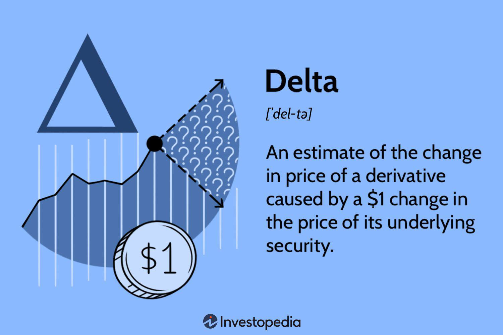

The world of financial trading is complex, comprising a wide array of tools and strategies that cater to the diverse needs of market participants. Investors and traders have at their disposal a variety of instruments that range from basic stocks and bonds to more sophisticated products such as derivatives. This article focuses specifically on the aspects of delta derivatives trading, financial derivatives, and algorithmic (algo) trading, areas that have gained prominence due to their potential for profit and risk management.

Delta derivatives trading involves options, which are financial contracts that derive their value from an underlying asset. Delta, a key concept within options trading, measures the sensitivity of the option's price to changes in the price of the underlying asset. This metric is instrumental for traders in assessing risk and making informed decisions. Understanding delta's role in pricing models can significantly enhance a trader's ability to predict market behaviors and optimize their trading portfolios.



Financial derivatives such as options, futures, and swaps are vital components of modern financial systems. These contracts allow traders to hedge against risks, speculate on future price movements, and leverage positions. By exploring the various types of financial derivatives, this article sheds light on their role in risk management and speculative trading, providing insight into how these instruments shape market dynamics.

Algorithmic trading, on the other hand, represents a technological advancement in financial markets. Utilizing computer algorithms, traders can execute orders at speeds and frequencies previously unimaginable. Algorithmic trading offers several advantages, including improved accuracy, reduced transaction costs, and the ability to capitalize on market inefficiencies. The impact of this technology on market dynamics and liquidity presents both opportunities and challenges for market participants.

Throughout this article, we will examine the fundamental concepts, strategies, and technological transformations shaping delta derivatives trading and algorithmic trading. This exploration will enhance the understanding of how these elements interact within the financial derivatives market, offering insights into how they influence trading approaches and decision-making processes. As the landscape of financial trading continues to evolve, staying informed about these developments is crucial for traders seeking to navigate and thrive in this dynamic environment.

## Table of Contents

## Understanding Delta in Derivatives Trading

Delta is a fundamental metric in derivatives trading, specifically used in options trading to measure the sensitivity of an option's price to changes in the price of the underlying asset. Mathematically, delta ($\Delta$) is defined as the partial derivative of the option's price ($V$) with respect to the price of the underlying asset ($S$):

$$
\Delta = \frac{\partial V}{\partial S}
$$

This measure indicates the expected change in the option's price for a one-dollar increase in the price of the underlying asset. If an option has a delta of 0.5, for example, the option's price is expected to increase by 50 cents if the underlying asset's price increases by one dollar.

Delta is critical for traders as it provides insight into the risk associated with holding an option position. By understanding delta, traders can make informed decisions about hedging their portfolios to protect against unfavorable price movements in the underlying asset. A positive delta indicates that the option's price moves in the same direction as the underlying asset, while a negative delta suggests an inverse relationship.

### Calculation of Delta

In practice, delta can be calculated using pricing models such as the Black-Scholes model for European options. The formula for the delta of a call option under the Black-Scholes framework is:

$$
\Delta_{\text{call}} = N(d_1)
$$

For a put option, delta is calculated as:

$$
\Delta_{\text{put}} = N(d_1) - 1
$$

where $N(d_1)$ is the cumulative distribution function of the standard normal distribution, and $d_1$ is given by:

$$
d_1 = \frac{\ln(S/K) + (r + \sigma^2/2)T}{\sigma\sqrt{T}}
$$

Here, $S$ is the current price of the underlying asset, $K$ is the strike price of the option, $r$ is the risk-free [interest rate](/wiki/interest-rate-trading-strategies), $\sigma$ is the [volatility](/wiki/volatility-trading-strategies) of the underlying asset, and $T$ is the time to expiration.

### Significance in Pricing Models

Delta plays a pivotal role in option pricing models, providing an estimate of the likelihood that an option will expire in-the-money. A delta closer to 1 or -1 suggests a higher probability of finishing in-the-money, while a delta near 0 indicates a low probability. This probabilistic interpretation helps traders assess the expected payoff of options and devise strategies that align with market expectations and risk tolerance.

Moreover, delta is instrumental in constructing delta-neutral portfolios, where traders aim to balance their delta exposure to minimize sensitivity to market movements. This involves taking offsetting positions to achieve a net delta of zero, thereby mitigating the risk associated with price fluctuations of the underlying asset.

Understanding and utilizing delta effectively allows traders to optimize their trading strategies, manage risk, and improve their decision-making process in dynamic financial markets.

## Financial Derivatives: An Overview

Financial derivatives are financial instruments whose value is reliant on the performance of an underlying asset or benchmark. Common underlying assets include stocks, bonds, currencies, interest rates, or market indexes. Derivatives are used by investors for a variety of purposes, including risk management, hedging, [arbitrage](/wiki/arbitrage), and speculation.

### Types of Financial Derivatives

1. **Options**: These are contracts that give the holder the right, but not the obligation, to buy or sell an underlying asset at a predetermined price before a specified expiration date. Options are typically used to hedge against price movements or to speculate on the price direction of an asset. The two main types of options are:
   - **Call Options**: Give the holder the right to buy an asset.
   - **Put Options**: Give the holder the right to sell an asset.

   The price of an option is influenced by several factors, including the price of the underlying asset, the strike price, time to expiration, volatility, and interest rates.

2. **Futures**: These standardized contracts obligate the parties to transact an asset at a predetermined future date and price. Futures are commonly used for commodities and financial instruments, and they are traded on exchanges. Investors use futures to hedge against price changes or to speculate on future price movements.

3. **Swaps**: These are financial agreements wherein two parties exchange cash flows or liabilities from two different financial instruments. The most common type of swap is the interest rate swap, where parties exchange cash flows based on a principal amount to hedge against interest rate fluctuations.

### Role of Derivatives in Risk Management and Speculative Trading

Derivatives play a crucial role in financial markets by providing mechanisms for risk management and speculation. 

- **Risk Management and Hedging**: One of the primary purposes of derivatives is to manage risk. Investors use derivatives to hedge against potential losses in an asset's price. For instance, an investor holding a stock portfolio subject to market volatility might use options or futures to protect against potential declines in portfolio value. By using derivatives, firms and investors can maintain their portfolios within acceptable levels of risk.

- **Speculative Trading**: Besides hedging, derivatives are also used for speculative purposes. Traders and investors use derivatives to bet on the future direction of asset prices. Since derivatives often require less capital than direct investments in the underlying assets, they can amplify potential gains as well as losses, making them attractive for speculative strategies.

In conclusion, financial derivatives are integral components of modern financial markets, offering flexibility, leverage, and risk management capabilities. By understanding their mechanics, investors can better position themselves to manage risk and take advantage of various market opportunities.

## The Role of Algorithmic Trading in Financial Markets

Algorithmic trading, or algo trading, utilizes computer programs to execute trades according to predefined criteria. This method has evolved significantly since its inception, with early implementations focusing on basic rule-based systems to current strategies that encompass sophisticated algorithms involving [machine learning](/wiki/machine-learning) and [artificial intelligence](/wiki/ai-artificial-intelligence).

### Evolution of Algorithmic Trading

The origins of [algorithmic trading](/wiki/algorithmic-trading) trace back to the 1970s when stock exchanges began to support fully electronic trading platforms. This transition marked the start of using technology to enhance trading efficiency and reduce the costs associated with manual processes. By the late 1990s and early 2000s, the advancement in computing power and the internet's widespread availability fostered a dramatic expansion of algorithmic trading practices.

### Advantages of Algorithmic Trading

The main advantages of algorithmic trading include:

1. **Speed**: Algo trading allows for rapid execution of orders, which is crucial in high-frequency trading (HFT). This speed enables traders to capitalize on small price movements that happen in fractions of a second, making it possible to execute thousands of trades in a day.

2. **Accuracy**: By eliminating human error that may occur during manual trading, algorithms ensure that trades are executed as per the predefined criteria without deviation. This enhances precision in implementing complex strategies, including those involving multiple assets or instruments.

3. **Cost Reduction**: Automated trading can reduce the transaction costs associated with traditional trading methods. By optimizing the order placement, algo trading can minimize bid-offer spreads and reduce market impact costs.

4. **Consistency**: Algorithms consistently apply trading strategies without the emotional influences that can affect human decision-making. This consistency helps maintain strategy integrity over time.

### Impact on Market Dynamics and Liquidity

Algorithmic trading has significantly influenced market dynamics and [liquidity](/wiki/liquidity-risk-premium):

- **Market Liquidity**: Algo trading enhances liquidity by facilitating continuous buy and sell offers, thus reducing spreads. However, during times of market stress, algorithms can exacerbate volatility, leading to liquidity withdrawal as they react simultaneously in similar patterns.

- **Price Discovery**: The speed and efficiency of algorithms contribute to efficient price discovery. Algo trading ensures that prices adjust quickly to new information, making markets more efficient.

- **Market Structure Changes**: The increased dominance of algorithmic and HFT traders has altered traditional market structures. Exchanges have adapted by offering co-location services and promoting fee structures favorable to large-volume traders.

Despite the advantages, algorithmic trading also poses challenges. The 2010 "Flash Crash," where the Dow Jones Industrial Average plunged nearly 1,000 points within minutes before swiftly recovering, underscored the potential risks linked to algorithmic strategies. Such incidents highlight the necessity for robust risk management frameworks and regulatory oversight to mitigate systemic risks.

Algorithmic trading continues to evolve as computational methods advance, promising further efficiencies and challenges for financial markets.

## Delta-Neutral Strategies and Risk Management

Delta-neutral strategies are a fundamental aspect of risk management in options and derivatives trading. The primary objective of these strategies is to construct a portfolio with a net delta of zero—meaning the portfolio's value remains unaffected by small changes in the price of the underlying asset. This neutrality allows traders to effectively hedge their positions against market volatility while focusing on other factors such as time decay or changes in implied volatility.

## Delta Spreading and Calendar Spreads

One common approach to achieving delta neutrality is through delta spreading, which involves buying and selling different options to balance the delta across the portfolio. For example, a trader could balance a short position in a call option with a corresponding long position in a put option of the same underlying asset, thus offsetting their respective deltas.

Calendar spreads, another technique, focus on options with different expiration dates but the same strike price. By purchasing an option with a longer expiration and selling one with a shorter expiration, traders can capitalize on the differing rates of time decay (theta), while maintaining a neutral delta position. This strategy can be particularly useful in volatile markets, where expiration timing can significantly impact profitability.

## Importance in Hedging and Portfolio Management

Delta-neutral strategies play a critical role in hedging by allowing traders to minimize directional market risk. In essence, by creating a position where the net delta is zero, traders protect their portfolios from adverse price movements of the underlying asset. This is particularly advantageous in a volatile market, helping to reduce the risk of unexpected losses.

In portfolio management, maintaining delta neutrality enables portfolio managers to focus on other risk factors, such as volatility risk (vega) and interest rate risk (rho), without worrying about price movements in the underlying asset. This holistic approach to risk management ensures a more balanced portfolio that can withstand various market conditions. Additionally, delta-neutral strategies afford traders flexibility to profit from movements in other Greeks, such as gamma or theta, by strategically adjusting positions over time.

By effectively applying delta-neutral strategies, traders can enhance their ability to manage risk while improving the potential for profit in complex trading environments. Through techniques such as delta spreading and calendar spreads, they create robust hedging mechanisms essential for sophisticated portfolio management.

## Examples and Case Studies

In the world of financial trading, delta hedging is an essential risk management tool used to mitigate the effects of price movements in the underlying asset of an option. One common approach to achieving delta neutrality involves adjusting the quantities of the underlying asset and derivative instruments in a portfolio such that the overall delta is zero. This allows traders to insulate their positions from small fluctuations in the market.

### Practical Examples of Delta Hedging

Consider an options trader holding a call option with a delta of 0.60, meaning the option's price is expected to move 60 cents for every $1 change in the underlying asset's price. To maintain a delta-neutral position, the trader can short 60 units of the underlying asset for every call option held. This strategy ensures that gains or losses from the change in the price of the underlying asset are offset by corresponding losses or gains in the option's value.

#### Python Code Example for Delta Hedging

The following Python code demonstrates a simple delta hedging strategy using the Black-Scholes model to calculate the delta of a call option:
```python
from scipy.stats import norm
import numpy as np

def black_scholes_delta(S, K, T, r, sigma, option_type='call'):
    d1 = (np.log(S / K) + (r + 0.5 * sigma ** 2) * T) / (sigma * np.sqrt(T))
    if option_type == 'call':
        return norm.cdf(d1)
    elif option_type == 'put':
        return norm.cdf(d1) - 1
    else:
        raise ValueError("option_type must be 'call' or 'put'")

# Parameters
S = 100     # Current stock price
K = 100     # Strike price
T = 1       # Time to expiration in years
r = 0.05    # Risk-free rate
sigma = 0.2 # Volatility
delta = black_scholes_delta(S, K, T, r, sigma)

print(f"Delta of the call option: {delta}")
```

### Case Studies in Delta-Neutral Strategies and Algorithmic Trading

#### Case Study 1: Delta-Neutral Portfolio Strategy
A [hedge fund](/wiki/hedge-fund-trading-strategies) implemented a delta-neutral strategy using calendar spreads to benefit from time decay. By simultaneously purchasing and selling calls of the same underlying asset but with different expiration dates, the fund successfully minimized exposure to directional movements while maximizing the decay difference. This approach proved profitable in a low-volatility market by capitalizing on the expected differential rate of time decay.

#### Case Study 2: Algorithmic Trading Execution
Algorithmic trading firms have increasingly adopted delta-neutral strategies to enhance execution efficiency. For instance, a prominent trading firm employed an algorithm that continuously adjusted its hedge ratios in real-time as market conditions fluctuated. This allowed the firm to maintain neutrality as the underlying asset's price and volatility changed throughout the trading day.

### Lessons from Historical Data

Analysis of historical trading data reveals several key lessons for practitioners seeking to refine their delta hedging and trading strategies:
- **Dynamic Adjustment**: Regular recalibration of delta positions is crucial as market conditions evolve, especially in volatile environments where underlying asset prices can shift dramatically within short periods.
- **Risk Management**: Employing a delta-neutral strategy does not eliminate risk entirely. Other Greeks, such as gamma and vega, should also be considered to understand the full scope of risks.
- **Technological Integration**: Successful execution often relies on integrating advanced computational tools capable of monitoring and adjusting positions in real time, underscoring the importance of technology in modern trading.

These insights highlight the complexity and necessity of delta derivatives trading strategies in mitigating market risks and optimizing returns.

## The Future of Delta Derivatives Trading and Algo Trading

Innovation in algorithmic trading and advancements in computing power continue to shape the future of trading. The increasing complexity and speed required in modern financial markets have driven traders and institutions to adopt innovative technologies. Among these, artificial intelligence (AI) and machine learning (ML) present significant opportunities to enhance delta derivatives trading.

AI and ML algorithms enable traders to analyze vast datasets quickly, identifying patterns and trends that humans might miss. In delta derivatives trading, these technologies can optimize portfolio management and execute delta-neutral strategies with greater precision. Algorithms can learn from historical data to predict market movements, thus assisting in the dynamic adjustment of delta hedging strategies. Python, with libraries such as TensorFlow and scikit-learn, provides a robust framework for developing these complex models.

For instance, an AI-powered trading system could continuously monitor a portfolio's delta exposure, automatically executing trades to maintain a delta-neutral position. This reduces manual intervention, decreases the likelihood of human error, and allows for real-time risk management. Such systems could also integrate [deep learning](/wiki/deep-learning) techniques to account for non-linear market dynamics, enhancing prediction accuracy.

Despite these advancements, trading with AI and ML technologies poses several challenges. Regulatory impacts loom large, as financial authorities worldwide strive to catch up with rapidly evolving technologies. The intricacies of machine-generated trades and their compliance with existing financial regulations present ongoing scrutiny. As these systems become more autonomous, regulators face challenges in ensuring market stability and preventing unfair trading practices.

Moreover, ethical concerns about algorithmic trading must be addressed. High-frequency trading, driven by algorithms, has previously triggered market disruptions, such as the 2010 Flash Crash. Ensuring that AI systems are transparent and accountable is crucial in fostering trust in automated trading. Discussions on establishing ethical guidelines for AI in trading are ongoing, with stakeholders urging a balance between innovation and market integrity.

In conclusion, while AI and ML stand to revolutionize delta derivatives trading, they also necessitate careful consideration of regulatory and ethical implications. Traders and institutions must remain cognizant of these challenges as they harness technology's potential, ensuring a responsible evolution in trading methodologies.

## Conclusion

Understanding delta and algorithmic trading within the financial derivatives market offers significant advantages to traders. Delta, a key metric in options trading, provides critical insight into how an option’s price is likely to change as the underlying asset moves. This understanding aids traders in crafting informed strategies that manage risk and capitalize on potential profits. Delta's role in pricing models forms a foundation for executing precise trading decisions, making it indispensable for options traders who seek to maximize returns while minimizing exposure to market fluctuations.

Algorithmic trading has become a cornerstone of modern financial markets. It enables the execution of trades with unmatched speed and accuracy, leveraging technology to process vast amounts of data and make decisions in real-time. The evolution of algo trading reflects a significant shift in how trades are conducted, contributing to enhanced market liquidity and efficiency. Algorithms can execute complex strategies across various asset classes, adapting to market conditions at speeds unattainable by human traders. This technological advancement has revolutionized trading, allowing for the implementation of sophisticated models and strategies that were previously unimaginable.

The trading landscape is continuously evolving, driven by innovation and advancement in technology. As these developments unfold, traders must stay informed and adapt to new strategies and tools. The integration of artificial intelligence and machine learning into trading further expands the horizon, offering unprecedented opportunities to analyze and predict market behavior. However, these advancements also present challenges, including regulatory considerations and ethical implications. Hence, continuous learning is crucial for traders to maintain their edge and effectively navigate the complexities of the market.

In conclusion, understanding delta and leveraging algorithmic trading are vital components of successful trading in the financial derivatives market. These elements not only enhance decision-making and risk management but also offer traders a competitive advantage in a rapidly changing environment. As trading strategies and technologies evolve, traders who embrace these changes and remain committed to learning will be better positioned to succeed amid the dynamics of financial markets.

## References & Further Reading

[1]: Hull, J. C. (2018). ["Options, Futures, and Other Derivatives (10th Edition)"](https://www.amazon.com/Options-Futures-Other-Derivatives-10th/dp/013447208X). Pearson.

[2]: Black, F., & Scholes, M. (1973). ["The Pricing of Options and Corporate Liabilities."](https://www.cs.princeton.edu/courses/archive/fall09/cos323/papers/black_scholes73.pdf) The Journal of Political Economy, 81(3), 637-654.

[3]: Lopez de Prado, M. (2018). ["Advances in Financial Machine Learning."](https://www.amazon.com/Advances-Financial-Machine-Learning-Marcos/dp/1119482089) Wiley.

[4]: Chan, E. (2009). ["Quantitative Trading: How to Build Your Own Algorithmic Trading Business."](https://github.com/justinchou/books-quantitative-trading) Wiley.

[5]: Jansen, S. (2018). ["Machine Learning for Algorithmic Trading."](https://www.amazon.com/Hands-Machine-Learning-Algorithmic-Trading/dp/178934641X) 

[6]: Wilmott, P. (2006). ["Paul Wilmott Introduces Quantitative Finance (2nd Edition)."](https://www.wiley.com/en-us/Paul+Wilmott+Introduces+Quantitative+Finance,+2nd+Edition-p-9781118836798) Wiley.

[7]: MacKenzie, D., & Spears, T. (2018). ["The Formula That Killed Wall Street: The Gaussian Copula and Modeling Risk."](https://journals.sagepub.com/doi/10.1177/0306312713517157) Insights into the risks of financial modeling.

[8]: Shah, N. (2015). ["Algorithmic and High-Frequency Trading."](https://www.cambridge.org/us/universitypress/subjects/mathematics/mathematical-finance/algorithmic-and-high-frequency-trading) Cambridge University Press.