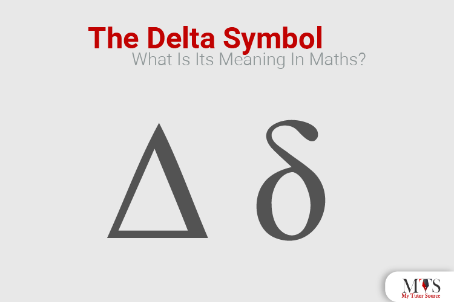

## Table of Contents

## What is the basic definition of delta in mathematics?

In mathematics, delta (often written as Δ or δ) is a symbol used to represent change or difference. It is commonly used to show how much a quantity has changed from one value to another. For example, if you want to know how much a person's weight has changed over a month, you might use delta to represent the difference between their starting weight and their ending weight.

Delta is also used in various fields of mathematics and science. In calculus, delta is used to represent small changes in variables, which is important for understanding concepts like derivatives and integrals. In physics, delta might be used to show changes in position, velocity, or other measurements. Overall, delta is a versatile symbol that helps mathematicians and scientists express changes and differences in a clear and concise way.

## How is delta used to represent change in various mathematical contexts?

In math, delta is often used to show how things change. For example, if you want to know how much a number has changed, you can use delta. Let's say you have a number that starts at 5 and then changes to 8. The delta would be the difference between these two numbers, which is 3. This helps people see the change easily. In algebra, delta is used a lot to show how variables change. If you have a formula and one of the numbers in it changes, you can use delta to show that change.

Delta is also important in calculus. In calculus, people often look at very small changes in numbers. They use delta to represent these tiny changes. For example, if you want to find out how fast something is changing at a certain point, you might use delta to help you. Delta helps break down big problems into smaller, easier parts. In physics, delta is used to show changes in things like speed or position. If a car goes from standing still to moving, delta can show how much its speed has changed. This makes it easier to understand and solve problems in science and math.

## Can you explain the use of delta in calculus, specifically in the context of derivatives?

In calculus, delta is super important when we talk about derivatives. A derivative tells us how fast something is changing at a certain point. Imagine you're watching a car move along a road. The derivative would tell you its speed at any moment. To find this, we use delta to look at tiny changes in the car's position over tiny changes in time. We call these tiny changes in position "delta x" and the tiny changes in time "delta t." By seeing how delta x changes with delta t, we can figure out the car's speed, which is the derivative.

The way we use delta to find the derivative is by making delta t smaller and smaller. As delta t gets really tiny, the ratio of delta x to delta t gets closer to the true speed of the car at that moment. This process is called taking the limit as delta t approaches zero. When we do this, delta x divided by delta t becomes the derivative, which we write as dx/dt. So, delta helps us understand how things change by looking at really small changes and then zooming in on them until we see the exact rate of change at a single point.

## What is the significance of the Kronecker delta in linear algebra?

The Kronecker delta is a special symbol in linear algebra that helps us work with matrices and vectors. It's usually written as δ_ij, where i and j are two numbers. The Kronecker delta is super simple: it equals 1 if i and j are the same number, and it equals 0 if they are different. This might sound basic, but it's really useful because it helps us do things like find out if two vectors are pointing in the same direction or if they are totally different.

In linear algebra, the Kronecker delta is used a lot when we're working with sums and products of matrices. For example, when we want to multiply two matrices together, we use the Kronecker delta to keep track of which parts of the matrices we should pay attention to. It helps us simplify our calculations and understand how the different parts of the matrices relate to each other. So, even though the Kronecker delta is a simple idea, it's a powerful tool that makes working with linear algebra a lot easier.

## How is the Dirac delta function used in mathematics and physics?

The Dirac delta function is a special tool used in math and physics to help us focus on specific points. Imagine you have a long line and you want to zoom in on just one spot on that line. The Dirac delta function, often written as δ(x), helps you do that. It's like a super tall, super thin spike at the point you're interested in, and it's zero everywhere else. This function is really useful because it helps us solve problems where we need to look at what's happening at a single point, like how much force is acting on an object at a specific moment.

In physics, the Dirac delta function is used a lot in things like quantum mechanics and electromagnetism. For example, in quantum mechanics, it can represent how a particle might be found at a certain position. In electromagnetism, it can help us understand how charges or currents are spread out in space. Even though the Dirac delta function might seem a bit weird because it's not a regular function, it's a powerful tool that helps us simplify complex problems and focus on the parts that matter most.

## What role does delta play in the concept of limits and continuity?

Delta is really important when we talk about limits and continuity in math. When we want to know the limit of a function at a certain point, we use delta to help us get closer and closer to that point. Imagine you're trying to find out what a function is doing right at a specific spot. You can't just jump right to that spot, so you use delta to take tiny steps towards it. Delta helps us see how the function behaves as we get closer and closer, and it tells us if the function is getting to a certain value or not. This is super useful because it helps us understand if a function is behaving smoothly or if it's jumping around.

In the concept of continuity, delta works together with another symbol called epsilon. Continuity means that a function doesn't have any sudden jumps or breaks. To check if a function is continuous at a point, we use delta to look at how close we can get to that point, and epsilon to see how close the function's value gets to what we expect it to be. If we can make the difference between the function's value and the expected value as small as we want by choosing a small enough delta, then the function is continuous. So, delta helps us make sure that a function is behaving nicely and smoothly all along its path.

## Can you describe the use of delta in the finite difference method?

In the finite difference method, delta helps us solve problems by breaking them into smaller, easier pieces. Imagine you want to know how something changes over time or space, but you can't solve the whole problem at once. You use delta to look at small changes in the thing you're studying. For example, if you're trying to figure out how the temperature changes across a metal rod, you can use delta to look at the temperature difference between two close points on the rod. By doing this for many small sections, you can understand how the temperature changes over the whole rod.

Delta is super important in this method because it lets us approximate how things change by using simple math. Instead of trying to solve a big, complicated equation all at once, we use delta to break it down into lots of tiny steps. Each step involves calculating the change over a small distance or time, which is much easier. By adding up all these small changes, we can get a good idea of how the whole system behaves. This method is used a lot in science and engineering to solve problems that would be too hard to solve otherwise.

## How is delta utilized in the field of differential equations?

In the field of differential equations, delta helps us understand how things change over time or space. Imagine you have a problem where you need to know how something like the population of a city or the temperature in a room changes. You can use delta to look at the small changes in these things. For example, if you want to know how the population changes each year, you can use delta to represent the change from one year to the next. This helps you set up equations that show how the population grows or shrinks over time.

Delta is also important when we solve these equations. Sometimes, we can't solve a differential equation directly, so we use methods like the finite difference method, which we talked about before. In this method, we break the problem into smaller pieces and use delta to look at the changes between these pieces. By doing this, we can approximate the solution to the equation. So, delta helps us both understand and solve differential equations by focusing on the small changes that make up the bigger picture.

## What is the importance of delta in statistical mechanics and thermodynamics?

In statistical mechanics and thermodynamics, delta is used to show how things change. Imagine you're studying how the energy of a bunch of tiny particles changes over time. Delta helps you focus on these small changes. For example, if you want to know how the energy of a gas changes when you heat it up, you can use delta to look at the difference in energy before and after you add the heat. This helps you understand how the whole system behaves by looking at the tiny changes that happen inside it.

Delta is also important when you're trying to figure out things like heat capacity or entropy. These are big ideas in thermodynamics that tell you how much energy a system can hold or how messy its energy is spread out. By using delta, you can see how these things change when you change something else, like the temperature or the [volume](/wiki/volume-trading-strategy) of the system. So, delta helps you break down complex problems in statistical mechanics and thermodynamics into smaller, easier-to-understand pieces.

## How does the delta operator function in discrete mathematics?

In discrete mathematics, the delta operator is used to show how things change from one step to the next. Imagine you have a list of numbers and you want to know how each number changes as you go down the list. The delta operator helps you find the difference between each pair of numbers. For example, if you have the numbers 2, 5, 9, 14, the delta operator would show you the changes: from 2 to 5 is a change of 3, from 5 to 9 is a change of 4, and from 9 to 14 is a change of 5. This helps you see patterns and understand how the numbers are changing.

The delta operator is also useful when you're working with sequences and series. If you have a sequence like 1, 4, 9, 16, which are the squares of the numbers 1, 2, 3, 4, the delta operator can help you find out how the sequence changes. By looking at the differences between the numbers, you can figure out if there's a rule or pattern to how the sequence grows. This is important in discrete math because it helps you solve problems and predict what will happen next in a sequence.

## Can you explain the advanced applications of delta in topology and measure theory?

In topology, delta is used to help us understand how spaces are connected and how they change. Imagine you're trying to figure out if you can smoothly move from one part of a space to another without any breaks or jumps. Delta can help you do this by looking at small changes in the space. For example, if you have a rubber sheet and you want to know if you can stretch it without tearing it, delta helps you see how the sheet changes as you stretch it. This is important because it helps us understand the properties of different shapes and spaces, like whether they are continuous or if they have holes or gaps.

In measure theory, delta is used to help us measure things in a more precise way. Imagine you're trying to figure out the length of a very wiggly line or the area of a shape with lots of tiny bumps. Delta helps you break these shapes into smaller pieces and measure the changes between them. By doing this, you can get a better idea of the total length or area. This is important because it helps us understand things like probability and how likely certain events are to happen. Delta makes it easier to work with complex shapes and spaces by focusing on the small changes that make them up.

## What are some cutting-edge research areas involving delta in mathematics?

In recent math research, delta is being used in new ways to understand how things change in complex systems. Scientists are looking at how delta can help them study things like networks, where delta shows how connections between different parts of the network change over time. This is important for understanding things like the internet or social media, where connections are always changing. By using delta, researchers can see patterns and predict how these networks will grow or shrink. This helps them solve problems and make better decisions about how to manage these systems.

Another exciting area where delta is being used is in [machine learning](/wiki/machine-learning) and [artificial intelligence](/wiki/ai-artificial-intelligence). Here, delta helps researchers understand how small changes in data can affect the outcomes of their models. For example, if you're teaching a computer to recognize pictures, delta can show how small changes in the pictures affect what the computer thinks it sees. This helps improve the accuracy of the models and makes them better at understanding the world. By focusing on these small changes, researchers can make big improvements in how machines learn and think.

## References & Further Reading

[1]: Black, F., & Scholes, M. (1973). ["The Pricing of Options and Corporate Liabilities."](https://www.cs.princeton.edu/courses/archive/fall09/cos323/papers/black_scholes73.pdf) The Journal of Political Economy, 81(3), 637-654.

[2]: Hull, J. C. (2009). ["Options, Futures, and Other Derivatives."](https://www.amazon.com/Options-Futures-Other-Derivatives-9th/dp/0133456315) Pearson Education.

[3]: Wilmott, P. (2006). ["Paul Wilmott Introduces Quantitative Finance."](https://www.amazon.com/Paul-Wilmott-Quantitative-Finance-Set/dp/0470018704) Wiley.

[4]: Taleb, N. (1997). ["Dynamic Hedging: Managing Vanilla and Exotic Options."](https://www.amazon.com/Dynamic-Hedging-Managing-Vanilla-Options/dp/0471152803) Wiley.

[5]: Glasserman, P. (2003). ["Monte Carlo Methods in Financial Engineering."](https://link.springer.com/book/10.1007/978-0-387-21617-1) Springer.

[6]: Gatheral, J. (2006). ["The Volatility Surface: A Practitioner's Guide."](https://www.wiley.com/en-us/The+Volatility+Surface%3A+A+Practitioner%27s+Guide-p-9780471792512) Wiley Finance.

[7]: Joshi, M. (2003). ["The Concepts and Practice of Mathematical Finance."](https://assets.cambridge.org/97805215/14088/frontmatter/9780521514088_frontmatter.pdf) Cambridge University Press.