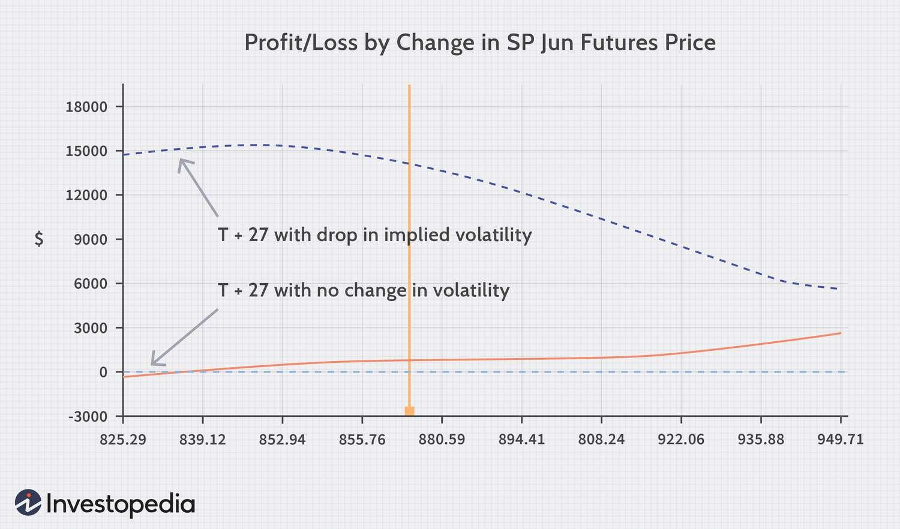

## Table of Contents

## What is delta neutral in portfolio management?

Delta neutral is a strategy used in portfolio management to reduce the risk of price movements in the assets you own. It involves balancing your portfolio so that the overall "delta" or sensitivity to price changes is zero. This means if the price of an asset goes up or down, the overall value of your portfolio should stay the same, because the gains and losses from different assets will cancel each other out.

To achieve delta neutrality, you might use options, which are financial instruments that give you the right to buy or sell an asset at a set price. For example, if you own a stock, you might buy a put option (which gives you the right to sell the stock at a certain price) to offset the risk of the stock's price falling. By carefully choosing the right mix of stocks and options, you can make your portfolio delta neutral, helping to protect it from market ups and downs.

## Why is delta neutral important for managing a portfolio?

Delta neutral is important for managing a portfolio because it helps reduce the risk from price changes in the market. When you make your portfolio delta neutral, you balance it so that if the price of one asset goes up or down, the overall value of your portfolio stays the same. This is like having a safety net that protects your investments from big swings in the market. It's especially useful for people who want to keep their portfolio stable without betting on whether the market will go up or down.

Using a delta neutral strategy can also give you more control over your investments. Instead of just hoping the market moves in your favor, you can use tools like options to fine-tune your portfolio. This means you can focus on other aspects of your investment strategy, like earning income from options or taking advantage of other market opportunities, without worrying as much about sudden price changes. In short, delta neutral helps you manage risk and gives you more flexibility in how you invest.

## How does delta neutral strategy work?

A delta neutral strategy works by balancing the sensitivity of your portfolio to price changes. Imagine you own a stock, and you want to protect it from losing value if the stock price drops. You can buy a put option, which gives you the right to sell the stock at a certain price. If the stock price goes down, the put option will gain value, offsetting the loss from the stock. This way, the overall value of your portfolio stays about the same, no matter what the stock does.

To keep your portfolio delta neutral, you need to keep adjusting it. This is because the delta, or sensitivity to price changes, can change over time. For example, as the stock price moves, the delta of your options will change too. So, you might need to buy or sell more options to keep everything balanced. It's a bit like riding a bike: you have to keep making small adjustments to stay on course. By doing this, you can protect your portfolio from big swings in the market and focus on other ways to grow your investments.

## What are the basic steps to achieve a delta neutral position?

To achieve a delta neutral position, you first need to understand the delta of the assets in your portfolio. Delta is a measure of how much the price of an asset, like a stock or an option, will change if the price of the underlying asset changes. For example, if you own a stock, its delta is 1, meaning if the stock price goes up by $1, the value of your stock goes up by $1 too. If you want to make your portfolio delta neutral, you need to find options or other assets that have a delta that can offset the delta of your stock.

Once you know the deltas, you can start balancing your portfolio. If you own a stock with a delta of 1, you can buy a put option with a delta of -1 to cancel out the stock's delta. This means if the stock price goes down, the put option will gain value, keeping your portfolio's overall value stable. You'll need to keep an eye on your portfolio and make adjustments as the deltas change over time. This might mean buying or selling more options to keep everything balanced. By doing this, you can protect your portfolio from big price swings and focus on other ways to grow your investments.

## What types of financial instruments are commonly used in delta neutral strategies?

Delta neutral strategies often use options because they are flexible and can help balance the sensitivity of your portfolio to price changes. Options come in two main types: call options, which give you the right to buy an asset at a set price, and put options, which give you the right to sell an asset at a set price. If you own a stock, you might buy a put option to protect against the stock's price dropping. This put option's delta, which measures how its price changes with the stock's price, can be used to offset the stock's delta, making your portfolio delta neutral.

Besides options, futures contracts are also used in delta neutral strategies. Futures are agreements to buy or sell an asset at a future date for a set price. Like options, futures have a delta that can help balance your portfolio. By carefully choosing and adjusting the mix of stocks, options, and futures, you can keep your portfolio's overall delta close to zero. This means your portfolio's value stays stable even if the market moves up or down, helping you manage risk and focus on other investment goals.

## How can delta neutral strategies be used to hedge against market movements?

Delta neutral strategies can help you protect your investments from big swings in the market. Imagine you own a stock and you're worried its price might drop. You can use a delta neutral strategy to balance out this risk. By buying a put option, which gives you the right to sell the stock at a certain price, you can offset any losses if the stock's price falls. The put option's value will go up if the stock's price goes down, keeping your portfolio's overall value stable. This way, you don't have to worry as much about the market going up or down.

To keep your portfolio delta neutral, you need to keep an eye on it and make adjustments. The sensitivity of your options to price changes, called delta, can change over time. So, you might need to buy or sell more options to keep everything balanced. It's like riding a bike: you have to keep making small adjustments to stay on course. By doing this, you can protect your portfolio from big price swings and focus on other ways to grow your investments. Delta neutral strategies give you more control over your investments and help you manage risk in a changing market.

## What are the risks associated with maintaining a delta neutral portfolio?

Maintaining a delta neutral portfolio can be tricky because it requires constant adjustments. As the market moves, the delta of your options and other financial instruments changes. This means you need to keep buying or selling more options to keep your portfolio balanced. If you don't keep up with these changes, your portfolio might not stay delta neutral, and you could lose money if the market moves against you. It's like trying to keep a seesaw level while people are getting on and off; it takes a lot of work and attention.

Another risk is the cost of the options you use to maintain the delta neutral position. Options aren't free, and buying them can eat into your profits. If the market stays stable, the cost of these options might be more than the gains you make from keeping your portfolio delta neutral. Also, if the market moves a lot, you might have to buy and sell options more often, which can add up quickly. So, while delta neutral strategies can help protect against market swings, they come with their own set of challenges and costs that you need to manage carefully.

## How often should a portfolio be rebalanced to maintain delta neutrality?

To keep your portfolio delta neutral, you might need to check and adjust it every day, especially if the market is moving a lot. The delta of your options and other financial instruments can change quickly, so you need to keep an eye on them. If you don't, your portfolio might not stay balanced, and you could lose money if the market goes against you. It's like trying to keep a seesaw level while people are getting on and off; you have to keep making small adjustments to stay on course.

In quieter times, when the market isn't moving as much, you might not need to rebalance your portfolio as often. Maybe once a week or even less often could be enough. But you still need to keep an eye on things because even small changes can add up over time. The key is to find a balance that works for you, so you can protect your investments without spending all your time adjusting your portfolio.

## Can delta neutral strategies be applied to different asset classes?

Delta neutral strategies can be used with different types of investments, not just stocks. For example, you can use them with commodities like gold or oil, or even with currencies. The idea is the same: you want to balance your portfolio so that if the price of one thing goes up or down, the overall value of your portfolio stays the same. You can use options or futures to do this, just like with stocks. So, if you own gold and you're worried about its price dropping, you can buy a put option on gold to protect your investment.

The key to using delta neutral strategies with different asset classes is understanding how the delta works for each type of investment. For example, the delta of a currency option might be different from the delta of a stock option. You need to keep an eye on these differences and make adjustments to keep your portfolio balanced. It might take a bit more work to manage a delta neutral portfolio with different types of assets, but it can help you protect your investments from big swings in the market, no matter what you're investing in.

## What are the advanced techniques for adjusting delta in a portfolio?

Advanced techniques for adjusting delta in a portfolio involve using more complex financial instruments and strategies. One common method is using options with different expiration dates and strike prices to fine-tune your portfolio's delta. For example, you might use a combination of short-term and long-term options to balance your portfolio's sensitivity to price changes over different time frames. This can help you manage risk more effectively, as you can adjust your exposure to the market based on how you think prices will move in the short and long term.

Another technique is to use dynamic hedging, where you constantly adjust your portfolio to keep it delta neutral. This means you might need to buy or sell options more frequently, especially if the market is moving a lot. By doing this, you can keep your portfolio balanced even when the market is volatile. It requires a lot of attention and quick decision-making, but it can help protect your investments from big swings in the market.

## How do transaction costs and slippage affect the effectiveness of delta neutral strategies?

Transaction costs and slippage can make delta neutral strategies less effective. Every time you buy or sell an option to keep your portfolio balanced, you have to pay for it. These costs can add up, especially if you're making a lot of trades. If the market is moving a lot, you might need to adjust your portfolio more often, which means more costs. Over time, these costs can eat into your profits, making it harder to keep your portfolio delta neutral without losing money.

Slippage is another problem. It happens when the price you want to trade at isn't the same as the price you actually get. This can happen if the market is moving quickly or if there aren't enough buyers or sellers at the price you want. Slippage can make it harder to keep your portfolio balanced because the actual delta of your options might be different from what you planned. So, even if you do everything right, transaction costs and slippage can still make it tougher to keep your portfolio delta neutral.

## What are the key performance metrics to evaluate the success of a delta neutral strategy?

To see if your delta neutral strategy is working well, you need to look at a few key things. One important measure is the portfolio's overall return. This tells you if your strategy is making money or not. Another thing to check is how much your portfolio's value changes when the market moves. If your portfolio stays stable even when the market goes up and down, that's a good sign your delta neutral strategy is doing its job. You should also keep an eye on the costs of your trades. If you're spending too much on buying and selling options, it could eat into your profits and make your strategy less effective.

Another key performance metric is the tracking error, which shows how closely your portfolio follows the market. A low tracking error means your portfolio is doing a good job of staying delta neutral. It's also important to look at the Sharpe ratio, which measures how much return you're getting for the risk you're taking. A higher Sharpe ratio means your strategy is giving you good returns without too much risk. By keeping an eye on these metrics, you can see if your delta neutral strategy is helping you manage risk and grow your investments effectively.

## What is Delta Neutral Strategy?

Delta neutral strategy is a financial approach aimed at creating a portfolio where the net delta, a measure of sensitivity to price changes in the underlying asset, equals zero. Delta ($\Delta$) is one of the Greeks used in options trading to assess how the price of an option will change relative to a one-unit change in the price of its underlying asset. Specifically, a delta of zero indicates that the portfolio is not sensitive to small movements in the asset's price, thus eliminating directional risk.

### Concept of Delta

In finance, delta is calculated as:

$$
\Delta = \frac{\partial V}{\partial S}
$$

where $V$ represents the price of the option, and $S$ is the price of the underlying asset. A delta of +1 indicates a perfectly correlated positive movement with the underlying asset, while a delta of -1 signifies perfect negative correlation. A delta-neutral portfolio aims to maintain a delta of zero through the combination of various positions, balancing positive and negative deltas.

### Construction of a Delta-Neutral Portfolio

To construct a delta-neutral portfolio, a trader combines long and short positions in options and various underlying assets to achieve a net delta of zero. For instance, if a portfolio has a long call option with a positive delta, the trader might offset this by shorting an equivalent number of shares of the underlying asset or purchasing a put option with a negative delta.

Here's a simplified Python example to illustrate the concept:

```python
# Let's assume a call option with a positive delta of 0.5
call_delta = 0.5

# Underlying asset has a normal delta of 1 (as owning the asset means delta=1 per share)
# To neutralize, we'll short shares equal to the call delta
shares_short = call_delta

# Calculate net delta
net_delta = call_delta - shares_short
print(f"Net Delta: {net_delta}")  # Expected output: Net Delta: 0.0
```

### Benefits of Delta Neutrality

A delta-neutral strategy offers several advantages:

1. **Hedging**: It provides protection against small price fluctuations in the underlying asset by neutralizing risk, thus acting as a hedge.

2. **Nondirectional Profits**: Traders can profit from volatility and time decay (theta), irrespective of the direction of the underlying asset's movement.

### Dynamic Management of Delta Neutrality

Maintaining a delta-neutral position is not a one-time operation but requires dynamic adjustments. As market conditions change, the deltas of various components in the portfolio will also shift, necessitating rebalancing to preserve neutrality. This involves routinely monitoring the portfolio's delta and taking corrective actions by adjusting positions—buying or selling additional options or shares as needed.

In summary, a delta-neutral strategy is a sophisticated technique that allows traders to neutralize directional risks associated with asset price movements, focusing instead on [volatility](/wiki/volatility-trading-strategies) and other market elements to optimize returns. Through careful construction and dynamic management, such portfolios can become robust tools for risk mitigation and profit generation.

## What is the Case Study about Delta Neutral Trading in Volatile Markets?

In a turbulent market characterized by rapid price fluctuations, the effective implementation of a delta neutral strategy can offer significant advantages. This case study explores the practical application of such a strategy using a combination of options and algorithmic trading techniques.

### Strategy Construction

A delta neutral strategy aims to balance a portfolio's delta to zero, minimizing exposure to directional movements. Consider a scenario where a trader holds a long position in 100 shares of a volatile stock, each having a delta of 1. The initial portfolio delta is therefore 100. To achieve delta neutrality, the trader can employ options. Assume the use of call options on the same stock, each having a delta of 0.5. The trader would need to short 200 call options to offset the positive delta from the stock, calculated as follows:

$$
\text{Number of Call Options to Short} = -\frac{\text{Stock Delta}}{\text{Option Delta}} = -\frac{100}{0.5} = -200
$$

### Monitoring and Management

Once constructed, the delta neutral position must be actively monitored to maintain its status. Price movements and time decay, among other factors, can shift the delta. Algorithmic trading systems can be employed to automate this process. A simple Python script can be devised to adjust the positions dynamically, using real-time data to recalculate deltas and execute trades as necessary. A sample implementation might involve the following Python pseudocode:

```python
def calculate_delta(stock_delta, option_delta, target_delta=0):
    return (stock_delta + option_delta) - target_delta

def adjust_positions(current_stock, current_options, market_data):
    stock_delta = current_stock * market_data['stock_price']
    option_delta = current_options * market_data['option_delta']
    delta_diff = calculate_delta(stock_delta, option_delta)

    if delta_diff != 0:
        # Execute trades to rebalance portfolio
        execute_trades(delta_diff, market_data)

def execute_trades(delta_diff, market_data):
    # Logic to execute buy/sell orders
    pass

# Periodically called to update positions
adjust_positions(current_stock=100, current_options=-200, market_data=fetch_market_data())
```

### Adjustment Decisions and Outcomes

Adjustments to the portfolio are guided by changes in the underlying stock's price and other market conditions. If the stock price rises, the delta of the existing options might increase, necessitating a recalibration of the position. Conversely, as options near expiry, their delta may decrease, requiring additional adjustments to stay neutral.

### Evaluation of Outcomes

In volatile markets, the benefits of maintaining a delta neutral position include protection against adverse price movements and the ability to capitalize on changes in volatility. Through algorithmic management, the strategy minimizes the manual intervention required, which can be crucial during periods of high market activity.

Overall, the delta neutral approach, when effectively implemented with algorithmic trading, not only mitigates risk but also opens opportunities for profit by trading volatility rather than price direction. By systematically adjusting the strategy as market conditions evolve, traders can achieve a stable return, even amid significant volatility.

## References & Further Reading

[1]: Taleb, N. N. (2010). ["Dynamic Hedging: Managing Vanilla and Exotic Options."](https://www.amazon.com/Dynamic-Hedging-Managing-Vanilla-Options/dp/0471152803) Wiley Finance.

[2]: Hull, J. C. (2018). ["Options, Futures, and Other Derivatives."](https://www.semanticscholar.org/paper/Options%2C-Futures%2C-and-Other-Derivatives-Hull/89bdee500c8623864fc9eb7a471546aa713acc44) Pearson.

[3]: Black, F., & Scholes, M. (1973). ["The Pricing of Options and Corporate Liabilities."](https://www.cs.princeton.edu/courses/archive/fall09/cos323/papers/black_scholes73.pdf) Journal of Political Economy, 81(3), 637-654.

[4]: Gatheral, J. (2006). ["The Volatility Surface: A Practitioner's Guide."](https://onlinelibrary.wiley.com/doi/book/10.1002/9781119202073) Wiley Finance.

[5]: Hasbrouck, J. (2007). ["Empirical Market Microstructure: The Institutions, Economics, and Econometrics of Securities Trading."](https://archive.org/details/empiricalmarketm0000hasb) Oxford University Press.