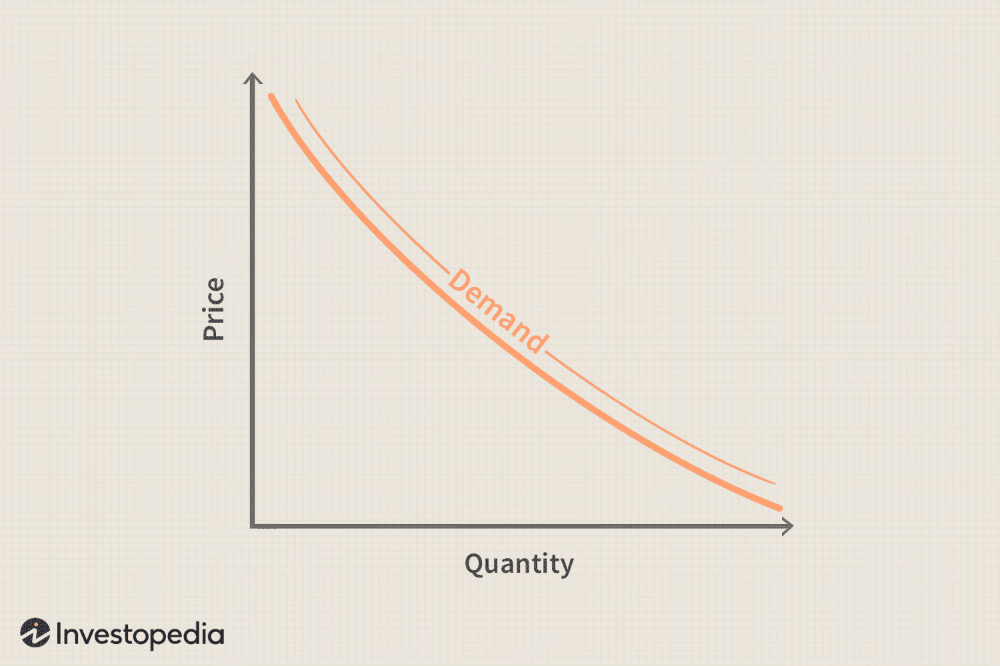

Demand curves serve as fundamental tools in the field of economics, depicting the relationship between the price of a good or service and its quantity demanded by consumers over a specified period. Typically downward sloping, these curves illustrate the inverse relationship between price and demand: as prices decrease, the demand generally increases, and vice versa. Demand curves are vital for analyzing how markets operate and for predicting consumer behavior, which is an essential component of economic forecasting.

Market analysis is critical in trading and economic forecasting as it provides a systematic approach to evaluating the various factors influencing supply and demand within markets. It encompasses diverse methodologies such as SWOT analysis, PESTEL analysis, and trend analysis, which help identify opportunities and risks within any given market environment. By understanding these dynamics, traders and economists can make informed decisions that optimize their strategies and forecasts.

Algorithmic trading, a novel and increasingly dominant force in financial markets, leverages computer algorithms to automatically execute trades at speeds and accuracies well beyond human capabilities. This form of trading is partially grounded in the principles of demand curves and market analysis, employing sophisticated models that integrate economic data to capitalize on market efficiencies. Algorithmic trading enhances trading strategies through its precision, scalability, and the reduction of human errors, leading to improved market liquidity and reduced transaction costs.

This article aims to examine the pivotal roles of demand curves, market analysis, and algorithmic trading in shaping modern economic strategies. It will further explore how the intersection of these elements enhances trading strategies, improves market efficiencies, and boosts trader profitability. The integration of theoretical economic principles with practical analytical techniques and cutting-edge technology offers substantial potential for the advancement of trading methodologies and economic forecasting.

## Table of Contents

## Understanding Demand Curves in Economics

Demand curves are fundamental constructs in economics that depict the relationship between the quantity of a good or service consumers are willing to purchase and its price. Typically, the demand curve is downward-sloping, reflecting the law of demand: as the price of a good decreases, the quantity demanded increases, and vice versa. This graphical representation is pivotal for understanding consumer behavior and predicting market outcomes.

Several factors influence demand curves, including price, income levels, and consumer preferences. Price is the most straightforward [factor](/wiki/factor-investing); as prices fall, the quantity demanded of a good typically increases, illustrating a movement along the demand curve. Income levels determine how much consumers can afford to spend; higher income generally leads to increased demand. Consumer preferences, shaped by tastes, cultural influences, and advertising, can shift the demand curve itself. For instance, a surge in popularity for a product can increase demand at all price levels, shifting the curve to the right.

Demand curves can be elastic or inelastic, describing how sensitive the quantity demanded is to a change in price. Elastic demand implies that a small change in price leads to a significant change in quantity demanded. This situation is common for goods with many substitutes, such as luxury items. Mathematically, the elasticity of demand is defined by the formula:

$$
E_d = \frac{\%\ \text{change in quantity demanded}}{\%\ \text{change in price}}
$$

A value greater than one indicates elasticity. In contrast, inelastic demand signifies that quantity demanded is relatively insensitive to price changes, common for essential goods like utilities or gasoline, where consumers have fewer alternatives. An elasticity value less than one indicates inelastic demand.

Graphically, demand curves are represented on a two-dimensional graph where the x-axis denotes quantity and the y-axis denotes price. A typical demand curve slopes downwards from left to right, indicating the inverse relationship between price and demand. The steepness of the curve reflects its elasticity; flatter curves represent more elastic demand.

Real-world examples illustrate the application of demand curves in market scenarios. During a holiday season, the demand for electronic gadgets may spike; retailers may observe a rightward shift in the demand curve, leading to increased sales volumes even at higher prices. Conversely, if a product is deemed obsolete, demand can plummet, shifting the curve leftward, necessitating price cuts to maintain sales levels.

Understanding these dynamics is crucial for businesses and policymakers to make informed decisions about pricing, production, and resource allocation. By analyzing demand curves, they can anticipate consumer behavior, adapt to market changes, and optimize economic outcomes.

## Market Analysis: The Backbone of Economic Forecasting

Market analysis is a critical activity in economics, focusing on understanding the current state and potential future scenarios of markets. It involves the detailed examination of market dynamics to inform economic strategies and forecast market trends. The primary objective of market analysis is to evaluate market conditions and anticipate changes, aiding businesses and investors in making informed decisions.

### Tools and Techniques in Market Analysis

Several tools and techniques are employed to conduct market analysis effectively. Among them are:

1. **SWOT Analysis**: This strategic planning tool assesses the Strengths, Weaknesses, Opportunities, and Threats related to a business or market segment. It helps identify internal and external factors that could impact business performance.

2. **PESTEL Analysis**: PESTEL (Political, Economic, Social, Technological, Environmental, and Legal) analysis helps identify macro-environmental factors that could influence market dynamics. This broad analysis framework enables businesses to adapt to changes and anticipate market shifts.

3. **Trend Analysis**: This involves examining historical data to predict future movements. By analyzing trends, such as consumer behavior, sales patterns, or economic indicators, businesses can make strategic decisions that align with projected market trajectories.

### Data Collection and Interpretation

Data collection is a cornerstone of market analysis, encompassing a variety of sources such as market surveys, economic reports, consumer feedback, and more. Once collected, data needs to be meticulously analyzed to extract meaningful insights. The interpretation of this data allows analysts to discern patterns, forecast demand and supply variations, and identify potential market opportunities or risks.

### Understanding Supply-Demand Dynamics

Market analysis is instrumental in comprehending supply-demand dynamics, a fundamental aspect of economic theory. By assessing market conditions, businesses gain insights into the balance or imbalance between supply and demand. This understanding aids in pricing strategies, inventory management, and resource allocation.

### Case Studies in Market Analysis

Several case studies demonstrate the successful application of market analysis. For instance, a company that accurately predicted the shift towards digital streaming could capitalize on this trend by altering its product offerings, ultimately gaining a competitive advantage. Similarly, firms leveraging market analysis to anticipate economic downturns can take preemptive measures, such as cost-cutting or diversifying investments, to mitigate potential losses.

Market analysis serves as the backbone of economic forecasting, enabling entities to navigate the complexities of market environments with greater confidence and precision. It combines strategic tools and data intelligence to offer insights that drive economic growth and stability.

## Algorithmic Trading: Revolutionizing Market Operations

Algorithmic trading, also known as algo-trading, has become a pivotal development in the financial markets, transforming how trades are executed. It refers to the use of computer algorithms to automate trading decisions. The genesis of [algorithmic trading](/wiki/algorithmic-trading) can be traced back to the 1970s, but it gained substantial traction in the late 1990s with the advent of electronic trading platforms. Today, it is a dominant force in the financial sector, contributing to the majority of transactions on exchanges worldwide.

### Utilization of Demand Curves and Market Analysis

Algorithmic trading systems often leverage demand curves and market analysis to inform trading strategies. These systems use historical data and statistical models to predict future price movements and trading volumes. By understanding the demand curve, which represents the relationship between the price of an asset and the quantity demanded, these algorithms can anticipate shifts in market conditions. This insight is crucial for making informed decisions about when to buy or sell assets.

For example, in a simplified model, the demand curve can be expressed as $Q_d = a - bP$, where $Q_d$ is the quantity demanded, $P$ is the price, and $a$ and $b$ are constants. Algorithmic trading models can incorporate such equations to project how supply and demand might change with price fluctuations.

### Benefits of Algorithmic Trading

One of the main benefits of algorithmic trading is its ability to execute trades at a much higher speed than human traders. Algorithms can analyze vast datasets and respond to market changes in milliseconds. This speed not only improves the efficiency of trades but also allows traders to capitalize on short-term market opportunities that would be impossible for humans to exploit due to natural latency.

Algorithmic trading also enhances accuracy. Algorithms eliminate human biases and errors that can affect trading decisions. Moreover, they operate based on predefined rules, ensuring consistency in execution. These traits are crucial for managing risk and ensuring that trading strategies align with long-term objectives.

### Types of Trading Algorithms

There are several types of algorithms used in trading, each designed with different objectives and methodologies:

1. **Market-Making Algorithms**: These seek to provide liquidity by placing limit orders on both sides of the order book, aiming to profit from the bid-ask spread.

2. **Arbitrage Algorithms**: These exploit price discrepancies between different markets or financial instruments, ensuring profits without risk if executed correctly.

3. **Trend-Following Algorithms**: These use technical indicators to identify and profit from emergent trends in the market.

4. **Mean Reversion Algorithms**: These are based on the theory that asset prices will revert to their historical mean.

5. **Sentiment Analysis Algorithms**: These evaluate market sentiment by analyzing news articles, social media, and other sources to predict price movements.

### Challenges and Ethical Considerations

Despite its advantages, algorithmic trading poses several challenges. Technical failures, such as software bugs, network outages, or erroneous algorithms, can result in significant financial losses. The infamous “Flash Crash” of 2010 demonstrated the potential [volatility](/wiki/volatility-trading-strategies) that algorithmic trading can introduce to financial markets.

Moreover, ethical considerations have come to the forefront, particularly concerning the fairness and transparency of markets. High-frequency trading ([HFT](/wiki/high-frequency-trading-strategies)), a subset of algorithmic trading, has faced criticism for creating an uneven playing field where only those with superior technology can succeed. Regulatory bodies worldwide are increasingly focused on enhancing oversight and implementing measures to ensure that algorithmic trading contributes positively to market stability.

In conclusion, algorithmic trading represents a significant advancement in market operations, providing unprecedented levels of speed and accuracy in trading. However, it also requires careful management of associated risks and ethical considerations to ensure equitable and stable financial markets.

## The Synergy between Demand Curves, Market Analysis, and Algorithmic Trading

The interplay between demand curves, market analysis, and algorithmic trading represents a sophisticated synergy that enhances the effectiveness of trading strategies. Demand curves, which graphically represent the relationship between the quantity of a good consumers are willing to purchase and its price, provide vital insights into consumer behavior. Market analysis, leveraging these curves, further deepens the understanding by incorporating broad economic factors, such as income changes and shifts in consumer preferences.

Algorithmic trading systems integrate these insights into automated processes, optimizing decision-making in financial markets. By using historical data and predictive analytics, these systems refine trading strategies, enhancing market efficiency. Algorithms can interpret demand curves to predict price movements, enabling traders to execute strategies swiftly and accurately without human intervention.

The impact of this synergy is evident in improved market efficiency and increased trader profitability. Algorithmic trading systems can process vast amounts of data, identifying trends and executing trades at speeds unattainable by human traders. This leads to more accurate pricing and [liquidity](/wiki/liquidity-risk-premium), reducing transaction costs and increasing market competitiveness.

Successful trading strategies that leverage demand curves and market analysis include statistical [arbitrage](/wiki/arbitrage) and trend-following strategies. For example, in [statistical arbitrage](/wiki/statistical-arbitrage), algorithms exploit pricing inefficiencies between correlated assets, using demand curve elasticities to gauge potential price reversals and execute profitable trades.

Looking forward, the evolving role of technology and data analytics promises to further enhance this synergy. Advances in [artificial intelligence](/wiki/ai-artificial-intelligence) and [machine learning](/wiki/machine-learning) can deepen market analysis, interpreting increasingly complex patterns in demand curves. Similarly, the integration of big data analytics allows for the real-time processing of large datasets, refining algorithmic trading strategies and adapting to dynamic market conditions.

The continuous advancement in these technologies holds the potential to transform trading strategies, making them more robust and adaptable. This ongoing evolution underscores the importance of understanding the fundamental economic components for both current and future traders.

## Conclusion

The demand curves, market analysis, and algorithmic trading play crucial roles in the modern economic landscape by shaping the strategies that traders and economists use to understand and forecast market movements. Demand curves provide insights into consumer behavior and how different factors affect demand for goods and services, offering a foundation for economic analysis. Market analysis builds on this by employing various tools and techniques to assess market conditions and anticipate future trends, thus aiding informed decision-making. Algorithmic trading represents the practical application of these theories and analyses, leveraging technology to execute trades with speed and precision, minimizing human error and maximizing efficiency.

Understanding these concepts is vital for traders at all levels. Demand curves help traders predict how market changes might affect supply and demand balances, while thorough market analysis enables them to interpret these dynamics effectively. Algorithmic trading, meanwhile, is becoming increasingly essential, offering benefits such as speed, enhanced accuracy, and the ability to process vast amounts of data. It is essential for traders to grasp the mechanics and potential of these components to remain competitive in the rapidly evolving financial markets.

As technology continues to advance, the integration of demand curves, market analysis, and algorithmic trading is likely to grow more sophisticated. Innovations in data analytics, machine learning, and artificial intelligence could further enhance the predictive power and efficiency of trading strategies. Continuous research and development in these areas are encouraged, as they hold the promise of identifying new patterns and insights that could optimize trading.

Future developments may transform trading strategies by providing new ways to interpret complex market dynamics. Algorithmic trading, powered by economic insights, offers transformative potential, allowing for more proactive and strategic market participation. Researchers and practitioners alike should remain engaged with emerging trends to harness these innovations effectively, advancing both theoretical understanding and practical applications in the economic field.

## References & Further Reading

[1]: Bergstra, J., Bardenet, R., Bengio, Y., & Kégl, B. (2011). ["Algorithms for Hyper-Parameter Optimization."](https://papers.nips.cc/paper/4443-algorithms-for-hyper-parameter-optimization) Advances in Neural Information Processing Systems 24.

[2]: ["Advances in Financial Machine Learning"](https://www.amazon.com/Advances-Financial-Machine-Learning-Marcos/dp/1119482089) by Marcos Lopez de Prado

[3]: ["Evidence-Based Technical Analysis: Applying the Scientific Method and Statistical Inference to Trading Signals"](https://www.amazon.com/Evidence-Based-Technical-Analysis-Scientific-Statistical/dp/0470008741) by David Aronson

[4]: ["Machine Learning for Algorithmic Trading"](https://github.com/stefan-jansen/machine-learning-for-trading) by Stefan Jansen

[5]: ["Quantitative Trading: How to Build Your Own Algorithmic Trading Business"](https://www.amazon.com/Quantitative-Trading-Build-Algorithmic-Business/dp/1119800064) by Ernest P. Chan