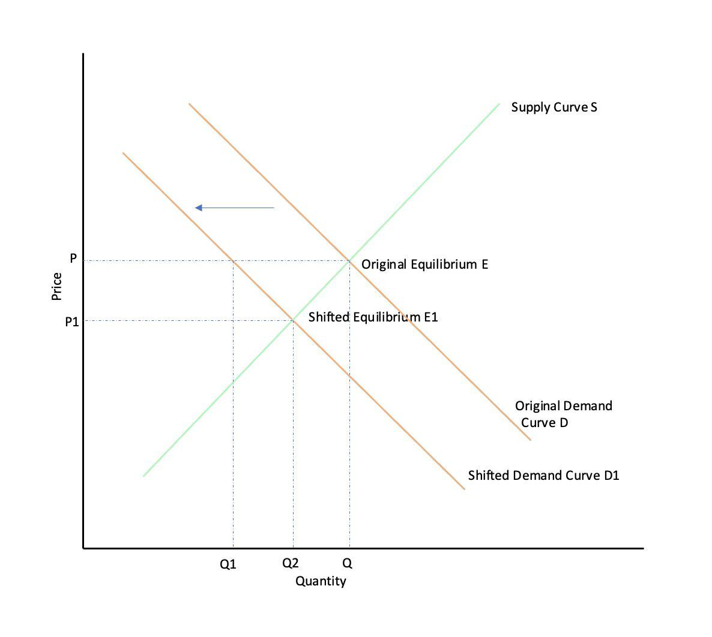

In today's dynamic economic environment, it is imperative to grasp the complexities of market dynamics, demand destruction, algorithmic trading, and their overarching economic impacts. These elements do not operate in isolation; rather, they are interconnected and collectively shape the global economic landscape. Demand destruction, primarily seen in sectors such as energy, describes a sustained decline in consumer demand often driven by persistently high prices or supply constraints. This phenomenon can trigger permanent shifts in consumer behavior, such as the transition from gasoline-powered to electric vehicles, which alters long-term market trends.

Market dynamics, influenced by these shifts, encompass the forces that affect supply, demand, and pricing within a market. Demand destruction can disrupt established equilibria and necessitate market adaptation through the introduction of substitutes or decommissioning of obsolete products. Meanwhile, algorithmic trading, through the deployment of computer algorithms for swift trading execution, significantly influences market characteristics like liquidity, pricing efficiency, and volatility. By reacting rapidly to price signals and demand changes, algorithmic trading amplifies these dynamics.



Understanding how these elements interact and affect each other is essential. Algorithmic trading, for instance, can magnify or mitigate the effects of demand destruction by immediately responding to shifting signals, creating potential stabilization or destabilization of markets. Moreover, the substantial volume and speed inherent in algorithmic transactions can lead to phenomena such as flash crashes or market manipulation concerns, which regulators and policymakers must address.

By providing a comprehensive overview of these interconnected phenomena, the article outlines how stakeholders, including businesses, policymakers, and investors, can navigate and adapt to these evolving economic conditions. Insights into these dynamics have profound implications for strategy development and the maintenance of market stability, emphasizing the necessity for ongoing research and the formulation of robust policy frameworks.

## Table of Contents

## Understanding Demand Destruction

Demand destruction refers to a prolonged reduction in consumer demand for a particular good, typically arising from persistently high prices or a limited supply. This concept is predominantly observed in the energy sector, affecting commodities like oil and gas. High prices often enforce a behavioral shift in consumers, driving them away from traditional consumption patterns towards alternatives. This reaction can have lasting impacts on market trends, as seen in the transition from gasoline-powered to electric vehicles due to surging gasoline prices.

In examining demand destruction, it is crucial to consider its potential to catalyze a permanent shift in consumer behavior. For instance, the move from gasoline to electric vehicles illustrates how sustained high oil prices can reduce gasoline demand over time. This shift is not merely a transient phenomenon but often results in a long-term transformation in market dynamics and consumption patterns.

The economic significance of demand destruction lies in its ability to reshape demand curves. High prices and limited supply push consumers toward substitute goods or alternative energy sources, like solar or wind power. This shift may be represented mathematically as a leftward shift in the demand curve for the original good, signifying reduced demand at all price levels. This shift influences the equilibrium price and quantity, potentially resulting in a new market equilibrium where traditional goods are no longer the primary choice for consumers.

Understanding demand destruction provides insight into how markets and industries must adapt to changing consumer preferences. Companies may need to innovate or invest in new technologies to meet the evolving demands and preferences of consumers. The shift from traditional energy sources to renewables is a prime example illustrating how demand destruction can lead industries towards more sustainable and alternative methods of production.

In summary, demand destruction is more than a temporary decline in demand; it fosters a structural change in consumer preferences and market dynamics, particularly within energy sectors. By acknowledging this phenomenon, businesses and policymakers can develop strategies that address shifts in consumer behavior, aiding in the seamless transition to alternative goods and services.

## Market Dynamics and Demand Destruction

Market dynamics are significantly influenced by demand destruction, which occurs when persistent high prices or limited availability lead to a sustained decline in consumer demand for a particular good. This shift has profound implications for supply-demand equilibria and market structure, affecting pricing, competition, and long-term economic outcomes.

The core of demand destruction lies in its ability to permanently alter consumer behavior and market preferences. As consumers adapt to elevated prices or scarce resources, they often explore alternatives or substitutes. For instance, continuous high gasoline prices have accelerated the adoption of electric vehicles, reducing gasoline demand and thereby causing a market shift. This transition exemplifies how demand destruction can spur transformative changes within industries.

Market dynamics in the face of demand destruction can lead to the emergence of new equilibria. The introduction of substitutes and the decreasing demand for traditional products can cause businesses to innovate, diversify, or [exit](/wiki/exit-strategy) the market. Firms are compelled to reevaluate their product lines, production methods, and strategic positioning. For example, industries may pivot to more sustainable practices or enhance product differentiation to remain competitive.

In analyzing market adaptations to demand destruction, several economic concepts become relevant:

1. **Elasticity of Demand**: The degree to which demand for a product changes in response to price alterations is crucial. Products with high price elasticity may experience significant demand reductions, driving markets to adapt more swiftly.

2. **Cross-Price Elasticity**: This measure indicates the responsiveness in the demand for one good when the price of another related good changes. High cross-price elasticity with substitutes can hasten the process of demand destruction.

3. **Economies of Scale and Scope**: Companies might leverage economies of scale to reduce costs and maintain competitiveness despite falling demand. Alternatively, economies of scope might allow firms to diversify product offerings and mitigate impacts on declining demand.

Market adaptations to demand destruction involve strategic pricing and competition adjustments. Pricing strategies, such as price skimming or penetration pricing, may be employed to manage decreasing demand and sustain market share. Competition intensifies as firms endeavor to capture consumer interest in a contracting market environment, often leading to increased innovation and supply chain efficiencies.

In summary, demand destruction significantly alters market dynamics by shifting consumer behaviors and creating opportunities for new market equilibria. Businesses and markets must agilely navigate these changes, fostering innovation and redefined competitive landscapes to sustain economic viability. Understanding how these dynamics play out is vital for predicting long-term market evolutions and economic impacts.

## Algorithmic Trading: Mechanisms and Impact

Algorithmic trading, often referred to as algo trading, involves the use of computer-generated algorithms to execute a large number of trades at incredibly high speeds. It leverages mathematical models and advanced software to make decisions about the timing, pricing, and quantity of trades, often bypassing human intervention. This type of trading is a major force in modern financial markets, influencing aspects such as market [liquidity](/wiki/liquidity-risk-premium), pricing efficiency, and [volatility](/wiki/volatility-trading-strategies).

The adoption of [algorithmic trading](/wiki/algorithmic-trading) has significantly transformed market liquidity. By enabling rapid execution of transactions, algorithms provide greater depth in the market, reducing bid-ask spreads and increasing the [volume](/wiki/volume-trading-strategy) of transactions that can be processed within a given time. This high level of liquidity can create a more efficient market environment, facilitating smoother price discovery processes.

Pricing efficiency is another area where algorithmic trading has made a noticeable impact. Algorithms quickly assess various indicators, including historical data, current market prices, and economic news, to determine the optimal price for buying or selling assets. This efficiency in processing and reacting to information ensures that asset prices are continuously adjusted to reflect true market conditions, leading to more accurate pricing.

Despite these advantages, the influence of algorithmic trading on market volatility is a subject of debate. On one hand, the rapid response capability of algorithms to new information can stabilize markets by evenly distributing trades over time and reducing large, sudden price swings. On the other hand, the same rapid processing can exacerbate volatility, especially if multiple algorithms interact unpredictably, as witnessed during events like the "Flash Crash" of May 6, 2010. In such instances, erroneous trades and cascading orders can significantly destabilize markets.

Algorithmic trading systems can amplify market dynamics due to their ability to quickly react to price signals and shifts in demand. This rapid response can magnify trends or reversals within the market, as the algorithms perpetually adjust their strategies based on real-time data. The speed at which these trades occur can help capitalize on small price differentials, known as [arbitrage](/wiki/arbitrage) opportunities, but it can also lead to unintended market outcomes if the algorithms behave irrationally or simultaneously.

The benefits of algorithmic trading include improved efficiency and heightened liquidity. By minimizing human errors and executing trades based on quantitative analysis, algorithmic trading enhances overall market functioning. Moreover, it allows traders to execute large orders without significantly impacting the market price, thanks to sophisticated techniques like slicing large orders into smaller, more manageable pieces.

Nevertheless, challenges exist, notably concerns over market manipulation and fairness. High-frequency trading ([HFT](/wiki/high-frequency-trading-strategies)), a subset of algorithmic trading that involves conducting thousands of trades in milliseconds, has been linked to market manipulation practices such as "spoofing," where traders place orders they do not intend to execute to trick other market participants about supply and demand conditions. Additionally, the significant technological investment required for effective algorithmic trading raises barriers to entry, potentially disadvantaging smaller investors.

In conclusion, while algorithmic trading offers substantial benefits, such as increased liquidity and improved price efficiency, it also presents challenges, especially concerning market stability and ethical trading practices. As algorithmic trading continues to evolve, it is essential to maintain robust regulatory frameworks that ensure fair and transparent market operations.

## Economic Impact of Algorithmic Trading on Demand Destruction

Algorithmic trading, characterized by the use of sophisticated algorithms to execute trades at high speeds, has a profound impact on market dynamics, particularly in relation to demand destruction. This impact is primarily due to the algorithms' ability to process a vast amount of data and react to market conditions in real time. As such, traders leveraging algorithmic trading can capitalize on shifts in demand by identifying and acting on price discrepancies, trends, and other market signals almost instantaneously. This capability can stabilize markets by ensuring liquidity and efficient price discovery, or destabilize them through rapid, large-volume trades that exacerbate volatility.

When demand destruction occurs, such as during a significant shift in consumer preferences or an economic downturn, algorithmic trading systems can adapt quickly to the new equilibrium states. For example, if there is a marked decrease in demand for a commodity due to persistent high prices, trading algorithms might adjust by quickly reallocating assets to more profitable sectors or hedging against potential losses. This rapid response helps maintain market efficiency and mitigate the potential negative impacts of demand destruction. However, it can also lead to increased market fragility if algorithms trigger feedback loops that intensify price fluctuations.

Understanding how algorithmic trading systems interpret and respond to the signals of demand destruction is crucial. Algorithms are typically designed to evaluate multiple data inputs, such as historical prices, trading volumes, and macroeconomic indicators, to make informed decisions. In Python, for instance, [machine learning](/wiki/machine-learning) models might be used to predict demand trends and guide trading strategies. Here's a simple example of how machine learning could be applied in such a scenario:

```python
from sklearn.ensemble import RandomForestRegressor
import numpy as np

# Historical data features: [price_change, volume, economic_indicator]
X = np.array([[0.01, 10000, 0.5], [0.02, 11000, 0.45], ...])
y = np.array([0.03, 0.04, ...])  # Target: Future price change

model = RandomForestRegressor()
model.fit(X, y)

# Predict future price change given new market data
new_data = np.array([[0.015, 10500, 0.48]])
predicted_price_change = model.predict(new_data)
```

Regulatory considerations also play a vital role in modulating the impact of algorithmic trading on demand destruction. Policymakers are continually assessing and updating regulatory frameworks to ensure market stability and fairness amid the increasing prevalence of algorithmic trading. Such regulations may include policies to prevent market manipulation, ensure transparency in trading activities, and implement circuit breakers to halt trading in the event of extreme volatility.

In summary, algorithmic trading can have both stabilizing and destabilizing impacts on markets experiencing demand destruction. The precision and speed with which these systems operate highlight the need for carefully crafted regulatory frameworks to safeguard against potential market disruptions, while still promoting the efficiency and liquidity benefits that algorithmic trading can provide.

## Case Studies and Real-World Applications

This section examines the significant impact of demand destruction and algorithmic trading on market dynamics through historical case studies, emphasizing the lessons learned and strategies for managing similar future scenarios.

### Oil Market and Demand Shifts

A quintessential example of demand destruction can be seen in the oil market, particularly during periods of high energy costs. For instance, the 1970s oil crisis showcased how sustained high oil prices can lead to demand destruction. Consumers and industries sought alternatives and more efficient energy solutions, culminating in a shift towards fuel-efficient vehicles and alternative energy sources. This transition, while initially sparked by geopolitical tensions and supply constraints, permanently altered consumption patterns and significantly influenced the automotive and energy sectors.

### Algorithmic Trading Influence During Financial Crises

Algorithmic trading's role during financial crises provides another perspective on its dynamic with market behavior. During the 2008 financial crisis, the rapid selling triggered by algorithmic trading mechanisms exacerbated the market downturn. High-frequency trades, designed to capitalize on fleeting price discrepancies, contributed to heightened volatility and liquidity shortages.

Consider a simplified model where an algorithm responds to market changes with a time delay $\Delta t$. The price change $\Delta P$ at each timestep may trigger a sell-off:

```python
def execute_trade(price_change, threshold=0.05):
    if price_change > threshold:
        return "Sell"
    else:
        return "Hold"

prices = [100, 95, 90, 92, 88]
for i in range(len(prices) - 1):
    price_change = (prices[i + 1] - prices[i]) / prices[i]
    action = execute_trade(price_change)
    print(f"Price {i}: {prices[i]}, Action: {action}")
```

This simple model highlights how algorithms can react aggressively to price movements, potentially leading to increased market instability.

### Economic Shock Impacts: 2008 Crisis and COVID-19 Pandemic

The 2008 financial crisis and the COVID-19 pandemic are pivotal events illustrating demand shocks. In both scenarios, sudden economic disruptions led to significant changes in consumer behavior and market dynamics. During the 2008 crisis, the real estate bubble burst resulted in a sharp decline in demand for housing and mortgage-backed securities, severely impacting financial institutions.

Similarly, the COVID-19 pandemic caused unprecedented disruptions across global markets. Lockdowns and travel restrictions led to staggering declines in demand for oil and other commodities. Algorithmic trading systems had to rapidly adapt to these changes, with the oil market witnessing a historic plunge in prices due to excess supply and storage limitations.

### Lessons Learned and Future Strategies

The examination of these case studies provides critical insights into managing future scenarios characterized by demand destruction and algorithmic trading. Key lessons include the importance of regulatory frameworks to mitigate excessive volatility and enhance market stability. Additionally, fostering flexibility in supply chains and promoting technological innovation can help adapt to rapid demand changes.

Finally, the inherent risks of algorithmic trading can be addressed by strengthening oversight and ensuring that trading algorithms are designed to operate within safe bounds. By learning from past events, stakeholders can develop robust strategies that enhance economic resilience and stability in the face of evolving market dynamics.

## Conclusion

The conclusion of examining the dynamic interplay between demand destruction, market dynamics, and algorithmic trading underscores the complex landscape of modern economics. These intertwined phenomena pose both significant challenges and remarkable opportunities for stakeholders. 

A comprehensive understanding of these concepts is paramount for businesses, policymakers, and investors striving to navigate and adapt to continuously evolving economic conditions. Recognizing the nuances of how demand destruction can alter consumer behavior and subsequently impact market equilibria equips decision-makers to anticipate shifts and develop pre-emptive strategies.

As markets evolve, crafting robust and adaptive strategies becomes crucial in managing the economic repercussions stemming from demand destruction and the increasingly influential role of algorithmic trading. The rapid responses enabled by algorithmic systems necessitate a reevaluation of traditional market strategies, requiring more agile and responsive approaches to sustain competitive advantage.

The ongoing transformation of global markets necessitates continuous research and the development of regulatory frameworks to ensure economic stability. It is essential to craft policies that mitigate potential risks while fostering innovation and resilience. By investing in ongoing research and adaptive policy frameworks, stakeholders can better position themselves to maintain economic stability and resilience amid transitions catalyzed by demand destruction and algorithmic trading.

## References & Further Reading

1. **Pindyck, R. S., & Rubinfeld, D. L. (2018). Microeconomics (9th ed.)**  
   This textbook provides foundational knowledge on microeconomic principles, including the concepts of demand, supply, and market dynamics. It discusses consumer behavior, market structures, and economic equilibrium.

2. **Hull, J. C. (2018). Options, Futures, and Other Derivatives (10th ed.)**  
   A comprehensive resource for understanding financial derivatives, including the mechanics and implications of algorithmic trading. It covers the role of these instruments in modern financial markets and their impact on pricing and liquidity.

3. **Malkiel, B. G. (2019). A Random Walk Down Wall Street: The Time-Tested Strategy for Successful Investing**  
   This book offers insights into modern investment strategies and the effects of market dynamics, including algorithmic trading. It provides a perspective on market efficiency and demand shifts caused by changing market conditions.

4. **Fabozzi, F. J., Modigliani, F., & Jones, F. J. (2015). Foundations of Financial Markets and Institutions (4th ed.)**  
   This resource explores the structure of financial institutions and markets. It highlights the interaction between market dynamics and financial instruments, such as how algorithmic trading affects market efficiency and transparency.

5. **Kilian, L., & Murphy, D. P. (2014). “The Role of Inventories and Speculative Trading in the Global Market for Crude Oil.” Journal of Applied Econometrics, 29(3), 454–478.**  
   An academic paper analyzing the role of inventories and speculative trading in the oil market, providing context for understanding demand destruction and its impact on market dynamics.

6. **Aldridge, I. (2013). High-Frequency Trading: A Practical Guide to Algorithmic Strategies and Trading Systems.**  
   This book provides an in-depth analysis of high-frequency trading strategies and systems, discussing both the benefits and risks of algorithmic trading and its influence on market behavior.

7. **Graham, B., & Zweig, J. (2003). The Intelligent Investor: The Definitive Book on Value Investing.**  
   A seminal book on value investing that discusses market behavior and strategies to deal with demand shifts. It remains relevant for understanding how demand destruction influences long-term investment decisions.

8. **Jovanovic, F., & Le Gall, P. (2001). “Does God Practice a Random Walk? The ‘Financial Physics’ of a Philosophical Fraud.” The European Journal of the History of Economic Thought, 8(3), 332-362.**  
   An article examining the intersection of physics and finance, providing insights into the modeling of complex market dynamics, including those affected by algorithmic trading.

