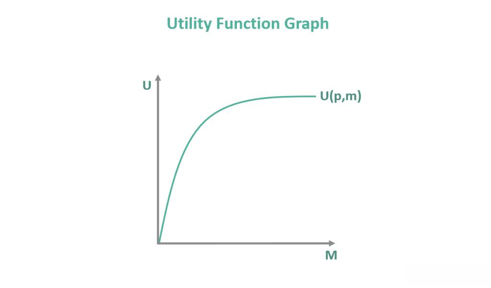

Economics, at its core, provides the essential frameworks and models that underpin our understanding of markets, consumer behavior, and the mechanics of financial systems. The interplay between economics, demand functions, utility functions, and algorithmic trading illustrates a significant evolution in how market activities are analyzed and executed. Economic theories offer the groundwork for the dynamic algorithms that facilitate modern financial markets, enabling the rapid execution of trades with precision and accuracy. Understanding these economic foundations is crucial for both seasoned economists and technology-driven traders, who benefit from the convergence of theoretical insights and practical application.

Demand functions are central to economics, capturing the relationship between the price of goods and the quantity demanded by consumers. Mathematically represented as $Q_d = f(P)$, where $Q_d$ is the quantity demanded and $P$ is the price, demand functions are fundamental in predicting market equilibria and consumer responses to price changes. Utility functions, on the other hand, are used to represent consumer preferences and satisfaction levels. They help in understanding how consumers decide between different bundles of goods, maximizing their utility given budget constraints. These functions are pivotal in determining market demand and supply dynamics.



Algorithmic trading, which refers to the use of computer algorithms to automatically execute trades based on pre-defined criteria, has transformed financial markets by enhancing the speed and efficiency with which trades are executed. Trading algorithms utilize data analysis, historical trends, and predictive analytics to make informed decisions within fractions of a second. By integrating concepts like demand and utility functions into these algorithms, traders can better predict market movements and optimize trading strategies. For example, understanding consumer demand patterns can inform stock price predictions, while utility functions can be applied to assess risk and optimize trade portfolios.

For both economists and traders, the integration of demand and utility functions into algorithmic trading presents opportunities for optimizing trading strategies and improving market predictions. By employing economic theories, traders can enhance their decision-making processes in uncertain and volatile markets. This synthesis of economic models and trading technologies facilitates more strategic trading and potential cost reductions, ultimately contributing to greater market efficiency.

The relevance of this topic extends beyond theoretical interest, with tangible benefits in maximizing trading efficiency and precision. As technology continues to evolve, the fusion of economic theory and trading practice promises increasingly sophisticated approaches to market engagement. Understanding and leveraging these insights is crucial for those wishing to remain competitive in today's fast-paced financial environments.

## Table of Contents

## Understanding Economics: Demand and Utility Functions

In economics, the demand function is a mathematical representation that describes the relationship between the quantity of a commodity demanded and its various determinants, such as price, income, and the prices of related goods. The law of demand, a foundational economic principle, posits that, ceteris paribus, as the price of a good decreases, the quantity demanded increases, typically resulting in a downward-sloping demand curve. This function is crucial in understanding consumer behavior, pricing strategies, and market dynamics. The general form of the demand function can be expressed as:

$$
Q_d = f(P, Y, P_s, P_c)
$$

where $Q_d$ is the quantity demanded, $P$ is the price of the good, $Y$ represents income, $P_s$ is the price of substitute goods, and $P_c$ is the price of complementary goods.

Utility functions serve as a cornerstone in economic theory, representing consumer preferences and satisfaction levels. These functions assign a numerical value to the level of satisfaction or utility a consumer derives from consuming a particular bundle of goods or services. Utility is subjective and varies across individuals, but within the framework of economic analysis, utility functions help in modeling decision-making behavior. A commonly used form is the Cobb-Douglas utility function, which can be expressed as:

$$
U(x_1, x_2) = x_1^\alpha x_2^{1-\alpha}
$$

where $U$ is the utility, $x_1$ and $x_2$ are quantities of two different goods, and $\alpha$ (0 < \alpha < 1) represents the relative preference for good $x_1$ over $x_2$.

Demand and utility functions play pivotal roles in predicting consumer behavior. For example, if a consumer's income increases, theoretically, they will demand more of a normal good, enhancing their utility and shifting the demand curve to the right. These functions enable economists and analysts to predict how changes in economic variables might affect market demand and consumer welfare.

Mathematically, determining demand functions often involves econometric modeling and regression analysis to estimate parameters influencing demand. Utility functions, on the other hand, are typically derived using concepts like marginal utility and indifference curves, which offer insights into consumer choices and substitution effects. For instance, the marginal rate of substitution, derived from the utility function, informs how much of one good a consumer is willing to give up to obtain an additional unit of another good while maintaining the same level of utility.

The integration of demand and utility functions is vital across various economic models, including those dealing with market equilibrium, consumer choice, and welfare economics. These models use the insights gained from demand and utility functions to inform policy-making, business strategy, and economic forecasting. Furthermore, these functions are essential in decision-making processes as they provide quantifiable measures and frameworks to evaluate consumer preferences and market conditions effectively. Understanding these economic foundations is critical for anyone involved in crafting policies, developing business strategies, or engaging in financial market analyses.

## Algorithmic Trading: An Overview

Algorithmic trading, commonly referred to as algo trading, is a method of executing trades using automated and pre-programmed trading instructions. These instructions take into account a variety of variables such as time, price, and [volume](/wiki/volume-trading-strategy), and are based on complex algorithms. The emergence of algo trading in the financial markets dates back to the late 20th century, driven by advancements in computer technologies and an increasing need for efficiency in trading operations.

Algo trading enables trades to be conducted at speeds and efficiencies that are impossible for human traders to achieve. Algorithms systematically scan market conditions and execute trades at ultrafast speeds, often in milliseconds or microseconds. This high-frequency nature of [algorithmic trading](/wiki/algorithmic-trading) allows for rapid response to market changes, minimizing human error and emotion-driven decisions.

Key components underpinning algorithmic trading include data analysis, historical data, and predictive analytics. Data analysis involves examining large datasets to identify patterns or trends that can inform trading decisions. Historical data is critical as it provides a foundation upon which algorithms are developed, allowing for [backtesting](/wiki/backtesting) of strategies. Predictive analytics, meanwhile, uses statistical models and [machine learning](/wiki/machine-learning) techniques to forecast future market movements, contributing to the strategic decisions embedded in the trading algorithms.

Several types of algorithms are prevalent in algorithmic trading, each serving different strategic purposes. Market-making strategies aim to provide [liquidity](/wiki/liquidity-risk-premium) to the markets by simultaneously placing buy and sell orders. These algorithms profit from the spread between the bid and the ask prices. Arbitrage strategies exploit price discrepancies of the same asset in different markets, executing trades to capitalize on these fleeting opportunities. Momentum-based algorithms rely on identifying trends, buying assets as their prices rise and selling as they fall, thus profiting from the market's [momentum](/wiki/momentum).

The advantages of algorithmic trading are significant. It enhances market liquidity by enabling continuous trade executions, thus narrowing bid-ask spreads and facilitating smoother market operations. It also lowers trading costs by reducing the need for manual trade processing and allowing firms to execute large volumes of trades with minimal market impact. Moreover, with reduced transaction times, algorithmic trading mitigates the risk of market [volatility](/wiki/volatility-trading-strategies) affecting trade execution, optimizing the timing and price of trades.

In essence, algorithmic trading represents a fusion of financial theories and cutting-edge technology, reshaping trading landscapes by offering speed, efficiency, and new strategic avenues previously unavailable to traditional trading methodologies.

## The Role of Demand and Utility Functions in Algorithmic Trading

The integration of demand and utility functions in algorithmic trading represents a sophisticated convergence of economic theory and advanced computational techniques. Demand functions, which portray the relationship between the quantity of a good that consumers are willing to purchase and its price, can be effectively harnessed within trading algorithms to predict stock prices and market movements. By analyzing historical price data and estimating demand patterns, these algorithms can anticipate changes in buying behavior, allowing traders to make more informed predictions about asset valuations and potential price fluctuations.

Similarly, utility functions, which reflect consumer preferences and their satisfaction levels, serve as valuable tools in the assessment of risk and optimization of trade portfolios. By applying utility theory, traders can evaluate different portfolio configurations to maximize expected utility, rather than just expected returns. This approach accounts for risk aversion and helps in tailoring investment strategies that align more closely with the investor’s risk preferences. The utility function $U(x) = x^{(1-\gamma)}/(1-\gamma)$, for instance, is often used to model a constant relative risk aversion, where $\gamma$ is the coefficient of risk aversion.

Trading strategies that incorporate insights from demand and utility functions are diverse and can include momentum-based strategies, where demand signals guide the timing of trades based on expected future price trends. Similarly, [arbitrage](/wiki/arbitrage) strategies can benefit from recognizing demand-driven price disparities across different markets or assets. By utilizing these economic indicators, algorithms can make real-time decisions that reflect underlying market conditions more accurately than traditional models that often overlook human behavioral factors.

The incorporation of these economic theories into trading algorithms enhances decision-making capabilities in unpredictable markets. By factoring in consumer behavior and preferences, trading algorithms become more adaptive and responsive to market changes. This leads to a dynamic adjustment of trading strategies, optimizing performance even in volatile or rapidly changing market environments. However, there are challenges to this integration, including the need for high-quality, granular data to construct accurate demand and utility models. Real-time dynamics pose an additional challenge; market conditions can shift quickly, rendering static models less effective. Moreover, accurately estimating demand functions requires complex models that can process large volumes of data efficiently, pointing to the need for ongoing advancements in computational resources and algorithmic efficiency.

In conclusion, the application of demand and utility functions in algorithmic trading opens new avenues for refined and economically-grounded trading strategies, though it requires overcoming certain practical and technical challenges.

## Case Studies and Practical Applications

Case studies where demand and utility functions are successfully utilized in algorithmic trading strategies exemplify the significant impact of economic theory on financial markets. One notable example is the incorporation of utility functions in portfolio optimization algorithms. Utility functions, which represent the trader's preference and risk tolerance, are integral in determining the composition of an investment portfolio. The utility maximization problem is commonly solved through algorithms aimed at achieving the highest expected utility given certain constraints. This approach has shown to outperform traditional mean-variance optimization by accounting for the investor's subjective preferences, enhancing the decision-making process in uncertain environments.

A practical application of demand functions is observed in market-making strategies. Algorithmic traders use demand functions to estimate the expected future demand for an asset based on historical price and volume data. For instance, a demand function $D(p) = a - bp$, where $D$ is demand, $p$ is price, and $a$ and $b$ are parameters, can be employed to predict how small price changes impact the demand for a security. By integrating these functions into their algorithms, traders can adjust bid and ask prices to better capitalize on predicted market movements, thus improving liquidity and aligning with market demand.

The performance of these economic-driven algorithms can be contrasted with traditional trading methodologies, which often rely on simple technical indicators and do not incorporate explicit economic theories. Studies have shown that algorithms integrating demand and utility functions provide improved risk-adjusted returns and more consistent performance across varying market conditions. This demonstrates the flexibility and robustness that these economic concepts bring to algorithmic strategies, particularly in volatile markets where traditional methods might falter.

Lessons learned from these applications highlight the critical importance of data quality and the modeling of dynamic market conditions. Demand and utility-based algorithms demand accurate, real-time data to function effectively, requiring sophisticated data processing and adaptive models. The limitations observed in some case studies underscore the challenge of implementing continuous updates of economic models to reflect current market scenarios while maintaining computational efficiency. Employing machine learning techniques can facilitate this process by enabling models to self-adjust based on new data, thus enhancing predictive accuracy and maintaining competitive advantage.

Examining the scope of implementing economic model updates in real-time trading scenarios reveals the vast potential for ongoing improvement in algorithmic strategies. As financial markets evolve, the ability to update demand and utility estimates dynamically becomes increasingly vital. Algorithmic trading platforms are tasked with continuously refining these models to capture shifts in market sentiment and economic indicators. Leveraging cloud computing and advanced analytics, traders can now execute strategy updates with reduced latency, ensuring their models remain aligned with the latest market developments.

These successful case studies and practical applications underscore the transformative impact economic theories can achieve when effectively integrated into algorithmic trading. As technology advances, the synergy between economics and trading algorithms promises to redefine strategic approaches, driving innovation and optimizing outcomes in financial markets.

## Future Trends and Developments

The future role of economics in developing next-generation trading algorithms is poised for transformative advancements. As financial markets continue to evolve, the integration of economic theories into algorithmic trading is anticipated to become increasingly sophisticated. This integration improves predictive accuracy and strategic decision-making, crucial in the fast-paced world of trading.

Emerging technologies such as blockchain, quantum computing, and big data analytics offer novel ways to blend economic principles with algorithmic trading. Blockchain, with its decentralized ledger systems, provides transparency and traceability, which can be harnessed to enhance trading algorithms' reliability. Quantum computing could revolutionize trading by processing complex calculations and datasets exponentially faster than classical computers, enabling real-time adjustments based on economic models.

Machine learning (ML) and [artificial intelligence](/wiki/ai-artificial-intelligence) (AI) significantly enhance the integration of economic functions into trading algorithms. These technologies facilitate the processing of vast amounts of financial data to identify patterns and predict market movements. AI-driven systems can dynamically adjust demand and utility functions based on real-time market data, optimizing trading strategies. For instance, AI can refine risk assessments and portfolio management by analyzing consumer behavior patterns through utility functions, thereby tailoring investment strategies to market conditions.

The regulatory landscape for algorithmic trading may undergo significant changes, impacting how economic theories are applied in practice. Regulators globally are scrutinizing algorithmic trading, particularly concerning market stability and transparency. Future regulations may mandate greater transparency in algorithmic strategies and potentially limit high-frequency trading practices, encouraging the development of more robust algorithms that incorporate comprehensive economic insights.

Continuous research and development are essential to maintain a competitive edge in algorithmic trading. Innovation in economic modeling and computational techniques will drive the evolution of trading algorithms. Economists and data scientists must collaborate to refine models that accurately reflect market dynamics, incorporating variables such as behavioral economics and global economic indicators. The ongoing collaboration between academia and industry can foster the development of predictive models that anticipate shifts in consumer behavior and market trends.

For instance, Python libraries like NumPy, pandas, and scikit-learn enable the implementation of complex mathematical models in trading algorithms. Here's a brief Python example illustrating the potential integration of economic theories into algorithmic trading:

```python
import numpy as np
import pandas as pd
from sklearn.linear_model import LinearRegression

# Example data
market_data = pd.DataFrame({
    'price': [100, 102, 104, 103, 105],
    'demand': [200, 180, 220, 210, 230]
})

# Linear regression model to predict market prices based on demand
model = LinearRegression()
model.fit(market_data[['demand']], market_data['price'])
predicted_price = model.predict(np.array([[210]]))

print(f"Predicted price based on demand: {predicted_price[0]:.2f}")
```

The model above predicts market prices based on demand data, demonstrating how economic functions can inform trading strategies.

In summary, the convergence of economics and advanced computational technologies heralds a new era of trading algorithms that are more predictive, adaptive, and aligned with market realities. Embracing these developments will empower traders and economists to navigate the complexities of modern financial markets with greater precision and foresight.

## Conclusion

The integration of economic functions with algorithmic trading presents a compelling synergy that enhances both theoretical understanding and practical application in financial markets. Through the incorporation of demand and utility functions, traders can achieve more precise predictions of market behaviors and optimize trade portfolios by assessing risk more effectively. This alignment offers significant advantages, such as improved accuracy in stock price predictions and more strategic portfolio management. Additionally, economic theories bring a robust framework that enriches the development of trading algorithms, fostering more resilient and adaptive strategies in the face of volatile market conditions.

The application of these economic principles in algorithmic trading underscores the necessity of ongoing exploration and adaptation. As markets evolve, so too must the algorithms and economic models that traders rely on. Researchers and practitioners are encouraged to continue examining the intersections of economics and technology, leveraging advancements in artificial intelligence and machine learning to refine the integration of these models. Such endeavors will undoubtedly yield innovative solutions, enabling traders to navigate financial markets with enhanced foresight and agility.

In conclusion, the confluence of economic theories with modern trading technologies holds vast potential for shaping the future of trading. Both traders and economists are urged to actively explore and apply these insights to drive more informed and strategic decision-making processes. By doing so, they can better position themselves to capitalize on market opportunities while mitigating risks, ultimately leading to more efficient and effective market participation.

## References & Further Reading

[1]: Jehle, G. A., & Reny, P. J. (2011). ["Advanced Microeconomic Theory."](https://archive.org/details/geoffrey-a.-jehle-philip-j.-reny-advanced-microeconomic-theory-3rd-edition-2011-prentice-hall) Pearson Education.

[2]: Varian, H. R. (1992). ["Microeconomic Analysis."](https://archive.org/details/microeconomicana00vari_0) W.W. Norton & Company.

[3]: Lopez de Prado, M. (2018). ["Advances in Financial Machine Learning."](https://www.amazon.com/Advances-Financial-Machine-Learning-Marcos/dp/1119482089) Wiley.

[4]: Chan, E. P. (2008). ["Quantitative Trading: How to Build Your Own Algorithmic Trading Business."](https://github.com/ftvision/quant_trading_echan_book) Wiley.

[5]: Jansen, S. (2020). ["Machine Learning for Algorithmic Trading."](https://github.com/stefan-jansen/machine-learning-for-trading) Packt Publishing.

[6]: Goodfellow, I., Bengio, Y., & Courville, A. (2016). ["Deep Learning."](https://www.deeplearningbook.org/) MIT Press.