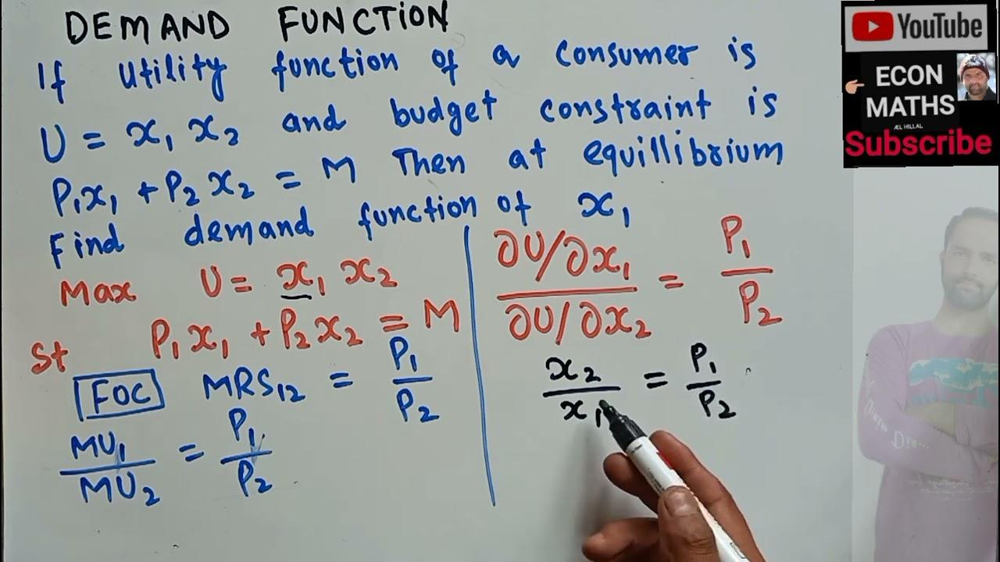

## Table of Contents

## What is a demand function?

A demand function is a way to show how much of something people want to buy at different prices. Imagine you are selling apples. If you lower the price of apples, more people might want to buy them. The demand function helps you understand this relationship. It usually shows that when the price goes down, the amount people want to buy goes up.

In simple terms, the demand function can be written as a formula. For example, if you know that at a price of $1, people will buy 100 apples, and at $2, they will buy 50 apples, you can use this information to create a demand function. This function helps businesses decide how to set their prices to sell the most products. It's a useful tool for understanding what customers want and how they react to changes in price.

## What is a utility function?

A utility function is a way to measure how happy or satisfied someone is with what they have or what they can do. Imagine you have some money and you can spend it on different things like food, toys, or books. The utility function helps you figure out which combination of these things makes you the happiest. For example, if you really like books, spending your money on books might give you more happiness than spending it on toys.

Economists use utility functions to understand how people make choices. They believe that people try to maximize their happiness or utility when they decide what to buy or do. By looking at a person's utility function, economists can predict what choices that person might make. For instance, if someone's utility function shows they get a lot of happiness from eating out, they might choose to spend more money on restaurants than on other things.

## How do demand and utility functions relate to each other?

Demand and utility functions are closely connected because they both help us understand how people make choices. A demand function shows how much of a product someone wants to buy at different prices. It helps businesses see how changing the price can affect how much people will buy. On the other hand, a utility function measures how happy or satisfied someone is with what they have. It helps us figure out which choices make people the happiest.

The link between these two functions is that the demand for a product comes from how much utility, or happiness, it gives to people. If a product gives a lot of happiness, people will want to buy more of it, even if the price goes up a bit. This means that the demand function can be influenced by the utility function. For example, if someone gets a lot of happiness from eating chocolate, they might keep buying it even if the price increases, showing a high demand for chocolate.

So, by understanding how much happiness a product brings, we can predict how much people will want to buy it at different prices. This helps businesses set their prices in a way that makes people happy and keeps them buying the product. In short, the utility function helps explain why the demand function looks the way it does.

## What are the key components of a demand function?

A demand function shows how much of a product people want to buy at different prices. The main part of a demand function is the price of the product. When the price goes down, people usually want to buy more of the product. When the price goes up, they might buy less. This relationship between price and how much people want to buy is called the law of demand.

Another important part of a demand function is the income of the people who might buy the product. If people have more money, they might buy more of the product even if the price stays the same. On the other hand, if people have less money, they might buy less of the product. This shows that income can change how much people want to buy.

There are also other things that can affect a demand function, like the tastes and preferences of people, the prices of other products, and even the weather. For example, if it's very hot, people might want to buy more ice cream. All these factors together help make up the demand function and show how much people want to buy a product at different prices.

## Can you explain the concept of marginal utility?

Marginal utility is a way to understand how much more happiness or satisfaction you get from having one more of something. Imagine you are eating slices of pizza. The first slice might make you very happy because you were hungry. But as you eat more slices, each new slice might not make you as happy as the one before. This is because the happiness you get from each additional slice, or the marginal utility, goes down.

This idea is important because it helps explain how people make choices. If the happiness you get from one more thing is less than the happiness you could get from something else, you might choose the other thing instead. For example, if you are deciding between buying another slice of pizza or a soda, and the soda would make you happier than the next slice of pizza, you would choose the soda. Understanding marginal utility helps people and businesses make better decisions about what to buy or sell.

## How does the law of diminishing marginal utility affect demand?

The law of diminishing marginal utility says that the more you have of something, the less happy each extra bit makes you. This idea can change how much people want to buy a product. Imagine you are buying apples. The first apple might make you really happy because you were hungry. But as you buy more apples, each new apple doesn't make you as happy as the one before. So, you might not want to buy as many apples, even if the price stays the same.

This change in how happy each extra apple makes you can affect the demand for apples. If people feel they are getting less happiness from each new apple, they might not want to buy as many, even if the price is low. This means the demand for apples could go down. Businesses need to think about this when they set prices. If they know people will buy less as they get more of something, they might lower the price to sell more or find ways to make their product more exciting so people want to buy more of it.

## What role does income play in the demand function?

Income is an important part of the demand function. It helps decide how much people want to buy. If people have more money, they can buy more things even if the price stays the same. For example, if someone gets a raise at work, they might buy more apples because they can afford it. On the other hand, if people have less money, they might buy fewer things. If someone loses their job, they might have to cut back on buying apples because they need to save money.

This relationship between income and demand can change how businesses set their prices. If a business knows that people have more money, they might raise the price because people can still afford to buy the product. But if they know people have less money, they might lower the price to help people keep buying. Understanding how income affects demand helps businesses make good choices about pricing and selling their products.

## How do prices of related goods influence the demand function?

The prices of related goods can change how much people want to buy a product. There are two main types of related goods: substitutes and complements. Substitutes are things you can use instead of each other, like tea and coffee. If the price of tea goes up, people might buy more coffee because it's cheaper. This means the demand for coffee goes up when the price of tea goes up. On the other hand, if the price of coffee goes down, people might buy less tea because coffee is a better deal.

Complements are things you use together, like cars and gasoline. If the price of cars goes down, more people might buy cars, and this could make them buy more gasoline too. So, the demand for gasoline goes up when the price of cars goes down. But if the price of gasoline goes up, people might drive less or buy fewer cars because it costs more to use them. This shows how the prices of related goods can affect the demand for other products.

## What are the different types of utility functions used in economic models?

In economic models, different types of utility functions help us understand how people make choices. One common type is the linear utility function. This is simple and shows that people value each good the same way, no matter how much they have. For example, if someone likes apples and bananas equally, a linear utility function would say that each apple or banana gives them the same amount of happiness, no matter how many they have.

Another type is the Cobb-Douglas utility function. This one is a bit more complicated but very useful. It shows that people might like some goods more than others and that their happiness from having more of something can change. For example, if someone really loves apples but only likes bananas a little, a Cobb-Douglas function would show that they get more happiness from each apple than from each banana. This function also helps explain how people might balance their spending between different goods to be as happy as possible.

A third type is the quasi-linear utility function. This is used when one good is much more important than others. For example, if money is very important to someone, a quasi-linear function might show that they care a lot about money but only a little about other things like apples or bananas. This type of function helps economists understand how people might trade off between money and other goods to maximize their happiness.

## How can we empirically estimate a demand function?

To estimate a demand function, researchers often use data from the real world. They collect information about how much of a product people buy at different prices. This data can come from sales records, surveys, or market research. By looking at this data, researchers can see how the amount people buy changes when the price changes. They use math to find a formula that best fits this data. This formula, or demand function, shows the relationship between price and how much people want to buy.

One common way to estimate a demand function is by using a method called regression analysis. This method helps find the best line or curve that matches the data. Researchers put the price and the amount bought into a computer program. The program then calculates the demand function that best explains how these two things are related. By using regression analysis, economists can make good guesses about how changing the price might affect how much people will buy in the future. This helps businesses make smart choices about pricing their products.

## What advanced mathematical techniques are used to model complex utility functions?

To model complex utility functions, economists often use advanced math techniques like calculus and optimization methods. Calculus helps them figure out how much happiness changes when someone gets a little more of something. For example, they can use calculus to find the best way to balance spending on different things to be as happy as possible. Optimization methods help them find the best choices that give the most happiness. These methods can solve tricky problems where many things need to be considered at once.

Another technique used is the use of non-linear functions, which are more complicated than simple straight lines. These functions can show how happiness might change in different ways as someone gets more of something. For example, a non-linear function might show that the first few apples make someone very happy, but the happiness from each new apple goes down quickly after that. Economists use special computer programs to work with these non-linear functions and find the best solutions to their problems. These advanced techniques help them understand and predict how people make choices in real life.

## How do behavioral economics challenge traditional assumptions about demand and utility functions?

Behavioral economics looks at how people actually make choices, not just how they should make them. Traditional economics says that people always try to be as happy as possible and make smart choices based on clear information. But behavioral economics shows that people often don't act this way. They might make choices based on feelings, habits, or because they don't have all the information they need. This means that the demand and utility functions used in traditional economics might not always be right. For example, people might keep buying a product even if the price goes up a lot, just because they are used to it.

Behavioral economics also talks about things like loss aversion, where people feel the pain of losing something more than the happiness of gaining something. This can change how much people want to buy something. If people think they might lose something they already have, they might buy more of it, even if the price is high. Traditional demand functions might not take this into account. Also, the idea of bounded rationality says that people can't always think through every choice perfectly. They might make quick, simple choices instead of thinking hard about what will make them happiest. This challenges the idea that utility functions can always predict what people will do.

## What is the relationship between demand and utility functions in understanding economics?

In economics, the demand function is a mathematical representation that describes the relationship between the quantity of a commodity demanded and its various determinants, such as price, income, and the prices of related goods. The law of demand, a foundational economic principle, posits that, ceteris paribus, as the price of a good decreases, the quantity demanded increases, typically resulting in a downward-sloping demand curve. This function is crucial in understanding consumer behavior, pricing strategies, and market dynamics. The general form of the demand function can be expressed as:

$$
Q_d = f(P, Y, P_s, P_c)
$$

where $Q_d$ is the quantity demanded, $P$ is the price of the good, $Y$ represents income, $P_s$ is the price of substitute goods, and $P_c$ is the price of complementary goods.

Utility functions serve as a cornerstone in economic theory, representing consumer preferences and satisfaction levels. These functions assign a numerical value to the level of satisfaction or utility a consumer derives from consuming a particular bundle of goods or services. Utility is subjective and varies across individuals, but within the framework of economic analysis, utility functions help in modeling decision-making behavior. A commonly used form is the Cobb-Douglas utility function, which can be expressed as:

$$
U(x_1, x_2) = x_1^\alpha x_2^{1-\alpha}
$$

where $U$ is the utility, $x_1$ and $x_2$ are quantities of two different goods, and $\alpha$ (0 < \alpha < 1) represents the relative preference for good $x_1$ over $x_2$.

Demand and utility functions play pivotal roles in predicting consumer behavior. For example, if a consumer's income increases, theoretically, they will demand more of a normal good, enhancing their utility and shifting the demand curve to the right. These functions enable economists and analysts to predict how changes in economic variables might affect market demand and consumer welfare.

Mathematically, determining demand functions often involves econometric modeling and regression analysis to estimate parameters influencing demand. Utility functions, on the other hand, are typically derived using concepts like marginal utility and indifference curves, which offer insights into consumer choices and substitution effects. For instance, the marginal rate of substitution, derived from the utility function, informs how much of one good a consumer is willing to give up to obtain an additional unit of another good while maintaining the same level of utility.

The integration of demand and utility functions is vital across various economic models, including those dealing with market equilibrium, consumer choice, and welfare economics. These models use the insights gained from demand and utility functions to inform policy-making, business strategy, and economic forecasting. Furthermore, these functions are essential in decision-making processes as they provide quantifiable measures and frameworks to evaluate consumer preferences and market conditions effectively. Understanding these economic foundations is critical for anyone involved in crafting policies, developing business strategies, or engaging in financial market analyses.

## References & Further Reading

[1]: Jehle, G. A., & Reny, P. J. (2011). ["Advanced Microeconomic Theory."](https://archive.org/details/geoffrey-a.-jehle-philip-j.-reny-advanced-microeconomic-theory-3rd-edition-2011-prentice-hall) Pearson Education.

[2]: Varian, H. R. (1992). ["Microeconomic Analysis."](https://archive.org/details/microeconomicana00vari_0) W.W. Norton & Company.

[3]: Lopez de Prado, M. (2018). ["Advances in Financial Machine Learning."](https://www.amazon.com/Advances-Financial-Machine-Learning-Marcos/dp/1119482089) Wiley.

[4]: Chan, E. P. (2008). ["Quantitative Trading: How to Build Your Own Algorithmic Trading Business."](https://github.com/ftvision/quant_trading_echan_book) Wiley.

[5]: Jansen, S. (2020). ["Machine Learning for Algorithmic Trading."](https://github.com/stefan-jansen/machine-learning-for-trading) Packt Publishing.

[6]: Goodfellow, I., Bengio, Y., & Courville, A. (2016). ["Deep Learning."](https://www.deeplearningbook.org/) MIT Press.