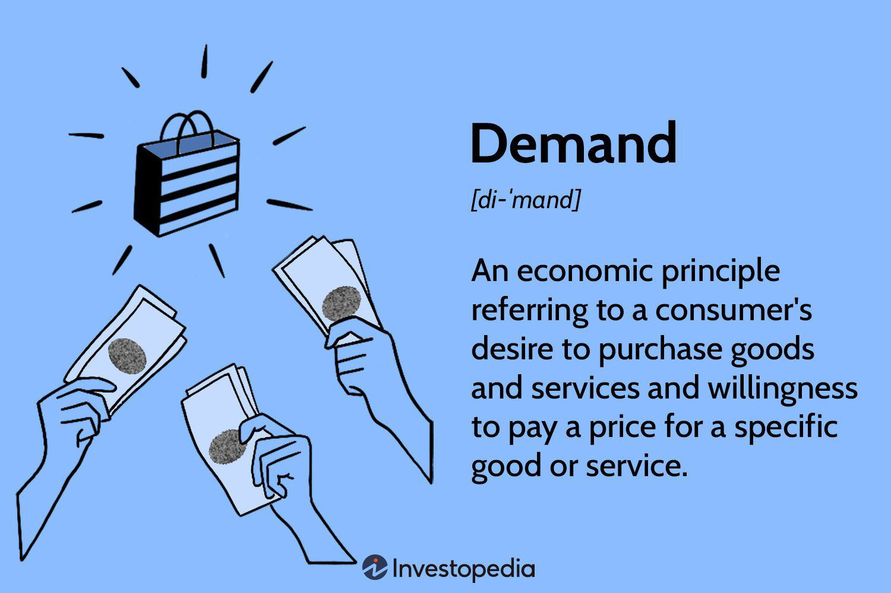

In today's dynamic financial landscape, the convergence of economics and technology is reshaping the trading sector. Algorithmic trading, or algo trading, stands as a pivotal development in this arena, utilizing advanced computational algorithms to enhance the speed and efficiency of trading operations. These algorithms analyze market data, identify trading opportunities, and execute transactions with minimal human intervention, thereby transforming how financial markets operate.

A compelling development within this context is the incorporation of demand guarantees into algo trading frameworks. Demand guarantees serve as financial safeguards that protect parties involved in a transaction against the risk of non-performance. Financial institutions, typically banks, issue these guarantees to ensure that the contractual obligations are honored, thus fostering trust and facilitating smoother transactions.



The synergy between demand guarantees and algo trading offers a fascinating opportunity to boost economic efficiency and mitigate inherent trading risks. By embedding demand guarantees into the architecture of algorithmic trading, financial entities can automate the verification of contract compliance and risk management processes. This integration promises to not only streamline trading operations but also enhance the reliability of automated trades.

The exploration of this intersection seeks to highlight how demand guarantees can fortify the economic fabric of modern trading practices, paving the way for more resilient and robust financial markets. As technology continues to advance, the strategic fusion of these elements will likely play a crucial role in the evolution of financial systems, promoting a more secure and efficient trading environment.

## Table of Contents

## Understanding Demand Guarantees in Economics

Demand guarantees are pivotal financial instruments designed to provide security in commercial transactions by mitigating non-performance risks. They are usually provided by banks or financial institutions, offering a promise to the beneficiary that compensation will be made if the contract terms are not fulfilled by the opposite party. This mechanism is crucial in facilitating transactions across economies, as it provides a safeguard against counterparty risks that could otherwise hinder business dealings.

In the context of economics, demand guarantees play a vital role by ensuring that contractual obligations are met, thereby promoting trust and reliability between parties. This assurance can be particularly beneficial in international trade, where buyers and sellers may be dealing with unfamiliar partners in different legal jurisdictions. Demand guarantees act as a bridge, overcoming the apprehension that may arise from such contexts.

Typically, demand guarantees are of several types, including performance guarantees, advance payment guarantees, and bid bonds. Each serves a specific purpose:

1. **Performance Guarantees**: Ensure the satisfactory completion of a project or the delivery of services as promised in the contract.

2. **Advance Payment Guarantees**: Protect the buyer by ensuring the seller returns any advance payments if they fail to deliver the goods or services.

3. **Bid Bonds**: Provide assurance to the project owner that the bidder will undertake the contract under the terms at which they bid.

The use of demand guarantees boosts economic activities by minimizing the perceived risks associated with large transactions. For example, in construction contracts, the inability of a contractor to fulfill their obligations can lead to significant financial losses for the client. With demand guarantees, the client is protected, enabling smoother progress of projects and reducing instances of litigation or renegotiations. 

Furthermore, these guarantees support various sectors by encouraging trade and enhancing the [liquidity](/wiki/liquidity-risk-premium) and cash flow of businesses. The safety net provided by demand guarantees allows companies to engage in transactions that they might otherwise consider too risky, broadening their market reach and competitive advantage.

Understanding the importance and mechanisms of demand guarantees is essential for businesses and financial institutions seeking to leverage these tools for economic benefits. They not only promote secure trading environments but also contribute to the stability and growth of financial markets by enabling more transactions with reduced hesitancy from potential risks.

## The Role of Algo Trading in Modern Economics

Algorithmic trading, often referred to as algo trading, represents a transformative advancement in financial markets, leveraging high-speed computational power and intricate mathematical models to execute trades with unprecedented speed and accuracy. This trading methodology automates decision-making processes that were traditionally handled manually by traders, thereby significantly minimizing human error and operational latency.

In [algorithmic trading](/wiki/algorithmic-trading), algorithms are designed to evaluate multiple parameters such as price, timing, and [volume](/wiki/volume-trading-strategy) to determine optimal trading strategies. This is achieved through rule-based systems and statistical models which can process vast amounts of data in real time. The core advantage of this approach is its capacity to execute transactions in fractions of a second, thereby taking advantage of fleeting market opportunities that are inaccessible through manual trading.

A fundamental component of algorithmic trading is its contribution to market liquidity. By continuously placing a large number of buy and sell orders, algorithms help to keep the market fluid, allowing traders to enter and [exit](/wiki/exit-strategy) positions with minimal price impact. This liquidity benefits not just institutional traders but also individual investors, who gain from narrower bid-ask spreads and more efficient price discovery.

From an economic perspective, the automation in algo trading facilitates more efficient market dynamics. The rapid pace at which algorithms can analyze and act upon data enables financial markets to reflect information and adjust prices more quickly, thus enhancing overall market efficiency. For instance, algorithms can swiftly incorporate news events into asset prices, which might take significantly longer to occur through traditional trading practices.

Additionally, algorithmic trading systems are equipped to handle complex computations that integrate diverse datasets, such as financial metrics, historical data, and even macroeconomic indicators. This data-driven approach can identify trading patterns and anomalies, thereby allowing for the development of sophisticated trading strategies that are capable of exploiting market inefficiencies and generating alpha.

To illustrate how algorithmic trading operates, consider the following Python pseudocode that describes a simple algorithm for moving average crossover—a popular strategy used to determine buy or sell signals based on moving averages of stock prices:

```python
import pandas as pd

def moving_average_crossover(prices, short_window, long_window):
    signals = pd.DataFrame(index=prices.index)
    signals['price'] = prices
    signals['short_mavg'] = prices.rolling(window=short_window, min_periods=1, center=False).mean()
    signals['long_mavg'] = prices.rolling(window=long_window, min_periods=1, center=False).mean()
    signals['signal'] = 0.0
    signals['signal'][short_window:] = np.where(signals['short_mavg'][short_window:] > signals['long_mavg'][short_window:], 1.0, 0.0)  
    signals['positions'] = signals['signal'].diff()
    return signals

# Example usage with dummy price data
prices = pd.Series([100, 102, 101, 105, 107, 104, 110])
short_window = 2
long_window = 3
signals = moving_average_crossover(prices, short_window, long_window)
print(signals)
```

In this example, the algorithm calculates the short-term and long-term moving averages of stock prices to generate trading signals. When the short-term average crosses above the long-term average, it indicates a buy signal, and a crossover in the opposite direction suggests a sell signal. Such simple algorithmic strategies can be expanded and refined to include additional data points and risk management parameters, further enhancing their effectiveness in live trading environments.

Overall, the role of algorithmic trading in modern economics is crucial, offering significant advancements in market operations. By leveraging cutting-edge technology and robust quantitative models, algo trading not only optimizes the speed and accuracy of trading activities but also supports the stability and efficiency of financial markets globally.

## Integrating Demand Guarantees into Algo Trading

The integration of demand guarantees into algorithmic trading platforms offers a strategic enhancement by embedding a layer of financial security. Demand guarantees act as a risk mitigation tool, ensuring that in the event of contract non-performance, the potential loss is minimized through a pre-arranged compensatory framework. This aspect is particularly crucial in algorithmic trading, where transactions are executed at an incredibly fast pace and involve sophisticated algorithms designed for optimal performance.

To seamlessly integrate demand guarantees, one must embed their logic within trading algorithms, allowing for the automatic verification of contract compliance and management of associated risks. This process involves defining the conditions under which a demand guarantee can be triggered and ensuring that the algorithm accurately interprets contractual clauses. A typical approach involves creating a set of rules and conditions coded directly into the trading software, which autonomously evaluates whether the terms of the guarantee are met.

Consider the following Python pseudo-code that illustrates the integration of a demand guarantee condition:

```python
class TradeGuarantee:
    def __init__(self, contract_value, guarantee_limit):
        self.contract_value = contract_value
        self.guarantee_limit = guarantee_limit

    def verify_contract(self, performance):
        if performance < self.contract_value:
            return self.trigger_guarantee(performance)
        else:
            return "Contract fulfilled"

    def trigger_guarantee(self, performance):
        compensation = self.contract_value - performance
        if compensation <= self.guarantee_limit:
            return f"Guarantee triggered: Compensate {compensation} units"
        else:
            return "Guarantee limit exceeded"

# Example usage
contract = TradeGuarantee(contract_value=1000, guarantee_limit=150)
print(contract.verify_contract(performance=850))
```

In this example, a `TradeGuarantee` class is defined to evaluate whether the performance of a contract meets its value. If not, the difference is calculated, triggering a guarantee if it is within the preset limits.

Automating the process of issuing and redeeming demand guarantees via algorithmic trading systems significantly streamlines operations. It reduces human intervention and increases the reliability of automated transactions by ensuring compliance with the contractual terms is verified with zero latency. Additionally, this automatic process improves risk management and operational efficiency, facilitating greater confidence in complex trading environments.

Moreover, by incorporating demand guarantees, trading platforms can better handle unexpected market conditions, where the risk of default or non-compliance is elevated. This system enables traders to focus on crafting strategies and making data-driven decisions, assured that the underlying risk management mechanism is robust and capable of handling contingencies efficiently.

## Practical Applications and Benefits

In practice, demand guarantees bolster algorithmic trading by offering a secure foundation that promotes confidence among market participants. These financial instruments are particularly effective in high-stakes transactions, where the involved parties face significant risk exposure. By ensuring payment fulfillment if contract terms are breached, demand guarantees enhance trust and facilitate the execution of complex and high-volume trades.

A primary benefit of integrating demand guarantees into algorithmic trading is enhanced risk management. Algorithmic trading systems are driven by data and speed, executing trades in milliseconds. While these features improve efficiency, they also introduce risks of systemic errors or unforeseen market movements. Demand guarantees help mitigate these risks by providing a layer of security that automatically triggers compensation if conditions are not met. This reduces the potential impact of trading errors and contributes to more stable trading environments.

Moreover, incorporating demand guarantees aligns trading practices with international compliance standards. Financial markets operate globally, subject to varying regulations and standards. Demand guarantees can be tailored to meet specific legal requirements, ensuring trading activities adhere to both local and international guidelines. This compliance facilitates cross-border transactions and opens up new markets for financial institutions that leverage algorithmic trading.

The facilitation of more significant trade volumes is another critical advantage of using demand guarantees within algo trading. High-frequency trading platforms benefit from the assurance that counterparties will fulfill their contractual obligations. This assurance allows traders to execute larger trades more confidently, increasing the liquidity available in the market. As a result, markets become more robust and resilient, contributing to overall economic stability.

In conclusion, demand guarantees play a pivotal role in expanding the capabilities of algorithmic trading. By enhancing risk management, ensuring compliance with international standards, and enabling larger trade volumes, they contribute to the thriving ecosystem of modern financial markets. As these integration practices evolve, they pave the way for more secure and efficient trading operations worldwide.

## Challenges and Considerations

Integrating demand guarantees into algorithmic trading presents various challenges that need careful consideration. One of the primary obstacles is ensuring compliance with a wide array of international financial regulations. Different jurisdictions may have specific requirements regarding financial instruments like demand guarantees. It is crucial to design algorithms that can adapt to these regulatory frameworks while still maintaining the efficiency and speed that define algorithmic trading.

Another significant challenge lies in developing sophisticated algorithms capable of accurately interpreting and executing the terms of demand guarantees. This requires the integration of advanced [machine learning](/wiki/machine-learning) models and natural language processing techniques to understand and automate guarantee-related tasks effectively. The complexity of these operations necessitates precise programming to handle diverse scenarios and to enforce contract terms programmatically.

Moreover, technological and cybersecurity concerns must be addressed to safeguard the systems involved in algo trading. The integration of demand guarantees introduces additional layers of complexity, necessitating robust cybersecurity measures to protect against potential breaches and malfunctions. Ensuring data integrity and preventing unauthorized access are critical, as any lapse in security could result in significant financial losses.

Implementing these systems also requires high reliability and uptime, as the speed and frequency of algorithmic trades leave little room for error. Redundancy measures and regular system audits are essential to maintain the integrity and efficiency of trading platforms. Using tools like automated testing and continuous monitoring can help mitigate these risks.

Despite these challenges, overcoming them can provide a competitive edge, allowing financial institutions to leverage algorithmic trading more effectively while reducing counterparty risks and enhancing trade efficiency.

## Conclusion

As financial markets continue to evolve, the strategic integration of demand guarantees within algorithmic trading platforms stands out as a promising advancement toward enhanced economic efficiency and security. This convergence addresses some of the critical challenges faced in modern finance, such as counterparty risk and the need for optimized trading processes.

Demand guarantees serve as an essential risk management tool by ensuring that contractual obligations are met, thereby minimizing the potential for financial disputes or defaults. When these guarantees are embedded within the trading algorithms, financial institutions can benefit from a seamless and automated verification process. This automation not only enhances reliability but also allows financial institutions to engage confidently in high-volume and high-stakes trading scenarios.

Algorithmic trading, by its nature, offers a significant reduction in human error and latency, while vastly improving the ability to process large datasets and react to market movements instantaneously. When paired with demand guarantees, the resulting synergy provides trading platforms with an additional layer of security, ensuring that all transactions are executed with the assurance of financial backing.

For financial institutions, the integration of these mechanisms represents a strategic advantage in an increasingly competitive and complex market. It allows them to offer more robust and reliable trading services, which can be pivotal in attracting and retaining clients who seek confidence in their financial dealings.

Looking forward, the future of trading strongly hinges on the effective harnessing of technology, ensuring that both old and new economic mechanisms work in tandem to support a sustainable and trustworthy financial ecosystem. This not only includes the integration of advanced technologies like algorithmic trading and demand guarantees but also requires continuous innovation in regulatory compliance, cybersecurity, and the overall robustness of financial systems. Through these efforts, the path is paved towards a financial environment that is not only efficient and secure but also inclusive and resilient, capable of adapting to the dynamic changes of global markets.

## References & Further Reading

[1]: Lewis, M. (2014). ["Flash Boys: A Wall Street Revolt."](https://en.wikipedia.org/wiki/Flash_Boys) W. W. Norton & Company.

[2]: Lopez de Prado, M. (2018). ["Advances in Financial Machine Learning."](https://www.amazon.com/Advances-Financial-Machine-Learning-Marcos/dp/1119482089) Wiley.

[3]: Chan, E. P. (2009). ["Quantitative Trading: How to Build Your Own Algorithmic Trading Business."](https://github.com/ftvision/quant_trading_echan_book) Wiley.

[4]: Jansen, S. (2018). ["Machine Learning for Algorithmic Trading: Predictive Models to Extract Signals from Market and Alternative Data for Systematic Trading Strategies with Python."](https://github.com/stefan-jansen/machine-learning-for-trading) Packt Publishing.

[5]: Aronson, D. R. (2006). ["Evidence-Based Technical Analysis: Applying the Scientific Method and Statistical Inference to Trading Signals."](https://www.amazon.com/Evidence-Based-Technical-Analysis-Scientific-Statistical/dp/0470008741) Wiley.

[6]: Hull, J. C. (2017). ["Options, Futures, and Other Derivatives."](https://www.semanticscholar.org/paper/Options%2C-Futures%2C-and-Other-Derivatives-Hull/89bdee500c8623864fc9eb7a471546aa713acc44) Pearson.