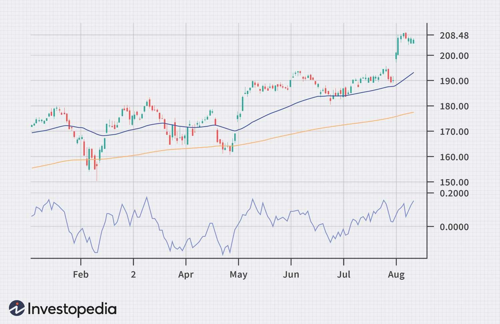

## Table of Contents

## What is a Demand Index?

A Demand Index is a tool used to measure how much people want to buy something. It looks at how many people are interested in a product or service and how much they are willing to pay for it. This helps businesses understand if there is a big or small demand for what they are selling.

Businesses use the Demand Index to make smart decisions. If the index shows a high demand, they might make more of the product or raise the price. If it shows low demand, they might lower the price or stop making it. This way, they can better match what they offer to what people want.

## Why is the Demand Index important in economics?

The Demand Index is really important in economics because it helps everyone understand how much people want to buy things. When businesses know the demand, they can decide how much to make and what price to set. If lots of people want a product, the Demand Index will be high, and businesses might make more of it or charge more. If not many people want it, the index will be low, and they might make less or lower the price. This helps keep the market balanced so that there's not too much or too little of things.

Also, the Demand Index helps economists and governments see how the economy is doing. If demand is going up, it might mean the economy is growing because people are buying more. If demand is going down, it could be a sign that the economy is slowing down. By watching the Demand Index, they can make plans and policies to help the economy stay strong. It's like a big signal that tells everyone what's happening with what people want to buy.

## How is the Demand Index calculated?

The Demand Index is calculated by looking at how many people want to buy something and how much they are willing to pay for it. To do this, economists and businesses collect data from sales, surveys, and market research. They look at how many items are sold over a period of time and at what price. They also ask people about their interest in the product and what they would be willing to pay. All this information helps them figure out the level of demand.

Once they have all the data, they use formulas to turn it into a number that shows the demand. This number is the Demand Index. It can be a simple average of the data points, or it can be more complex, using weights for different factors like price sensitivity or seasonal changes. The exact way to calculate it can change depending on what the business or economist wants to know, but the main idea is to get a clear picture of how much people want the product.

## What are the key components of the Demand Index?

The Demand Index has two main parts: the number of people who want to buy something and how much they are willing to pay for it. The first part looks at how many sales there are and how many people say they are interested in the product. This tells us how popular the product is. The second part checks the prices people are paying and what they say they would pay. This shows how much people value the product.

To calculate the Demand Index, businesses and economists gather data from sales records, customer surveys, and market research. They use this information to see how many items are sold at different prices and how many people are interested at those prices. Then, they use a formula to turn all this data into a single number, the Demand Index. This number helps them understand if demand is high or low, which is important for making decisions about how much to produce and what price to set.

## Can you explain the basic rules for interpreting the Demand Index?

The Demand Index is a number that shows how much people want to buy something. If the Demand Index is high, it means a lot of people want the product and are willing to pay a good price for it. This is good news for businesses because it means they can sell more and maybe even charge more money. When the Demand Index is low, it means not many people want the product or they don't want to pay much for it. This can be a warning for businesses to maybe lower the price or stop making as much of the product.

You can also use the Demand Index to see trends over time. If the Demand Index keeps going up, it might mean more and more people are interested in the product, which could be a sign of a growing market. If it keeps going down, it might mean fewer people want the product, which could be a sign of a shrinking market. By watching these changes, businesses and economists can make better plans for the future.

## What are some common misconceptions about the Demand Index?

One common misconception about the Demand Index is that it's the same thing as how many products are sold. But it's not just about sales numbers. The Demand Index also looks at how much people are willing to pay. So, even if sales are high, if people are only buying because the price is really low, the Demand Index might not be that high. It's about understanding the value people see in the product, not just how many they buy.

Another misconception is that the Demand Index is always accurate. But it's based on data and guesses about what people want. Sometimes, the data can be wrong or people might change their minds. So, the Demand Index is a helpful tool, but it's not perfect. It's important to use it along with other information to get a full picture of what's going on in the market.

## How does the Demand Index differ from other economic indicators?

The Demand Index is different from other economic indicators because it focuses on how much people want to buy things and what they are willing to pay. Other indicators, like the Gross Domestic Product (GDP), look at the total value of all goods and services produced in a country. The Consumer Price Index (CPI) measures how prices are changing over time. While these indicators give a broad view of the economy, the Demand Index is more specific to understanding consumer demand for particular products or services.

Another difference is that the Demand Index is more immediate and can change quickly based on current market conditions. For example, if a new popular product comes out, the Demand Index can show a sudden increase in demand for it. In contrast, indicators like unemployment rates or GDP might take longer to reflect changes in the economy. The Demand Index helps businesses make quick decisions about production and pricing, while other indicators are used more for long-term economic planning and policy-making.

## What historical examples illustrate the use of the Demand Index?

During the early 2000s, the Demand Index was used to understand the growing interest in smartphones. When Apple released the first iPhone in 2007, the Demand Index showed a huge spike in demand for this new type of device. People were willing to pay a lot of money for it, and stores couldn't keep them in stock. This high Demand Index helped Apple know that they should keep making more iPhones and even raise the price a bit. It also helped other companies see that there was a big market for smartphones, so they started making their own versions.

Another example is during the 1970s oil crisis. The Demand Index helped show how much people needed oil and how much they were willing to pay for it. When oil supplies were cut off, the Demand Index went up because people still needed oil but there was less of it. This led to higher prices and helped governments and oil companies understand that they needed to find new ways to get oil or use less of it. The Demand Index was a key tool in figuring out how to handle the crisis and plan for the future.

## How can businesses use the Demand Index to make strategic decisions?

Businesses can use the Demand Index to figure out how much people want their products and what they are willing to pay. If the Demand Index is high, it means a lot of people want the product and are ready to pay good money for it. This tells the business they should make more of the product and maybe even raise the price a bit. For example, if a toy company sees a high Demand Index for a new toy, they might make more toys and sell them at a higher price because they know people want them.

On the other hand, if the Demand Index is low, it means not many people want the product or they don't want to pay much for it. This is a signal for the business to maybe lower the price or stop making as much of the product. For instance, if a clothing store sees a low Demand Index for a certain style of jeans, they might lower the price to sell them faster or stop ordering more of that style. By using the Demand Index, businesses can make smart choices about what to make and how much to charge, helping them sell more and make more money.

## What advanced techniques can be used to analyze the Demand Index?

One advanced way to analyze the Demand Index is by using data analytics and machine learning. These tools can look at lots of data from the past and find patterns that are hard for people to see. For example, they can predict how the Demand Index might change in the future based on things like the time of year, what's happening in the news, or even what people are saying on social media. By using these predictions, businesses can be ready for changes in demand and make better plans for what to make and when to sell it.

Another technique is to use something called econometric models. These are like math formulas that help understand how different things affect the Demand Index. They can show how changes in prices, income levels, or even the weather might change how much people want to buy. By using these models, businesses can see how different choices might affect the Demand Index and choose the best way to go. This helps them make smart decisions about pricing, production, and marketing to match what people want.

## How does the Demand Index correlate with other macroeconomic variables?

The Demand Index often goes up and down with other big economic numbers like the Gross Domestic Product (GDP). When the Demand Index is high, it usually means more people are buying things, which can make the GDP go up too. This is because when people want more stuff, businesses make more stuff, and that adds to the total value of goods and services in the country. But if the Demand Index is low, it might mean fewer people are buying things, which can make the GDP go down because businesses are not selling as much.

The Demand Index also has a close relationship with the Consumer Price Index (CPI). When the Demand Index goes up, it can push prices up too, because businesses might raise prices when they see a lot of people want their products. This can make the CPI go up, which measures how prices are changing over time. On the other hand, if the Demand Index is low, businesses might lower prices to sell more, which can keep the CPI from going up too fast. By watching how the Demand Index changes with these other numbers, economists can get a better idea of what's happening in the economy and make plans to help it grow.

## What are the limitations and criticisms of the Demand Index as an economic tool?

The Demand Index can be helpful, but it has some problems. One big issue is that it's based on guesses and data that might not always be right. People can change their minds about what they want to buy, so the Demand Index might not always show what will really happen. Also, the data used to calculate it can have mistakes or be out of date, which can make the Demand Index less useful for making decisions.

Another criticism is that the Demand Index can be hard to understand because it's affected by so many things. Things like the time of year, what's happening in the news, or even the weather can change how much people want to buy things. This means the Demand Index can go up and down a lot, making it tricky for businesses to use it to plan for the future. Even though it's a good tool, it's best to use the Demand Index along with other information to get a full picture of what's going on in the market.

## References & Further Reading

[1]: Aronson, D. R. (2006). ["Evidence-Based Technical Analysis: Applying the Scientific Method and Statistical Inference to Trading Signals"](https://www.amazon.com/Evidence-Based-Technical-Analysis-Scientific-Statistical/dp/0470008741). Wiley.

[2]: Chan, E. P. (2008). ["Quantitative Trading: How to Build Your Own Algorithmic Trading Business"](https://github.com/ftvision/quant_trading_echan_book). Wiley.

[3]: Jansen, S. (2020). ["Machine Learning for Algorithmic Trading"](https://github.com/stefan-jansen/machine-learning-for-trading). Packt Publishing.

[4]: Lopez de Prado, M. (2018). ["Advances in Financial Machine Learning"](https://www.amazon.com/Advances-Financial-Machine-Learning-Marcos/dp/1119482089). Wiley.

[5]: Bergstra, J., Bardenet, R., Bengio, Y., & Kégl, B. (2011). ["Algorithms for Hyper-Parameter Optimization"](https://dl.acm.org/doi/10.5555/2986459.2986743). Advances in Neural Information Processing Systems 24.