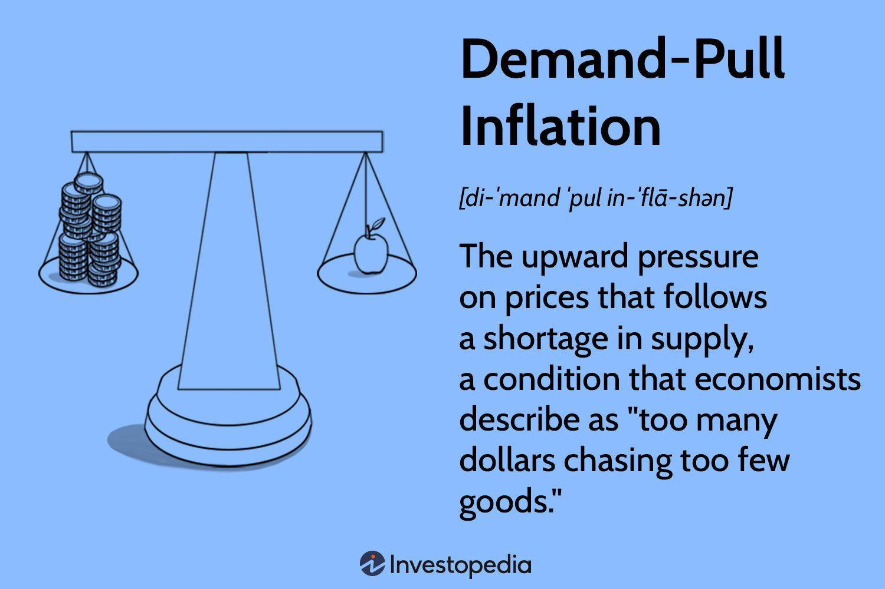

Inflation economics, demand-pull dynamics, and algorithmic trading represent critical components of contemporary economic analysis. Each plays a significant role in shaping the financial environment, influencing investor decisions, and informing policy formulation. Understanding how these elements interact is essential for investors seeking profitable opportunities and policymakers aiming to maintain economic stability.

Demand-pull inflation arises when aggregate demand for goods and services exceeds supply, resulting in increased prices within an economy. This phenomenon is often triggered by factors such as robust economic growth, government spending enhancements, and heightened consumer confidence. Its effects can lead to significant economic shifts, influencing everything from consumer purchasing power to interest rate adjustments.

Algorithmic trading, on the other hand, involves the use of sophisticated algorithms to conduct trades based on real-time market data and predefined rules. These automated systems offer benefits such as increased market liquidity and reduced transaction costs. However, they can also influence inflation dynamics by affecting market volatility and price movements, especially during periods of economic instability.

By exploring these interconnected phenomena, we can appreciate how they collectively mold modern economic landscapes. Recognizing the causative factors of demand-pull inflation and understanding the influence of algorithmic trading on these processes provides a nuanced perspective on the forces driving current and future economic conditions. This knowledge is invaluable for both investors seeking to maximize returns and policymakers tasked with fostering sustainable economic growth.

## Table of Contents

## Understanding Demand-Pull Inflation

Demand-pull inflation arises when the aggregate demand for goods and services in an economy surpasses its aggregate supply. This phenomenon typically results in price increases because demand cannot be met promptly by the available supply, thus creating upward pressure on prices. Several key factors can trigger demand-pull inflation. Economic growth often serves as a significant driver, as rising income levels lead to increased consumer spending. This, in turn, propels demand beyond what can be satisfied by current production levels. Similarly, increased government expenditure, particularly when financed through debt, injects additional money into the economy, stimulating demand further.

Rising consumer confidence also plays a crucial role. When consumers feel optimistic about their financial futures, they are more likely to spend rather than save, thus enhancing demand. This aspect ties demand-pull inflation closely to the economic cycle, where periods of prosperity and growth see heightened inflationary pressures due to robust consumer activity.

The fundamental mechanics behind demand-pull inflation can be simplified by the economic equation of exchange, given by:

$$
MV = PQ
$$

where $M$ is the money supply, $V$ is the velocity of money, $P$ is the price level, and $Q$ is the quantity of goods and services produced. In scenarios where the economy’s output capacity ($Q$) does not increase at the same rate as shifts in $M$ or $V$, $P$ tends to rise, indicating inflation.

Contrastingly, cost-push inflation originates from factors that increase production costs, such as rising wages or material costs, and these increased expenses are frequently passed on to consumers as higher prices. This type of inflation does not stem from an increase in demand, but from constraints or increases in the cost to supply goods and services. While both types of inflation lead to price increases, the causative factors and economic implications of each differ. Understanding these distinctions is essential for devising appropriate monetary and fiscal policies to address inflationary pressures effectively.

## The Mechanics of Demand-Pull Inflation

Demand-pull inflation emerges when an economy experiences an imbalance between aggregate demand and aggregate supply, a concept primarily developed within the Keynesian economic framework. It occurs as the economy grows and employment levels rise, prompting an increase in aggregate demand. Companies, responding to this surge in demand, tend to expand their operations, thereby hiring additional employees and enhancing production capacities.

However, the critical [factor](/wiki/factor-investing) in demand-pull inflation is the persistence of demand outstripping supply capabilities. This condition creates inflationary pressures, which are reflected in the upward movement of prices for goods and services. As more money competes for a limited quantity of goods, sellers are incentivized to increase prices, contributing to an overall rise in the cost of living.

To illustrate this phenomenon mathematically, let us consider the aggregate demand (AD) and aggregate supply (AS) framework. In a typical demand-pull scenario, the equation can be simplified as follows:

$$
AD > AS
$$

This inequality highlights that when aggregate demand is greater than aggregate supply, the result is upward pressure on price levels. Aggregate demand itself can be represented as the sum of consumption (C), investment (I), government spending (G), and net exports (X - M):

$$
AD = C + I + G + (X - M)
$$

A significant increase in any of these components, particularly in a period of full employment, can drive the demand beyond the available supply, leading to inflationary pressures. For example, considerable government expenditure (G) during economic recovery phases or surge in consumer spending (C) due to high consumer confidence might contribute to such dynamics.

Economists often monitor these variables to predict potential inflationary trends and suggest timely interventions to prevent undesirable economic outcomes. If not managed effectively, demand-pull inflation can lead to a self-reinforcing cycle of rising prices and wages that complicates economic stability.

## Causes of Demand-Pull Inflation

Demand-pull inflation arises when the aggregate demand for goods and services in an economy surpasses the available supply, leading to upward pressure on prices. This phenomenon is often linked to several key factors that stimulate demand beyond the economy's productive capacity.

One primary cause of demand-pull inflation is robust economic growth. During periods of economic expansion, consumer incomes generally rise, increasing their purchasing power. This heightened demand for goods and services, if not matched by an equivalent increase in supply, can lead to inflationary pressures. The relationship between demand and supply can be mathematically represented by the equation:

$$
P = \frac{D}{S}
$$

where $P$ is the price level, $D$ is the demand, and $S$ is the supply. A substantial increase in $D$ relative to $S$ results in an increase in $P$, indicating higher prices.

Increased export demand also contributes to demand-pull inflation. When a country's goods become more desirable abroad, domestic producers may prioritize foreign markets, reducing the quantity available locally. This competition for limited resources drives prices up domestically, as both local and international buyers vie for the same goods.

Expansive monetary policies are another significant catalyst. Central banks may lower interest rates or implement quantitative easing strategies to stimulate economic growth, increasing the money supply in circulation. When more money is available, consumer spending and business investments rise, heightening demand and potentially leading to inflation if not balanced with corresponding supply growth.

Government actions, including increased public spending and tax incentives, can intensify demand-pull effects. Policies designed to stimulate the economy by boosting consumer and government spending can inadvertently create scenarios where too much money chases too few goods, embodying the classic essence of demand-pull inflation.

Rising consumer expectations also play a crucial role. When consumers anticipate future price increases, they may expedite purchases, further intensifying demand. This behavior can create a self-fulfilling cycle, where expectancy-driven demand contributes to the very price increases consumers fear.

Finally, monetary inflation, characterized by an excessive growth in the money supply, can exacerbate demand-pull inflation. When an economy's money supply increases faster than its output of goods and services, the value of money diminishes, requiring more currency to purchase the same items, thus inflating prices.

Each of these factors, whether through direct market interactions or through policies and perceptions, contributes to the broader dynamic of demand-pull inflation, a challenging phenomenon for monetary authorities to manage.

## Algorithmic Trading's Role in Inflation Dynamics

Algorithmic trading utilizes sophisticated algorithms to conduct rapid and intricate trades on financial markets. It relies on advanced mathematical models and computer systems to make trading decisions at speeds that are impossible for human traders. By leveraging market data, technical indicators, and historical trends, [algorithmic trading](/wiki/algorithmic-trading) systems aim to exploit short-term inefficiencies in the market.

These systems can significantly influence inflationary trends in several ways. Firstly, algorithmic trading can enhance market [liquidity](/wiki/liquidity-risk-premium) by facilitating more trades and narrowing bid-ask spreads, which generally stabilizes prices. Increased liquidity often translates to lower [volatility](/wiki/volatility-trading-strategies) and smoother price fluctuations, potentially counteracting inflationary pressures. 

However, algorithmic trading can also exacerbate price movements during inflationary periods. This is largely dependent on the strategic objectives embedded within the algorithms. For instance, if a substantial number of trading algorithms are programmed to buy assets when prices surge or to sell during price falls, this can lead to sharp volatility, reinforcing inflationary pressures rather than mitigating them. This phenomenon is often observed during so-called "flash crashes," where prices plummet or soar dramatically within a very short period due to algorithmic trading.

The role of algorithmic trading in the broader economic context is nuanced. On one hand, it can effectively dampen inflation by providing continuous market presence that enhances liquidity. On the other hand, its rapid and high-frequency operations may amplify inflationary trends when herd behavior is reflected in algorithms' design.

Given the complex interaction between algorithmic trading and inflation, regulatory frameworks are essential to ensure that these systems do not destabilize financial markets. Mechanisms such as circuit breakers, which pause trading when drastic price movements occur, can help manage the potentially negative impacts of algorithmic trading on inflation dynamics. Furthermore, continuous monitoring and adaptation of algorithmic strategies are crucial in aligning trading objectives with market stability, thereby maintaining a balanced economic environment.

## Examples of Demand-Pull Inflation

Historically, demand-pull inflation has emerged during significant economic and technological transformations. After major conflicts such as World War II, the post-war periods often experienced economic booms that triggered demand-pull inflation. The rebuilding of infrastructure and the resumption of consumer production, coupled with increased household spending, led to heightened demand that surpassed supply capabilities. This imbalance resulted in widespread inflationary pressures as economies rapidly expanded.

Technological advances have also contributed to demand-pull inflation by sparking shifts in production and labor markets. For instance, the tech boom of the late 20th and early 21st centuries saw rapid innovation and improved productivity. However, the initial surge in demand for new technologies and related products often led to inflationary trends as markets adjusted to these changes.

Recent examples of demand-pull inflation can be observed in the economic recoveries propelled by governmental fiscal stimulus measures. In response to economic slowdowns, governments worldwide have implemented expansive monetary policies and stimulus packages to boost economic activity and consumer spending. Such interventions, while providing a necessary economic uplift, can also lead to scenarios where demand quickly recovers and exceeds the available supply, thus fueling inflation.

These instances underscore the influential role of policy decisions and external events in shaping inflation dynamics. As economies respond to various stimuli, demand fluctuations can lead to significant inflationary challenges, highlighting the intricate relationship between government actions, external factors, and inflationary trends.

## Strategies to Manage Demand-Pull Inflation

To manage demand-pull inflation, economic policymakers deploy several strategies aimed at reducing the excessive demand that drives price increases. Central banks play a crucial role through monetary policy adjustments, primarily by influencing interest rates. By raising interest rates, central banks can make borrowing more expensive, which consequently reduces consumer and business spending. This decrease in demand can help cool down inflationary pressures. The mathematical relationship governing this is represented by the inverse relationship between [interest rate](/wiki/interest-rate-trading-strategies) (i) and investment (I), where an increase in $i$ leads to a decrease in $I$, symbolically expressed as:

$$
I = f(i) \quad \text{where} \quad \frac{dI}{di} < 0
$$

Moreover, central banks can employ open market operations to influence the money supply directly. By selling government securities, they can reduce the amount of money circulating in the economy, thereby exerting downward pressure on demand.

Fiscal policies conducted by governments provide another set of tools to manage demand-pull inflation. Governments may opt to decrease public spending or increase taxes to reduce disposable income and, consequently, consumer spending. This contractionary fiscal approach effectively decreases aggregate demand, alleviating the upward pressure on prices. The fiscal multiplier effect illustrates how changes in government spending ($\Delta G$) can lead to larger changes in gross domestic product (GDP), indicative of demand levels:

$$
\Delta \text{GDP} = \frac{1}{1 - MPC} \times \Delta G
$$

where $MPC$ is the marginal propensity to consume.

On the supply side, enhancing production efficiency stands as a strategic remedy to demand-pull inflation. By improving technologies, optimizing production processes, and investing in workforce training, companies can increase their supply capabilities, thus diminishing the gap between supply and demand. Consequently, this alleviates the pressure on prices.

For instance, using advancements in automation and digitization, firms can streamline operations and reduce production costs, which increases output without necessitating price hikes.

In summary, managing demand-pull inflation demands a multifaceted approach. Monetary and fiscal policies play essential roles, while supply-side enhancements provide a sustainable way to meet rising demand without triggering inflationary effects. These strategies are crucial in stabilizing economies and fostering an environment conducive to stable growth.

## Conclusion

Demand-pull inflation arises when the aggregate demand in an economy surpasses its aggregate supply, leading to upward pressure on prices. This phenomenon represents a significant challenge for both economic stability and policy formulation. The primary difficulty lies in managing the delicate balance between promoting economic growth through demand stimulation and controlling inflation to maintain purchasing power and economic stability. 

Algorithmic trading, which utilizes complex algorithms to execute trades based on market data, plays a noteworthy role in this dynamic. By influencing price discovery and market liquidity, algorithmic trading can either stabilize or exacerbate inflationary trends. For example, algorithms programmed to capitalize on rapid price movements can intensify market volatility during inflationary periods. Conversely, well-designed algorithms can improve market efficiency and liquidity, potentially mitigating some inflationary pressures. Thus, understanding the intricacies of algorithmic trading offers valuable insights into its dual role as both a catalyst and a stabilizer in modern financial markets.

Ultimately, achieving sustainable economic development requires a strategic approach to managing demand-pull inflation. Policymakers must carefully consider how to stimulate demand without triggering unchecked inflation. This involves a mix of fiscal and monetary policies aimed at adjusting interest rates, regulating public spending, and enhancing production efficiencies. Efficient policy interventions should strive for an equilibrium where economic growth is robust but prices remain stable. The judicious use of algorithmic trading systems can support this goal by enhancing market function, thus ensuring a well-calibrated response to the ever-evolving economic landscape.

## References & Further Reading

[1]: ["Macroeconomics" (8th Edition)](https://www.pearson.com/en-us/subject-catalog/p/macroeconomics/P200000005935/9780137646579) by Olivier Blanchard

[2]: Mankiw, N. G. (2019). ["Principles of Economics" (8th Edition)](https://archive.org/details/principles-of-microeconomics) Cengage Learning

[3]: ["Algorithmic Trading: Winning Strategies and Their Rationale"](https://play.google.com/store/books/details/Algorithmic_Trading_Winning_Strategies_and_Their_R?id=CIwCTVqEj4oC&hl=en-US) by Ernie Chan

[4]: Bernanke, B. S. (2013). ["The Federal Reserve and the Financial Crisis"](https://archive.org/details/federalreservefi0000bern) Princeton University Press

[5]: Lo, A. W., & Hasanhodzic, J. (2010). ["The Evolution of Technical Analysis: Financial Prediction from Babylonian Tablets to Bloomberg Terminals"](https://archive.org/details/evolutionoftechn0000loan) 

[6]: Friedman, M., & Schwartz, A. J. (2008). ["A Monetary History of the United States, 1867-1960"](https://www.jstor.org/stable/j.ctt7s1vp) Princeton University Press