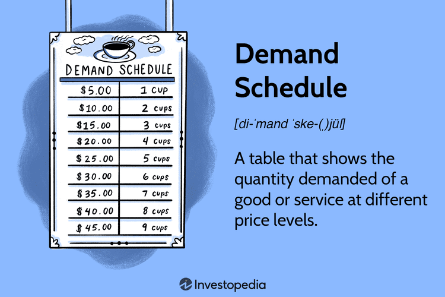

Supply and demand are fundamental economic concepts that underpin market dynamics. Supply refers to the quantity of a good or service that producers are willing and able to offer for sale at different prices, while demand represents the quantity that consumers are ready to purchase at various price points. These forces interact to establish market equilibrium, where the quantity supplied equals the quantity demanded, and this interaction is pivotal in shaping pricing and production decisions within markets.

Demand schedules play a critical role in visualizing these economic scenarios. A demand schedule lists the quantities of a good or service that consumers are willing to purchase at different prices. It serves as a foundational tool in economics for illustrating how price and quantity demanded are related, helping economists and businesses anticipate how changes in market conditions might affect consumer behavior. By examining demand schedules, decision-makers can forecast market trends and devise effective pricing strategies to align supply with anticipated consumer demand.



Economic graphing techniques are vital for the illustration of supply and demand relationships. Using graphs such as line graphs, scatter plots, and bar charts, complex economic interactions can be visually represented, allowing for a more intuitive understanding of market behaviors. Graphs are indispensable in presenting data comprehensively, providing insights that might not be immediately apparent through numerical data alone. They assist in predicting future market movements by highlighting patterns and relationships within the data.

Algorithmic trading, or algo trading, is a method of executing trades using pre-programmed strategies based on statistical models and economic data. In the context of this article, algo trading's connection to economic data becomes evident as these algorithms often rely on supply and demand models to inform trading decisions. By integrating economic graphing techniques, algo trading strategies become more robust, capable of adapting to real-time changes in market conditions.

This article aims to explore the integration of supply and demand theory, economic graphing, and algorithmic trading. It will examine how these elements can be synergistically combined to enhance market strategies and trading effectiveness. Readers will gain an understanding of the interplay between economic theory and technological advancements in trading, the impact of data visualization on trading models, and the challenges associated with aligning economic models with algorithmic strategies. This exploration is intended to encourage traders, economists, and technology developers to leverage these tools for improved market outcomes.

## Table of Contents

## Understanding Supply and Demand

Supply and demand are foundational concepts in economics, forming the basis for understanding how markets function. Supply refers to the quantity of a good or service that producers are willing and able to sell at various price levels over a given period. Demand, conversely, is the amount of a good or service that consumers are willing and able to purchase at different price points within the same timeframe. These concepts interact to determine market equilibrium—the point at which the quantity supplied equals the quantity demanded, resulting in a stable market price.

The interaction of supply and demand shapes market equilibrium. If demand for a product increases while supply remains constant, prices tend to rise due to higher consumer willingness to pay. Conversely, if supply increases with unchanged demand, prices typically decrease as more of the product is available. The equilibrium is mathematically represented by the equations:

$$
Q_d = Q_s
$$

where $Q_d$ is the quantity demanded and $Q_s$ is the quantity supplied. The equilibrium price $P_e$ satisfies both the supply function $S(P)$ and the demand function $D(P)$.

Several factors can affect supply and demand, such as consumer preferences, production costs, and external shocks. Changes in consumer preferences can shift demand curves, causing consumers to buy more or less of a good even if its price does not change. Production costs influence supply since higher costs reduce profitability, potentially decreasing supply. External shocks, like natural disasters or political events, can simultaneously affect both supply and demand by altering availability and consumer needs.

Real-world examples illustrate the dynamics of supply and demand. The oil market provides a clear demonstration; geopolitical tensions can restrict supply, driving up global oil prices. During such times, businesses reliant on fuel may face higher operational costs, affecting supply chains and consumer prices. Another example is the technological advancement in the electronics market, where new innovations boost demand for cutting-edge products, causing older models to experience reduced demand and lower prices.

Understanding these principles helps in analyzing how shifts in supply and demand impact prices and quantities in various markets, offering insights into potential strategies for businesses and policymakers.

## The Role of Demand Schedules

A demand schedule is a tabular representation of the relationship between the price of a good or service and the quantity demanded by consumers over a specified period. It serves a fundamental role in economics by illustrating consumer behavior concerning price changes, enabling analysts and businesses to understand market dynamics better. Demand schedules are foundational in predicting consumer responses to price fluctuations and help guide strategic decisions regarding pricing and production.

The creation of a demand schedule typically involves listing various price points for a particular good or service and the corresponding quantity consumers are willing to purchase at each price. This data is often gathered through market research, surveys, historical sales data, and consumer behavior analysis. For example, a simplified demand schedule for a product might look like this:

| Price ($) | Quantity Demanded |
|-----------|-------------------|
| 5         | 100               |
| 4         | 150               |
| 3         | 200               |
| 2         | 250               |
| 1         | 300               |

Interpreting a demand schedule involves understanding that as prices decrease, the quantity demanded tends to increase, illustrating the law of demand. This relationship helps businesses anticipate how changes in pricing might affect demand levels.

Demand schedules play a crucial role in forecasting market trends. By examining historical data and demand patterns, businesses can anticipate future demand at different price levels, allowing them to optimize inventory, allocate resources efficiently, and implement effective pricing strategies. For instance, during peak seasons, a company might adjust prices knowing that demand typically increases, thus maximizing revenue.

Comparatively, demand schedules align with other economic tools such as supply schedules and demand curves. A supply schedule mirrors a demand schedule by depicting the relationship between price and the quantity supplied by producers. Together, these schedules help determine the market equilibrium where supply equals demand. The demand curve, on the other hand, graphically represents the data in a demand schedule. It typically slopes downwards from left to right, showing the inverse relationship between price and quantity demanded.

In economic analysis, demand schedules, supply schedules, and demand curves collectively contribute to a comprehensive understanding of market mechanisms. They are essential tools for businesses, economists, and policymakers in making informed decisions and strategic plans tailored to anticipated market conditions.

## Economic Graphing Techniques

Economic graphing techniques are indispensable tools for economists and analysts to represent and interpret the dynamics of supply and demand. These techniques provide a visual framework to comprehend complex economic interactions, facilitating the extraction of insights vital for decision-making processes. Graphical analysis not only enables the understanding of current market behavior but also assists in forecasting future trends based on historical data.

Common graph types utilized in economic graphing include line graphs, scatter plots, and bar charts. Line graphs are frequently employed to illustrate changes in supply and demand over time, offering a straightforward way to track price levels or quantity sold and highlighting trends, cycles, and fluctuations. For example, a line graph can depict how the price of a commodity like oil has evolved over several years, providing insights into market [volatility](/wiki/volatility-trading-strategies) and long-term trends.

Scatter plots are effective in showing the relationship between two variables, such as supply and demand. By plotting data points on a two-dimensional axis, these graphs can highlight correlations and causations, assisting in identifying market equilibrium or determining elasticity. For instance, a scatter plot could be used to visualize the relationship between the price of an item and the quantity demanded, facilitating the estimation of demand elasticity.

Bar charts offer a comparative view of discrete data sets, making them suitable for illustrating differences in quantities across various categories or time periods. These charts can effectively highlight [statistics](/wiki/bayesian-statistics) such as production levels of different industries or comparison of sales figures before and after a market event, offering a clear picture of how distinct components or periods vary relative to each other.

Graphs play a crucial role in understanding and predicting market behaviors by synthesizing vast amounts of data into a digestible visual format. They enable the identification of underlying patterns and trends that are not immediately evident in raw data. Graphs provide a basis for predictions by elucidating potential future shifts in supply and demand based on historical data trends and relationships, which can be incorporated into forecasting models.

The significance of graphical analysis in presenting complex economic data comprehensively cannot be overstated. It allows economists to communicate intricate data insights with clarity and precision, enhancing stakeholder understanding. Economists can apply graphical models to convey complex theories such as the Laffer Curve or the Phillips Curve, transforming them into intuitive visualizations that invite detailed analysis and inspire further research.

For example, using Python, a line graph depicting supply and demand over time can be easily generated using libraries such as Matplotlib:

```python
import matplotlib.pyplot as plt

# Sample data
time = ['Q1', 'Q2', 'Q3', 'Q4']
demand = [150, 200, 180, 220]
supply = [140, 160, 170, 210]

plt.plot(time, demand, label='Demand', color='blue', marker='o')
plt.plot(time, supply, label='Supply', color='green', marker='x')

plt.title('Supply and Demand Over Time')
plt.xlabel('Time Period')
plt.ylabel('Units')
plt.legend()
plt.grid(True)
plt.show()
```

This example showcases how economic data can be visualized to assess the relationship between supply and demand throughout different time periods, aiding in the analysis and prediction of market conditions. Such visual representations are integral in elucidating the quantitative aspects of economics, making intricate data approachable and actionable.

## Algorithmic Trading and Economics

Algorithmic trading, or algo trading, is a method of executing trades using pre-programmed instructions concerning variables such as timing, price, and [volume](/wiki/volume-trading-strategy). It leverages economic data to enhance decision-making and efficiency in trade execution. By incorporating complex mathematical models and historical economic data, [algorithmic trading](/wiki/algorithmic-trading) provides traders the ability to execute evaluations at speeds and frequencies that would be impossible for a human trader.

### Integration of Supply and Demand Models in Algo Trading Strategies

The foundation of algo trading strategies often rests on models that reflect supply and demand dynamics. Supply and demand models help in predicting market movements by analyzing patterns and trends that indicate the preferences of buyers and sellers. These models utilize historical pricing, volume data, and other economic indicators to estimate future prices.

For example, if a demand surge for a commodity is anticipated, an algorithm may initiate a buy order, thus capitalizing on the expected price increase. The integration of these models enables algo trading platforms to exploit market inefficiencies by making informed predictions about price movements.

### Benefits of Economic Graphing in Trading Algorithms

Economic graphing techniques are vital in the development and optimization of trading algorithms. Graphical data representations such as line graphs and scatter plots allow for the visualization of trends and correlations among variables. Graphical analysis simplifies complex data sets, making it easier to identify patterns and relationships that inform trading decisions.

Python, with libraries such as Matplotlib and Seaborn, offers robust graphing capabilities for economic data analysis. These tools help traders to visualize data trends over time, correlate different economic indicators, and ultimately create more effective trading strategies. 

Here is a simple example of using Python for plotting a supply-demand curve:

```python
import matplotlib.pyplot as plt
import numpy as np

# Sample data
demand = np.array([15, 14, 12, 10, 8, 5])
supply = np.array([1, 3, 5, 7, 9, 12])
price = np.array([10, 20, 30, 40, 50, 60])

# Create plot
plt.figure(figsize=(10, 6))
plt.plot(price, demand, label='Demand', marker='o')
plt.plot(price, supply, label='Supply', marker='o')
plt.xlabel('Price')
plt.ylabel('Quantity')
plt.title('Supply and Demand Curve')
plt.legend()
plt.grid(True)
plt.show()
```

This visualization helps traders and developers to clearly understand where supply meets demand, indicating market equilibrium points which are crucial for setting trading actions.

### Case Studies of Successful Algo Trading Strategies

Several case studies showcase the success of using economic principles in algorithmic trading. One prominent example is Renaissance Technologies, a [hedge fund](/wiki/hedge-fund-trading-strategies) known for employing quantitative models to drive trading decisions. Their approach relies heavily on analyzing economic indicators and deploying algorithms to execute trades that align with detected patterns.

Another example is the use of [momentum](/wiki/momentum)-based strategies, where algorithms analyze demand trends to predict short-term price movements. By identifying periods of increased buying or selling pressure, these algorithms make real-time trading decisions that capitalize on momentum effects.

In conclusion, algorithmic trading significantly enhances the ability to use complex economic principles and data to inform trading decisions. By integrating supply and demand models and utilizing economic graphing for data visualization, algo trading platforms optimize strategies to maximize financial gains. These techniques continue to evolve, with future developments poised to further refine the precision and effectiveness of trading algorithms.

## Synergy of Supply and Demand, Graphing, and Algo Trading

The synergy of supply and demand theory, economic graphing, and algorithmic trading represents a convergence of traditional economic principles with modern technological advancements. Economic theory provides the fundamental understanding of how markets operate, while graphing techniques offer a visual representation of these dynamics. Algorithmic trading leverages these insights to develop automated strategies that execute trades based on predefined criteria. The interconnectedness of these elements enables traders and analysts to make more informed decisions, enhancing market efficiency and profitability.

Economic graphing has significantly influenced trading models by providing a clear visualization of market trends and patterns. For instance, traders often use candlestick charts or point-and-figure charts to identify potential buy or sell signals. By examining historical data, these visual tools enable traders to anticipate future price movements and adjust their strategies accordingly. In Python, libraries like Matplotlib and Plotly are widely used for creating such graphical representations, allowing for interactive and dynamic analysis.

```python
import matplotlib.pyplot as plt
import pandas as pd

# Sample data
data = {
    'Date': pd.date_range(start='2023-01-01', periods=5, freq='D'),
    'Price': [100, 102, 105, 103, 107]
}
df = pd.DataFrame(data)

# Plotting the price data
plt.plot(df['Date'], df['Price'], marker='o')
plt.title('Price Trend')
plt.xlabel('Date')
plt.ylabel('Price')
plt.show()
```

The integration of real-time economic data analysis into trading platforms is a burgeoning frontier. Modern trading systems harness vast amounts of data, from market prices to macroeconomic indicators, to refine trading strategies continuously. This constant influx of data necessitates sophisticated algorithms capable of processing information rapidly and efficiently. Machine learning models and [artificial intelligence](/wiki/ai-artificial-intelligence) are increasingly employed to detect subtle patterns in the data that might not be immediately apparent through traditional analytical methods.

Aligning economic models with algorithmic trading strategies presents several challenges and considerations. One key challenge is the need for models to adapt quickly to changing market conditions. Economic models, often based on historical data, may not always account for sudden shifts due to political events or unexpected economic reports. Additionally, market anomalies and inefficiencies can disrupt the assumptions underlying economic models, leading to potential losses if not addressed promptly.

Another consideration is the reliance on accurate data. Algorithmic strategies demand high-quality, real-time data inputs to function optimally. Errors in data or delays in receiving information can result in significant financial implications. Therefore, developing robust data management systems is essential to ensure the reliability of trading algorithms.

In conclusion, the integration of supply and demand theories, economic graphing, and algo trading strategies provides a comprehensive framework for addressing the complexities of modern financial markets. While challenges remain, the continued evolution of these fields holds promise for more sophisticated and capable trading systems, ultimately facilitating a more agile and informed trading environment.

## Conclusion

This article has explored the amalgamation of economic fundamentals, particularly supply and demand, with technological advancements in trading through algorithmic models and economic graphing. A thorough comprehension of supply and demand provides a crucial foundation for understanding market dynamics and predicting trends. Recognizing how these elements establish market equilibrium allows traders to devise more effective strategies for buying and selling assets.

The integration of demand schedules and advanced economic graphing techniques enhances the visualization and interpretation of economic data, facilitating more accurate market forecasts and risk assessments. Demand schedules and economic graphs enable traders to anticipate market moves and adjust their strategies accordingly. Algorithmic trading, which applies these concepts, showcases how strategic programmatic trading can optimize decision-making processes, capitalize on market movements, and mitigate risks.

By merging economic insights with algorithmic trading, we anticipate upcoming opportunities for innovation in financial markets. The integration of real-time economic data with advanced trading algorithms is set to offer unprecedented precision and adaptability in trading platforms. This synergy drives the financial industry towards more efficient and responsive trading systems.

Traders, economists, and technology developers are encouraged to harness the power of these combined tools. By leveraging economic models and technological advancements, stakeholders can craft enhanced strategies and contribute to more harmonious market operations. As the fields of economic theory and computational technology continue to intersect, the potential for developing robust and dynamic market strategies grows, promising a more informed and strategic trading landscape.

## References & Further Reading

[1]: Bergstra, J., Bardenet, R., Bengio, Y., & Kégl, B. (2011). ["Algorithms for Hyper-Parameter Optimization."](https://papers.nips.cc/paper/4443-algorithms-for-hyper-parameter-optimization) Advances in Neural Information Processing Systems 24.

[2]: ["Advances in Financial Machine Learning"](https://www.amazon.com/Advances-Financial-Machine-Learning-Marcos/dp/1119482089) by Marcos Lopez de Prado

[3]: ["Evidence-Based Technical Analysis: Applying the Scientific Method and Statistical Inference to Trading Signals"](https://www.amazon.com/Evidence-Based-Technical-Analysis-Scientific-Statistical/dp/0470008741) by David Aronson

[4]: ["Machine Learning for Algorithmic Trading"](https://github.com/PacktPublishing/Machine-Learning-for-Algorithmic-Trading-Second-Edition) by Stefan Jansen

[5]: ["Quantitative Trading: How to Build Your Own Algorithmic Trading Business"](https://www.amazon.com/Quantitative-Trading-Build-Algorithmic-Business/dp/0470284889) by Ernest P. Chan