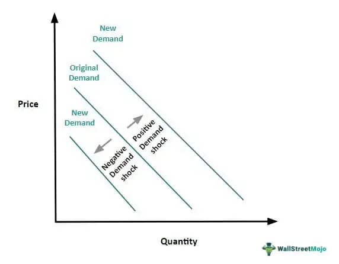

Demand shocks constitute a vital concept within economics, referring to sudden, unexpected changes in the demand for goods and services. These shocks can be positive or negative, leading to significant fluctuations in consumption patterns and potentially causing broader economic disturbances. Understanding demand shocks is crucial for policymakers, businesses, and investors as they navigate the intricate dynamics of the economy.

The significance of comprehending demand shocks lies in their impact on market equilibrium, price levels, and economic output. Unanticipated changes in demand can provoke abrupt supply-demand imbalances, prompting shifts in production and adjustments in pricing strategies. These effects can ripple through the economy, influencing sectors beyond the initial epicenter of the shock. The ability to predict and respond to demand shocks is thus essential for maintaining economic stability and fostering robust growth.

In modern economic systems, the relevance of demand shocks has become increasingly pronounced, especially with the proliferation of algorithmic trading. Algorithms now execute a substantial proportion of financial transactions, operating at speeds far surpassing human capabilities. This development has introduced new dimensions to demand shocks, potentially amplifying their effects on financial markets. Algorithmic trading can lead to rapid asset price adjustments, heightening market volatility and occasionally inducing flash crashes, where asset prices plunge precipitously within minutes before recovering.

Setting the stage for an in-depth discussion on the causes and effects of demand shocks, it is imperative to explore their origins. Factors like economic recessions, policy changes, and technological advancements can instigate these shocks, each with distinct implications. Furthermore, understanding how demand shocks interact with contemporary elements such as algorithmic trading provides insights into their potential consequences and guides the formulation of strategies to mitigate adverse impacts. As demand shocks continue to shape the economic landscape, analyzing their dynamics is crucial for safeguarding market stability and promoting sustainable economic progress.

## Table of Contents

## Understanding Demand Shock

Demand shock in economics refers to an unexpected event that leads to a sudden change in the demand for goods or services. These shocks can either increase or decrease demand, which subsequently affects market dynamics, prices, and economic stability. 

Demand shocks are generally categorized into two types: positive and negative. A positive demand shock occurs when there is an unexpected increase in demand for a product or service. For example, a technological breakthrough that significantly enhances the appeal of electric vehicles might lead to a surge in their demand, representing a positive shock. Conversely, a negative demand shock happens when there is an unexpected drop in demand. The global financial crisis of 2008, which led to a sudden reduction in consumer spending and investment, is an instance of a negative demand shock.

The nature of demand shocks is typically short-term, stemming from unanticipated events like policy shifts, technological innovations, or external crises. However, their impacts can extend into the long term, altering market trajectories and economic landscapes. A sudden spike in demand, if not quickly addressed by supply, may lead to price surges and inflationary pressures. In contrast, a decline in demand can result in excess supply, reduced revenues for businesses, and increased unemployment.

The velocity and magnitude of demand shocks can create chain reactions within an economy. For instance, a sharp increase in demand might push companies to expand production capacities, invest in new technologies, or recruit additional labor, potentially fostering economic expansion in the long run. Conversely, a demand collapse may force businesses to downsize, halt investments, or cut workforce, leading to prolonged economic stagnation or contraction.

To mathematically characterize a demand shock, one might represent demand (D) as a function of various factors like price (P), consumer income (Y), and preferences (Z):

$$
D = f(P, Y, Z)
$$

A demand shock can then be modeled as an exogenous modification to this function, causing significant shifts in D over a short timeframe. Analyzing such shifts helps economists and policymakers understand the initial effects and design appropriate responses to mitigate adverse outcomes.

## Economic Impact of Demand Shocks

Demand shocks, whether sudden increases or decreases in demand for goods and services, play a crucial role in shaping an economy's dynamics. These shocks often lead to price [volatility](/wiki/volatility-trading-strategies) as markets react to the immediate changes in demand levels. For instance, a positive demand shock may lead to price increases due to heightened competition for limited goods, whereas a negative demand shock tends to cause prices to fall as excess supply outweighs declining consumer interest.

Price volatility triggered by demand shocks affects not just the pricing of specific goods but extends to general economic indicators such as Gross Domestic Product (GDP), inflation, and employment. When a demand shock impacts GDP, the effect is proportional to the shift in consumer spending and business investments. If demand increases, GDP may experience growth due to increased production activities and higher business incomes. Conversely, a negative demand shock dampens economic output, leading to a contraction in GDP reflecting reduced economic activity.

The relationship between demand shocks and inflation is closely intertwined. A positive demand shock can provoke inflationary pressures as the increased expenditure drives up prices, contributing to a rise in the Consumer Price Index (CPI). On the other hand, a negative demand shock could result in deflationary tendencies when the decreased consumption leads to downward pressure on prices.

Employment is another area significantly influenced by demand shocks. As demand rises, companies may boost employment to match increased production needs. However, if a negative demand shock occurs, firms might resort to layoffs or hiring freezes, leading to higher unemployment rates and underemployment conditions. The labor market's response can further influence consumer confidence and spending, perpetuating the effects of the initial shock.

Beyond these immediate economic factors, demand shocks pose broader ramifications for market stability and investor confidence. Markets characterized by high volatility may deter investment due to perceived risks, affecting capital flows and long-term growth prospects. Unpredictable demand fluctuations challenge both businesses and investors, necessitating adjustments in production, pricing strategies, and investment portfolios to mitigate risks.

Investors' reactions to demand shocks often manifest in altered risk assessments, influencing stock market performance and valuations. In cases where market participants anticipate sustained demand changes, share prices may adjust accordingly, reflecting revised future earnings expectations. This sentiment-driven market behavior can exacerbate volatility, sometimes resulting in abrupt shifts in asset prices and diminished investor confidence in market resilience.

In summary, understanding the economic impact of demand shocks requires a thorough analysis of their effects on prices, GDP, inflation, employment, and broader market dynamics. These shocks can generate significant volatility, influencing both the short and long-term trajectory of economic development and necessitating informed strategic responses from policymakers, businesses, and investors alike.

## Causes of Demand Shock

Demand shocks are sudden events that cause a drastic change in the demand for goods and services within an economy. Understanding their causes is crucial for predicting and managing their impacts. Various factors contribute to demand shocks, and they can be categorized into economic, technological, environmental, geopolitical, and supply chain-related causes.

### Economic Factors

Economic fluctuations are primary catalysts for demand shocks. Recessions, defined as significant declines in economic activity spread across the economy, lasting more than a few months, can lead to negative demand shocks by reducing consumer and business spending. Conversely, expansions in economic activity can lead to positive demand shocks.

Policy changes also play a significant role. Changes in fiscal policy, such as tax increases or decreases, influence consumer disposable income and consequently affect demand. Similarly, monetary policy adjustments—especially [interest rate](/wiki/interest-rate-trading-strategies) changes—impact borrowing costs. For instance, a reduction in interest rates generally reduces the cost of borrowing, potentially boosting demand by encouraging spending and investment.

### Technological Advancements and Innovation

Technological advancements can alter demand dynamics either by introducing new products or by obsoleting existing ones. Innovation often leads to demand shocks through the development of new technologies that create consumer demand for previously non-existent goods. For instance, the introduction of smartphones revolutionized the telecommunications industry by shifting demand from traditional mobile phones to more advanced devices. Such innovations can rapidly increase the demand curve, representing a positive demand shock.

### Natural Disasters and Geopolitical Events

Natural disasters, such as earthquakes, hurricanes, and pandemics, often cause immediate and profound impacts on demand patterns. These events can destroy infrastructure, disrupt markets, and alter consumer behavior almost instantaneously. For example, the COVID-19 pandemic precipitated an unparalleled demand shock across various sectors, from healthcare to digital services, while significantly reducing demand for others, such as travel and hospitality.

Geopolitical events, including wars and international tensions, cause demand shocks by creating uncertainty and disrupting economic activities. These events can change global trade dynamics, affecting demand both directly and indirectly. For instance, trade sanctions can decrease demand for goods and services from specific countries, altering global demand patterns.

### Supply Chain Disruptions

Supply chain disruptions, often arising from logistical inefficiencies, labor strikes, or international trade barriers, can lead to demand shocks as well. When supply chains are interrupted, the availability of goods and services decreases, affecting consumer confidence and expenditure. These disruptions can exacerbate demand shocks by creating shortages and delaying the fulfillment of existing demand, leading to immediate changes in consumption patterns.

In conclusion, understanding the myriad causes of demand shocks, from economic policies to unforeseen natural events, is essential for developing robust strategies to mitigate their impacts. Addressing these causes requires a comprehensive understanding of how they interact within an increasingly interconnected global economy.

## Algorithmic Trading and Demand Shocks

Algorithmic trading, a method of executing trades using pre-programmed instructions or algorithms, dominates contemporary financial markets. It utilizes complex mathematical models and high-speed automated processes to make trading decisions, often operating at speeds far exceeding human capability. This technological advancement has significantly transformed market dynamics, introducing both efficiencies and new challenges.

Algorithmic trading can amplify the effects of demand shocks, which are sudden, unexpected changes in the demand for goods or services. Due to the algorithms' sensitivity to market conditions, even small fluctuations in demand can trigger significant trading activities. For instance, when a sudden negative demand shock occurs, algorithms may interpret this as a signal to sell, potentially leading to a cascade of sell orders. The rapid execution of these orders can exacerbate price movements, thereby amplifying the initial shock.

The impact of [algorithmic trading](/wiki/algorithmic-trading) on demand shocks is evident in increased market volatility. Algorithms, especially those based on high-frequency trading, react to market signals at unprecedented speeds, often executing trades within milliseconds. This swift reaction can lead to abrupt changes in asset prices, contributing to volatility. Moreover, feedback loops can arise when algorithms respond not only to market data but also to each other's actions, further magnifying price swings.

One notable consequence of algorithmic trading's interaction with demand shocks is the phenomenon known as flash crashes. These are events where asset prices plunge and recover within minutes or even seconds, often without any apparent fundamental reason. Flash crashes can be triggered by algorithms simultaneously executing large sell orders in response to a perceived demand shock, leading to a rapid decline in prices. An illustrative example of this occurred on May 6, 2010, when the U.S. stock market experienced a trillion-dollar loss within minutes, only to rebound shortly thereafter.

To mitigate the destabilizing effects of algorithmic trading on demand shocks, measures such as circuit breakers have been introduced in many financial markets. These mechanisms temporarily halt trading if prices move too quickly in a short period, providing a buffer to potentially restore order and market confidence. Additionally, regulations requiring more transparency and oversight of algorithmic trading practices aim to reduce the risk of excessive volatility and flash crashes.

## Real-World Examples of Demand Shocks

Demand shocks are pivotal events in modern economics, shaping market dynamics in profound ways. They can be positive, increasing the demand for goods and services, or negative, reducing it. Several real-world examples illustrate the impact and complexity of demand shocks.

### Electric Vehicles: Positive Demand Shock

The rise of electric vehicles (EVs) represents a significant positive demand shock. Over the past decade, advancements in battery technology, coupled with growing environmental awareness and supportive government policies, have substantially increased the demand for EVs. Companies such as Tesla have played a pivotal role in transforming consumer preference away from traditional internal combustion engines towards electric alternatives. This shift is driven by several factors, including perceived environmental benefits, potential cost savings from reduced fuel expenses, and government incentives such as tax rebates and subsidies.

Moreover, the automotive industry's response involves restructuring supply chains to accommodate the increased demand for lithium, cobalt, and other components essential for battery production. This shift also spurs innovation and investment in renewable energy infrastructure, illustrating the profound and cascading effects of a positive demand shock.

### 2008 Financial Crisis: Negative Demand Shock

The 2008 Financial Crisis exemplifies a negative demand shock, with widespread implications for global economies. Triggered by the collapse of major financial institutions and the bursting of the housing bubble in the United States, the crisis led to a severe contraction in consumer and business spending. As banks faced [liquidity](/wiki/liquidity-risk-premium) issues, the resulting credit crunch reduced access to finance for consumers and businesses, exacerbating the downturn in economic activity.

This shock was characterized by a sharp decline in GDP, with many countries slipping into recession. Unemployment rates soared as businesses cut back on production and services to cope with decreased demand. The crisis highlighted vulnerabilities in the financial system, leading to extensive regulatory reforms aimed at preventing similar occurrences in the future.

### COVID-19 Pandemic: Complex Demand Shock

The COVID-19 pandemic introduced a complex demand shock with both positive and negative elements across various sectors. On the negative side, sectors like travel, hospitality, and retail experienced substantial declines as lockdowns and social distancing measures curtailed consumer spending and mobility. The International Air Transport Association reported a loss of over $118 billion in 2020 due to decreased air travel demand.

Conversely, the pandemic accelerated demand in areas such as healthcare, e-commerce, and digital services. With remote work becoming a norm, companies like Zoom and Amazon saw unprecedented growth. The shift in consumer behavior towards online shopping and digital communication tools reflects a mixed demand shock, where certain sectors boom while others plummet.

In conclusion, real-world examples such as the rise of electric vehicles, the 2008 Financial Crisis, and the COVID-19 pandemic underscore the multifaceted nature of demand shocks. They illustrate how sudden changes in demand can have widespread consequences, influencing economic structures at multiple levels. Understanding these examples aids policymakers and businesses in developing strategies to navigate and mitigate the impacts of future demand shocks.

## Strategies to Mitigate Demand Shock Impacts

To mitigate the impacts of demand shocks, economies typically employ a combination of fiscal and monetary policies. Fiscal policy involves the adjustment of government spending and taxation to influence overall demand. During a negative demand shock, governments may increase public spending or cut taxes to stimulate economic activity. Conversely, during a positive demand shock resulting in overheating and inflation, fiscal restraint can slow growth and stabilize prices. For example, during economic downturns, governments may increase infrastructure spending to create jobs and boost demand for materials and services, thus mitigating the adverse effects on GDP and employment rates.

Monetary policy is another critical tool, often employed by central banks. By adjusting interest rates and conducting open market operations, central banks can influence the cost of borrowing and the money supply. During a demand shock-induced recession, lowering interest rates encourages borrowing and investment, thus stimulating economic activity. In situations of excess demand, raising interest rates can help control inflation by dampening expenditure. Quantitative easing, an unconventional monetary policy, involves large-scale asset purchases to increase liquidity and encourage lending and investment when traditional policy measures are insufficient.

Diversification and risk management play crucial roles in investment strategies to handle demand shocks. Diversification involves spreading investments across various financial instruments or sectors to reduce exposure to any single economic [factor](/wiki/factor-investing) or shock. A well-diversified portfolio can cushion the impact of demand fluctuations on individual investments, preserving overall portfolio value. Risk management strategies, such as using hedging instruments like options and futures, can protect against undesirable price movements caused by demand shocks. For example, an investor might use options to lock in a price for a commodity, shielding against demand-driven price volatility.

Businesses must adopt adaptive strategies to cope with demand fluctuations. These strategies include flexible production systems, which allow companies to adjust output quickly in response to changing demand. For instance, a manufacturer might employ just-in-time inventory systems to reduce holding costs and enable rapid scaling of production. Dynamic pricing strategies can also help businesses adjust prices in real-time based on demand levels, ensuring better management of inventory and resources while maximizing revenue opportunities.

Furthermore, having robust supply chain management practices ensures that businesses can handle disruptions effectively. This may entail developing multiple supplier relationships, nearshore outsourcing, or investing in technology to enhance supply chain visibility and resilience. By implementing such adaptive strategies, businesses can mitigate the adverse effects of demand shocks, safeguarding their operations and maintaining market competitiveness.

## Conclusion

Understanding the causes and impacts of demand shocks is crucial for maintaining economic stability. Demand shocks, whether positive or negative, can lead to significant disruptions in market dynamics, affecting prices, GDP, inflation rates, and employment levels. These shocks are often triggered by various factors, including economic policy changes, technological advancements, natural disasters, and geopolitical events, with each contributing to sudden shifts in demand.

With the rise of algorithmic trading, the effects of demand shocks can be amplified, potentially causing increased market volatility and phenomena such as flash crashes. Historical events, like the rise of electric vehicles, the 2008 Financial Crisis, and the COVID-19 pandemic, provide tangible examples of how demand shocks can influence different economic sectors.

Addressing demand shocks requires a multi-faceted approach. Traditional fiscal and monetary policies remain essential tools for managing immediate impacts. Additionally, diversification, risk management, and adaptive business strategies play vital roles in mitigating potential adverse effects. As economic systems grow more complex with technological advancement, ongoing research and strategy development are imperative to devise effective solutions for managing demand shocks. This proactive stance ensures resilience and adaptability in facing future economic fluctuations, ultimately safeguarding long-term stability.

## References & Further Reading

[1]: Acemoglu, D., & Ozdaglar, A. (2007). ["Competition and Efficiency in Congested Markets."](https://www.jstor.org/stable/pdf/25151769.pdf) Mathematics of Operations Research, 32(1), 1-31.

[2]: Bernanke, B. S. (1983). ["Nonmonetary Effects of the Financial Crisis in the Propagation of the Great Depression."](https://www.nber.org/papers/w1054) The American Economic Review, 73(3), 257-276.

[3]: Blanchard, O., & Leigh, D. (2014). ["Learning About Fiscal Multipliers from Growth Forecast Errors."](https://www.jstor.org/stable/43297818) American Economic Review, 104(5), 116-121.

[4]: Gabaix, X. (2016). ["A Behavioral New Keynesian Model."](https://scholar.harvard.edu/files/xgabaix/files/behavioral_new_keynesian_model.pdf) National Bureau of Economic Research.

[5]: Lopez de Prado, M. (2018). ["Advances in Financial Machine Learning."](https://www.amazon.com/Advances-Financial-Machine-Learning-Marcos/dp/1119482089) Wiley.

[6]: Reinhart, C. M., & Rogoff, K. S. (2009). ["The Aftermath of Financial Crises."](https://www.nber.org/papers/w14656) National Bureau of Economic Research.

[7]: Shiller, R. J. (2003). ["From Efficient Markets Theory to Behavioral Finance."](https://www.aeaweb.org/articles?id=10.1257/089533003321164967) Journal of Economic Perspectives, 17(1), 83-104.

[8]: Taleb, N. N. (2007). ["The Black Swan: The Impact of the Highly Improbable."](https://www.jstor.org/stable/23045073) Random House.

[9]: Woodford, M. (2003). ["Interest and Prices: Foundations of a Theory of Monetary Policy."](https://www.jstor.org/stable/j.ctv30pnvmf) Princeton University Press.