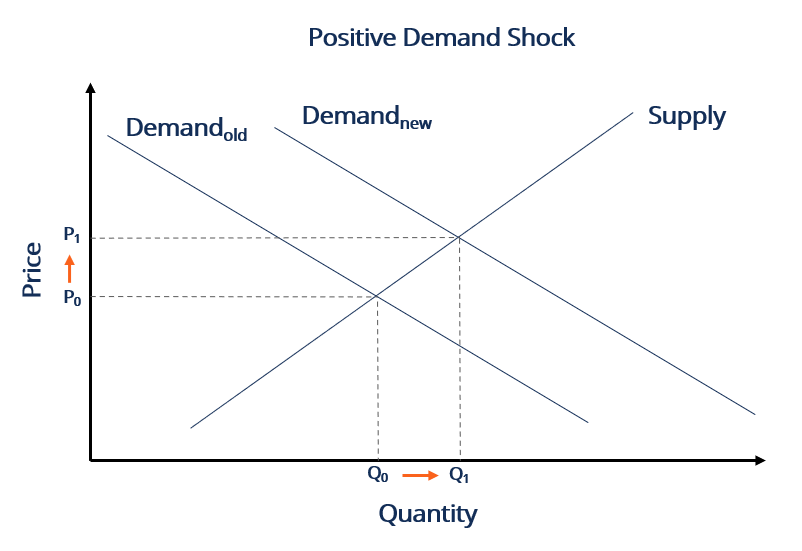

## Table of Contents

## What is a demand shock?

A demand shock is a sudden event that changes how much people want to buy things. It can make people want to buy more or less than they usually do. This can happen because of things like a big change in the economy, a new law, or even a natural disaster. When people suddenly want to buy more, it's called a positive demand shock. When they want to buy less, it's called a negative demand shock.

These shocks can have a big impact on businesses and the economy. If there's a positive demand shock, businesses might sell more and make more money. But if they can't keep up with the extra demand, prices might go up. On the other hand, a negative demand shock can make businesses sell less and lose money. They might have to lower prices or even close down. Governments and businesses need to be ready to handle these sudden changes to keep the economy stable.

## What are the common causes of a demand shock?

Demand shocks can happen because of many different things. One common cause is a big change in the economy, like a recession or a boom. When the economy is doing badly, people might not have as much money to spend, so they buy less. This is a negative demand shock. On the other hand, if the economy is doing really well, people might feel more confident and spend more money, causing a positive demand shock.

Another cause can be changes in government policy or laws. For example, if the government raises taxes, people might have less money to spend on other things, leading to a negative demand shock. Or, if the government gives people more money through programs like stimulus checks, people might spend more, creating a positive demand shock. Natural disasters or big events can also cause demand shocks. A hurricane might destroy a lot of things, so people need to buy more to replace what they lost, causing a positive demand shock in some areas. But if people are worried about a big event, they might spend less, leading to a negative demand shock.

In summary, demand shocks can come from economic changes, new laws or policies, and unexpected events like natural disasters. These shocks can make people want to buy more or less, which can have a big impact on businesses and the economy.

## How does a demand shock affect the economy?

A demand shock can really shake up the economy. When there's a positive demand shock, people suddenly want to buy more things. This can be good for businesses because they sell more and make more money. But if they can't keep up with all the extra orders, they might have to raise prices. This can lead to inflation, where the prices of things go up. On the other hand, a negative demand shock means people want to buy less. This can hurt businesses because they sell less and make less money. They might have to lower prices or even close down if things get really bad.

These shocks can also affect jobs and how much people earn. If businesses are doing well because of a positive demand shock, they might hire more people or give their workers raises. But if there's a negative demand shock, businesses might have to let people go or cut wages to save money. This can make it harder for people to buy things, which can make the negative demand shock even worse. Governments often try to help by changing policies or giving people money to spend, but it can take time for these changes to make a difference.

## Can you explain the difference between a positive and a negative demand shock?

A positive demand shock happens when people suddenly want to buy more things. This can be good for businesses because they sell more and make more money. But if they can't make enough of what people want, they might have to raise prices. This can make things more expensive for everyone, which is called inflation. Governments might try to help by making more money available for people to spend, but it can take time for this to work.

A negative demand shock is the opposite. It happens when people suddenly want to buy less. This can hurt businesses because they sell less and make less money. They might have to lower prices or even close down if things get really bad. When people buy less, it can also mean fewer jobs and less money for workers. Governments might try to help by giving people money or changing laws, but it can be hard to fix a negative demand shock quickly.

## What are some historical examples of demand shocks?

One big example of a demand shock happened in 2008 during the global financial crisis. This was a negative demand shock. People lost a lot of money and jobs, so they couldn't buy as much as before. Businesses sold less, and many had to close down. Governments around the world tried to help by giving people money and changing laws, but it took a long time for things to get better.

Another example is the demand shock caused by the COVID-19 pandemic in 2020. At first, it was a negative demand shock because people were scared and stayed home, so they didn't buy as much. Many businesses, especially restaurants and stores, had to close. But then, there was also a positive demand shock for things like toilet paper, masks, and computers because everyone needed them to stay safe and work from home. Governments gave people money to help, but it was still a hard time for the economy.

## How do businesses respond to a demand shock?

When businesses face a demand shock, they have to figure out how to handle it. If it's a positive demand shock and people suddenly want to buy more, businesses might try to make more of their products to keep up. They might hire more people or work longer hours. But if they can't make enough, they might have to raise prices. This can be good for them because they make more money, but it can also make customers unhappy if things get too expensive.

On the other hand, if it's a negative demand shock and people want to buy less, businesses need to find ways to sell more. They might lower prices to attract more customers or offer special deals. If things get really bad, they might have to let some workers go or even close down some stores. Businesses have to be smart and quick to respond to these changes to survive and keep making money.

## What role does government policy play in mitigating the effects of a demand shock?

Government policy can help a lot when there's a demand shock. If people suddenly want to buy less and there's a negative demand shock, the government might give people money through programs like unemployment benefits or stimulus checks. This can help people keep buying things, which is good for businesses. The government might also change laws to make it easier for businesses to keep going, like lowering taxes or helping them get loans. These actions can help stop the economy from getting worse and help it get better faster.

When there's a positive demand shock and people want to buy more, the government might try to keep things stable. They might control prices or make sure businesses can make enough of what people need. They could also change interest rates to make borrowing money easier or harder, which can affect how much people spend. By doing these things, the government tries to make sure the economy doesn't get too hot or too cold, and that everyone can keep buying and selling what they need.

## How can demand shocks be predicted or anticipated?

Predicting or anticipating demand shocks can be tricky, but there are some things that can help. Economists and businesses look at data and trends to see if a demand shock might be coming. They watch things like how much people are spending, how many jobs there are, and what's happening in the news. If they see signs that the economy might be changing, like a big drop in spending or a new law that could affect people's money, they might guess that a demand shock is on the way.

It's not just about looking at numbers, though. Sometimes, big events like natural disasters or global crises can cause demand shocks. People can't always predict these things, but they can be ready for them. Governments and businesses might have plans in place for emergencies, like having extra supplies or money set aside. By staying alert and prepared, they can react faster when a demand shock happens, which can help make the impact a little less bad.

## What are the long-term effects of a demand shock on an economy?

Demand shocks can have big effects on an economy that last a long time. If there's a negative demand shock and people keep buying less, businesses might stay closed or not grow. This can mean fewer jobs and less money for people. Over time, this can make the whole economy weaker. People might not spend as much because they're worried about the future, which can make the negative demand shock last even longer. Governments might have to keep helping by giving people money or changing laws to try to fix things, but it can take years for the economy to fully recover.

On the other hand, a positive demand shock can also have long-term effects. If people keep buying more, businesses might grow and hire more people. This can make the economy stronger and help people earn more money. But if businesses can't keep up with the demand, prices might stay high, which can lead to inflation. Governments might need to step in to control prices or help businesses make more of what people need. Over time, a positive demand shock can help the economy grow, but it needs to be managed carefully to avoid problems like too much inflation.

## How do demand shocks impact different sectors of the economy differently?

Demand shocks can hit different parts of the economy in different ways. For example, when there's a negative demand shock and people stop buying as much, some businesses feel it more than others. Stores that sell things people don't need right away, like fancy clothes or big TVs, might see a big drop in sales. But stores that sell things people always need, like food or medicine, might not be hit as hard. This is because even when times are tough, people still need to eat and stay healthy. So, the impact of a negative demand shock can be much worse for some sectors than others.

On the flip side, a positive demand shock can also affect sectors differently. If people suddenly want to buy more of something, like computers during a time when everyone is working from home, the tech sector might see a big boost. They might sell more and make more money. But other sectors, like travel or entertainment, might not see as much of a change if people are still staying home. So, a positive demand shock can help some parts of the economy grow a lot while others might not see as much benefit. Both types of demand shocks show how different sectors can react differently to changes in what people want to buy.

## What are the global implications of a demand shock in a major economy?

When a big economy like the United States or China has a demand shock, it can affect the whole world. If people in that country suddenly buy less, it can hurt businesses everywhere. This is because big economies buy a lot of things from other countries. If they stop buying, those other countries might sell less and make less money. This can make their economies weaker too. It's like a chain reaction where one country's problems can spread to others.

On the other hand, if a big economy has a positive demand shock and people start buying more, it can help other countries. They might buy more things from around the world, which can help those countries sell more and make more money. But it can also make prices go up everywhere if everyone is trying to buy the same things. So, a demand shock in a big economy can have a big impact on the whole world, making things better or worse for everyone.

## How can economic models help in understanding and managing demand shocks?

Economic models are like tools that help us understand how demand shocks work and what we can do about them. These models use math and data to show how people's spending can change suddenly and what that means for businesses and the economy. By looking at these models, economists can see patterns and predict what might happen next. For example, they can see if a negative demand shock might make businesses close down or if a positive demand shock might make prices go up. This helps everyone be ready for what's coming and plan better.

Using economic models, governments and businesses can also figure out the best ways to handle demand shocks. If there's a negative demand shock, the models can show how giving people money or changing laws might help. They can also show what might happen if nothing is done. For a positive demand shock, the models can help decide if raising prices or making more products is the best way to go. By using these models, people in charge can make smarter choices to keep the economy stable and help it grow, even when things change suddenly.

## What is a Demand Shock and How Can We Understand It?

Demand shock in economics refers to an unexpected event that leads to a sudden change in the demand for goods or services. These shocks can either increase or decrease demand, which subsequently affects market dynamics, prices, and economic stability. 

Demand shocks are generally categorized into two types: positive and negative. A positive demand shock occurs when there is an unexpected increase in demand for a product or service. For example, a technological breakthrough that significantly enhances the appeal of electric vehicles might lead to a surge in their demand, representing a positive shock. Conversely, a negative demand shock happens when there is an unexpected drop in demand. The global financial crisis of 2008, which led to a sudden reduction in consumer spending and investment, is an instance of a negative demand shock.

The nature of demand shocks is typically short-term, stemming from unanticipated events like policy shifts, technological innovations, or external crises. However, their impacts can extend into the long term, altering market trajectories and economic landscapes. A sudden spike in demand, if not quickly addressed by supply, may lead to price surges and inflationary pressures. In contrast, a decline in demand can result in excess supply, reduced revenues for businesses, and increased unemployment.

The velocity and magnitude of demand shocks can create chain reactions within an economy. For instance, a sharp increase in demand might push companies to expand production capacities, invest in new technologies, or recruit additional labor, potentially fostering economic expansion in the long run. Conversely, a demand collapse may force businesses to downsize, halt investments, or cut workforce, leading to prolonged economic stagnation or contraction.

To mathematically characterize a demand shock, one might represent demand (D) as a function of various factors like price (P), consumer income (Y), and preferences (Z):

$$
D = f(P, Y, Z)
$$

A demand shock can then be modeled as an exogenous modification to this function, causing significant shifts in D over a short timeframe. Analyzing such shifts helps economists and policymakers understand the initial effects and design appropriate responses to mitigate adverse outcomes.

## References & Further Reading

[1]: Acemoglu, D., & Ozdaglar, A. (2007). ["Competition and Efficiency in Congested Markets."](https://www.jstor.org/stable/pdf/25151769.pdf) Mathematics of Operations Research, 32(1), 1-31.

[2]: Bernanke, B. S. (1983). ["Nonmonetary Effects of the Financial Crisis in the Propagation of the Great Depression."](https://www.nber.org/papers/w1054) The American Economic Review, 73(3), 257-276.

[3]: Blanchard, O., & Leigh, D. (2014). ["Learning About Fiscal Multipliers from Growth Forecast Errors."](https://www.jstor.org/stable/43297818) American Economic Review, 104(5), 116-121.

[4]: Gabaix, X. (2016). ["A Behavioral New Keynesian Model."](https://scholar.harvard.edu/files/xgabaix/files/behavioral_new_keynesian_model.pdf) National Bureau of Economic Research.

[5]: Lopez de Prado, M. (2018). ["Advances in Financial Machine Learning."](https://www.amazon.com/Advances-Financial-Machine-Learning-Marcos/dp/1119482089) Wiley.

[6]: Reinhart, C. M., & Rogoff, K. S. (2009). ["The Aftermath of Financial Crises."](https://www.nber.org/papers/w14656) National Bureau of Economic Research.

[7]: Shiller, R. J. (2003). ["From Efficient Markets Theory to Behavioral Finance."](https://www.aeaweb.org/articles?id=10.1257/089533003321164967) Journal of Economic Perspectives, 17(1), 83-104.

[8]: Taleb, N. N. (2007). ["The Black Swan: The Impact of the Highly Improbable."](https://www.jstor.org/stable/23045073) Random House.

[9]: Woodford, M. (2003). ["Interest and Prices: Foundations of a Theory of Monetary Policy."](https://www.jstor.org/stable/j.ctv30pnvmf) Princeton University Press.