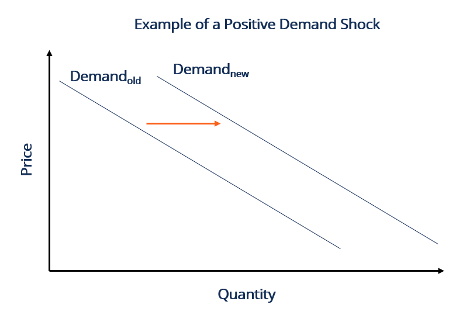

## Table of Contents

## What is a demand shock?

A demand shock is a sudden event that changes how much people want to buy things. It can make people want to buy more or less than they usually do. For example, if a new popular toy comes out, people might rush to buy it, causing a positive demand shock. On the other hand, if there's a big economic problem, people might stop buying as much, causing a negative demand shock.

These shocks can affect the whole economy. When there's a positive demand shock, businesses might need to make more products quickly, which can lead to higher prices and more jobs. But if there's a negative demand shock, businesses might sell less, leading to lower prices and possibly layoffs. Governments and businesses need to be ready to handle these changes to keep the economy stable.

## Can you explain the difference between a positive and a negative demand shock?

A positive demand shock happens when something suddenly makes people want to buy more things. This can be because of a new popular product, a big event, or even good news about the economy. When this happens, stores might sell out of items quickly, and businesses might need to make more products to keep up with everyone wanting to buy. This can lead to more jobs and sometimes higher prices because everyone is trying to buy the same things at the same time.

On the other hand, a negative demand shock is when something makes people want to buy less. This could happen because of bad economic news, a big disaster, or people just feeling less confident about spending money. When people stop buying as much, stores might have too many products and need to lower prices to sell them. This can lead to businesses making less money, and sometimes they might even have to let workers go because they don't need as many people to make or sell things.

## What are some common causes of demand shocks?

Demand shocks can happen for many reasons. One common cause is big changes in the economy, like when there's a sudden increase or decrease in people's income. If people get more money, they might start buying more things, causing a positive demand shock. But if they lose jobs or their money goes down, they might stop spending as much, leading to a negative demand shock. Another cause can be big events, like a new popular product coming out or a big sale happening, which can make people rush to buy things.

Another reason for demand shocks can be changes in what people think about the future. If people feel good about the economy and think it will get better, they might spend more money now, causing a positive demand shock. But if they're worried and think things will get worse, they might save their money instead of spending it, leading to a negative demand shock. Natural disasters or big news events can also change how much people want to buy things, either by making them feel they need to buy more right away or by making them more cautious about spending.

## How do demand shocks affect the economy?

Demand shocks can have a big impact on the economy. When there's a positive demand shock, like when a new popular product comes out, people rush to buy it. This means businesses need to make more of that product quickly. They might hire more workers and work longer hours to keep up with everyone wanting to buy. This can lead to more jobs and sometimes higher prices because everyone is trying to buy the same thing at the same time. The economy can grow because of all this extra buying and selling.

On the other hand, a negative demand shock can slow down the economy. If something bad happens, like a big economic problem or a natural disaster, people might stop buying as much. Stores might have too many products and need to lower prices to sell them. Businesses might make less money and might even have to let workers go because they don't need as many people to make or sell things. This can lead to fewer jobs and lower prices, which can make the economy shrink. Governments and businesses need to be ready to handle these changes to keep the economy stable.

## Can you provide an example of a demand shock caused by a natural disaster?

A hurricane hitting a coastal city can cause a negative demand shock. When the hurricane is about to hit, people might rush to the stores to buy things like water, batteries, and food to prepare for the storm. This sudden rush to buy things is a positive demand shock because everyone wants to get these items quickly. But after the hurricane hits, many people might lose their homes or jobs, and the city might be damaged. This makes people spend less money on things they usually buy, like clothes or going out to eat. This is a negative demand shock because people are buying less than they used to.

For example, after Hurricane Katrina hit New Orleans in 2005, there was a big change in what people bought. Before the hurricane, there was a rush to buy emergency supplies, causing a short-term positive demand shock. But after the hurricane, many people left the city, and those who stayed had less money to spend because of the damage and job losses. This led to a negative demand shock as people bought fewer things overall. Stores and businesses in New Orleans had to deal with selling less, and it took a long time for the economy to recover.

## What was the impact of the 2008 financial crisis as a demand shock?

The 2008 financial crisis was a big negative demand shock. It started when banks and big companies lost a lot of money, and many people lost their jobs or homes. When this happened, people got scared and stopped spending money on things they didn't need, like new cars or going out to eat. This made businesses sell less, and they had to lower prices to get people to buy anything at all. The whole economy slowed down because people weren't buying as much, and this led to more job losses and even less spending.

The impact of the 2008 financial crisis lasted for a long time. Governments and central banks tried to help by lowering interest rates and spending more money to get the economy going again. Slowly, people started to feel better about the future and began spending a bit more. But it took years for the economy to get back to normal. The crisis showed how a big negative demand shock can affect everyone and how important it is for governments to help when things go wrong.

## How did the demand shock from the COVID-19 pandemic affect different industries?

The COVID-19 pandemic caused a huge demand shock that affected many different industries in different ways. At first, when the virus started spreading, people were scared and stopped going out as much. This meant that industries like travel, hotels, and restaurants saw a big drop in customers. People weren't flying, staying in hotels, or eating out, so these businesses made a lot less money. Airlines had to cut back on flights, hotels closed rooms, and many restaurants had to shut down or change to take-out only. This was a big negative demand shock for these industries because people weren't buying their services anymore.

On the other hand, some industries saw a positive demand shock because of the changes people made during the pandemic. With everyone staying home, there was a big increase in demand for things like groceries, cleaning supplies, and home entertainment. Stores that sold food and household items couldn't keep up with how much people were buying. Also, companies that made things like computers, video games, and streaming services saw a lot more people wanting their products because everyone was at home and looking for ways to stay busy. This positive demand shock helped these industries grow, but it also made it hard for them to keep up with everyone wanting to buy things at the same time.

## What role do government policies play in mitigating the effects of demand shocks?

Government policies are really important when it comes to dealing with demand shocks. When there's a negative demand shock, like during the 2008 financial crisis or the COVID-19 pandemic, governments can help by spending more money to get the economy going again. They might give people money directly, like stimulus checks, so people can keep buying things even if they're worried about the future. Governments can also help businesses by giving them loans or money to keep paying their workers, so fewer people lose their jobs. This can stop the economy from slowing down too much and help it start growing again faster.

On the other hand, when there's a positive demand shock, governments might need to make sure things don't get out of control. If everyone is trying to buy the same thing at the same time, prices can go up a lot. Governments can step in to make sure businesses don't raise prices too much and that everyone has a fair chance to buy what they need. They might also work to make sure there's enough of everything to go around, so no one is left without important things like food or medicine. By doing these things, governments can help keep the economy stable no matter what kind of demand shock happens.

## How can businesses prepare for and respond to demand shocks?

Businesses can prepare for demand shocks by keeping an eye on what's happening in the world and the economy. They should have a plan ready for if something big happens that changes how much people want to buy their products. This could mean having extra supplies ready or being able to change how much they make quickly. Businesses can also talk to their customers and suppliers to understand what might happen and be ready to change their plans if they need to. By being ready and flexible, businesses can handle demand shocks better and keep going even when things change a lot.

When a demand shock happens, businesses need to act fast. If it's a positive demand shock and everyone wants to buy more, businesses should try to make more of their products quickly. They might need to hire more workers or work longer hours to keep up with everyone wanting to buy. If it's a negative demand shock and people are buying less, businesses might need to lower their prices or find new ways to sell their products. They could also look for new customers or change what they sell to match what people want now. By responding quickly and smartly, businesses can get through demand shocks and come out stronger on the other side.

## What are the long-term economic implications of recurring demand shocks?

Recurring demand shocks can make the economy less stable over time. When demand shocks keep happening, businesses and people might start to feel unsure about the future. They might not want to spend money or invest in new things because they're worried about what might happen next. This can slow down the economy because if people aren't buying, businesses aren't selling, and they might have to let workers go. Over time, this can lead to less growth and more ups and downs in the economy, making it harder for everyone to plan for the future.

On the other hand, if governments and businesses learn how to handle demand shocks better, they can help the economy stay more stable. By having good plans and being ready to change quickly, they can keep the economy going even when big changes happen. This can lead to more growth over time because people feel more confident about spending and investing. But it takes a lot of work and planning to make sure demand shocks don't cause too many problems in the long run.

## Can you discuss a historical example where a demand shock led to significant policy changes?

One big example of a demand shock leading to big policy changes was the Great Depression in the 1930s. It started with a big drop in what people were buying, which made businesses sell less and led to many people losing their jobs. This was a huge negative demand shock that made the whole economy crash. Because of how bad things got, the government had to do something big to help. They made new rules and programs, like the New Deal, to help people get jobs and start spending again. These changes helped the economy start growing again and showed how important it is for the government to step in when things go wrong.

The New Deal included things like building projects to give people work, helping farmers, and making banks safer. These steps were meant to get people spending again and make the economy stronger. The Great Depression showed that demand shocks can be really bad, but also that the right policies can help fix them. It changed how governments thought about helping the economy during tough times, and many of the ideas from the New Deal are still used today to help during economic problems.

## How do demand shocks influence monetary policy decisions by central banks?

When there's a big change in what people want to buy, like a demand shock, central banks have to think about what to do with money and interest rates. If there's a negative demand shock, like during a big economic problem, people stop spending as much. This can make the economy slow down. To help, central banks might lower interest rates. Lower interest rates make it cheaper for people to borrow money, so they might start spending more. This can help the economy start growing again. Central banks might also print more money to help businesses and people have more to spend.

On the other hand, if there's a positive demand shock and everyone wants to buy more, prices can go up a lot. This is called inflation. To stop prices from going too high, central banks might raise interest rates. Higher interest rates make it more expensive to borrow money, so people might not spend as much. This can help keep prices from going up too fast. Central banks have to watch the economy closely and change interest rates to keep things balanced, no matter what kind of demand shock happens.

## What is Understanding Demand Shock?

A demand shock is an unexpected event that dramatically changes the demand for goods or services in an economy. This shift in demand can occur due to various factors, leading to significant short-term and long-term economic consequences. Understanding demand shocks is crucial as they influence macroeconomic stability and policy-making.

### Definition and Examples of Demand Shock

Demand shocks can be defined as sudden and unforeseen changes in the demand side of the economy. These shocks can be either positive, leading to an increase in demand, or negative, resulting in a reduction. 

- **Positive Demand Shock**: Occurs when there is a sudden increase in demand for goods and services. An example is a government stimulus package that encourages increased consumer spending.

- **Negative Demand Shock**: Is characterized by a sudden decrease in demand. A typical example is the 2008 financial crisis, where panic and loss of wealth led to a significant drop in consumer spending.

### Historical Cases of Demand Shocks

Several historical cases illustrate the immediate effects of demand shocks on markets:

1. **Great Depression (1929)**: A massive negative demand shock occurred due to falling consumer confidence, which plummeted spending and investment.

2. **Oil Crisis (1973)**: While primarily a supply shock, the ensuing panic led to a demand shock as industries and consumers reacted to fuel shortages.

3. **COVID-19 Pandemic (2020)**: Generated both negative and positive demand shocks globally. Negative shocks were seen in tourism and hospitality, while sectors like e-commerce experienced positive shocks.

### Differentiating Between Positive and Negative Demand Shocks

Positive demand shocks can lead to economic growth and potentially inflation if the supply does not meet the increased demand. Conversely, negative demand shocks often result in recessionary conditions characterized by deflation, unemployment, and decreased production.

### Causes and Triggers of Demand Shocks

Demand shocks can be caused by multiple factors, such as:

- **Economic Policy Changes**: Tax cuts can lead to positive demand shocks, while increased interest rates often result in negative demand shocks.

- **Unexpected Global Events**: Natural disasters, pandemics, or geopolitical tensions can rapidly alter demand, as seen with the COVID-19 pandemic, where demand for travel plummeted, while demand for medical supplies surged.

### Elasticity of Demand

The elasticity of demand measures how much the quantity demanded of a good changes when its price changes. It's essential for assessing the impact of demand shocks. If demand is elastic, quantity demanded changes significantly with price changes. However, if demand is inelastic, it does not change much with price fluctuations. 

Mathematically, the price elasticity of demand ($E_d$) is computed as:

$$

E_d = \frac{\%\ \text{change in quantity demanded}}{\%\ \text{change in price}}
$$

High elasticity implies consumers are sensitive to price changes, meaning demand shocks can lead to substantial swings in quantities demanded and supplied. Understanding elasticity helps policymakers and businesses predict how demand shocks can influence economic equilibrium and design appropriate responses.

In summary, demand shocks are crucial events that can substantially impact economic dynamics. They can stem from diverse causes and manifest as positive or negative, with lasting effects on consumer behavior, market stability, and economic policy. Understanding their nature and implications is vital for economists and policymakers to navigate and mitigate adverse impacts on economies.

## What is the economic impact of a demand shock?

Economic shocks, such as demand shocks, can have profound effects on an economy. Demand shocks refer to sudden and unexpected changes in consumer demand for goods and services, which can significantly alter economic conditions in both the short and long term.

### Short-term and Long-term Economic Consequences of Demand Shocks

In the short term, a demand shock can lead to abrupt changes in production and employment. For instance, a negative demand shock—where demand decreases rapidly—can cause businesses to reduce output and lay off workers, leading to a rise in unemployment. Conversely, a positive demand shock, such as a sudden increase in consumer spending, can boost production and employment temporarily.

In the long term, the consequences of demand shocks depend on several factors, including the economy's structural flexibility and the nature of the shock itself. Negative demand shocks can lead to prolonged recessions if not addressed by appropriate policy measures. On the other hand, positive demand shocks might lead to overheating of the economy, causing inflationary pressures if supply cannot match the surge in demand.

### Influence on GDP, Employment Rates, and Consumer Prices

A demand shock directly affects the Gross Domestic Product (GDP), as GDP is the total value of goods and services produced within an economy. A negative demand shock typically leads to a decrease in GDP due to reduced consumer spending, which is a major component of GDP calculations. This decline can be represented mathematically as:

$$
\Delta \text{GDP} = C + I + G + (X - M)
$$

where $C$ is consumption, $I$ is investment, $G$ is government spending, $X$ is exports, and $M$ is imports.

Employment rates are closely tied to GDP; a drop in demand results in reduced production, leading to layoffs and increased unemployment rates. Consumer prices are also impacted; a negative demand shock might cause prices to fall due to decreased demand (deflation), while a positive shock might drive prices up due to increased demand (inflation).

### Effects on Different Sectors of the Economy

The impact of a demand shock can vary across different sectors. Essential industries, such as healthcare and utilities, may experience less [volatility](/wiki/volatility-trading-strategies), as demand for their services tends to remain relatively stable. However, sectors like automotive, luxury goods, and travel can be more sensitive to demand fluctuations. For example, during the 2008 financial crisis, the automotive industry faced significant challenges due to a sharp decline in consumer demand.

### Role of Government Intervention

Governments play a crucial role in addressing demand shocks to stabilize the economy. Policy tools such as fiscal stimulus—through increased government spending and tax cuts—can help boost demand during downturns. Monetary policy, including changes in interest rates and quantitative easing, can also be used to influence economic activity by altering the cost of borrowing and the money supply.

Government intervention can either mitigate or exacerbate the effects of demand shocks. Effective policy responses tailored to the specific nature of the shock can facilitate smoother recovery and minimize economic disruptions.

### Analysis of Recovery Patterns Following Demand Shocks

Recovery from demand shocks depends on the effectiveness of policy intervention and the adaptability of the economy. V-shaped recoveries, characterized by a sharp economic bounce-back after a decline, often occur when quick and robust policies are implemented. Conversely, U-shaped or L-shaped recoveries indicate slower and more prolonged return to pre-shock levels.

Economies with more flexible labor and product markets, alongside supportive policy environments, tend to recover more quickly and efficiently from demand shocks. Additionally, technological advancements and innovation can play a critical role in facilitating recovery by enhancing productivity and creating new market opportunities.

In summary, demand shocks have multifaceted impacts on economies, influencing GDP, employment, prices, and sectoral performance. Government intervention and structural characteristics largely determine the speed and trajectory of economic recovery following such shocks.

## How does the interplay between demand shock, market fluctuation, and algorithmic trading affect the market?

The interaction between demand shock, market fluctuations, and [algorithmic trading](/wiki/algorithmic-trading) is a complex and evolving landscape that prominently shapes modern financial markets. Demand shocks create abrupt changes in consumer demand, affecting market prices and volatility, and algorithmic trading systems are employed to address these changes. By analyzing market behavior in response to demand shocks, algorithmic trading leverages advanced computational techniques, including predictive modeling and [artificial intelligence](/wiki/ai-artificial-intelligence) (AI), to forecast market responses and optimize trading strategies.

Predictive modeling, enhanced by AI, facilitates the anticipation of market trends following a demand shock. Machine learning algorithms analyze historical data to discern patterns that precede market fluctuations, enabling traders to anticipate potential shifts. A common approach involves using supervised learning models, such as linear regression or decision trees, to predict price movements based on input features derived from macroeconomic indicators or previous market data. For instance, the use of a linear regression model might involve predicting the price $P(t)$ at time $t$ using features like historical prices $P(t-1), P(t-2), \ldots$, and exogenous variables $X(t)$. The model could be expressed as:

$$
P(t) = \beta_0 + \beta_1 P(t-1) + \beta_2 P(t-2) + \ldots + \beta_n X(t) + \epsilon
$$

where $\beta_0, \beta_1, \ldots \beta_n$ are coefficients to be estimated, and $\epsilon$ represents the error term.

Algorithmic traders face several challenges during unexpectedly severe demand shocks. Such events can lead to unpredictable volatility and price dislocations, complicating execution algorithms. These situations demand rapid algorithm adjustments, testing risk management protocols to their limits. Algorithmic systems must quickly recalibrate to manage heightened operational risks, such as slippage and execution errors.

Regulatory considerations also play a crucial role in algorithmic trading during volatile periods. Regulatory bodies may impose constraints on algorithmic trading practices to maintain market stability. For example, circuit breakers are mechanisms that halt trading temporarily when extreme price movements occur, preventing potential market crashes. Regulation ensures that algorithmic trading does not exacerbate market disruptions and promotes transparency and fairness.

The adaptability of algorithmic trading systems is a formidable advantage in managing future market responses to demand shocks. These systems' ability to refine models in real-time and learn from new data ensures traders can respond effectively to dynamic market conditions. As computational power grows and AI techniques become more sophisticated, algorithmic trading will progressively exploit potential market inefficiencies created by demand shocks, offering substantial competitive advantages.

In conclusion, the synergy between demand shock reactions and algorithmic trading strategies proves crucial in navigating the unpredictability of modern financial markets. Algorithms that integrate AI and predictive modeling tools have the capacity to foresee market changes and mitigate risks, solidifying their pivotal role in finance. Through continued evolution, these systems will likely become integral to understanding and leveraging the complexities of demand shocks and market fluctuations.

## References & Further Reading

[1]: Bergstra, J., Bardenet, R., Bengio, Y., & Kégl, B. (2011). ["Algorithms for Hyper-Parameter Optimization."](https://papers.nips.cc/paper/4443-algorithms-for-hyper-parameter-optimization) Advances in Neural Information Processing Systems 24.

[2]: ["Advances in Financial Machine Learning"](https://www.amazon.com/Advances-Financial-Machine-Learning-Marcos/dp/1119482089) by Marcos Lopez de Prado

[3]: ["Evidence-Based Technical Analysis: Applying the Scientific Method and Statistical Inference to Trading Signals"](https://www.amazon.com/Evidence-Based-Technical-Analysis-Scientific-Statistical/dp/0470008741) by David Aronson

[4]: ["Machine Learning for Algorithmic Trading"](https://github.com/stefan-jansen/machine-learning-for-trading) by Stefan Jansen

[5]: ["Quantitative Trading: How to Build Your Own Algorithmic Trading Business"](https://www.amazon.com/Quantitative-Trading-Build-Algorithmic-Business/dp/1119800064) by Ernest P. Chan