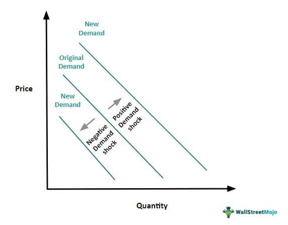

Demand shock is a critical concept in economics that refers to sudden and unexpected changes in the demand for goods and services. Such shocks can have profound impacts on economic stability and the equilibrium of markets. Demand shock's significance lies in its ability to influence key economic variables such as employment, inflation, and overall economic output. When a demand shock occurs, it can lead to rapid fluctuations in market dynamics, affecting both producers and consumers as they navigate through the uncertainty created by such disruptions.

Market fluctuations as a result of demand shocks are typically characterized by volatility in prices and quantities. For example, a positive demand shock, where demand suddenly increases, can result in increased prices and production as businesses strive to meet the heightened demand. Conversely, a negative demand shock, such as a sudden drop in consumer spending, might lead to reduced prices and excess supply. These fluctuations are not only indicative of the immediate effects of demand shocks but also highlight the broader interconnectedness of economic systems, where shifts in demand can have cascading effects across industries and geographies.

Algorithmic trading has become an integral component of modern financial markets, utilizing complex algorithms and computer systems to execute trading strategies at speeds and frequencies that humans cannot match. These algorithms analyze large volumes of data to identify trading opportunities, often capitalizing on market fluctuations, such as those induced by demand shocks. Algorithmic trading can, therefore, play a pivotal role in how markets respond to demand shocks, potentially exacerbating or dampening the effects depending on the strategies employed.

The purpose of this article is to provide a comprehensive analysis of demand shocks, their economic impacts, and their influence on market behavior. The article is relevant to both traders and economists, offering insights into the mechanisms through which demand shocks propagate through economies and financial markets. For traders, understanding these dynamics is essential for developing effective trading strategies, particularly in an era where algorithmic trading is becoming increasingly prevalent. Economists, on the other hand, benefit from a clearer understanding of how demand shocks affect macroeconomic indicators and what this implies for policy-making and economic planning.

The article is structured as follows: it begins with a detailed explanation of demand shocks, including definitions, examples, and their causes. This is followed by an exploration of the economic impacts of these shocks, including their effects on GDP, employment, and various economic sectors. The discussion then shifts to market fluctuations in response to demand shocks, particularly focusing on financial markets' volatility. Next, the article investigates into algorithms in trading amidst these fluctuations, analyzing how technology is leveraged to navigate uncertain markets. Finally, it brings together the interplay between demand shock responses and algorithmic trading strategies, discussing future implications and concluding with recommendations and considerations for both traders and economists in preparing for future shocks.

## Table of Contents

## Understanding Demand Shock

A demand shock is an unexpected event that dramatically changes the demand for goods or services in an economy. This shift in demand can occur due to various factors, leading to significant short-term and long-term economic consequences. Understanding demand shocks is crucial as they influence macroeconomic stability and policy-making.

### Definition and Examples of Demand Shock

Demand shocks can be defined as sudden and unforeseen changes in the demand side of the economy. These shocks can be either positive, leading to an increase in demand, or negative, resulting in a reduction. 

- **Positive Demand Shock**: Occurs when there is a sudden increase in demand for goods and services. An example is a government stimulus package that encourages increased consumer spending.

- **Negative Demand Shock**: Is characterized by a sudden decrease in demand. A typical example is the 2008 financial crisis, where panic and loss of wealth led to a significant drop in consumer spending.

### Historical Cases of Demand Shocks

Several historical cases illustrate the immediate effects of demand shocks on markets:

1. **Great Depression (1929)**: A massive negative demand shock occurred due to falling consumer confidence, which plummeted spending and investment.

2. **Oil Crisis (1973)**: While primarily a supply shock, the ensuing panic led to a demand shock as industries and consumers reacted to fuel shortages.

3. **COVID-19 Pandemic (2020)**: Generated both negative and positive demand shocks globally. Negative shocks were seen in tourism and hospitality, while sectors like e-commerce experienced positive shocks.

### Differentiating Between Positive and Negative Demand Shocks

Positive demand shocks can lead to economic growth and potentially inflation if the supply does not meet the increased demand. Conversely, negative demand shocks often result in recessionary conditions characterized by deflation, unemployment, and decreased production.

### Causes and Triggers of Demand Shocks

Demand shocks can be caused by multiple factors, such as:

- **Economic Policy Changes**: Tax cuts can lead to positive demand shocks, while increased interest rates often result in negative demand shocks.

- **Unexpected Global Events**: Natural disasters, pandemics, or geopolitical tensions can rapidly alter demand, as seen with the COVID-19 pandemic, where demand for travel plummeted, while demand for medical supplies surged.

### Elasticity of Demand

The elasticity of demand measures how much the quantity demanded of a good changes when its price changes. It's essential for assessing the impact of demand shocks. If demand is elastic, quantity demanded changes significantly with price changes. However, if demand is inelastic, it does not change much with price fluctuations. 

Mathematically, the price elasticity of demand ($E_d$) is computed as:

$$

E_d = \frac{\%\ \text{change in quantity demanded}}{\%\ \text{change in price}}
$$

High elasticity implies consumers are sensitive to price changes, meaning demand shocks can lead to substantial swings in quantities demanded and supplied. Understanding elasticity helps policymakers and businesses predict how demand shocks can influence economic equilibrium and design appropriate responses.

In summary, demand shocks are crucial events that can substantially impact economic dynamics. They can stem from diverse causes and manifest as positive or negative, with lasting effects on consumer behavior, market stability, and economic policy. Understanding their nature and implications is vital for economists and policymakers to navigate and mitigate adverse impacts on economies.

## Economic Impact of Demand Shock

Economic shocks, such as demand shocks, can have profound effects on an economy. Demand shocks refer to sudden and unexpected changes in consumer demand for goods and services, which can significantly alter economic conditions in both the short and long term.

### Short-term and Long-term Economic Consequences of Demand Shocks

In the short term, a demand shock can lead to abrupt changes in production and employment. For instance, a negative demand shock—where demand decreases rapidly—can cause businesses to reduce output and lay off workers, leading to a rise in unemployment. Conversely, a positive demand shock, such as a sudden increase in consumer spending, can boost production and employment temporarily.

In the long term, the consequences of demand shocks depend on several factors, including the economy's structural flexibility and the nature of the shock itself. Negative demand shocks can lead to prolonged recessions if not addressed by appropriate policy measures. On the other hand, positive demand shocks might lead to overheating of the economy, causing inflationary pressures if supply cannot match the surge in demand.

### Influence on GDP, Employment Rates, and Consumer Prices

A demand shock directly affects the Gross Domestic Product (GDP), as GDP is the total value of goods and services produced within an economy. A negative demand shock typically leads to a decrease in GDP due to reduced consumer spending, which is a major component of GDP calculations. This decline can be represented mathematically as:

$$
\Delta \text{GDP} = C + I + G + (X - M)
$$

where $C$ is consumption, $I$ is investment, $G$ is government spending, $X$ is exports, and $M$ is imports.

Employment rates are closely tied to GDP; a drop in demand results in reduced production, leading to layoffs and increased unemployment rates. Consumer prices are also impacted; a negative demand shock might cause prices to fall due to decreased demand (deflation), while a positive shock might drive prices up due to increased demand (inflation).

### Effects on Different Sectors of the Economy

The impact of a demand shock can vary across different sectors. Essential industries, such as healthcare and utilities, may experience less [volatility](/wiki/volatility-trading-strategies), as demand for their services tends to remain relatively stable. However, sectors like automotive, luxury goods, and travel can be more sensitive to demand fluctuations. For example, during the 2008 financial crisis, the automotive industry faced significant challenges due to a sharp decline in consumer demand.

### Role of Government Intervention

Governments play a crucial role in addressing demand shocks to stabilize the economy. Policy tools such as fiscal stimulus—through increased government spending and tax cuts—can help boost demand during downturns. Monetary policy, including changes in interest rates and quantitative easing, can also be used to influence economic activity by altering the cost of borrowing and the money supply.

Government intervention can either mitigate or exacerbate the effects of demand shocks. Effective policy responses tailored to the specific nature of the shock can facilitate smoother recovery and minimize economic disruptions.

### Analysis of Recovery Patterns Following Demand Shocks

Recovery from demand shocks depends on the effectiveness of policy intervention and the adaptability of the economy. V-shaped recoveries, characterized by a sharp economic bounce-back after a decline, often occur when quick and robust policies are implemented. Conversely, U-shaped or L-shaped recoveries indicate slower and more prolonged return to pre-shock levels.

Economies with more flexible labor and product markets, alongside supportive policy environments, tend to recover more quickly and efficiently from demand shocks. Additionally, technological advancements and innovation can play a critical role in facilitating recovery by enhancing productivity and creating new market opportunities.

In summary, demand shocks have multifaceted impacts on economies, influencing GDP, employment, prices, and sectoral performance. Government intervention and structural characteristics largely determine the speed and trajectory of economic recovery following such shocks.

## Market Fluctuation in Response to Demand Shock

Financial markets exhibit a range of reactions to demand shocks, with volatility being a salient feature of such periods. Demand shocks can lead to sudden and unpredictable changes in market dynamics, affecting asset prices, trading volumes, and investor behavior.

**Volatility and Stock Market Behavior**

Demand shocks, whether positive or negative, often result in heightened volatility within stock markets. Volatility refers to the degree of variation in trading prices over time, typically measured by the standard deviation of returns. In the wake of a demand shock, markets frequently experience sharp price movements as participants adjust their positions to new information. For instance, during adverse demand shocks, such as a sudden decrease in consumer spending, investors may panic sell, leading to significant drops in stock prices. Conversely, positive demand shocks can spur buying frenzies, driving prices up unpredictably.

**Patterns Following Demand Shocks**

Distinct patterns emerge in stock markets in response to demand shocks. Initially, there is usually a rapid adjustment period marked by increased trading activity and price swings as the market incorporates the new information. This period might be followed by phases of stabilization or continued volatility depending on the clarity of economic forecasts and confidence levels among market participants. Historical analyses show that the magnitude of these market responses is often correlated to the perceived severity and unexpectedness of the shock.

**Case Study: Recent Demand Shocks**

A pertinent example of a recent demand shock is the COVID-19 pandemic, which caused substantial disruptions to financial markets globally. In early 2020, as the virus spread, markets saw sharp declines due to fears of economic slowdown, leading to circuit breaker halts in trading. The stimulus measures introduced by governments then triggered a recovery, illustrating the market's sensitivity to policy interventions. This case underscores how external health crises can translate into significant economic demand shocks, impacting investor behavior and market dynamics.

**Investor Sentiment and Market Dynamics**

Investor sentiment plays a critical role during demand shocks, influencing how markets adjust to new conditions. Sentiment refers to the overall attitude of investors towards market conditions, which can be swayed by factors like media reports, economic forecasts, and geopolitical events. During demand shocks, negative sentiment can exacerbate market declines as fear and uncertainty lead to increased selling pressure. Conversely, positive or stabilizing sentiment, possibly driven by confidence in government interventions or optimistic economic projections, can mitigate the severity of market drops.

**Market Liquidity and Risk Management**

Market [liquidity](/wiki/liquidity-risk-premium), the ease with which assets can be bought or sold without affecting their price, is crucial during periods of volatility. High liquidity levels generally help to cushion markets against extreme fluctuations by enabling smoother trading and price adjustments. However, liquidity can dry up during severe demand shocks, causing bid-ask spreads to widen and market movements to become more erratic. Effective risk management strategies, including diversification and hedging, are essential to navigate such volatile periods. Institutional investors often employ [algorithmic trading](/wiki/algorithmic-trading) and financial derivatives to manage risks and adapt quickly to shifting market conditions.

In conclusion, understanding market fluctuations in response to demand shocks is vital for investors and policymakers. As markets remain sensitive to both predictable and unforeseen demand changes, robust strategies and informed decision-making are crucial to mitigate risks and leverage opportunities in these volatile environments.

## Algorithmic Trading Amidst Market Fluctuations

Algorithmic trading, increasingly prevalent in today's financial markets, employs computer programs to automate trading decisions based on pre-defined criteria. Its significance has grown considerably, accounting for a significant [volume](/wiki/volume-trading-strategy) of trades across major exchanges. This method leverages sophisticated algorithms to analyze varying market data rapidly, enabling traders to execute a large number of orders in fractions of a second, often capitalizing on minute market discrepancies.

During market fluctuations, such as those induced by demand shocks, algorithmic traders deploy technology to maintain stability and capitalize on volatility. Algorithms can assess vast amounts of data in real time, identifying patterns or anomalies that may signal trading opportunities. This capability is particularly beneficial in volatile markets, where rapid price changes occur. For instance, high-frequency trading ([HFT](/wiki/high-frequency-trading-strategies)), a subset of algorithmic trading, excels in exploiting small price differentials across different markets or instruments due to its ability to process trades at extraordinary speeds.

However, algorithmic trading comes with both advantages and drawbacks during economic instability. One major benefit is the enhancement of market liquidity; algorithms can provide buy and sell orders easing transactions for other investors. Additionally, they can mitigate human biases and emotional decision-making, leading to more systematic trading approaches. On the downside, the reliance on algorithms can exacerbate market volatility. Algorithms operate based on existing market data patterns, and unanticipated market disruptions can lead to cascading effects, such as flash crashes, where rapid sell-offs triggered by algorithms result in sudden price declines. Moreover, the complexity of these trading systems can result in significant financial losses if programming errors occur or if algorithms misinterpret market signals.

An example of algorithmic strategies used during demand shocks includes statistical [arbitrage](/wiki/arbitrage), where algorithms identify mispricing between correlated financial instruments. When a demand shock occurs, affecting the price of a particular asset class, algorithms can quickly identify and exploit deviations from expected pricing relationships, thereby profiting from the readjustment process.

Looking forward, the future of algorithmic trading is inherently tied to technological advancement. Innovations in [artificial intelligence](/wiki/ai-artificial-intelligence) (AI) and [machine learning](/wiki/machine-learning) are poised to revolutionize algorithmic trading, enabling systems to learn and adapt new patterns in real time, enhancing predictive accuracy. The integration of big data analytics will further refine these algorithms, offering even more precise trading opportunities by analyzing non-traditional data sources, such as social media sentiment or global news impacts, which can provide early indicators of potential market movements.

Despite its advancements, the evolution of algorithmic trading must be balanced with enhanced regulatory measures to safeguard against systemic risks. Ensuring robust algorithmic systems, without fostering undue volatility or market manipulation, remains a critical consideration for financial regulators globally. As the landscape continues to develop, the adaptability of algorithmic trading strategies will profoundly shape market dynamics, offering both challenges and opportunities for market participants.

## The Interplay Between Demand Shock, Market Fluctuation, and Algorithmic Trading

The interaction between demand shock, market fluctuations, and algorithmic trading is a complex and evolving landscape that prominently shapes modern financial markets. Demand shocks create abrupt changes in consumer demand, affecting market prices and volatility, and algorithmic trading systems are employed to address these changes. By analyzing market behavior in response to demand shocks, algorithmic trading leverages advanced computational techniques, including predictive modeling and artificial intelligence (AI), to forecast market responses and optimize trading strategies.

Predictive modeling, enhanced by AI, facilitates the anticipation of market trends following a demand shock. Machine learning algorithms analyze historical data to discern patterns that precede market fluctuations, enabling traders to anticipate potential shifts. A common approach involves using supervised learning models, such as linear regression or decision trees, to predict price movements based on input features derived from macroeconomic indicators or previous market data. For instance, the use of a linear regression model might involve predicting the price $P(t)$ at time $t$ using features like historical prices $P(t-1), P(t-2), \ldots$, and exogenous variables $X(t)$. The model could be expressed as:

$$
P(t) = \beta_0 + \beta_1 P(t-1) + \beta_2 P(t-2) + \ldots + \beta_n X(t) + \epsilon
$$

where $\beta_0, \beta_1, \ldots \beta_n$ are coefficients to be estimated, and $\epsilon$ represents the error term.

Algorithmic traders face several challenges during unexpectedly severe demand shocks. Such events can lead to unpredictable volatility and price dislocations, complicating execution algorithms. These situations demand rapid algorithm adjustments, testing risk management protocols to their limits. Algorithmic systems must quickly recalibrate to manage heightened operational risks, such as slippage and execution errors.

Regulatory considerations also play a crucial role in algorithmic trading during volatile periods. Regulatory bodies may impose constraints on algorithmic trading practices to maintain market stability. For example, circuit breakers are mechanisms that halt trading temporarily when extreme price movements occur, preventing potential market crashes. Regulation ensures that algorithmic trading does not exacerbate market disruptions and promotes transparency and fairness.

The adaptability of algorithmic trading systems is a formidable advantage in managing future market responses to demand shocks. These systems' ability to refine models in real-time and learn from new data ensures traders can respond effectively to dynamic market conditions. As computational power grows and AI techniques become more sophisticated, algorithmic trading will progressively exploit potential market inefficiencies created by demand shocks, offering substantial competitive advantages.

In conclusion, the synergy between demand shock reactions and algorithmic trading strategies proves crucial in navigating the unpredictability of modern financial markets. Algorithms that integrate AI and predictive modeling tools have the capacity to foresee market changes and mitigate risks, solidifying their pivotal role in finance. Through continued evolution, these systems will likely become integral to understanding and leveraging the complexities of demand shocks and market fluctuations.

## Conclusion

Demand shocks present critical challenges and insights for both economists and traders. These shocks significantly influence economic variables such as GDP, employment rates, and consumer prices. The volatility they introduce into markets can disrupt trading dynamics and alter the trajectory of economic growth. 

Market fluctuations resulting from demand shocks require a nuanced understanding of investor sentiment and financial market behavior. Algorithmic trading, with its rapid data-processing capabilities, plays an increasingly vital role in navigating these fluctuations. It can exploit market inefficiencies through sophisticated algorithms, yet it is not without risks, particularly during periods of extreme volatility.

In preparing for future demand shocks within a technologically advanced trading environment, it is essential to embrace both macroeconomic understanding and technological proficiency. Potential areas for further research include refining predictive models to better gauge market responses to sudden demand shifts and enhancing risk management techniques.

Traders and economists must continually update their strategies to accommodate evolving market dynamics. This involves incorporating advanced data analytics and machine learning techniques to improve decision-making accuracy. In an environment where demand shocks can swiftly impact financial stability, a proactive approach is crucial to anticipate changes and mitigate potential losses. Both communities should collaborate to develop more resilient economic and trading systems, ensuring robust performance amid unpredictability.

## References & Further Reading

[1]: Bergstra, J., Bardenet, R., Bengio, Y., & Kégl, B. (2011). ["Algorithms for Hyper-Parameter Optimization."](https://papers.nips.cc/paper/4443-algorithms-for-hyper-parameter-optimization) Advances in Neural Information Processing Systems 24.

[2]: ["Advances in Financial Machine Learning"](https://www.amazon.com/Advances-Financial-Machine-Learning-Marcos/dp/1119482089) by Marcos Lopez de Prado

[3]: ["Evidence-Based Technical Analysis: Applying the Scientific Method and Statistical Inference to Trading Signals"](https://www.amazon.com/Evidence-Based-Technical-Analysis-Scientific-Statistical/dp/0470008741) by David Aronson

[4]: ["Machine Learning for Algorithmic Trading"](https://github.com/stefan-jansen/machine-learning-for-trading) by Stefan Jansen

[5]: ["Quantitative Trading: How to Build Your Own Algorithmic Trading Business"](https://www.amazon.com/Quantitative-Trading-Build-Algorithmic-Business/dp/1119800064) by Ernest P. Chan